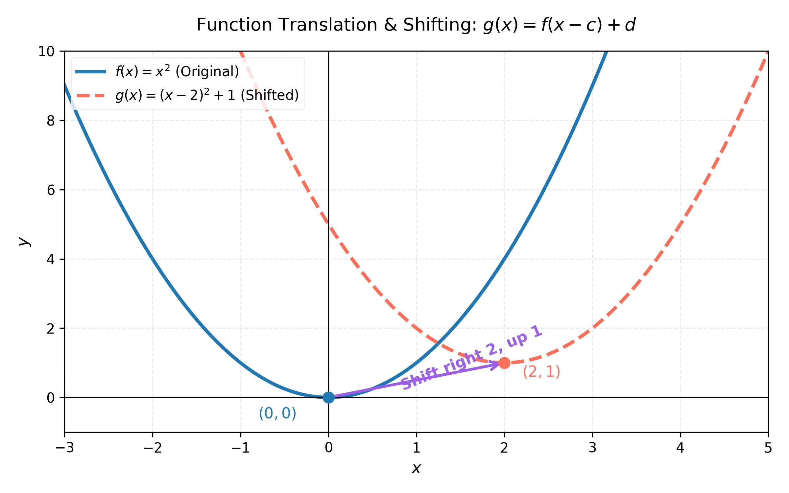
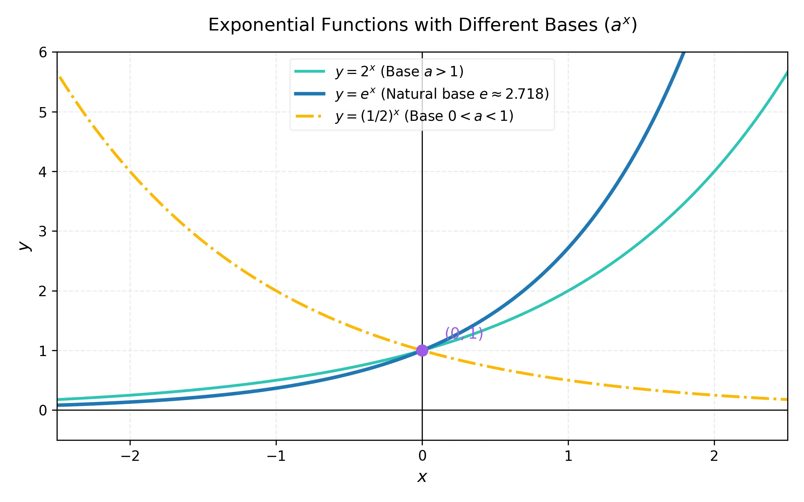
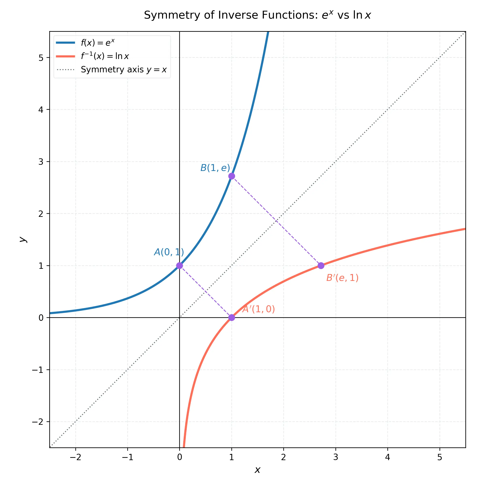

# 課程：微積分上 - 第 1 週 - 函數與模型 (Functions and Models)

本文件包含了第 1 週完整的教學大綱、實作指南以及擴充版練習題庫。本週重點在於掌握函數的多種表示法，並透過 Python 工具（Matplotlib 與 SymPy）進行函數的視覺化與性質分析。
本週教學內容對應 **Stewart Calculus (Metric Edition) Chapter 1: Functions and Models** 的核心章節。

---

## 一、 單元講解 (Lecture) - 總計 100 分鐘

### 1. 函數的四種表示法 (20 min) (KP1.1)
*   **課本對應**：Stewart Calculus Chapter 1 Section 1.1 - Four Ways to Represent a Function.
*   **概念講解**：
    函數 $f$ 是從集合 $D$ (定義域 Domain) 到集合 $E$ (對應域 Codomain) 的一種規則，使得 $D$ 中的每個元素 $x$ 恰好在 $E$ 中對應唯一的一個元素 $f(x)$。函數的四種表示法為：
    1.  **視覺法 (Visual)**：利用座標平面上的圖形 (Graph) 來表示。這是最直觀的，能一目了然函數的增減性與局部特徵。
    2.  **代數法 (Algebraic)**：使用明確的數學公式，例如 $f(x) = x^2 + 2x + 1$。便於嚴謹的符號推導與精確計算。
    3.  **數值法 (Numerical)**：利用數值表 (Table of values) 列出特定輸入與輸出的對應關係。
    4.  **語意法 (Verbal)**：用文字描述規則，例如「$y$ 是 $x$ 的兩倍再加三」。
*   **練習題與解答**：
    *   **練習題 1.1.1**：求函數 $f(x) = \frac{\sqrt{x+3}}{x-2}$ 的定義域。
    *   **解答**：
        1. 根號內的表達式必須大於或等於零：
           $$x + 3 \ge 0 \implies x \ge -3$$
        2. 分母不能為零：
           $$x - 2 \neq 0 \implies x \neq 2$$
        3. 綜合上述兩個條件，該函數的定義域為 $[-3, 2) \cup (2, \infty)$。

---

### 2. 基本函數分類 (20 min) (KP1.2)
*   **課本對應**：Stewart Calculus Chapter 1 Section 1.2 - Mathematical Models: A Catalog of Essential Functions.
*   **概念講解**：
    微積分中常見的函數類型及其代數特徵包括：
    *   **多項式函數 (Polynomials)**：形如 $P(x) = a_n x^n + a_{n-1} x^{n-1} + \dots + a_1 x + a_0$，其定義域為全體實數 $\mathbb{R}$。
    *   **有理函數 (Rational Functions)**：兩個多項式之商，即 $f(x) = \frac{P(x)}{Q(x)}$，定義域為滿足 $Q(x) \neq 0$ 的所有實數。
    *   **代數函數 (Algebraic Functions)**：可由多項式經由代數運算（加、減、乘、除、乘方、開方）構造出的函數。
    *   **三角函數 (Trigonometric Functions)**：以 $\sin(x), \cos(x)$ 為代表的週期函數。在微積分中，除非特別聲明，自變數 $x$ 均採用**弧度 (Radians)** 作為單位。
    *   **超越函數 (Transcendental Functions)**：非代數函數的函數，例如指數函數、對數函數以及三角函數。
*   **練習題與解答**：
    *   **練習題 1.2.1**：試判斷函數 $g(x) = x^2 - \sin(x)$ 屬於代數函數還是超越函數？並求其在 $x = 0$ 的值。
    *   **解答**：
        1. 因為 $g(x)$ 包含了三角函數 $\sin(x)$，這無法僅透過多項式的基本代數運算（有限次加減乘除與開方）來表示，故 $g(x)$ 屬於**超越函數**。
        2. 當 $x = 0$ 時：
           $$g(0) = 0^2 - \sin(0) = 0 - 0 = 0$$

---

### 3. 函數的變換與平移 (20 min) (KP1.3)
*   **課本對應**：Stewart Calculus Chapter 1 Section 1.3 - New Functions from Old Functions.
*   **概念講解**：
    透過對基礎母函數 $y = f(x)$ 進行變換，我們可以快速繪製出更複雜函數的圖形：
    *   **平移變換 (Shifting)**：
        *   鉛直平移：$y = f(x) + c$ (當 $c>0$，向上平移 $c$ 單位；當 $c<0$，向下平移)。
        *   水平平移：$y = f(x - c)$ (當 $c>0$，向右平移 $c$ 單位；當 $c<0$，向左平移)。
    *   **伸縮與反射 (Scaling and Reflection)**：
        *   鉛直伸縮：$y = c f(x)$ (當 $c>1$，縱向拉伸；當 $0<c<1$，縱向壓縮)。
        *   水平伸縮：$y = f(cx)$ (當 $c>1$，橫向壓縮；當 $0<c<1$，橫向拉伸)。
        *   反射：$y = -f(x)$ (對 $x$ 軸反射)；$y = f(-x)$ (對 $y$ 軸反射)。

    下列圖形展示了二次函數 $f(x)=x^2$ 在水平向右平移 2 單位、鉛直向上平移 1 單位後得到新函數 $g(x)=(x-2)^2+1$ 的幾何過程：

    

*   **練習題與解答**：
    *   **練習題 1.3.1**：若已知 $f(x) = \sqrt{x}$，試寫出將此圖形先向左平移 4 單位，再對 $x$ 軸進行反射，最後向上平移 3 單位所得之新函數 $h(x)$ 的方程式。
    *   **解答**：
        1. 向左平移 4 單位：將 $x$ 替換為 $x + 4$，得到 $y = \sqrt{x+4}$。
        2. 對 $x$ 軸反射：在函數前面加上負號，得到 $y = -\sqrt{x+4}$。
        3. 向上平移 3 單位：在尾端加上 3，得到新函數：
           $$h(x) = -\sqrt{x+4} + 3$$

---

### 4. 指數函數的性質 (20 min) (KP1.4)
*   **課本對應**：Stewart Calculus Chapter 1 Section 1.4 - Exponential Functions.
*   **概念講解**：
    指數函數的形式為 $f(x) = a^x$，其中底數 $a > 0$ 且 $a \neq 1$。
    *   **定義域與值域**：定義域為 $(-\infty, \infty)$，值域為 $(0, \infty)$。
    *   **自然底數 $e$**：在微積分中，最天然且重要的底數是無理數 $e \approx 2.71828$。函數 $f(x) = e^x$ 在 $x=0$ 處的切線斜率恰好為 1。
    *   **指數律**：對於任意實數 $x, y$ 與正數 $a, b$，滿足：
        $$a^{x+y} = a^x a^y, \quad a^{x-y} = \frac{a^x}{a^y}, \quad (a^x)^y = a^{xy}, \quad (ab)^x = a^x b^x$$

    下圖視覺化了不同底數 $a$ 的指數函數變化趨勢。當 $a>1$ 時函數呈指數增長，當 $0<a<1$ 時呈指數衰減，所有曲線均通過恆定點 $(0, 1)$：

    

*   **練習題與解答**：
    *   **練習題 1.4.1**：化簡代數式 $\frac{(e^{2x})^3 \cdot e^{-x}}{e^{4x}}$。
    *   **解答**：
        1. 使用冪次定律，分子第一部分 $(e^{2x})^3 = e^{2x \cdot 3} = e^{6x}$。
        2. 分子相乘：$e^{6x} \cdot e^{-x} = e^{6x - x} = e^{5x}$。
        3. 與分母相除：
           $$\frac{e^{5x}}{e^{4x}} = e^{5x - 4x} = e^x$$

---

### 5. 反函數與對數函數 (20 min) (KP1.5)
*   **課本對應**：Stewart Calculus Chapter 1 Section 1.5 - Inverse Functions and Logarithms.
*   **概念講解**：
    *   **一對一函數**：函數 $f$ 在定義域內不重複輸出相同值，即若 $x_1 \neq x_2$ 則 $f(x_1) \neq f(x_2)$。幾何上可通過**水平線檢定法 (Horizontal Line Test)** 來判定。
    *   **反函數**：若 $f$ 是定義域為 $A$、值域為 $B$ 的一對一函數，則其反函數 $f^{-1}$ 的定義域為 $B$、值域為 $A$，且滿足：
        $$f^{-1}(y) = x \iff f(x) = y$$
    *   **對數函數**：以 $a$ 為底的對數函數 $y = \log_a x$ 是指數函數 $y = a^x$ 的反函數。
    *   **自然對數 $\ln x$**：以 $e$ 為底的對數函數，記作 $\ln x$。對數律如下：
        $$\ln(xy) = \ln x + \ln y, \quad \ln\left(\frac{x}{y}\right) = \ln x - \ln y, \quad \ln(x^r) = r\ln x$$
*   **數學證明**：證明對數律 $\ln(xy) = \ln x + \ln y$。
    *   **證明**：
        令 $u = \ln x$ 且 $v = \ln y$。
        根據對數與指數的互逆定義，這等價於：
        $$x = e^u \quad \text{且} \quad y = e^v$$
        此時，我們計算兩數相乘：
        $$xy = e^u \cdot e^v = e^{u+v} \quad \text{（根據指數律）}$$
        再將此指數式轉換回自然對數式：
        $$\ln(xy) = u + v$$
        將 $u, v$ 的定義代回，即得：
        $$\ln(xy) = \ln x + \ln y \quad \text{Q.E.D.}$$

    幾何上，反函數的圖形是原函數圖形相對於對稱軸 $y = x$ 的鏡像反射。下圖清晰展示了 $y=e^x$ 與 $y=\ln x$ 之間的對稱美感，其中任意點 $(a, b)$ 對應於反射點 $(b, a)$：

    

*   **練習題與解答**：
    *   **練習題 1.5.1**：求函數 $f(x) = 2\ln(x-1)$ 的反函數 $f^{-1}(x)$ 及其定義域。
    *   **解答**：
        1. 令 $y = 2\ln(x-1)$，求 $x$：
           $$\frac{y}{2} = \ln(x-1)$$
        2. 兩邊取指數：
           $$e^{y/2} = x - 1 \implies x = e^{y/2} + 1$$
        3. 將變數 $x, y$ 互換，得到反函數：
           $$f^{-1}(x) = e^{x/2} + 1$$
        4. 因為反函數 $f^{-1}(x)$ 的輸入是實數，且原函數的值域為全體實數，故反函數的定義域為 $(-\infty, \infty)$。

---

## 二、 動手實作 (Lab) - 總計 50 分鐘

### 實作一：使用 Matplotlib 繪製多種函數圖形 (25 min)
**任務目標**：透過 Python 觀察函數的變換與分類。
1.  在 Google Colab 中執行以下代碼，觀察不同參數對圖形的影響。
    ```python
    import matplotlib.pyplot as plt
    import numpy as np

    x = np.linspace(-5, 5, 400)
    
    # 定義函數
    y1 = x**2          # 多項式
    y2 = (x-2)**2 + 1  # 平移後的函數
    y3 = np.exp(x)     # 指數函數
    y4 = np.log(x[x>0]) # 對數函數 (需處理定義域)

    plt.figure(figsize=(10, 6))
    plt.plot(x, y1, label='$f(x)=x^2$')
    plt.plot(x, y2, label='$g(x)=(x-2)^2+1$ (Shifted)')
    plt.plot(x, y3, label='$h(x)=e^x$')
    plt.plot(x[x>0], y4, label='$p(x)=\ln(x)$')

    plt.axhline(0, color='black',linewidth=0.5)
    plt.axvline(0, color='black',linewidth=0.5)
    plt.legend()
    plt.title("Function Visualization")
    plt.grid(True)
    plt.show()
    ```

### 實作二：使用 SymPy 求解反函數與代數運算 (25 min)
**任務目標**：使用符號運算工具處理數學問題。
1.  安裝並導入 SymPy。
2.  求解函數的零點與反函數表達式。
    ```python
    import sympy as sp

    x = sp.Symbol('x')
    f = sp.exp(x) + 2
    
    # 求解 f(x) = 5 的 x 值
    solution = sp.solve(f - 5, x)
    print(f"f(x) = 5 的解為: {solution}")

    # 求反函數 y = e^x + 2 => x = ln(y-2)
    y = sp.Symbol('y')
    f_inv = sp.solve(sp.exp(x) + 2 - y, x)
    print(f"f(x) = e^x + 2 的反函數為: f^-1(y) = {f_inv}")
    ```

---

## 三、 本週知識點回顧 (KP)
- **KP1.1**: 函數的四種表示法（視覺、代數、數值、語意）。
- **KP1.2**: 基本函數分類（多項式、有理、代數、三角）。
- **KP1.3**: 函數的平移（左右上下）與伸縮變換。
- **KP1.4**: 指數函數 $a^x$ 的圖形特徵與底數 $e$。
- **KP1.5**: 反函數的求法與對數函數 $\ln x$ 的基本運算律。

---

## 四、 課後測驗題庫 (Quiz) - 30 分鐘

### 1. 單選題 (Single Choice) - 共 10 題

1. **Q1**: 下列哪一種表示法是透過「文字」來描述函數規則？
   - (A) 視覺法 (B) 代數法 (C) 數值法 (D) 語意法
   - *答案*: D (KP1.1)

2. **Q2**: 函數 $f(x) = \frac{x+1}{x^2-4}$ 屬於哪一類函數？
   - (A) 多項式函數 (B) 有理函數 (C) 三角函數 (D) 指數函數
   - *答案*: B (KP1.2)

3. **Q3**: 若將 $y=f(x)$ 的圖形向右平移 3 單位，新的方程式為？
   - (A) $y=f(x)+3$ (B) $y=f(x)-3$ (C) $y=f(x+3)$ (D) $y=f(x-3)$
   - *答案*: D (KP1.3)

4. **Q4**: $e$ 的近似值約為多少？
   - (A) 3.14 (B) 2.718 (C) 1.414 (D) 1.618
   - *答案*: B (KP1.4)

5. **Q5**: $\ln(e^5)$ 的值為多少？
   - (A) 1 (B) 0 (C) 5 (D) $e$
   - *答案*: C (KP1.5)

6. **Q6**: 下列哪一個函數在 $x=0$ 時沒有定義？
   - (A) $y=x^2$ (B) $y=e^x$ (C) $y=\ln x$ (D) $y=\sin x$
   - *答案*: C (KP1.5)

7. **Q7**: 若 $f(x) = 2x + 3$，則其反函數 $f^{-1}(x)$ 為？
   - (A) $\frac{x-3}{2}$ (B) $\frac{x+3}{2}$ (C) $2x-3$ (D) $\frac{1}{2x+3}$
   - *答案*: A (KP1.5)

8. **Q8**: 多項式函數的定義域通常為何？
   - (A) $(0, \infty)$ (B) $(-\infty, 0)$ (C) $(-\infty, \infty)$ (D) $[-1, 1]$
   - *答案*: C (KP1.2)

9. **Q9**: $\ln(1)$ 的值是多少？
   - (A) 1 (B) $e$ (C) 0 (D) 無定義
   - *答案*: C (KP1.5)

10. **Q10**: 將 $y=x^2$ 對 x 軸進行反射後，方程式變為？
    - (A) $y=x^2$ (B) $y=-x^2$ (C) $y=(-x)^2$ (D) $y=x^{-2}$
    - *答案*: B (KP1.3)

### 2. 多選題 (Multiple Choice) - 共 10 題

11. **Q11**: 關於函數的四種表示法，哪些描述正確？
    - (A) 視覺法能一眼看出增減趨勢 (B) 代數法最精確 (C) 數值法一定能表現出所有定義域的點 (D) 語意法能用生活化語言解釋
    - *答案*: A, B, D (KP1.1)

12. **Q12**: 下列哪些是「超越函數 (Transcendental functions)」？
    - (A) 三角函數 (B) 指數函數 (C) 多項式函數 (D) 對數函數
    - *答案*: A, B, D (KP1.2)

13. **Q13**: 若 $c > 1$，則 $y = c f(x)$ 的圖形相對於 $y = f(x)$ 發生了什麼？
    - (A) 鉛直伸張 (B) 鉛直壓縮 (C) 遠離 x 軸 (D) 靠近 x 軸
    - *答案*: A, C (KP1.3)

14. **Q14**: 指數函數 $f(x) = a^x$ (當 $a > 1$) 的性質包括：
    - (A) 定義域為實數全集 (B) 恆大於 0 (C) 是遞增函數 (D) 圖形通過 (0, 1)
    - *答案*: A, B, C, D (KP1.4)

15. **Q15**: 下列哪些是有效的對數運算律？
    - (A) $\ln(a+b) = \ln a + \ln b$ (B) $\ln(ab) = \ln a + \ln b$ (C) $\ln(a/b) = \ln a - \ln b$ (D) $\ln(a^b) = b \ln a$
    - *答案*: B, C, D (KP1.5)

16. **Q16**: 下列哪些函數在其定義域內是一對一函數（即存在反函數）？
    - (A) $y = x^3$ (B) $y = e^x$ (C) $y = x^2$ (D) $y = \ln x$
    - *答案*: A, B, D (KP1.5)

17. **Q17**: 關於 $y = \sin x$ 的描述，哪些正確？
    - (A) 是週期函數 (B) 值域為 $[-1, 1]$ (C) 屬於代數函數 (D) $x$ 通常使用弧度
    - *答案*: A, B, D (KP1.2)

18. **Q18**: 進行函數變換時，哪些操作會影響圖形的水平位置？
    - (A) $f(x+c)$ (B) $f(x)+c$ (C) $f(cx)$ (D) $cf(x)$
    - *答案*: A, C (KP1.3)

19. **Q19**: 自然對數 $\ln x$ 的圖形特徵包括：
    - (A) 通過 (1, 0) (B) 以 y 軸為垂直漸近線 (C) 定義域為 $x > 0$ (D) 是 $e^x$ 的對稱圖形（相對於 $y=x$）
    - *答案*: A, B, C, D (KP1.5)

20. **Q20**: 下列哪些屬於多項式函數？
    - (A) $y = 3x^2 + 5$ (B) $y = \sqrt{x}$ (C) $y = x^5 - x + 1$ (D) $y = 2/x$
    - *答案*: A, C (KP1.2)

### 3. 填充題 (Fill-in-the-blank) - 共 10 題

21. **Q21**: 函數 $f(x) = \sqrt{x}$ 的定義域為 __________ (使用區間符號)。
    - *答案*: $[0, \infty)$ (KP1.2)

22. **Q22**: 將 $y=f(x)$ 向上平移 5 單位，得到的方程式為 __________。
    - *答案*: $y=f(x)+5$ (KP1.3)

23. **Q23**: $\ln e = $ __________。
    - *答案*: 1 (KP1.5)

24. **Q24**: 指數函數 $f(x) = 2^x$ 與 $g(x) = (1/2)^x$ 的圖形相對於 __________ 軸對稱。
    - *答案*: y (KP1.4)

25. **Q25**: 若 $f(x) = \ln(x-1)$，則其定義域為 $x > $ __________。
    - *答案*: 1 (KP1.5)

26. **Q26**: 代數法表示函數時，若一輸入對應多個輸出，則該規則 __________ (是/不是) 函數。
    - *答案*: 不是 (KP1.1)

27. **Q27**: $\log_{10} 100 = $ __________。
    - *答案*: 2 (KP1.5)

28. **Q28**: 有理函數是由兩個 __________ 函數相除構成。
    - *答案*: 多項式 (KP1.2)

29. **Q29**: 將 $y=f(x)$ 圖形水平伸張為原來的 2 倍（即變寬），應將 $x$ 代換為 __________。
    - *答案*: $x/2$ (KP1.3)

30. **Q30**: 函數 $y = e^x$ 的值域為 __________ (使用區間符號)。
    - *答案*: $(0, \infty)$ (KP1.4)

---

## 五、 Q 矩陣 (Q-matrix)

| 題號 | KP1.1 | KP1.2 | KP1.3 | KP1.4 | KP1.5 |
|---|---|---|---|---|---|
| Q1 | 1 | 0 | 0 | 0 | 0 |
| Q2 | 0 | 1 | 0 | 0 | 0 |
| Q3 | 0 | 0 | 1 | 0 | 0 |
| Q4 | 0 | 0 | 0 | 1 | 0 |
| Q5 | 0 | 0 | 0 | 0 | 1 |
| Q6 | 0 | 0 | 0 | 0 | 1 |
| Q7 | 0 | 0 | 0 | 0 | 1 |
| Q8 | 0 | 1 | 0 | 0 | 0 |
| Q9 | 0 | 0 | 0 | 0 | 1 |
| Q10| 0 | 0 | 1 | 0 | 0 |
| Q11| 1 | 0 | 0 | 0 | 0 |
| Q12| 0 | 1 | 0 | 0 | 1 |
| Q13| 0 | 0 | 1 | 0 | 0 |
| Q14| 0 | 0 | 0 | 1 | 0 |
| Q15| 0 | 0 | 0 | 0 | 1 |
| Q16| 0 | 0 | 0 | 1 | 1 |
| Q17| 0 | 1 | 0 | 0 | 0 |
| Q18| 0 | 0 | 1 | 0 | 0 |
| Q19| 0 | 0 | 0 | 1 | 1 |
| Q20| 0 | 1 | 0 | 0 | 0 |
| Q21| 0 | 1 | 0 | 0 | 0 |
| Q22| 0 | 0 | 1 | 0 | 0 |
| Q23| 0 | 0 | 0 | 0 | 1 |
| Q24| 0 | 0 | 0 | 1 | 0 |
| Q25| 0 | 0 | 0 | 0 | 1 |
| Q26| 1 | 0 | 0 | 0 | 0 |
| Q27| 0 | 0 | 0 | 0 | 1 |
| Q28| 0 | 1 | 0 | 0 | 0 |
| Q29| 0 | 0 | 1 | 0 | 0 |
| Q30| 0 | 0 | 0 | 1 | 0 |
