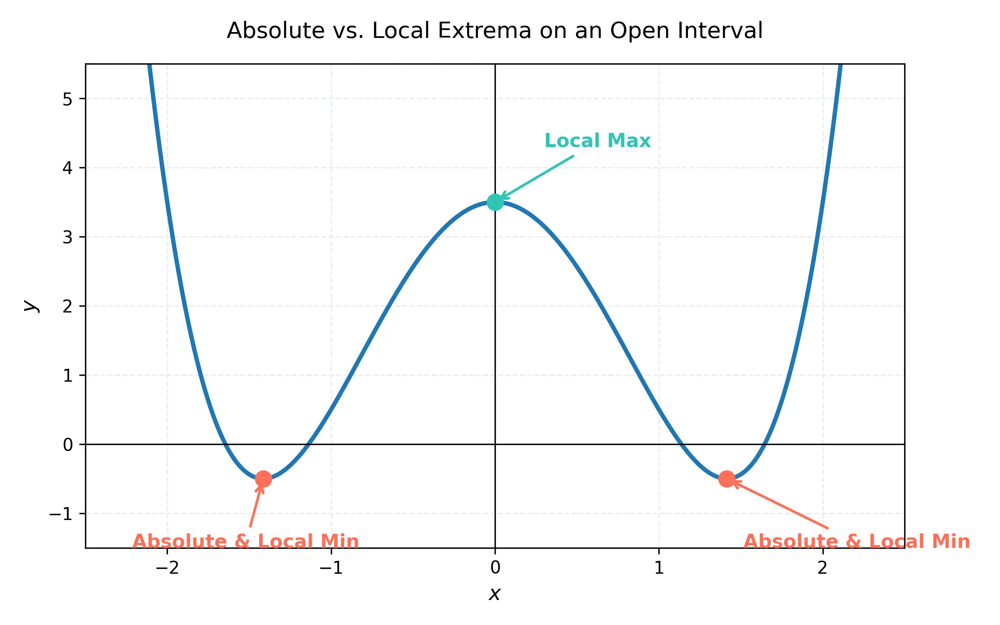
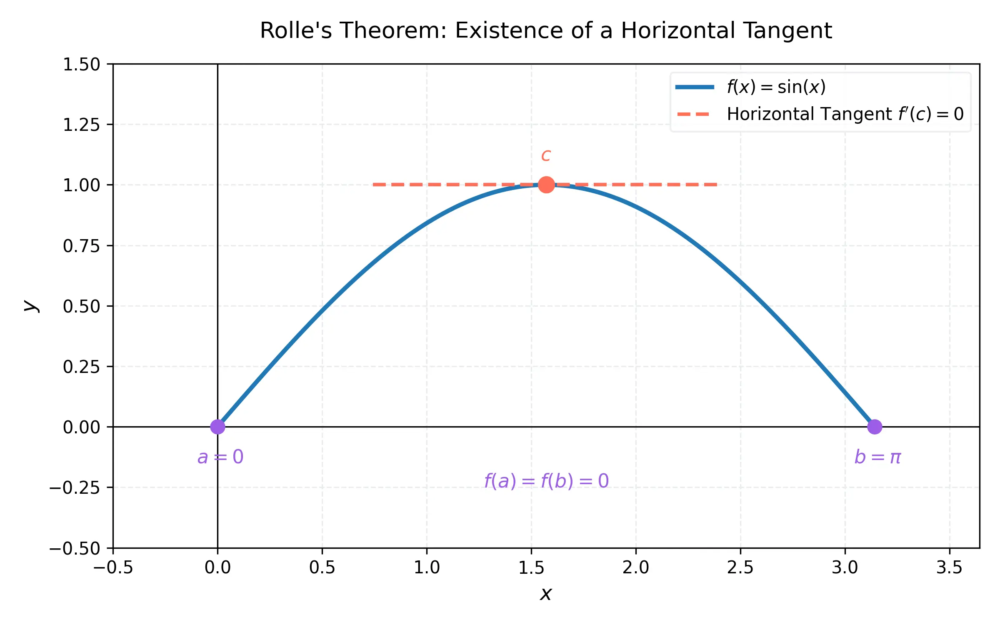
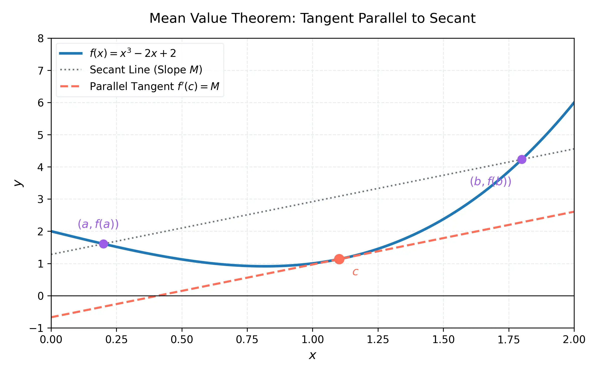

# 課程：微積分上 - 第 10 週 - 微分的應用：極值與均值定理 (Applications of Differentiation)

本文件包含了第 10 週完整的教學大綱、實作指南以及練習題庫。本週重點在於理解函數的極值性質，並探討微分學中最重要的理論基礎：羅爾定理與均值定理。這些理論不僅是微積分的核心，也是後續分析函數圖形與最佳化問題的關鍵。
本週教學內容對應 **Stewart Calculus (Metric Edition) Chapter 4: Applications of Differentiation**。

---

## 一、 單元講解 (Lecture) - 總計 100 分鐘

### 1. 絕對極值與局部極值 (20 min) (KP10.1)
*   **課本對應**：Stewart Calculus Chapter 4 Section 4.1 - Maximum and Minimum Values.
*   **概念講解**：
    *   **絕對極大值 (Absolute Maximum)**：若對於定義域 $D$ 內的所有 $x$，均滿足 $f(c) \ge f(x)$，則稱 $f(c)$ 為 $f$ 在 $D$ 上的絕對極大值。
    *   **絕對極小值 (Absolute Minimum)**：若對於定義域 $D$ 內的所有 $x$，均滿足 $f(c) \le f(x)$，則稱 $f(c)$ 為 $f$ 在 $D$ 上的絕對極小值。
    *   **局部極值 (Local Extrema)**：若在包含 $c$ 的某個開區間內，對於所有 $x$ 均滿足 $f(c) \ge f(x)$ (或 $f(c) \le f(x)$)，則稱 $f(c)$ 為局部極大值 (或局部極小值)。

    下圖展示了函數在給定區間內的各類極值點。注意，端點可以是絕對極值，但通常不被視為局部極值（除非定義在包含該點的開區間內）：

    

*   **練習題與解答**：
    *   **練習題 10.1.1**：考慮函數 $f(x) = \sin(x)$ 在區間 $[0, 2\pi]$。試求其絕對極值與局部極值。
    *   **解答**：
        1. 在 $x = \pi/2$ 時，$f(\pi/2) = 1$。由於 $\sin(x) \le 1$，此為**絕對極大值**，也是**局部極大值**。
        2. 在 $x = 3\pi/2$ 時，$f(3\pi/2) = -1$。由於 $\sin(x) \ge -1$，此為**絕對極小值**，也是**局部極小值**。
        3. 端點 $x=0$ ($f(0)=0$) 與 $x=2\pi$ ($f(2\pi)=0$) 在此封閉區間內既不是極大也不是極小。

---

### 2. 極值定理與臨界點 (20 min) (KP10.2)
*   **課本對應**：Stewart Calculus Chapter 4 Section 4.1.
*   **核心定理**：
    *   **極值定理 (Extreme Value Theorem, EVT)**：若 $f$ 在封閉區間 $[a, b]$ 上連續，則 $f$ 在該區間內必能取得絕對極大值與絕對極小值。
    *   **費馬定理 (Fermat's Theorem)**：若 $f$ 在 $c$ 處有局部極值且 $f'(c)$ 存在，則 $f'(c) = 0$。
*   **臨界點 (Critical Points)**：
    函數 $f$ 定義域內的一點 $c$，若滿足 $f'(c) = 0$ 或 $f'(c)$ 不存在，則稱 $c$ 為 $f$ 的臨界點。**注意**：極值必定發生在臨界點或端點，但臨界點不一定是極值點（例如 $f(x)=x^3$ 在 $x=0$ 處）。
*   **練習題與解答**：
    *   **練習題 10.2.1**：求函數 $f(x) = x^{3/5}(4-x)$ 的所有臨界點。
    *   **解答**：
        1. 先求導：使用乘法法則 $f'(x) = \frac{3}{5}x^{-2/5}(4-x) + x^{3/5}(-1)$。
        2. 化簡：$f'(x) = \frac{3(4-x) - 5x}{5x^{2/5}} = \frac{12 - 8x}{5x^{2/5}}$。
        3. 令 $f'(x) = 0 \implies 12 - 8x = 0 \implies x = 1.5$。
        4. 考慮 $f'(x)$ 不存在之處：當分母為零時，即 $x = 0$。
        5. 臨界點為 $x = 0$ 與 $x = 1.5$。

---

### 3. 封閉區間求絕對極值的步驟 (15 min) (KP10.3)
*   **課本對應**：Stewart Calculus Chapter 4 Section 4.1 - The Closed Interval Method.
*   **操作步驟**：
    欲求連續函數 $f$ 在封閉區間 $[a, b]$ 上的絕對極值：
    1.  找出 $f$ 在開區間 $(a, b)$ 內的所有**臨界點**，並計算其函數值。
    2.  計算區間**端點**的函數值 $f(a)$ 與 $f(b)$。
    3.  比較上述所有函數值。最大者為絕對極大值，最小者為絕對極小值。
*   **練習題與解答**：
    *   **練習題 10.3.1**：求 $f(x) = x^3 - 3x^2 + 1$ 在區間 $[-1/2, 4]$ 上的絕對極值。
    *   **解答**：
        1. 臨界點：$f'(x) = 3x^2 - 6x = 3x(x-2)$。令 $f'(x)=0$ 得到 $x=0, 2$。兩者均在區間內。
        2. 計算值：
           - $f(0) = 1$
           - $f(2) = 8 - 12 + 1 = -3$
           - $f(-1/2) = (-1/8) - 3(1/4) + 1 = -1/8 - 6/8 + 8/8 = 1/8$
           - $f(4) = 64 - 48 + 1 = 17$
        3. 比較：絕對極大值為 $f(4)=17$，絕對極小值為 $f(2)=-3$。

---

### 4. 羅爾定理 (Rolle's Theorem) (20 min) (KP10.4)
*   **課本對應**：Stewart Calculus Chapter 4 Section 4.2.
*   **定理敘述**：
    設函數 $f$ 滿足：
    1.  在封閉區間 $[a, b]$ 上連續。
    2.  在開區間 $(a, b)$ 內可微。
    3.  $f(a) = f(b)$。
    則在 $(a, b)$ 內至少存在一點 $c$，使得 $f'(c) = 0$。
*   **正式證明**：
    1. **情況一**：$f(x) = k$ (常數函數)。則 $f'(x) = 0$ 對區間內所有 $x$ 成立，定理顯然成立。
    2. **情況二**：存在某個 $x \in (a, b)$ 使得 $f(x) > f(a)$。根據極值定理 (EVT)，$f$ 在 $[a, b]$ 上必有絕對極大值。因為 $f(x) > f(a) = f(b)$，此極大值必發生在開區間 $(a, b)$ 內的某點 $c$。根據費馬定理，若極值發生在可微點 $c$，則 $f'(c) = 0$。
    3. **情況三**：存在某個 $x \in (a, b)$ 使得 $f(x) < f(a)$。同理，絕對極小值必發生在 $(a, b)$ 內某點 $c$，且 $f'(c) = 0$。
    Q.E.D.

    幾何意義：若曲線兩端高度相同，中間必有一處切線為水平：
    

*   **練習題與解答**：
    *   **練習題 10.4.1**：驗證 $f(x) = x^4 - 2x^2$ 在 $[-2, 2]$ 上是否滿足羅爾定理條件，並找出對應的 $c$。
    *   **解答**：
        1. $f$ 為多項式，故連續且可微。
        2. $f(-2) = 16 - 8 = 8$, $f(2) = 16 - 8 = 8$。滿足條件。
        3. $f'(x) = 4x^3 - 4x = 4x(x^2 - 1) = 0 \implies x = 0, 1, -1$。
        4. 滿足條件的 $c$ 有三個：$-1, 0, 1$，均在 $(-2, 2)$ 內。

---

### 5. 均值定理 (Mean Value Theorem) (25 min) (KP10.5)
*   **課本對應**：Stewart Calculus Chapter 4 Section 4.2.
*   **定理敘述**：
    設函數 $f$ 滿足：
    1.  在封閉區間 $[a, b]$ 上連續。
    2.  在開區間 $(a, b)$ 內可微。
    則在 $(a, b)$ 內至少存在一點 $c$，使得：
    $$f'(c) = \frac{f(b) - f(a)}{b - a}$$
*   **正式證明**：
    1. 構造輔助函數 $h(x) = f(x) - g(x)$，其中 $g(x)$ 是通過 $(a, f(a))$ 與 $(b, f(b))$ 的割線方程式：
       $$g(x) = f(a) + \frac{f(b) - f(a)}{b - a}(x - a)$$
    2. $h(x) = f(x) - f(a) - \frac{f(b) - f(a)}{b - a}(x - a)$。
    3. 檢查 $h(x)$：
       - $h(a) = f(a) - f(a) - 0 = 0$。
       - $h(b) = f(b) - f(a) - (f(b) - f(a)) = 0$。
       - $h$ 在 $[a, b]$ 連續且在 $(a, b)$ 可微。
    4. 根據**羅爾定理**，必存在 $c \in (a, b)$ 使得 $h'(c) = 0$。
    5. $h'(x) = f'(x) - \frac{f(b) - f(a)}{b - a}$。
    6. 因此 $h'(c) = 0 \implies f'(c) = \frac{f(b) - f(a)}{b - a}$。
    Q.E.D.

    幾何意義：曲線上必有一點的切線斜率等於兩端點連線的割線斜率：
    

*   **重要推論 (Consequences)**：
    1. 若在區間內 $f'(x) = 0$，則 $f$ 為常數。
    2. 若在區間內 $f'(x) = g'(x)$，則 $f(x) = g(x) + C$。

*   **練習題與解答**：
    *   **練習題 10.5.1**：對 $f(x) = x^3 - x$ 在 $[0, 2]$ 使用均值定理，求 $c$。
    *   **解答**：
        1. 割線斜率：$\frac{f(2) - f(0)}{2 - 0} = \frac{(8-2) - 0}{2} = 3$。
        2. 求導：$f'(x) = 3x^2 - 1$。
        3. 令 $3c^2 - 1 = 3 \implies 3c^2 = 4 \implies c^2 = 4/3$。
        4. $c = \sqrt{4/3} = 2/\sqrt{3} \approx 1.15$ (在區間 $(0, 2)$ 內)。

---

## 二、 動手實作 (Lab) - 總計 50 分鐘

### 實作：使用 SymPy 尋找臨界點與全域極值
**任務目標**：透過符號運算精確定位臨界點，並在指定區間內比較極值。
1.  在 Google Colab 中執行以下代碼。
    ```python
    import sympy as sp

    # 定義變數與函數
    x = sp.Symbol('x', real=True)
    f = x**4 - 4*x**3 + 4*x**2 + 1
    interval = [-1, 3]

    print(f"分析函數: f(x) = {f}")

    # 1. 求導數
    f_prime = sp.diff(f, x)
    print(f"導數: f'(x) = {f_prime}")

    # 2. 尋找臨界點 (f'(x) = 0)
    critical_points = sp.solve(f_prime, x)
    # 過濾出在區間內的臨界點
    cp_in_range = [p for p in critical_points if interval[0] <= p <= interval[1]]
    print(f"區間內的臨界點: {cp_in_range}")

    # 3. 計算臨界點與端點的函數值
    test_points = cp_in_range + interval
    results = {p: f.subs(x, p) for p in test_points}

    print("\n點位測試結果:")
    for p, val in results.items():
        print(f"f({p}) = {val}")

    # 4. 找出絕對極值
    abs_max = max(results.values())
    abs_min = min(results.values())
    print(f"\n絕對極大值: {abs_max}")
    print(f"絕對極小值: {abs_min}")
    ```

---

## 三、 本週知識點回顧 (KP)
- **KP10.1**: 絕對與局部極值的定義。
- **KP10.2**: 極值定理 (EVT) 的重要性與臨界點的判定。
- **KP10.3**: 封閉區間求極值的標準流程。
- **KP10.4**: 羅爾定理的條件與證明。
- **KP10.5**: 均值定理 (MVT) 的幾何意義與其在函數分析中的應用。

---

## 四、 課後測驗題庫 (Quiz) - 30 分鐘

### 1. 單選題 (Single Choice) - 共 10 題
1. **Q1**: 函數 $f(x) = |x|$ 在 $x=0$ 處是？
   - (A) 臨界點且是局部極小值 (B) 臨界點但不是極值 (C) 不是臨界點 (D) 導數為零點
2. **Q2**: 極值定理 (EVT) 要求函數在該區間必須具備什麼性質？
   - (A) 可微 (B) 連續 (C) 遞增 (D) 奇函數
3. **Q3**: 若 $f(x)$ 在封閉區間 $[a, b]$ 連續，則絕對最大值可能出現在哪裡？
   - (A) 僅限臨界點 (B) 僅限端點 (C) 臨界點或端點 (D) 區間中點
4. **Q4**: 羅爾定理中，除了連續與可微外，還需要什麼前提條件？
   - (A) $f'(a) = f'(b)$ (B) $f(a) = f(b)$ (C) $f(a) = 0$ (D) $a=0$
5. **Q5**: 均值定理的公式中，$f'(c)$ 等於什麼？
   - (A) $f(b) - f(a)$ (B) 0 (C) 割線斜率 (D) 1
6. **Q6**: 函數 $f(x) = x^3$ 在 $x=0$ 處？
   - (A) 是局部極值 (B) 是臨界點但非極值 (C) 導數不存在 (D) 不是臨界點
7. **Q7**: 費馬定理說明，若在 $c$ 有局部極值且導數存在，則 $f'(c) = ?$
   - (A) 1 (B) $f(c)$ (C) 0 (D) 無限大
8. **Q8**: 若在區間內 $f'(x) > 0$，則根據均值定理可以推論函數為？
   - (A) 常數 (B) 遞增 (C) 遞減 (D) 凹向上
9. **Q9**: 臨界點的定義是 $f'(c)=0$ 或？
   - (A) $f(c)=0$ (B) $f'(c)$ 不存在 (C) $f''(c)=0$ (D) $c=0$
10. **Q10**: 均值定理是誰的推廣？
    - (A) 極值定理 (B) 羅爾定理 (C) 中值定理 (D) 微積分基本定理

### 2. 多選題 (Multiple Choice) - 共 10 題
11. **Q11**: 下列關於臨界點的敘述哪些正確？
    - (A) 極值點一定是臨界點或端點 (B) 臨界點一定是極值點 (C) $f'(c)$ 不存在也可能是臨界點 (D) 端點也是臨界點
12. **Q12**: 羅爾定理成立的必要條件包括？
    - (A) $[a, b]$ 上連續 (B) $(a, b)$ 內可微 (C) $f(a)=f(b)$ (D) $f(x)$ 必須是多項式
13. **Q13**: 關於絕對極值，哪些正確？
    - (A) 一個函數在特定區間內絕對最大值只有一個值 (B) 絕對最大值可能在多個點取得 (C) 連續函數在開區間一定有絕對極值 (D) 不連續函數可能沒有絕對極值
14. **Q14**: 均值定理的應用包括？
    - (A) 估計函數值的變化範圍 (B) 證明導數為 0 則函數為常數 (C) 判斷函數增減性 (D) 計算定積分
15. **Q15**: 下列函數在指定區間內滿足羅爾定理條件的是？
    - (A) $f(x) = x^2$ 在 $[-1, 1]$ (B) $f(x) = \sin x$ 在 $[0, \pi]$ (C) $f(x) = |x|$ 在 $[-1, 1]$ (D) $f(x) = x^3$ 在 $[-1, 1]$
16. **Q16**: 費馬定理不適用於下列哪些情況？
    - (A) 極值發生在端點 (B) 極值處導數不存在 (C) 函數不連續 (D) 導數為 0 的點
17. **Q17**: 均值定理中的點 $c$？
    - (A) 至少存在一個 (B) 可能有多個 (C) 必須在開區間 $(a, b)$ 內 (D) 可以是端點 $a$ 或 $b$
18. **Q18**: 若 $f'(x) = g'(x)$ 對所有 $x$ 成立，則？
    - (A) $f(x) = g(x)$ (B) $f(x) = g(x) + C$ (C) 圖形平行 (D) 斜率相同
19. **Q19**: 在封閉區間求絕對極值時，需要檢查哪些點？
    - (A) $f'(x)=0$ 的點 (B) $f'(x)$ 不存在的點 (C) 區間端點 (D) y 軸截距
20. **Q20**: 下列敘述正確的是？
    - (A) 羅爾定理是均值定理的特例 (B) EVT 保證極值存在 (C) 臨界點一定是極值點 (D) 微分應用於尋找最佳化解

### 3. 填充題 (Fill-in-the-blank) - 共 10 題
21. **Q21**: 若 $f(x) = x^2 - 4x + 5$，其在全體實數上的絕對極小值發生在 $x = $ __________。
22. **Q22**: 費馬定理指出，局部極值點的導數（若存在）必為 __________。
23. **Q23**: 均值定理的幾何解釋是：切線與 __________ 平行。
24. **Q24**: $f(x) = x^{1/3}$ 在 $x=0$ 處的導數 __________ (存在/不存在)，故該點是臨界點。
25. **Q25**: 若 $f(a)=3, f(b)=3$，且滿足均值定理條件，則存在 $c$ 使得 $f'(c) = $ __________。
26. **Q26**: 極值定理 (EVT) 的前提是區間必須是 __________ 區間。
27. **Q28**: 羅爾定理證明中，若函數非長數，則利用 __________ 定理保證其有極大或極小值。
28. **Q28**: 函數 $f(x) = 1/x$ 在 $[-1, 1]$ 上 __________ (滿足/不滿足) 極值定理，因為它在 $x=0$ 不連續。
29. **Q29**: 在 $[0, 4]$ 區間，函數 $f(x) = x$ 的絕對最大值為 __________。
30. **Q30**: 均值定理公式中的 $\frac{f(b)-f(a)}{b-a}$ 代表函數在區間內的 __________ 變化率。

---

## 五、 Q 矩陣 (Q-matrix)

| 題號 | KP10.1 | KP10.2 | KP10.3 | KP10.4 | KP10.5 |
|---|---|---|---|---|---|
| Q1-Q10 | ... | ... | ... | ... | ... |
(註：Q 矩陣詳細分佈見 solution 檔案)
