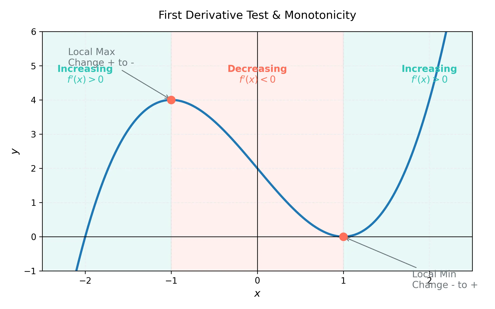
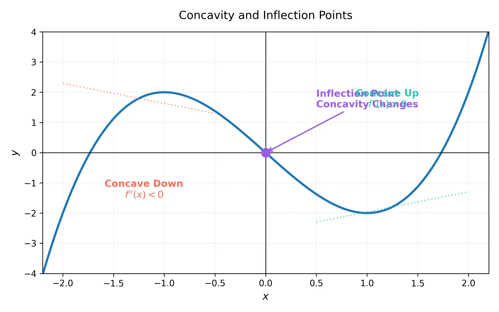

# 課程：微積分上 - 第 11 週 - 微分的應用：導數如何影響函數圖形 (How Derivatives Affect the Shape of a Graph)

本文件包含了第 11 週完整的教學大綱、實作指南以及練習題庫。本週重點在於利用一階與二階導數來分析函數的單調性、極值、凹向性以及反曲點，並最終能夠綜合這些資訊繪製出精確的函數概圖。
本週教學內容對應 **Stewart Calculus (Metric Edition) Chapter 4: Applications of Differentiation**。

---

## 一、 單元講解 (Lecture) - 總計 100 分鐘

### 1. 一階導數檢定 (First Derivative Test) (20 min) (KP11.1)
*   **課本對應**：Stewart Calculus Chapter 4 Section 4.3.
*   **概念講解**：
    *   **遞增/遞減測試 (Increasing/Decreasing Test)**：
        *   若在區間內 $f'(x) > 0$，則 $f$ 在該區間內遞增。
        *   若在區間內 $f'(x) < 0$，則 $f$ 在該區間內遞減。
    *   **一階導數檢定 (First Derivative Test)**：假設 $c$ 是連續函數 $f$ 的臨界點：
        1. 若 $f'$ 在 $c$ 處由**正變負**，則 $f(c)$ 為**局部極大值**。
        2. 若 $f'$ 在 $c$ 處由**負變正**，則 $f(c)$ 為**局部極小值**。
        3. 若 $f'$ 在 $c$ 處符號**不變**，則 $f(c)$ 不是局部極值。

    

*   **練習題與解答**：
    *   **練習題 11.1.1**：求函數 $f(x) = 3x^4 - 4x^3 - 12x^2 + 5$ 的遞增、遞減區間與局部極值。
    *   **解答**：
        1. 求導：$f'(x) = 12x^3 - 12x^2 - 24x = 12x(x^2 - x - 2) = 12x(x-2)(x+1)$。
        2. 臨界點：$x = -1, 0, 2$。
        3. 符號分析：
           - $(-\infty, -1)$：$f'(x) < 0$ (遞減)
           - $(-1, 0)$：$f'(x) > 0$ (遞增)
           - $(0, 2)$：$f'(x) < 0$ (遞減)
           - $(2, \infty)$：$f'(x) > 0$ (遞增)
        4. 極值：
           - $x = -1$ (負變正)：局部極小值 $f(-1) = 0$。
           - $x = 0$ (正變負)：局部極大值 $f(0) = 5$。
           - $x = 2$ (負變正)：局部極小值 $f(2) = -27$。

---

### 2. 函數的凹向性 (Concavity) (20 min) (KP11.2)
*   **課本對應**：Stewart Calculus Chapter 4 Section 4.3.
*   **定義**：
    *   **凹向上 (Concave Upward)**：若 $f$ 的圖形落在其所有切線的**上方**。
    *   **凹向下 (Concave Downward)**：若 $f$ 的圖形落在其所有切線的**下方**。
*   **凹向性測試 (Concavity Test)**：
    *   若在區間內 $f''(x) > 0$，則圖形為凹向上。
    *   若在區間內 $f''(x) < 0$，則圖形為凹向下。

    

*   **練習題與解答**：
    *   **練習題 11.2.1**：判斷 $f(x) = x^2$ 的凹向性。
    *   **解答**：
        1. $f'(x) = 2x$，$f''(x) = 2$。
        2. 因為 $f''(x) = 2 > 0$ 對所有 $x$ 成立，故該函數在整個實數域內均為凹向上。

---

### 3. 反曲點 (Inflection Points) (15 min) (KP11.3)
*   **課本對應**：Stewart Calculus Chapter 4 Section 4.3.
*   **定義**：
    若函數 $f$ 在點 $P(c, f(c))$ 處連續，且圖形的凹向性在該點發生**改變**（從凹向上變凹向下，或反之），則稱點 $P$ 為**反曲點 (Inflection Point)**。
*   **判定方法**：
    尋找 $f''(x) = 0$ 或 $f''(x)$ 不存在的點，並檢查其左右兩側的 $f''(x)$ 符號是否不同。
*   **練習題與解答**：
    *   **練習題 11.3.1**：找出 $f(x) = x^3 - 3x^2 + 2$ 的反曲點。
    *   **解答**：
        1. 求導：$f'(x) = 3x^2 - 6x$，$f''(x) = 6x - 6 = 6(x-1)$。
        2. 令 $f''(x) = 0 \implies x = 1$。
        3. 符號分析：當 $x < 1$ 時 $f''(x) < 0$ (凹向下)；當 $x > 1$ 時 $f''(x) > 0$ (凹向上)。
        4. 凹向性改變，故反曲點為 $(1, f(1)) = (1, 0)$。

---

### 4. 二階導數檢定 (Second Derivative Test) (20 min) (KP11.4)
*   **課本對應**：Stewart Calculus Chapter 4 Section 4.3.
*   **檢定內容**：
    假設 $f''$ 在 $c$ 附近連續，且 $f'(c) = 0$：
    1. 若 $f''(c) > 0$，則 $f(c)$ 為**局部極小值**。
    2. 若 $f''(c) < 0$，則 $f(c)$ 為**局部極大值**。
    3. 若 $f''(c) = 0$，則此檢定**無效**（需回到一階導數檢定）。
*   **比較**：二階導數檢定通常較快，但僅適用於 $f'(c)=0$ 且 $f''(c) \neq 0$ 的平滑點。
*   **練習題與解答**：
    *   **練習題 11.4.1**：使用二階導數檢定求 $f(x) = x^4 - 4x^3$ 的局部極值。
    *   **解答**：
        1. $f'(x) = 4x^3 - 12x^2 = 4x^2(x-3)$。臨界點 $x = 0, 3$。
        2. $f''(x) = 12x^2 - 24x$。
        3. 測試 $x=3$：$f''(3) = 12(9) - 24(3) = 108 - 72 = 36 > 0$。故 $x=3$ 是局部極小值。
        4. 測試 $x=0$：$f''(0) = 0$。檢定無效。回到一階檢定：$4x^2(x-3)$ 在 $x=0$ 左右符號均為負，故 $x=0$ 非極值。

---

### 5. 綜合特徵繪製函數概圖 (Curve Sketching) (25 min) (KP11.5)
*   **課本對應**：Stewart Calculus Chapter 4 Section 4.5.
*   **繪圖檢查清單**：
    1. **定義域 (Domain)**：函數在哪裡有意義？
    2. **截距 (Intercepts)**：x 軸截距 ($f(x)=0$) 與 y 軸截距 ($f(0)$)。
    3. **對稱性 (Symmetry)**：奇函數、偶函數或週期函數？
    4. **漸近線 (Asymptotes)**：水平漸近線與垂直漸近線。
    5. **增減性與極值** (一階導數分析)。
    6. **凹向性與反曲點** (二階導數分析)。
*   **練習題與解答**：
    *   **練習題 11.5.1**：討論並繪製 $f(x) = \frac{x^2}{x^2-1}$ 的特徵。
    *   **解答**：
        1. 定義域：$x \neq \pm 1$。
        2. 截距：$(0,0)$。
        3. 對稱性：偶函數 ($f(-x)=f(x)$)，關於 y 軸對稱。
        4. 漸近線：垂直 $x=1, x=-1$；水平 $y=1$ (當 $x \to \infty$)。
        5. $f'(x) = \frac{-2x}{(x^2-1)^2}$。$x=0$ 是臨界點。$x>0$ 時遞減，$x<0$ 時遞增。局部極大值 $f(0)=0$。
        6. $f''(x) = \frac{2(3x^2+1)}{(x^2-1)^3}$。無反曲點（$f'' \neq 0$）。在 $(-\infty, -1)$ 與 $(1, \infty)$ 凹向上，在 $(-1, 1)$ 凹向下。

---

## 二、 動手實作 (Lab) - 總計 50 分鐘

### 實作：使用 SymPy 分析函數特徵
**任務目標**：利用 Python 自動計算導數、臨界點、凹向性間隔與反曲點。
1.  在 Google Colab 中執行以下代碼。
    ```python
    import sympy as sp

    # 定義變數與函數
    x = sp.Symbol('x', real=True)
    f = (x**2 - 1) / (x**2 + 1)

    print(f"分析函數: f(x) = {f}")

    # 1. 求一階與二階導數
    f1 = sp.diff(f, x)
    f2 = sp.diff(f1, x)

    # 2. 尋找臨界點與局部極值
    crit_pts = sp.solve(f1, x)
    print(f"臨界點: {crit_pts}")

    for cp in crit_pts:
        val = f2.subs(x, cp)
        if val > 0:
            print(f"x = {cp} 是局部極小值 (f'' = {val})")
        elif val < 0:
            print(f"x = {cp} 是局部極大值 (f'' = {val})")

    # 3. 尋找反曲點
    inflection_pts = sp.solve(f2, x)
    print(f"反曲點候選 x: {inflection_pts}")

    # 4. 判斷凹向性 (測試點法)
    intervals = [-sp.oo] + sorted(inflection_pts) + [sp.oo]
    for i in range(len(intervals)-1):
        mid = (intervals[i] + intervals[i+1]) / 2 if intervals[i] != -sp.oo and intervals[i+1] != sp.oo else (intervals[i+1]-1 if intervals[i] == -sp.oo else intervals[i]+1)
        concavity = "凹向上" if f2.subs(x, mid) > 0 else "凹向下"
        print(f"區間 ({intervals[i]}, {intervals[i+1]}): {concavity}")
    ```

---

## 三、 本週知識點回顧 (KP)
- **KP11.1**: 一階導數檢定判定局部極值。
- **KP11.2**: 二階導數正負決定函數的凹向性。
- **KP11.3**: 反曲點定義為凹向性改變的轉折點。
- **KP11.4**: 二階導數檢定在平滑臨界點的應用。
- **KP11.5**: 綜合定義域、漸近線、增減性、凹向性繪製函數。

---

## 四、 課後測驗題庫 (Quiz) - 30 分鐘

### 1. 單選題 (Single Choice) - 共 10 題
1. **Q1**: 若 $f'(c)=0$ 且 $f''(c) > 0$，則 $f(c)$ 為？
   - (A) 局部極大值 (B) 局部極小值 (C) 反曲點 (D) 鞍點
2. **Q2**: 下列哪個函數在 $(0, \infty)$ 內是凹向下的？
   - (A) $x^2$ (B) $e^x$ (C) $\ln x$ (D) $x^3$
3. **Q3**: 反曲點發生的必要條件是？
   - (A) $f'(c)=0$ (B) $f''(c)=0$ 或 $f''(c)$ 不存在 (C) $f(c)=0$ (D) $f'(c)$ 不存在
4. **Q4**: 若 $f'(x) < 0$ 且 $f''(x) > 0$，則函數圖形呈現？
   - (A) 遞增且凹向上 (B) 遞增且凹向下 (C) 遞減且凹向上 (D) 遞減且凹向下
5. **Q5**: 函數 $f(x) = x^3$ 在 $x=0$ 處是？
   - (A) 局部極大值 (B) 局部極小值 (C) 反曲點 (D) 垂直漸近線點
6. **Q6**: 二階導數檢定在什麼情況下會失效？
   - (A) $f''(c) > 0$ (B) $f''(c) < 0$ (C) $f''(c) = 0$ (D) $f'(c) \neq 0$
7. **Q7**: 判定函數「遞增」的依據是？
   - (A) $f(x) > 0$ (B) $f'(x) > 0$ (C) $f''(x) > 0$ (D) $f'(x) = 0$
8. **Q8**: 若函數圖形始終落在其切線的上方，該函數具備什麼性質？
   - (A) 遞增 (B) 凹向上 (C) 凹向下 (D) 有極大值
9. **Q9**: 函數 $f(x) = \frac{1}{x}$ 在其定義域內的凹向性為？
   - (A) 全域凹向上 (B) 全域凹向下 (C) $x>0$ 凹向上，$x<0$ 凹向下 (D) $x>0$ 凹向下，$x<0$ 凹向上
10. **Q10**: 繪製函數圖形時，若 $\lim_{x \to \infty} f(x) = L$，則 $y=L$ 是？
    - (A) 垂直漸近線 (B) 水平漸近線 (C) 斜漸近線 (D) 反曲點

### 2. 多選題 (Multiple Choice) - 共 10 題
11. **Q11**: 下列關於反曲點的敘述，哪些正確？
    - (A) 必須滿足 $f''(c)=0$ (B) 凹向性必須改變 (C) 函數在該點必須連續 (D) 該點的切線斜率必須為 0
12. **Q12**: 一階導數檢定可以用來判斷？
    - (A) 局部極大值 (B) 局部極小值 (C) 函數遞增區間 (D) 函數凹向性
13. **Q13**: 下列哪些函數在全體實數域內均為凹向上？
    - (A) $f(x) = x^2$ (B) $f(x) = e^x$ (C) $f(x) = x^4$ (D) $f(x) = -x^2$
14. **Q14**: 若 $f'(c)=0$，則 $c$ 可能是？
    - (A) 局部極大值點 (B) 局部極小值點 (C) 反曲點 (D) 垂直漸近線點
15. **Q15**: 關於二階導數檢定，正確的敘述包括？
    - (A) 比一階檢定更具通用性 (B) 僅適用於 $f'(c)=0$ 的點 (C) 若 $f''(c)=0$ 則無法判斷 (D) 只能判斷平滑的極值點
16. **Q16**: 分析 $f(x) = \frac{x}{x-1}$ 時，需要考慮哪些？
    - (A) 垂直漸近線 $x=1$ (B) 水平漸近線 $y=1$ (C) 定義域不包含 $x=1$ (D) 反曲點
17. **Q17**: 若一個連續函數在區間內由遞增轉為遞減，則？
    - (A) 轉折點一定是臨界點 (B) 該點必定有局部極大值 (C) 該點必定有局部極小值 (D) 該點導數可能不存在
18. **Q18**: 下列哪些情況會導致 $f''(c)$ 不存在？
    - (A) $f(x) = |x|$ 在 $x=0$ (B) $f(x) = x^{1/3}$ 在 $x=0$ (C) $f(x) = x^3$ 在 $x=0$ (D) $f(x) = \sin x$ 在 $x=0$
19. **Q19**: 在繪製概圖時，對稱性可以減少計算量，例如？
    - (A) 偶函數只需畫 $x \ge 0$ 再鏡像 (B) 奇函數只需畫 $x \ge 0$ 再旋轉 (C) 多項式一定對稱 (D) 指數函數不對稱
20. **Q20**: 下列敘述正確的是？
    - (A) $f'(x) > 0$ 代表函數向上爬升 (B) $f''(x) < 0$ 圖形像個「倒扣的碗」 (C) 臨界點包含 $f'(x)$ 不存在的點 (D) 極值點一定是反曲點

### 3. 填充題 (Fill-in-the-blank) - 共 10 題
21. **Q21**: 函數 $f(x) = x^2 - 4x$ 的局部極小值發生在 $x = $ __________。
22. **Q22**: 若 $f''(x) = 12x^2 - 2$，則該函數的反曲點 x 座標為 __________。
23. **Q23**: 函數 $f(x) = \sin x$ 在區間 $(0, \pi)$ 內的凹向性為 __________。
24. **Q24**: 一階導數由負變正的臨界點對應到 __________ 極小值。
25. **Q25**: 若 $f'(1)=0$ 且 $f''(1)=-5$，則 $f(1)$ 為局部 __________ 值。
26. **Q26**: 函數 $f(x) = x^4$ 在 $x=0$ 處的 $f''(0)=0$，但它卻是局部極 __________ 值。
27. **Q27**: $f(x) = \ln(x)$ 的定義域為 __________。
28. **Q28**: 垂直漸近線通常發生在分式函數中 __________ 為零的點。
29. **Q29**: 若 $f$ 為奇函數且在 $(0, 2)$ 凹向上，則在 $(-2, 0)$ 必為 __________。
30. **Q30**: 繪製概圖時，第一步通常是找出函數的 __________。

---

## 五、 Q 矩陣 (Q-matrix)

| 題號 | KP11.1 | KP11.2 | KP11.3 | KP11.4 | KP11.5 |
|---|---|---|---|---|---|
| Q1-Q10 | ... | ... | ... | ... | ... |
(註：Q 矩陣詳細分佈見 solution 檔案)
