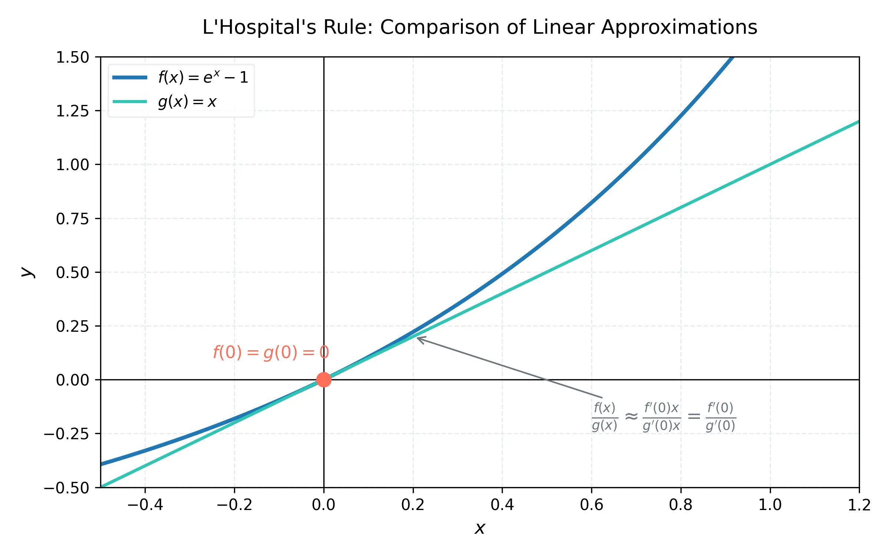
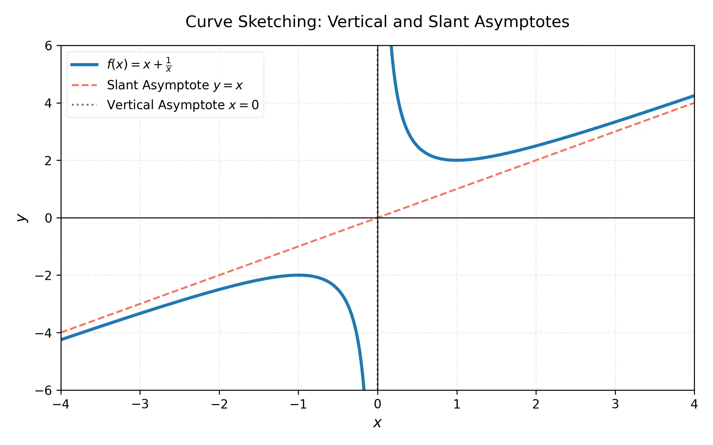

# 課程：微積分上 - 第 12 週 - 洛必達法則與函數圖形描繪 (L'Hospital's Rule and Curve Sketching)

本文件包含了第 12 週完整的教學大綱、實作指南以及練習題庫。本週重點在於掌握洛必達法則 (L'Hospital's Rule) 以解決各類未定式的極限問題，並學習如何分析包含斜漸近線在內的複雜函數圖形。
本週教學內容對應 **Stewart Calculus (Metric Edition) Chapter 4: Applications of Differentiation**。

---

## 一、 單元講解 (Lecture) - 總計 100 分鐘

### 1. 洛必達法則：基礎未定式 $0/0$ 與 $\infty/\infty$ (20 min) (KP12.1)
*   **課本對應**：Stewart Calculus Chapter 4 Section 4.4.
*   **概念講解**：
    假設 $f$ 和 $g$ 是可微函數，且在包含 $a$ 的開區間內（除 $a$ 外） $g'(x) \neq 0$。
    若 $\lim_{x \to a} f(x) = 0$ 且 $\lim_{x \to a} g(x) = 0$，或者兩者皆為 $\pm \infty$，則：
    $$\lim_{x \to a} \frac{f(x)}{g(x)} = \lim_{x \to a} \frac{f'(x)}{g'(x)}$$
    只要右側極限存在（或是 $\infty, -\infty$）。
*   **注意**：在使用洛必達法則前，**必須**確認極限屬於 $0/0$ 或 $\infty/\infty$ 形式。

    

*   **練習題與解答**：
    *   **練習題 12.1.1**：求 $\lim_{x \to 0} \frac{\sin x - x}{x^3}$。
    *   **解答**：
        1. 檢查形式：當 $x \to 0$，分子 $\sin 0 - 0 = 0$，分母 $0^3 = 0$。符合 $0/0$。
        2. 應用洛必達：$\lim_{x \to 0} \frac{\cos x - 1}{3x^2}$。仍然是 $0/0$。
        3. 再次應用：$\lim_{x \to 0} \frac{-\sin x}{6x} = -\frac{1}{6} \lim_{x \to 0} \frac{\sin x}{x} = -\frac{1}{6}(1) = -\frac{1}{6}$。

---

### 2. 乘積與差項的未定式：$0 \cdot \infty$ 與 $\infty - \infty$ (20 min) (KP12.2)
*   **課本對應**：Stewart Calculus Chapter 4 Section 4.4.
*   **轉換技巧**：
    *   **$0 \cdot \infty$ 型**：將 $fg$ 改寫為 $\frac{f}{1/g}$ 或 $\frac{g}{1/f}$，將其轉換為 $0/0$ 或 $\infty/\infty$。
    *   **$\infty - \infty$ 型**：透過通分、有理化或提出公因式，將差項轉為分式形式。
*   **練習題與解答**：
    *   **練習題 12.2.1**：求 $\lim_{x \to 0^+} x \ln x$。
    *   **解答**：
        1. 形式為 $0 \cdot (-\infty)$。
        2. 轉換：$\lim_{x \to 0^+} \frac{\ln x}{1/x}$ (變為 $-\infty/\infty$ 形式)。
        3. 洛必達：$\lim_{x \to 0^+} \frac{1/x}{-1/x^2} = \lim_{x \to 0^+} (-x) = 0$。

---

### 3. 指數型未定式：$0^0, \infty^0, 1^\infty$ (20 min) (KP12.3)
*   **課本對應**：Stewart Calculus Chapter 4 Section 4.4.
*   **處理流程**：
    1. 令 $y = [f(x)]^{g(x)}$。
    2. 取自然對數：$\ln y = g(x) \ln f(x)$。
    3. 求 $\ln y$ 的極限 $L = \lim \ln y$ (此時通常會變成 $0 \cdot \infty$ 型)。
    4. 原極限為 $e^L$。
*   **練習題與解答**：
    *   **練習題 12.3.1**：求 $\lim_{x \to 0^+} (1+ \sin 4x)^{\cot x}$。
    *   **解答**：
        1. 形式為 $1^\infty$。
        2. 令 $y = (1+ \sin 4x)^{\cot x} \implies \ln y = \cot x \ln(1+ \sin 4x) = \frac{\ln(1+ \sin 4x)}{\tan x}$。
        3. 求 $\lim_{x \to 0^+} \frac{\ln(1+ \sin 4x)}{\tan x}$ (形式 $0/0$)。
        4. 洛必達：$\lim_{x \to 0^+} \frac{\frac{4 \cos 4x}{1 + \sin 4x}}{\sec^2 x} = \frac{4/1}{1} = 4$。
        5. 原極限為 $e^4$。

---

### 4. 具備漸近線的複雜函數圖形描繪 (25 min) (KP12.4)
*   **課本對應**：Stewart Calculus Chapter 4 Section 4.5.
*   **漸近線複習與進階**：
    *   **垂直漸近線 (V.A.)**：分母為零且分子不為零的點。
    *   **水平漸近線 (H.A.)**：$\lim_{x \to \pm \infty} f(x) = L$。
    *   **斜漸近線 (Slant Asymptotes)**：若 $f(x) = mx + b + r(x)$ 且 $\lim_{x \to \pm \infty} r(x) = 0$，則 $y = mx + b$ 是斜漸近線。通常發生在分子次數比分母次數恰好高 1 次的多項式分式。

    

*   **練習題與解答**：
    *   **練習題 12.4.1**：找出 $f(x) = \frac{x^2+x+1}{x}$ 的漸近線並分析圖形。
    *   **解答**：
        1. 改寫為 $f(x) = x + 1 + \frac{1}{x}$。
        2. **V.A.**：$x = 0$。
        3. **斜漸近線**：因為 $\lim_{x \to \infty} \frac{1}{x} = 0$，故斜漸近線為 $y = x + 1$。
        4. 極值：$f'(x) = 1 - \frac{1}{x^2}$。臨界點 $x = \pm 1$。局部極小 $f(1)=3$，局部極大 $f(-1)=-1$。

---

### 5. 微積分與繪圖計算機的驗證與誤差分析 (15 min) (KP12.5)
*   **課本對應**：Stewart Calculus Chapter 4 Section 4.6.
*   **重點議題**：
    *   **解析度陷阱**：計算機可能漏掉極窄的峰值或極點。
    *   **精確極值**：利用導數找出的極值點是精確的，而計算機可能是數值逼近。
    *   **驗證步驟**：使用二階導數確認凹向性，確保繪圖工具顯示的彎曲方向正確。
*   **討論**：例如 $f(x) = \sin(100x)$ 在大範圍縮放下的顯示誤差。

---

## 二、 動手實作 (Lab) - 總計 50 分鐘

### 實作：使用 SymPy 處理極限與漸近線
**任務目標**：利用 Python 自動判斷未定式並找出各類漸近線。
1.  在 Google Colab 中執行以下代碼。
    ```python
    import sympy as sp

    x = sp.Symbol('x', real=True)

    def analyze_limit(expr, target):
        print(f"極限表達式: {expr} 在 x -> {target}")
        limit_val = sp.limit(expr, x, target)
        print(f"結果: {limit_val}")

    # 1. 洛必達實例
    analyze_limit(sp.sin(x)/x, 0)
    analyze_limit((sp.exp(x)-1-x)/x**2, 0)

    # 2. 尋找漸近線
    f = (x**3 + 1) / (x**2 - 4)
    print(f"\n分析函數: {f}")

    # 垂直漸近線
    va = sp.solve(sp.denom(f), x)
    print(f"垂直漸近線: x = {va}")

    # 水平或斜漸近線
    # 若次數差為 1，求斜漸近線 y = mx + b
    m = sp.limit(f/x, x, sp.oo)
    if m != 0 and m != sp.oo:
        b = sp.limit(f - m*x, x, sp.oo)
        print(f"斜漸近線: y = {m}x + {b}")
    else:
        ha = sp.limit(f, x, sp.oo)
        print(f"水平漸近線: y = {ha}")
    ```

---

## 三、 本週知識點回顧 (KP)
- **KP12.1**: 洛必達法則處理 $0/0$ 與 $\infty/\infty$ 的基本條件。
- **KP12.2**: 將乘積與差項轉為商式以應用洛必達。
- **KP12.3**: 利用對數將指數型未定式降階。
- **KP12.4**: 斜漸近線的判斷與綜合繪圖技術。
- **KP12.5**: 微積分是驗證圖形工具正確性的最終標準。

---

## 四、 課後測驗題庫 (Quiz) - 30 分鐘

### 1. 單選題 (Single Choice) - 共 10 題
1. **Q1**: 洛必達法則主要用來解決哪種問題？
   - (A) 微分 (B) 積分 (C) 未定式極限 (D) 導數連續性
2. **Q2**: 若 $\lim_{x \to a} f(x) = 1$ 且 $\lim_{x \to a} g(x) = \infty$，則 $\lim_{x \to a} [f(x)]^{g(x)}$ 屬於哪種未定式？
   - (A) $0^0$ (B) $\infty^0$ (C) $1^\infty$ (D) $0/0$
3. **Q3**: 求 $\lim_{x \to 0} \frac{e^x - 1}{x}$ 的結果為？
   - (A) 0 (B) 1 (C) $\infty$ (D) 不存在
4. **Q4**: 下列哪個函數具有斜漸近線？
   - (A) $\frac{x}{x^2+1}$ (B) $\frac{x^2}{x+1}$ (C) $\frac{x^3}{x+1}$ (D) $\sin x$
5. **Q5**: 處理 $\infty - \infty$ 未定式的第一步通常是？
   - (A) 取對數 (B) 直接微分 (C) 合併分式 (D) 使用連鎖律
6. **Q6**: 斜漸近線 $y = mx + b$ 中的 $m$ 可以透過哪個極限求得？
   - (A) $\lim_{x \to \infty} f(x)$ (B) $\lim_{x \to \infty} \frac{f(x)}{x}$ (C) $\lim_{x \to 0} f(x)$ (D) $\lim_{x \to \infty} [f(x) - x]$
7. **Q7**: 函數 $f(x) = e^{-x}x$ 在 $x \to \infty$ 時的極限為？
   - (A) $\infty$ (B) 1 (C) 0 (D) $e$
8. **Q8**: 下列何者**不是**洛必達法則的直接適用形式？
   - (A) $0/0$ (B) $\infty/\infty$ (C) $0 \cdot \infty$ (D) 全部都不是
9. **Q9**: $\lim_{x \to 0^+} x^x$ 的值為？
   - (A) 0 (B) 1 (C) $e$ (D) $1/e$
10. **Q10**: 在繪製圖形時，若發現分子次數恰比分母次數大 1，應檢查是否存在？
    - (A) 垂直漸近線 (B) 水平漸近線 (C) 斜漸近線 (D) 反曲點

### 2. 多選題 (Multiple Choice) - 共 10 題
11. **Q11**: 下列哪些是洛必達法則的正確應用前提？
    - (A) 分子分母必須同時趨近於 0 或 $\infty$ (B) 分母的導數不能為 0 (C) 極限必須是單側極限 (D) 分子分母必須在區間內可微
12. **Q12**: 指數型未定式包括？
    - (A) $0^0$ (B) $1^\infty$ (C) $\infty^0$ (D) $0^\infty$
13. **Q13**: 關於漸近線，下列敘述哪些正確？
    - (A) 水平漸近線可以與圖形相交 (B) 垂直漸近線絕不與圖形相交 (C) 一個函數最多只有兩條水平漸近線 (D) 斜漸近線必不與水平漸近線同時存在（在同一端）
14. **Q14**: 求 $\lim_{x \to \infty} \frac{\ln x}{x^p}$ ($p > 0$) 時，下列敘述正確的是？
    - (A) 形式為 $\infty/\infty$ (B) 結果為 0 (C) 代表冪函數比對數函數增長快 (D) 結果為 $\infty$
15. **Q15**: 使用繪圖計算機時可能的誤差來源包括？
    - (A) 函數在某點未定義 (B) 選取的 $x$ 軸範圍太廣 (C) 垂直漸近線被畫成斜線 (D) 計算機解析度限制
16. **Q16**: 轉換 $0 \cdot \infty$ 為洛必達形式時，可以？
    - (A) 把 0 項放到分母變成 $1/0 = \infty$ (B) 把 $\infty$ 項放到分母變成 $1/\infty = 0$ (C) 直接對兩項分別微分 (D) 取 $\ln$ 轉換
17. **Q17**: 函數 $f(x) = \frac{x^2-1}{x+1}$ 的特性包括？
    - (A) $x = -1$ 是垂直漸近線 (B) 在 $x = -1$ 處有空心點 (C) 其圖形是一條直線（除 $x=-1$ 外） (D) 具有斜漸近線
18. **Q18**: 若 $\lim_{x \to a} \frac{f'(x)}{g'(x)} = L$，則 $\lim_{x \to a} \frac{f(x)}{g(x)} = L$ 的條件是？
    - (A) $f(a)=g(a)=0$ (B) $f, g$ 在 $a$ 附近可微 (C) $L$ 必須是實數 (D) $g'(x) \neq 0$
19. **Q19**: 下列極限值為 1 的有？
    - (A) $\lim_{x \to 0} \frac{\sin x}{x}$ (B) $\lim_{x \to \infty} (1+1/x)^x$ (C) $\lim_{x \to 0^+} x^x$ (D) $\lim_{x \to \infty} \frac{x+1}{x-1}$
20. **Q20**: 斜漸近線的求法步驟包含？
    - (A) 長除法 (B) 求 $\lim f(x)/x$ (C) 求 $\lim [f(x) - mx]$ (D) 檢查二階導數

### 3. 填充題 (Fill-in-the-blank) - 共 10 題
21. **Q21**: $\lim_{x \to 0} \frac{\tan x}{x} = $ __________。
22. **Q22**: 函數 $f(x) = \frac{2x^2+1}{x-1}$ 的斜漸近線方程式為 $y = $ __________。
23. **Q23**: $\lim_{x \to \infty} \frac{\ln x}{x} = $ __________。
24. **Q24**: 處理 $1^\infty$ 未定式時，取對數後的極限形式通常會變成 __________ 型。
25. **Q25**: 若 $\lim_{x \to a} f(x) = 0$ 且 $\lim_{x \to a} g(x) = \infty$，則 $f(x) \cdot g(x)$ 的極限稱為 __________ 式。
26. **Q26**: 洛必達法則**不能**直接用於 $\frac{\infty}{0}$，因為這不是 __________。
27. **Q27**: $\lim_{x \to 0} \frac{1-\cos x}{x^2} = $ __________。
28. **Q28**: 函數 $f(x) = \frac{x^3}{x^2+1}$ 的斜漸近線為 $y = $ __________。
29. **Q29**: 使用洛必達法則時，是對分子與分母分別 __________，而不是使用除法規則。
30. **Q30**: 繪圖時若 $\lim_{x \to 3^+} f(x) = \infty$，則 $x=3$ 是 __________ 漸近線。
