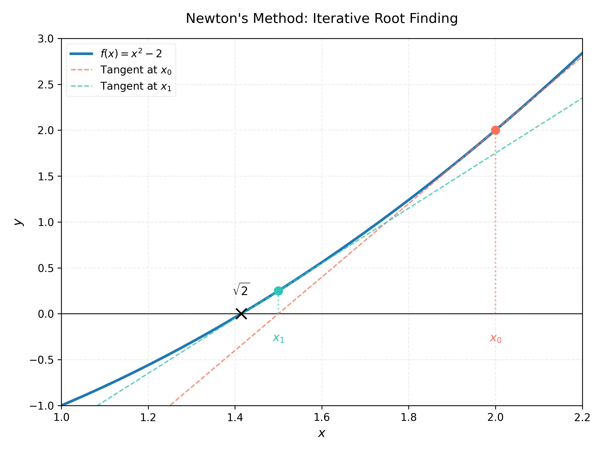
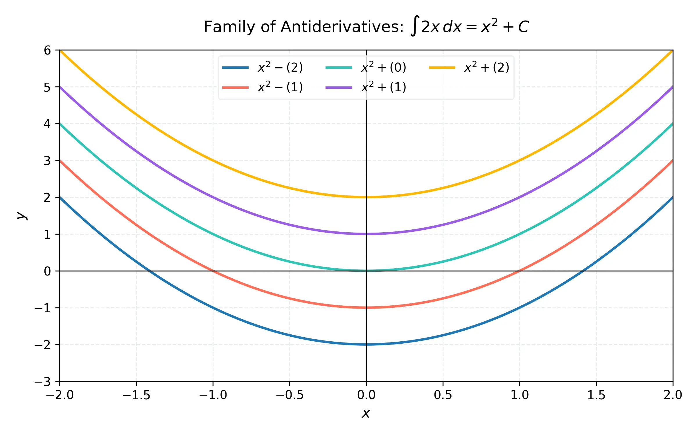

# 課程：微積分上 - 第 13 週 - 最佳化問題、牛頓法與反導數

本文件包含了第 13 週完整的教學大綱、實作指南以及練習題庫。本週重點在於應用導數解決現實世界中的最佳化問題，學習數值解法「牛頓法」，並初步探索微分的逆運算——反導數。
本週教學內容對應 **Stewart Calculus (Metric Edition) Chapter 4: Applications of Differentiation**。

---

## 一、 單元講解 (Lecture) - 總計 100 分鐘

### 1. 最佳化問題建模：面積與體積最大化 (20 min) (KP13.1)
*   **概念講解**：
    最佳化問題的核心是將現實約束轉化為數學函數，並尋找其極值。
    **步驟**：
    1.  繪圖並定義變數。
    2.  寫出目標函數（例如面積 $A$ 或體積 $V$）。
    3.  利用約束條件消去多餘變數，得到單變數函數。
    4.  求導並找尋臨界點。
    5.  確認是否為最大值（一階或二階導數判別法）。

*   **經典案例：無蓋盒子 (Open Box Problem)**：
    從一塊 $a \times b$ 的長方形紙板四個角剪去邊長為 $x$ 的正方形，摺成無蓋盒子。體積 $V(x) = x(a-2x)(b-2x)$。

*   **練習題與解答**：
    *   **練習題 13.1.1**：給定 1200 $cm^2$ 的材料製作一個底面為正方形的無蓋盒子，求其最大體積。
    *   **解答**：
        1. 設底面邊長為 $x$，高為 $h$。
        2. 約束：表面積 $S = x^2 + 4xh = 1200 \implies h = \frac{1200 - x^2}{4x}$。
        3. 目標：$V = x^2 h = x^2 \left( \frac{1200 - x^2}{4x} \right) = 300x - \frac{1}{4}x^3$。
        4. 求導：$V' = 300 - \frac{3}{4}x^2$。令 $V' = 0 \implies x^2 = 400 \implies x = 20$。
        5. 二階導：$V'' = -\frac{3}{2}x < 0$，故為最大值。
        6. $V_{max} = 300(20) - \frac{1}{4}(20^3) = 6000 - 2000 = 4000 \text{ cm}^3$。

---

### 2. 最佳化問題建模：成本最小化與距離最短 (20 min) (KP13.2)
*   **概念講解**：
    在工業生產中，我們常希望最小化材料成本或表面積。在幾何中，最短距離問題常利用距離公式的平方來簡化計算。

*   **經典案例：圓柱體罐頭 (Cylindrical Can)**：
    設計一個給定體積 $V$ 的圓柱體，使其表面積最小。結論通常是 $h = 2r$（高等於直徑）。

*   **練習題與解答**：
    *   **練習題 13.2.1**：求曲線 $y = \sqrt{x}$ 上距離點 $(3, 0)$ 最近的點。
    *   **解答**：
        1. 距離平方 $D = (x-3)^2 + (y-0)^2 = (x-3)^2 + x = x^2 - 5x + 9$。
        2. 求導：$D' = 2x - 5$。令 $D' = 0 \implies x = 2.5$。
        3. 當 $x = 2.5$ 時，$y = \sqrt{2.5}$。點為 $(2.5, \sqrt{2.5})$。
    *   **練習題 13.2.2**：製作一個體積為 500 $cm^3$ 的圓柱體罐頭，求使其表面積最小的半徑 $r$。
    *   **解答**：
        1. $V = \pi r^2 h = 500 \implies h = 500 / (\pi r^2)$。
        2. $A = 2\pi r^2 + 2\pi r h = 2\pi r^2 + \frac{1000}{r}$。
        3. $A' = 4\pi r - \frac{1000}{r^2} = 0 \implies 4\pi r^3 = 1000 \implies r = \sqrt[3]{\frac{250}{\pi}} \approx 4.3 \text{ cm}$。

---

### 3. 經濟學與商業中的邊際分析 (20 min) (KP13.3)
*   **概念講解**：
    *   **成本函數 $C(x)$**，**營收函數 $R(x)$**，**利潤函數 $P(x) = R(x) - C(x)$**。
    *   **邊際成本 (Marginal Cost)**: $C'(x)$。
    *   **邊際營收 (Marginal Revenue)**: $R'(x)$。
    *   **利潤最大化條件**：$P'(x) = 0 \implies R'(x) = C'(x)$。即「邊際營收等於邊際成本」。

*   **練習題與解答**：
    *   **練習題 13.3.1**：已知 $C(x) = 100 + 3x$，需求函數 $p(x) = 15 - 0.1x$。求最大利潤的產量。
    *   **解答**：
        1. $R(x) = x \cdot p(x) = 15x - 0.1x^2$。
        2. $P(x) = R(x) - C(x) = -0.1x^2 + 12x - 100$。
        3. $P'(x) = -0.2x + 12 = 0 \implies x = 60$。產量為 60 時利潤最大。

---

### 4. 牛頓法 (Newton's Method) (20 min) (KP13.4)
*   **概念講解**：
    用於尋找方程 $f(x) = 0$ 的數值解。
    **幾何意義**：利用切線與 $x$ 軸的交點作為根的下一個近似值。
    **迭代公式**：
    $$x_{n+1} = x_n - \frac{f(x_n)}{f'(x_n)}$$
    
    

*   **注意**：若 $f'(x_n)$ 接近 0 或初始值 $x_0$ 選擇不當，牛頓法可能會發散（Divergence）。

*   **練習題與解答**：
    *   **練習題 13.4.1**：使用牛頓法求 $x^3 - 2 = 0$ 的近似解（即 $\sqrt[3]{2}$），設 $x_1 = 1.5$。
    *   **解答**：
        1. $f(x) = x^3 - 2, f'(x) = 3x^2$。
        2. $x_2 = 1.5 - \frac{1.5^3 - 2}{3(1.5)^2} = 1.5 - \frac{3.375 - 2}{6.75} = 1.5 - \frac{1.375}{6.75} \approx 1.2963$。

---

### 5. 反導數 (Antiderivatives) 導論 (20 min) (KP13.5)
*   **概念講解**：
    若 $F'(x) = f(x)$，則稱 $F$ 為 $f$ 的一個**反導數**。
    **通解形式**：$F(x) + C$，其中 $C$ 為任意常數。
    **初值問題 (IVP)**：給定一個點 $(x_0, y_0)$，可以求出唯一的 $C$。

    

*   **常見公式**：
    *   $\int x^n dx = \frac{x^{n+1}}{n+1} + C \quad (n \neq -1)$
    *   $\int \sin x dx = -\cos x + C$
    *   $\int e^x dx = e^x + C$

*   **練習題與解答**：
    *   **練習題 13.5.1**：求 $f(x) = x^2 - \sin x$ 的所有反導數。
    *   **解答**：$F(x) = \frac{1}{3}x^3 + \cos x + C$。
    *   **練習題 13.5.2**：已知 $f'(x) = 4x^3$ 且 $f(1) = 5$，求 $f(x)$。
    *   **解答**：
        1. $f(x) = \int 4x^3 dx = x^4 + C$。
        2. 代入初值：$1^4 + C = 5 \implies C = 4$。
        3. $f(x) = x^4 + 4$。

---

## 二、 動手實作 (Lab) - 總計 50 分鐘

### 實作：SymPy 最佳化與牛頓法實作
**任務目標**：利用 Python 自動化求解最佳化問題並實作牛頓法。
1.  在 Google Colab 中執行以下代碼。
    ```python
    import sympy as sp

    # 1. 最佳化問題：圓柱體體積固定，求最小表面積
    r = sp.Symbol('r', positive=True)
    h = sp.Symbol('h', positive=True)
    V_fixed = 1000  # 固定體積

    # 約束：V = pi * r^2 * h => h = V / (pi * r^2)
    h_expr = V_fixed / (sp.pi * r**2)
    
    # 目標：表面積 S = 2*pi*r^2 + 2*pi*r*h
    S = 2 * sp.pi * r**2 + 2 * sp.pi * r * h_expr
    
    print(f"表面積函數 S(r) = {S}")
    
    dS_dr = sp.diff(S, r)
    crit_points = sp.solve(dS_dr, r)
    r_min = crit_points[0]
    
    print(f"最佳半徑 r = {r_min.evalf()}")
    print(f"最佳高度 h = {h_expr.subs(r, r_min).evalf()}")

    # 2. 牛頓法實作
    def newton_method(f_func, x0, iterations=5):
        x_val = x0
        f_sym = sp.sympify(f_func)
        df_sym = sp.diff(f_sym, sp.Symbol('x'))
        
        f = sp.lambdify(sp.Symbol('x'), f_sym)
        df = sp.lambdify(sp.Symbol('x'), df_sym)
        
        print(f"\n牛頓法求解 {f_func} = 0, 初始值 x0 = {x0}")
        for i in range(iterations):
            x_val = x_val - f(x_val) / df(x_val)
            print(f"迭代 {i+1}: x = {x_val:.6f}")
        return x_val

    newton_method("x**3 - x - 1", 1.5)
    ```

---

## 三、 本週知識點回顧 (KP)
- **KP13.1**: 利用導數尋找面積與體積的最大化方案。
- **KP13.2**: 成本最小化與距離最短問題的建模技巧。
- **KP13.3**: 理解邊際成本與邊際營收相等時，利潤達到最大。
- **KP13.4**: 牛頓法公式 $x_{n+1} = x_n - f(x_n)/f'(x_n)$ 的運用。
- **KP13.5**: 反導數的定義與初值問題的解法。

---

## 四、 課後測驗題庫 (Quiz) - 30 分鐘

### 1. 單選題 (Single Choice) - 共 10 題
1. **Q1**: 最佳化問題中，若目標函數在開區間內只有一個臨界點且二階導為正，則該點為？
   - (A) 局部最大 (B) 絕對最小 (C) 反曲點 (D) 垂直漸近線
2. **Q2**: 在「無蓋盒子」問題中，若紙板為正方形（邊長 $L$），剪去的小正方形邊長 $x$ 為多少時體積最大？
   - (A) $L/2$ (B) $L/4$ (C) $L/6$ (D) $L/8$
3. **Q3**: 邊際成本 $MC$ 是成本函數 $C(x)$ 的？
   - (A) 積分 (B) 一階導數 (C) 二階導數 (D) 倒數
4. **Q4**: 當邊際營收 $MR$ 小於邊際成本 $MC$ 時，企業應該？
   - (A) 增加產量 (B) 減少產量 (C) 保持不變 (D) 提高售價但不改產量
5. **Q5**: 牛頓法在下列哪種情況下會失效？
   - (A) $f(x)$ 是多項式 (B) $f'(x_n) = 0$ (C) $x_0$ 太接近根 (D) $f''(x) > 0$
6. **Q6**: 求 $x^2 - 2 = 0$ 的牛頓法迭代公式為？
   - (A) $x_{n+1} = (x_n + 2/x_n)/2$ (B) $x_{n+1} = x_n - x_n^2$ (C) $x_{n+1} = 2x_n$ (D) $x_{n+1} = x_n - 2$
7. **Q7**: 函數 $f(x) = \sin x$ 的一般反導數為？
   - (A) $\cos x + C$ (B) $-\cos x + C$ (C) $\sin x + C$ (D) $-\sin x + C$
8. **Q8**: 若 $F(x)$ 是 $f(x)$ 的反導數，則 $(F(x) + 5)' = $？
   - (A) $f(x) + 5$ (B) $f(x)$ (C) $f'(x)$ (D) $0$
9. **Q9**: 求解初值問題 $y' = e^x, y(0) = 2$，則 $y(x) = $？
   - (A) $e^x + 1$ (B) $e^x + 2$ (C) $e^x$ (D) $e^x - 1$
10. **Q10**: 距離最短問題中，最小化 $d = \sqrt{f(x)^2 + g(x)^2}$ 等同於最小化？
    - (A) $f(x) + g(x)$ (B) $f(x)^2 + g(x)^2$ (C) $f'(x) + g'(x)$ (D) $\sqrt{f(x) + g(x)}$

### 2. 多選題 (Multiple Choice) - 共 10 題
11. **Q11**: 下列哪些是解決最佳化問題的正確步驟？
    - (A) 找出目標函數 (B) 確定定義域 (C) 求臨界點 (D) 忽略端點值
12. **Q12**: 關於圓柱體罐頭（體積固定）表面積最小化的敘述，正確的是？
    - (A) 側面面積應等於底面積的兩倍 (B) 高度等於直徑 (C) $h = 2r$ (D) 只要半徑大，面積就小
13. **Q13**: 利潤最大化發生在？
    - (A) $MR = MC$ (B) $P'(x) = 0$ (C) $R(x) = C(x)$ (D) 營收最大時
14. **Q14**: 牛頓法可能不收斂的原因 include？
    - (A) 初始值遠離真實根 (B) 導數為零 (C) 陷入循環 (D) 函數是二階的
15. **Q15**: 反導數的應用包括？
    - (A) 由加速度求速度 (B) 由速度求位移 (C) 由邊際成本求總成本 (D) 求曲線的切線斜率
16. **Q16**: 下列哪些是 $f(x) = x$ 的反導數？
    - (A) $x^2/2$ (B) $x^2/2 + 10$ (C) $x^2/2 - \pi$ (D) $1$
17. **Q17**: 關於初值問題 (IVP)，下列敘述正確的是？
    - (A) 需要一個已知點來確定常數 $C$ (B) 反導數的通解包含無數個函數 (C) IVP 的解是唯一的 (D) IVP 只能解決多項式
18. **Q18**: 牛頓法求 $f(x)=0$ 的根，若 $f(x)$ 是直線 $ax+b$，則？
    - (A) 一次迭代即可得到精確根 (B) 需要多次迭代 (C) 迭代公式與 $x_n$ 無關 (D) 公式簡化為 $-b/a$
19. **Q19**: 在經濟學模型中，總利潤 $P(x)$ 增加的條件是？
    - (A) $MR > MC$ (B) $P'(x) > 0$ (C) $MR < MC$ (D) $R(x) > C(x)$ 且產量在增加
20. **Q20**: 下列公式正確的有？
    - (A) $\int x^3 dx = \frac{1}{4}x^4 + C$ (B) $\int \frac{1}{x} dx = \ln|x| + C$ (C) $\int \cos x dx = \sin x + C$ (D) $\int k dx = kx + C$

### 3. 填充題 (Fill-in-the-blank) - 共 10 題
21. **Q21**: 若 $f'(x) = 2x + 3$，則其一般反導數 $F(x) = $ __________。
22. **Q22**: 牛頓法的迭代公式中，分母項為 __________。
23. **Q23**: 經濟學中，當 $MR = MC$ 時，__________ 達到極大。
24. **Q24**: 給定周長固定為 $P$ 的矩形，當其為 __________ 時面積最大。
25. **Q25**: 求 $\sqrt{a}$ 的牛頓迭代式為 $x_{n+1} = \frac{1}{2}(x_n + \frac{a}{x_n})$，這又被稱為 __________ 法。
26. **Q26**: 若 $f(x) = \sec^2 x$，則其反導數為 $F(x) = $ __________。
27. **Q27**: 已知 $a(t) = -9.8$，則速度 $v(t) = $ __________（設初始速度為 $v_0$）。
28. **Q28**: 最佳化問題中，若臨界點在邊界上，則必須檢查 __________ 的函數值。
29. **Q29**: 牛頓法求根時，若切線水平，則無法與 __________ 軸相交。
30. **Q30**: 符號 $\int f(x) dx$ 稱為 __________ 積分。
