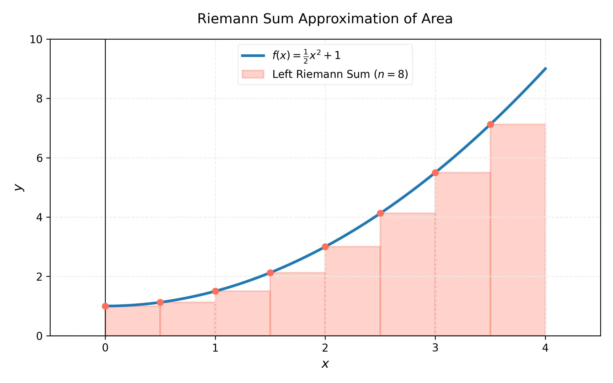
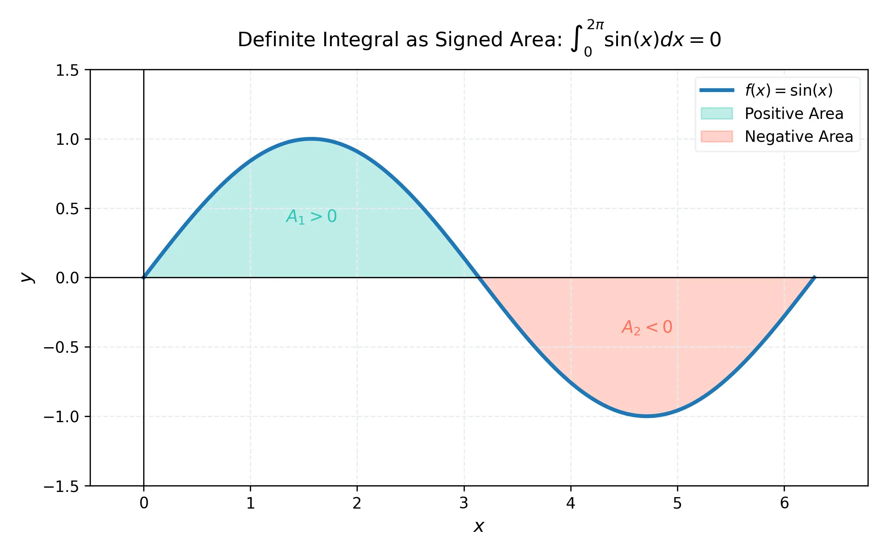

# 課程：微積分上 - 第 14 週 - 定積分的定義與性質

本文件包含了第 14 週完整的教學大綱、實作指南以及練習題庫。本週重點在於理解如何透過無窮逼近來定義面積，並正式引入微積分的核心概念之一：定積分。
本週教學內容對應 **Stewart Calculus (Metric Edition) Chapter 5: Integrals**。

---

## 一、 單元講解 (Lecture) - 總計 100 分鐘

### 1. 面積問題與無窮逼近 (20 min) (KP14.1)
*   **概念講解**：
    如何求得曲線 $y = f(x)$ 下方的面積？核心思想是「以直代曲」。我們將區間 $[a, b]$ 分割成 $n$個小區間，每個寬度為 $\Delta x = \frac{b-a}{n}$。在每個小區間上構造長方形，則長方形面積之和會逼近真實面積。
    當 $n \to \infty$ 時，誤差趨近於 0。

*   **練習題與解答**：
    *   **練習題 14.1.1**：考慮 $f(x) = x^2$ 在區間 $[0, 1]$。將其分成 4 個等寬子區間，使用右端點近似面積。
    *   **解答**：
        1. $\Delta x = (1-0)/4 = 0.25$。
        2. 右端點為 $0.25, 0.5, 0.75, 1.0$。
        3. $R_4 = \Delta x [f(0.25) + f(0.5) + f(0.75) + f(1.0)] = 0.25 [0.0625 + 0.25 + 0.5625 + 1] = 0.25 [1.875] = 0.46875$。

---

### 2. 黎曼和 (Riemann Sums) 的構造 (20 min) (KP14.2)
*   **概念講解**：
    黎曼和是定積分的離散形式，定義為：
    $$\sum_{i=1}^n f(x_i^*) \Delta x$$
    其中 $x_i^*$ 是第 $i$ 個子區間內的任意樣本點。
    *   **左端點和 (L_n)**：$x_i^* = x_{i-1}$。
    *   **右端點和 (R_n)**：$x_i^* = x_i$。
    *   **中點和 (M_n)**：$x_i^* = \bar{x}_i = \frac{x_{i-1} + x_i}{2}$。

    

*   **練習題與解答**：
    *   **練習題 14.2.1**：使用 $\sum$ 符號表示 $f(x) = \sqrt{x}$ 在 $[1, 4]$ 上的 $n$ 階右黎曼和。
    *   **解答**：
        $\Delta x = \frac{3}{n}, x_i = 1 + i \Delta x = 1 + \frac{3i}{n}$。
        $R_n = \sum_{i=1}^n \sqrt{1 + \frac{3i}{n}} \cdot \frac{3}{n}$。

---

### 3. 定積分的精確定義 (20 min) (KP14.3)
*   **概念講解**：
    定積分被定義為黎曼和當分割無限細化時的極限：
    $$\int_a^b f(x) \, dx = \lim_{n \to \infty} \sum_{i=1}^n f(x_i^*) \Delta x$$
    如果這個極限存在，我們稱 $f$ 在 $[a, b]$ 上是**可積的 (Integrable)**。
    *   **定理**：若 $f$ 在 $[a, b]$ 上連續，則 $f$ 在該區間上可積。

*   **練習題與解答**：
    *   **練習題 14.3.1**：將極限 $\lim_{n \to \infty} \sum_{i=1}^n (x_i^3 + x_i \sin x_i) \Delta x$ 表示為 $[0, \pi]$ 上的定積分。
    *   **解答**：$\int_0^\pi (x^3 + x \sin x) \, dx$。

---

### 4. 定積分的幾何意義與性質 (20 min) (KP14.4)
*   **概念講解**：
    *   **幾何意義**：定積分代表「淨面積」(Net Area) 或「帶正負號的面積」(Signed Area)。x 軸上方的面積取正，下方的取負。
    *   **性質**：
        1. $\int_a^b f(x) dx = - \int_b^a f(x) dx$
        2. $\int_a^a f(x) dx = 0$
        3. 線性：$\int_a^b [cf(x) + g(x)] dx = c\int_a^b f(x) dx + \int_a^b g(x) dx$
        4. 區間加法：$\int_a^b f(x) dx + \int_b^c f(x) dx = \int_a^c f(x) dx$

    

*   **練習題與解答**：
    *   **練習題 14.4.1**：已知 $\int_0^{10} f(x) dx = 17$ 且 $\int_0^8 f(x) dx = 12$，求 $\int_8^{10} f(x) dx$。
    *   **解答**：利用區間加法：$\int_0^{10} = \int_0^8 + \int_8^{10} \implies 17 = 12 + \int_8^{10} \implies \int_8^{10} f(x) dx = 5$。

---

### 5. 定積分的比較定理 (20 min) (KP14.5)
*   **概念講解**：
    1. 若在 $[a, b]$ 上 $f(x) \ge 0$，則 $\int_a^b f(x) dx \ge 0$。
    2. 若在 $[a, b]$ 上 $f(x) \ge g(x)$，則 $\int_a^b f(x) dx \ge \int_a^b g(x) dx$。
    3. **估計定理**：若 $m \le f(x) \le M$ 於 $[a, b]$，則 $m(b-a) \le \int_a^b f(x) dx \le M(b-a)$。

*   **練習題與解答**：
    *   **練習題 14.5.1**：估計 $\int_0^1 e^{x^2} dx$ 的範圍。
    *   **解答**：
        在 $[0, 1]$ 上，$f(x) = e^{x^2}$ 是遞增函數。
        最小值 $m = f(0) = e^0 = 1$；最大值 $M = f(1) = e^1 = e$。
        因此，$1(1-0) \le \int_0^1 e^{x^2} dx \le e(1-0) \implies 1 \le \int_0^1 e^{x^2} dx \le e$。

---

## 二、 動手實作 (Lab) - 總計 50 分鐘

### 實作：黎曼和的數值計算與視覺化
**任務目標**：利用 Python (NumPy/Matplotlib) 計算不同 $n$ 值下的黎曼和，並觀察其收斂過程。
1.  在 Google Colab 中執行以下代碼。
    ```python
    import numpy as np
    import matplotlib.pyplot as plt

    def f(x):
        return x**2 + 1

    def calculate_riemann(a, b, n, method='midpoint'):
        dx = (b - a) / n
        if method == 'left':
            x = np.linspace(a, b - dx, n)
        elif method == 'right':
            x = np.linspace(a + dx, b, n)
        else: # midpoint
            x = np.linspace(a + dx/2, b - dx/2, n)
        
        return np.sum(f(x) * dx)

    a, b = 0, 2
    ns = [4, 10, 50, 100]
    exact_area = 2**3 / 3 + 2 # 實際值約 4.6667

    print(f"實際面積: {exact_area:.6f}")
    for n in ns:
        m_sum = calculate_riemann(a, b, n, 'midpoint')
        print(f"n={n:3d}, 中點黎曼和 = {m_sum:.6f}, 誤差 = {abs(exact_area - m_sum):.6f}")

    # 視覺化展示 n=10 的情況
    n_plot = 10
    dx = (b-a)/n_plot
    x_bar = np.linspace(a + dx/2, b - dx/2, n_plot)
    y_bar = f(x_bar)

    x_fine = np.linspace(a, b, 100)
    plt.plot(x_fine, f(x_fine), 'r', lw=2, label='f(x) = x^2 + 1')
    plt.bar(x_bar, y_bar, width=dx, alpha=0.3, edgecolor='blue', label=f'Midpoint Sum (n={n_plot})')
    plt.title(f"Riemann Sum Visualization (n={n_plot})")
    plt.legend()
    plt.show()
    ```

---

## 三、 本週知識點回顧 (KP)
- **KP14.1**: 理解長方形逼近法是求解曲線面積的基礎。
- **KP14.2**: 熟練構造左、右與中點黎曼和的 $\Sigma$ 表達式。
- **KP14.3**: 掌握定積分作為黎曼和極限的定義及其可積條件。
- **KP14.4**: 理解定積分代表淨面積，並靈活運用積分的線性與區間加法性質。
- **KP14.5**: 學會使用比較定理來估計定積分的上下界。

---

## 四、 課後測驗題庫 (Quiz) - 30 分鐘

### 1. 單選題 (Single Choice) - 共 10 題
1. **Q1**: 使用右端點法近似 $f(x)=x$ 在 $[0, 2]$ 上的面積，若 $n=2$，結果為？
   - (A) 1 (B) 2 (C) 3 (D) 4
2. **Q2**: 定積分 $\int_1^5 f(x) dx$ 中，若將區間分成 $n$ 等分，則 $\Delta x$ 為？
   - (A) $5/n$ (B) $4/n$ (C) $1/n$ (D) $6/n$
3. **Q3**: 若 $f$ 在 $[a, b]$ 上連續且恆正，則 $\int_a^b f(x) dx$ 必定？
   - (A) 大於 0 (B) 等於 0 (C) 小於 0 (D) 不一定
4. **Q4**: $\int_2^5 3 dx = $？
   - (A) 3 (B) 6 (C) 9 (D) 15
5. **Q5**: 黎曼和中，哪種方法通常對連續函數的近似效果最好？
   - (A) 左端點法 (B) 右端點法 (C) 中點法 (D) 隨機採樣
6. **Q6**: 若 $\int_1^3 f(x) dx = 4$ 且 $\int_1^3 g(x) dx = 2$，則 $\int_1^3 [2f(x) - g(x)] dx = $？
   - (A) 2 (B) 6 (C) 8 (D) 10
7. **Q7**: 定積分 $\int_a^b f(x) dx$ 的幾何意義是？
   - (A) 總面積 (B) 淨面積 (C) 切線斜率 (D) 曲線弧長
8. **Q8**: 下列何種函數在閉區間內保證可積？
   - (A) 任何函數 (B) 有窮個間斷點的函數 (C) 連續函數 (D) 只有多項式
9. **Q9**: $\int_b^a f(x) dx$ 等於？
   - (A) $\int_a^b f(x) dx$ (B) $-\int_a^b f(x) dx$ (C) $0$ (D) 無法確定
10. **Q10**: 比較定理中，若 $f(x) \le g(x)$，則？
    - (A) $\int f \ge \int g$ (B) $\int f \le \int g$ (C) $\int f = \int g$ (D) 導數 $f' \le g'$

### 2. 多選題 (Multiple Choice) - 共 10 題
11. **Q11**: 關於黎曼和，下列敘述正確的有？
    - (A) 樣本點可以任意選取 (B) $n$ 越大通常越準確 (C) 左端點法永遠低估面積 (D) 極限存在時稱為定積分
12. **Q12**: 定積分的性質包括？
    - (A) $\int_a^b f + \int_b^c f = \int_a^c f$ (B) $\int_a^b kf = k \int_a^b f$ (C) $\int_a^b f \cdot g = \int_a^b f \cdot \int_a^b g$ (D) $\int_a^a f = 0$
13. **Q13**: 下列哪些情況會導致 $\int_a^b f(x) dx = 0$？
    - (A) $a=b$ (B) $f(x)=0$ (C) $f$ 為奇函數且區間關於原點對稱 (D) $f$ 為偶函數
14. **Q14**: 關於估計定理，若 $f(x) = \sin x$ 於 $[0, \pi/2]$，則？
    - (A) $\int f \ge 0$ (B) $\int f \le \pi/2$ (C) $\int f \ge \pi/2$ (D) $\int f \le 1$
15. **Q15**: 哪些因素會影響黎曼和的數值？
    - (A) 分割數量 $n$ (B) 樣本點的選擇 (C) 積分區間 $[a, b]$ (D) 變數的名稱（如 $x$ 改為 $t$）
16. **Q16**: 定積分 $\int_a^b f(x) dx$ 中，符號 $dx$ 的意義包含？
    - (A) 代表微小的寬度 $\Delta x$ 的極限 (B) 指出積分變數 (C) 是一個獨立的乘數 (D) 僅是裝飾，無意義
17. **Q17**: 對於遞增函數 $f(x)$ 於 $[a, b]$：
    - (A) $L_n$ 是下和 (B) $R_n$ 是上和 (C) $M_n$ 介於 $L_n$ 與 $R_n$ 之間 (D) 真實值必等於 $M_n$
18. **Q18**: 若 $f(x)$ 在 $[a, b]$ 上可積，則？
    - (A) $f$ 必須是有界的 (B) $f$ 可以有有限個跳躍間斷 (C) $f$ 必須是單調的 (D) $f$ 必須連續
19. **Q19**: 利用性質 $\int_0^1 (x^2 + 1) dx$ 可以拆解為？
    - (A) $\int_0^1 x^2 dx + \int_0^1 1 dx$ (B) $2 \int_0^1 x dx$ (C) $\int_0^{0.5} (x^2+1) dx + \int_{0.5}^1 (x^2+1) dx$ (D) $\int_1^0 -(x^2+1) dx$
20. **Q20**: 關於帶正負號的面積，若 $f(x)$ 在半個區間正、半個區間負且對稱，則？
    - (A) 總面積為 0 (B) 淨面積為 0 (C) 定積分為 0 (D) 絕對值的積分為 0

### 3. 填充題 (Fill-in-the-blank) - 共 10 題
21. **Q21**: 將區間 $[0, 3]$ 分成 $n$ 等分，第 $i$ 個右端點 $x_i = $ __________。
22. **Q22**: 定積分的符號 $\int$ 最初是由字母 __________ 拉長而來。
23. **Q23**: 若 $\int_0^5 f(x) dx = 10$，則 $\int_5^0 2f(x) dx = $ __________。
24. **Q24**: 估計 $\int_1^4 \sqrt{x} dx$ 的最小值（利用估計定理）為 __________。
25. **Q25**: 函數 $f(x) = x^3$ 在 $[-2, 2]$ 上的定積分值為 __________。
26. **Q26**: $\lim_{n \to \infty} \sum_{i=1}^n \frac{1}{n} \sin(\frac{i}{n})$ 對應的定積分為 $\int_0^1$ __________ $dx$。
27. **Q27**: 若 $\int_1^2 f(x) dx = 3, \int_2^4 f(x) dx = 5$，則 $\int_1^4 f(x) dx = $ __________。
28. **Q28**: 定積分 $\int_a^b c dx$ 的公式解為 __________。
29. **Q29**: 在黎曼和中，當樣本點取為區間中點時，稱為 __________ 法則。
30. **Q30**: 若 $f(x) \ge 0$ 且 $\int_a^b f(x) dx = 0$，則在 $f$ 連續的前提下，$f(x)$ 必為 __________。
