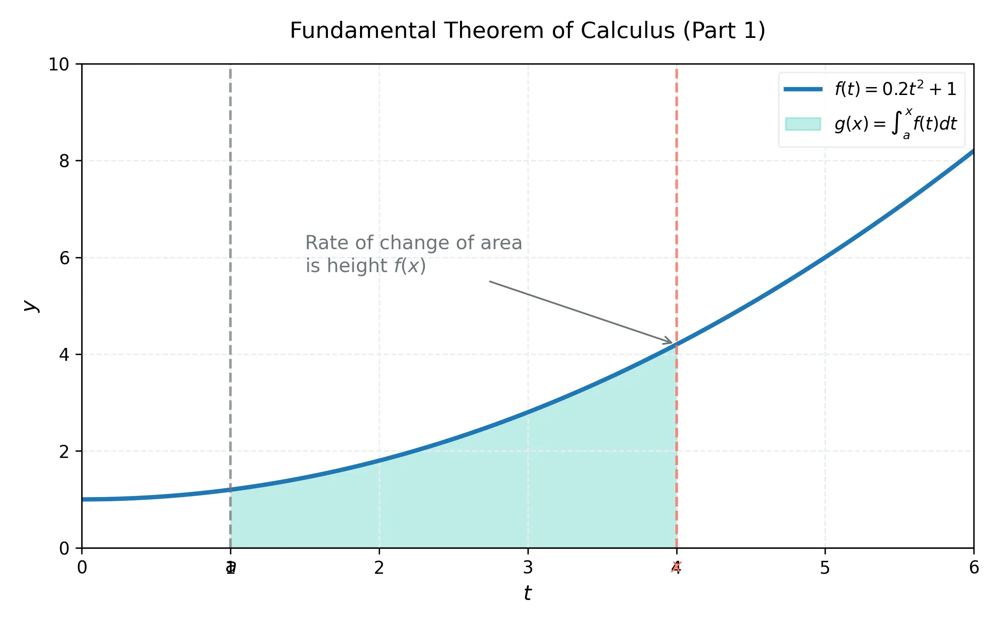

# 課程：微積分上 - 第 15 週 - 微積分基本定理

本文件包含了第 15 週完整的教學大綱、實作指南以及練習題庫。本週重點在於微積分學中最核心的理論：微積分基本定理 (Fundamental Theorem of Calculus, FTC)。這個定理巧妙地聯結了微分與積分這兩個看似獨立的概念，將「變率」與「累積」統一起來。
本週教學內容對應 **Stewart Calculus (Metric Edition) Chapter 5: Integrals**。

---

## 一、 單元講解 (Lecture) - 總計 100 分鐘

### 1. 微積分基本定理 第一部分 (FTC 1) (20 min) (KP15.1)
*   **概念講解**：
    FTC 1 指出，若我們定義一個函數為另一個連續函數的積分，則這個「積分函數」的導數就是被積函數。
    **定理陳述**：若 $f$ 在 $[a, b]$ 上連續，則由 $g(x) = \int_a^x f(t) \, dt$ 定義的函數在 $[a, b]$ 上連續、在 $(a, b)$ 上可微，且其導數為：
    $$g'(x) = \frac{d}{dx} \int_a^x f(t) \, dt = f(x)$$
    
    **正式證明**：
    利用導數定義：$g'(x) = \lim_{h \to 0} \frac{g(x+h) - g(x)}{h}$。
    1. $g(x+h) - g(x) = \int_a^{x+h} f(t) \, dt - \int_a^x f(t) \, dt = \int_x^{x+h} f(t) \, dt$。
    2. 對於 $h > 0$，根據積分均值定理，在 $[x, x+h]$ 內存在一點 $c$ 使得 $\int_x^{x+h} f(t) \, dt = f(c) \cdot h$。
    3. 則 $\frac{g(x+h) - g(x)}{h} = f(c)$。
    4. 當 $h \to 0$ 時，由於 $x \le c \le x+h$，根據夾擊定理，$c \to x$。
    5. 因為 $f$ 連續，故 $\lim_{h \to 0} f(c) = f(x)$。證畢。

    

*   **練習題與解答**：
    *   **練習題 15.1.1**：設 $g(x) = \int_0^x \sqrt{1 + t^2} \, dt$，求 $g'(x)$。
    *   **解答**：直接套用 FTC 1，$g'(x) = \sqrt{1 + x^2}$。
    *   **練習題 15.1.2**：設 $g(x) = \int_x^5 \cos(t) \, dt$，求 $g'(x)$。
    *   **解答**：先交換積分上下限 $g(x) = -\int_5^x \cos(t) \, dt$，故 $g'(x) = -\cos(x)$。

---

### 2. 透過 FTC 1 求積分函數的導數 (20 min) (KP15.2)
*   **概念講解**：
    當積分的上限不是單純的 $x$，而是 $x$ 的函數 $u(x)$ 時，必須結合**連鎖律 (Chain Rule)**。
    公式：$\frac{d}{dx} \int_a^{u(x)} f(t) \, dt = f(u(x)) \cdot u'(x)$。
    推廣：$\frac{d}{dx} \int_{v(x)}^{u(x)} f(t) \, dt = f(u(x)) u'(x) - f(v(x)) v'(x)$。

*   **練習題與解答**：
    *   **練習題 15.2.1**：求 $y = \int_1^{x^4} \sec(t) \, dt$ 的導數。
    *   **解答**：設 $u = x^4$，則 $du/dx = 4x^3$。根據公式：
        $\frac{dy}{dx} = \sec(x^4) \cdot \frac{d}{dx}(x^4) = 4x^3 \sec(x^4)$。
    *   **練習題 15.2.2**：求 $y = \int_{\sin x}^{x^2} \sqrt{t} \, dt$ 的導數。
    *   **解答**：$\frac{dy}{dx} = \sqrt{x^2} \cdot (2x) - \sqrt{\sin x} \cdot (\cos x) = 2x|x| - \cos x \sqrt{\sin x}$。

---

### 3. 微積分基本定理 第二部分 (FTC 2) (20 min) (KP15.3)
*   **概念講解**：
    FTC 2 提供了計算定積分的簡便方法：只要找到反導數，就不需要計算複雜的黎曼和極限。
    **定理陳述**：若 $f$ 在 $[a, b]$ 上連續，且 $F$ 是 $f$ 的任一反導數（即 $F' = f$），則：
    $$\int_a^b f(x) \, dx = F(b) - F(a)$$
    
    **正式證明**：
    1. 令 $g(x) = \int_a^x f(t) \, dt$。根據 FTC 1，$g$ 是 $f$ 的一個反導數。
    2. 若 $F$ 是 $f$ 的任意反導數，則 $F(x) = g(x) + C$。
    3. 當 $x = a$ 時，$F(a) = g(a) + C = \int_a^a f(t) \, dt + C = 0 + C \implies C = F(a)$。
    4. 當 $x = b$ 時，$F(b) = g(b) + F(a) = \int_a^b f(t) \, dt + F(a)$。
    5. 移項得 $\int_a^b f(t) \, dt = F(b) - F(a)$。證畢。

*   **練習題與解答**：
    *   **練習題 15.3.1**：計算 $\int_1^2 x^3 \, dx$。
    *   **解答**：$x^3$ 的反導數為 $\frac{1}{4}x^4$。
        $\int_1^2 x^3 \, dx = [\frac{1}{4}x^4]_1^2 = \frac{1}{4}(2^4 - 1^4) = \frac{15}{4}$。
    *   **練習題 15.3.2**：計算 $\int_0^{\pi/4} \sec^2 x \, dx$。
    *   **解答**：$\sec^2 x$ 的反導數為 $\tan x$。
        $\int_0^{\pi/4} \sec^2 x \, dx = [\tan x]_0^{\pi/4} = \tan(\frac{\pi}{4}) - \tan(0) = 1 - 0 = 1$。

---

### 4. 利用 FTC 2 計算定積分 (20 min) (KP15.4)
*   **概念講解**：
    在實務計算中，我們常先對函數進行代數化簡，再尋找反導數。
    常見符號：$F(x) \big|_a^b = [F(x)]_a^b = F(b) - F(a)$。

*   **練習題與解答**：
    *   **練習題 15.4.1**：計算 $\int_1^9 \frac{x-1}{\sqrt{x}} \, dx$。
    *   **解答**：化簡 $\frac{x-1}{\sqrt{x}} = x^{1/2} - x^{-1/2}$。
        $\int_1^9 (x^{1/2} - x^{-1/2}) \, dx = [\frac{2}{3}x^{3/2} - 2x^{1/2}]_1^9$
        $= (\frac{2}{3} \cdot 27 - 2 \cdot 3) - (\frac{2}{3} \cdot 1 - 2 \cdot 1) = (18 - 6) - (- \frac{4}{3}) = 12 + \frac{4}{3} = \frac{40}{3}$。
    *   **練習題 15.4.2**：計算 $\int_0^2 |2x - 1| \, dx$。
    *   **解答**：分段積分。當 $x < 1/2$ 時 $|2x-1| = 1-2x$；當 $x \ge 1/2$ 時 $|2x-1| = 2x-1$。
        $\int_0^{1/2} (1-2x) \, dx + \int_{1/2}^2 (2x-1) \, dx = [x-x^2]_0^{1/2} + [x^2-x]_{1/2}^2$
        $= (1/2 - 1/4) + (4-2 - (1/4-1/2)) = 1/4 + 2 + 1/4 = 2.5$。

---

### 5. 不定積分與淨變化定理 (20 min) (KP15.5)
*   **概念講解**：
    *   **不定積分**：$\int f(x) \, dx$ 代表 $f$ 的所有反導數集合，結果必帶常數 $C$。
    *   **淨變化定理 (Net Change Theorem)**：變化率的積分等於總淨變化量。
        $$\int_a^b F'(x) \, dx = F(b) - F(a)$$
    *   **應用實例**：
        1. 位移 (Displacement)：$\int_{t_1}^{t_2} v(t) \, dt = s(t_2) - s(t_1)$。
        2. 總距離 (Total Distance)：$\int_{t_1}^{t_2} |v(t)| \, dt$。

*   **練習題與解答**：
    *   **練習題 15.5.1**：已知一質點的速度為 $v(t) = t^2 - t - 6$ (m/s)，求在區間 $[1, 4]$ 內的位移。
    *   **解答**：位移 $= \int_1^4 (t^2 - t - 6) \, dt = [\frac{1}{3}t^3 - \frac{1}{2}t^2 - 6t]_1^4$
        $= (\frac{64}{3} - 8 - 24) - (\frac{1}{3} - \frac{1}{2} - 6) = \frac{63}{3} - 32 + 6.5 = 21 - 32 + 6.5 = -4.5$ 米。
    *   **練習題 15.5.2**：承上題，求該質點在 $[1, 4]$ 內行經的總距離。
    *   **解答**：$v(t) = (t-3)(t+2)$。在 $[1, 3]$ 時 $v \le 0$，在 $[3, 4]$ 時 $v \ge 0$。
        距離 $= \int_1^3 -(t^2-t-6) \, dt + \int_3^4 (t^2-t-6) \, dt = -[-7.33] + [2.83] = 10.16$ 米 (約略值)。

---

## 二、 動手實作 (Lab) - 總計 50 分鐘

### 實作：使用 SymPy 處理積分函數與定積分
**任務目標**：利用 Python 驗證 FTC 1 的導數與計算複雜的定積分。
1.  在 Google Colab 中執行以下代碼。
    ```python
    import sympy as sp

    x, t = sp.symbols('x t')

    # --- 實作 1: 驗證 FTC 1 ---
    # 定義積分函數 g(x) = int_0^{x^2} sqrt(1 + t^4) dt
    f_t = sp.sqrt(1 + t**4)
    g_x = sp.integrate(f_t, (t, 0, x**2)) # 注意：有些複雜函數 SymPy 可能無法求出解析原函數，但能求導

    # 使用 sp.diff 求導
    dg_dx = sp.diff(sp.Integral(f_t, (t, 0, x**2)), x).doit()
    print(f"FTC 1 導數結果: {dg_dx}")

    # --- 實作 2: 計算定積分 (FTC 2) ---
    # 計算 int_1^2 (x^2 + 1/x) dx
    expr = x**2 + 1/x
    val = sp.integrate(expr, (x, 1, 2))
    print(f"定積分精確值: {val}")
    print(f"定積分數值近似: {val.evalf()}")

    # --- 實作 3: 淨變化定理 (位移與距離) ---
    v = t**2 - t - 6
    displacement = sp.integrate(v, (t, 1, 4))
    distance = sp.integrate(sp.Abs(v), (t, 1, 4))
    print(f"位移: {displacement}")
    print(f"總距離: {distance}")
    ```

---

## 三、 本週知識點回顧 (KP)
- **KP15.1**: 微積分基本定理第一部分 (FTC 1) 說明了微分與積分是逆運算。
- **KP15.2**: 學會將連鎖律應用於積分上限為複合函數的情況。
- **KP15.3**: 掌握 FTC 2 的定義，理解如何透過反導數避開黎曼和極限。
- **KP15.4**: 熟練各種代數技巧輔助定積分的計算。
- **KP15.5**: 理解淨變化定理在物理上的意義，區分位移與總距離的計算。

---

## 四、 課後測驗題庫 (Quiz) - 30 分鐘

### 1. 單選題 (Single Choice) - 共 10 題
1. **Q1**: $\frac{d}{dx} \int_2^x \sin(t^2) \, dt = $ ？
   - (A) $\cos(x^2)$ (B) $\sin(x^2)$ (C) $2x \sin(x^2)$ (D) $\sin(x^2) - \sin(4)$
2. **Q2**: $\frac{d}{dx} \int_0^{x^3} e^t \, dt = $ ？
   - (A) $e^{x^3}$ (B) $3x^2 e^{x^3}$ (C) $e^{x^3} - 1$ (D) $x^3 e^{x^2}$
3. **Q3**: 若 $\int_a^b f(x) \, dx = 10$，則 $\int_b^a 3f(x) \, dx = $ ？
   - (A) 30 (B) -30 (C) 10 (D) 13
4. **Q4**: 計算 $\int_1^e \frac{1}{x} \, dx$ 的結果為？
   - (A) $e$ (B) 1 (C) 0 (D) $\ln 2$
5. **Q5**: 淨變化定理中，速度函數的積分 $\int_{t_1}^{t_2} v(t) \, dt$ 代表？
   - (A) 總距離 (B) 加速度 (C) 位移 (D) 平均速率
6. **Q6**: $\int_{-2}^2 x^5 \, dx = $ ？
   - (A) 0 (B) 32 (C) 64 (D) 128
7. **Q7**: 設 $g(x) = \int_x^1 \sqrt{u} \, du$，則 $g'(4) = $ ？
   - (A) 2 (B) -2 (C) 1/4 (D) -1/4
8. **Q8**: 下列何者為 $\int (x^2 + 1) \, dx$ 的正確表示？
   - (A) $\frac{1}{3}x^3 + x$ (B) $\frac{1}{3}x^3 + x + C$ (C) $2x$ (D) $x^3 + x + C$
9. **Q9**: $\int_0^{\pi} \sin x \, dx = $ ？
   - (A) 0 (B) 1 (C) 2 (D) -2
10. **Q10**: FTC 2 成立的前提是 $f$ 在區間內必須：
    - (A) 可微 (B) 連續 (C) 恆正 (D) 是多項式

### 2. 多選題 (Multiple Choice) - 共 10 題
11. **Q11**: 關於 $\frac{d}{dx} \int_{v(x)}^{u(x)} f(t) \, dt$，下列敘述正確的有？
    - (A) 涉及微分連鎖律 (B) 結果與 $a$ 的選取無關 (C) 等於 $f(u(x))u'(x) - f(v(x))v'(x)$ (D) 要求 $f$ 連續
12. **Q12**: 定積分 $\int_a^b f(x) \, dx$ 與不定積分 $\int f(x) \, dx$ 的區別在於？
    - (A) 前者是一個數值，後者是一個函數族 (B) 後者必須加常數 $C$ (C) 前者有上下限 (D) 兩者毫無關聯
13. **Q13**: 下列哪些函數的反導數包含 $\ln|x|$？
    - (A) $1/x$ (B) $2/(2x)$ (C) $e^x$ (D) $1/x^2$
14. **Q14**: 關於總距離與位移，正確的有？
    - (A) 總距離 $\ge$ |位移| (B) 速度恆正時兩者相等 (C) 總距離是速率的積分 (D) 位移是速度的積分
15. **Q15**: 若 $F, G$ 都是 $f$ 的反導數，則？
    - (A) $F = G$ (B) $F' = G'$ (C) $F - G = C$ (D) $\int_a^b f = F(b) - F(a) = G(b) - G(a)$
16. **Q16**: 下列積分值為正的有？
    - (A) $\int_0^1 e^x \, dx$ (B) $\int_1^2 \frac{1}{x} \, dx$ (C) $\int_{-1}^0 x^2 \, dx$ (D) $\int_\pi^{2\pi} \sin x \, dx$
17. **Q17**: FTC 1 的證明中用到了？
    - (A) 導數的定義 (B) 積分均值定理 (C) 夾擊定理 (D) 連續性的定義
18. **Q18**: 計算 $\int_0^2 |x-1| \, dx$ 可以拆解為？
    - (A) $\int_0^1 (1-x) \, dx + \int_1^2 (x-1) \, dx$ (B) $\int_0^2 (x-1) \, dx$ (C) $2 \int_0^1 (1-x) \, dx$ (D) $0$
19. **Q19**: 下列哪些公式正確？
    - (A) $\int \sec^2 x \, dx = \tan x + C$ (B) $\int \frac{1}{\sqrt{1-x^2}} \, dx = \sin^{-1} x + C$ (C) $\int a^x \, dx = a^x \ln a + C$ (D) $\int \cos x \, dx = \sin x + C$
20. **Q20**: 使用 Python SymPy 時：
    - (A) `integrate(f, x)` 求不定積分 (B) `integrate(f, (x, a, b))` 求定積分 (C) `diff()` 求導數 (D) `Subs()` 可以用來做變數變換

### 3. 填充題 (Fill-in-the-blank) - 共 10 題
21. **Q21**: $\frac{d}{dx} \int_1^{\sqrt{x}} \frac{z^2}{z^4+1} \, dz$ 在 $x=1$ 時的值為 __________。
22. **Q22**: $\int_1^9 \frac{1}{2\sqrt{x}} \, dx = $ __________。
23. **Q23**: 若 $F(x) = \int_0^x (t-1) \, dt$，則 $F(x)$ 的極小值發生在 $x = $ __________。
24. **Q24**: $\int_{-1}^1 (x^3 + x^2) \, dx = $ __________。
25. **Q25**: 若 $\int_a^x f(t) \, dt = x^2 - 4$，則 $f(x) = $ __________。
26. **Q26**: 某工廠邊際成本為 $C'(x) = 3x^2 - 2x$，則產量從 1 增加到 3 的總成本增加量為 __________。
27. **Q27**: $\int_0^{\pi/2} \cos x \, dx = $ __________。
28. **Q28**: $\frac{d}{dx} \int_x^{x+1} e^{t} \, dt = $ __________。
29. **Q29**: $f(x) = x$ 在 $[0, 4]$ 上的平均值為 __________。
30. **Q30**: 積分 $\int \frac{dx}{x^2+1} = $ __________ $+ C$。
