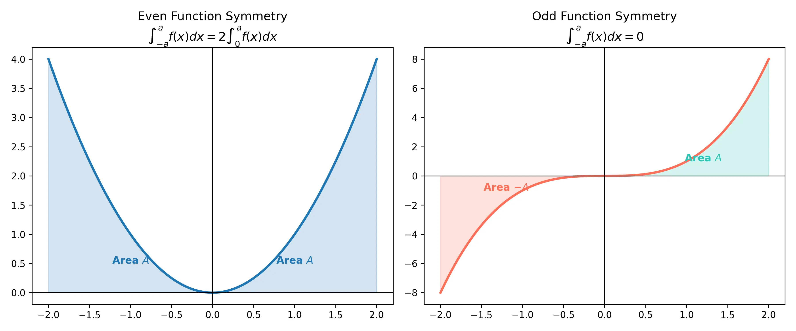

# 課程：微積分上 - 第 16 週 - 代換法 (The Substitution Rule)

本文件包含了第 16 週完整的教學大綱、實作指南以及練習題庫。本週重點在於積分計算中最常用且最強大的工具：代換法 (Substitution Rule)。這技術本質上是微分連鎖律的逆運算，能將複雜的積分問題簡化為基本積分公式。
本週教學內容對應 **Stewart Calculus (Metric Edition) Chapter 5: Integrals**。

---

## 一、 單元講解 (Lecture) - 總計 100 分鐘

### 1. 代換法 (Substitution Rule) 的連鎖律逆運算 (20 min) (KP16.1)
*   **概念講解**：
    代換法是為了處理複合函數的積分。回想微分的連鎖律：$\frac{d}{dx}[F(g(x))] = F'(g(x))g'(x)$。
    如果我們對兩邊積分，得到：
    $$\int F'(g(x))g'(x) \, dx = F(g(x)) + C$$
    令 $u = g(x)$，則 $du = g'(x)dx$。若設 $f = F'$，則公式變為：
    $$\int f(g(x))g'(x) \, dx = \int f(u) \, du$$
    這就是代換法的核心思想：尋找一個中間變數 $u$，使得積分式變得容易處理。

*   **練習題與解答**：
    *   **練習題 16.1.1**：求 $\int 2x \cos(x^2) \, dx$。
    *   **解答**：觀察到 $x^2$ 的導數 $2x$ 就在被積函數中。
        令 $u = x^2$，則 $du = 2x \, dx$。
        原式 $= \int \cos(u) \, du = \sin(u) + C = \sin(x^2) + C$。
    *   **練習題 16.1.2**：說明為何代換法被稱為「連鎖律的逆運算」。
    *   **解答**：因為它將形式為 $f(g(x))g'(x)$ 的積分（這是連鎖律微分後的結果）還原為複合函數 $F(g(x))$。

---

### 2. 不定積分的代換技巧 (20 min) (KP16.2)
*   **概念講解**：
    實務上，我們常需要對常數項進行微調（即「湊」微分）。
    **步驟**：
    1.  選定 $u = g(x)$（通常是「內層」函數）。
    2.  計算 $du = g'(x)dx$。
    3.  將積分式中的所有 $x$ 與 $dx$ 替換為 $u$ 與 $du$。
    4.  計算關於 $u$ 的積分。
    5.  **最後必須將 $u$ 代回原變數 $x$**。

*   **練習題與解答**：
    *   **練習題 16.2.1**：計算 $\int x^2 \sqrt{x^3 + 1} \, dx$。
    *   **解答**：令 $u = x^3 + 1$，則 $du = 3x^2 \, dx \implies x^2 \, dx = \frac{1}{3} du$。
        原式 $= \int \sqrt{u} \cdot \frac{1}{3} \, du = \frac{1}{3} \int u^{1/2} \, du = \frac{1}{3} \cdot \frac{2}{3} u^{3/2} + C = \frac{2}{9}(x^3 + 1)^{3/2} + C$。
    *   **練習題 16.2.2**：計算 $\int \frac{e^x}{1 + e^x} \, dx$。
    *   **解答**：令 $u = 1 + e^x$，則 $du = e^x \, dx$。
        原式 $= \int \frac{1}{u} \, du = \ln|u| + C = \ln(1 + e^x) + C$。

---

### 3. 定積分的代換法與上下限轉換 (20 min) (KP16.3)
*   **概念講解**：
    對於定積分，使用代換法時有一個關鍵步驟：**轉換積分上下限**。
    **定理**：若 $g'$ 在 $[a, b]$ 上連續且 $f$ 在 $g$ 的值域上連續，則：
    $$\int_a^b f(g(x))g'(x) \, dx = \int_{g(a)}^{g(b)} f(u) \, du$$
    這意味著一旦換了變數並調整了邊界，就**不需要**再換回 $x$。

*   **練習題與解答**：
    *   **練習題 16.3.1**：計算 $\int_0^4 \sqrt{2x+1} \, dx$。
    *   **解答**：令 $u = 2x+1$，則 $du = 2 \, dx \implies dx = \frac{1}{2} du$。
        上下限轉換：當 $x=0, u=1$；當 $x=4, u=9$。
        原式 $= \int_1^9 \sqrt{u} \cdot \frac{1}{2} \, du = \frac{1}{2} [\frac{2}{3}u^{3/2}]_1^9 = \frac{1}{3}(9^{3/2} - 1^{3/2}) = \frac{1}{3}(27 - 1) = \frac{26}{3}$。
    *   **練習題 16.3.2**：計算 $\int_1^e \frac{\ln x}{x} \, dx$。
    *   **解答**：令 $u = \ln x, du = \frac{1}{x} dx$。當 $x=1, u=0$；當 $x=e, u=1$。
        原式 $= \int_0^1 u \, du = [\frac{1}{2}u^2]_0^1 = \frac{1}{2}$。

---

### 4. 偶函數與奇函數的積分對稱性 (20 min) (KP16.4)
*   **概念講解**：
    利用代換法 $u = -x$，我們可以簡化對稱區間 $[-a, a]$ 上的積分：
    1.  若 $f$ 為**偶函數** ($f(-x) = f(x)$)，則 $\int_{-a}^a f(x) \, dx = 2 \int_0^a f(x) \, dx$。
    2.  若 $f$ 為**奇函數** ($f(-x) = -f(x)$)，則 $\int_{-a}^a f(x) \, dx = 0$。

    

*   **練習題與解答**：
    *   **練習題 16.4.1**：計算 $\int_{-\pi}^{\pi} \sin x \, dx$。
    *   **解答**：因為 $\sin(-x) = -\sin x$，$\sin x$ 是奇函數。
        在對稱區間 $[-\pi, \pi]$ 上，積分結果直接為 $0$。
    *   **練習題 16.4.2**：計算 $\int_{-1}^1 (x^4 + x^2) \, dx$。
    *   **解答**：$f(x) = x^4 + x^2$ 是偶函數。
        原式 $= 2 \int_0^1 (x^4 + x^2) \, dx = 2 [\frac{1}{5}x^5 + \frac{1}{3}x^3]_0^1 = 2(\frac{1}{5} + \frac{1}{3}) = 2(\frac{8}{15}) = \frac{16}{15}$。

---

### 5. 複雜代換問題的解題策略 (20 min) (KP16.5)
*   **概念講解**：
    有時 $u$ 的選擇不那麼直觀，或需要二次代換。
    常見策略：
    - 若有根式 $\sqrt[n]{ax+b}$，嘗試令 $u = ax+b$ 或 $u = \sqrt[n]{ax+b}$。
    - 處理如 $\int x^3 \sqrt{1+x^2} \, dx$：令 $u = 1+x^2$，則 $x^2 = u-1$，將其餘的 $x$ 變項也轉為 $u$。
    - 三角代換（進階）：利用 $\sin^2 \theta + \cos^2 \theta = 1$ 等恆等式。

*   **練習題與解答**：
    *   **練習題 16.5.1**：計算 $\int x^5 \sqrt{1+x^3} \, dx$。
    *   **解答**：令 $u = 1+x^3, du = 3x^2 dx$。原式可拆為 $\int x^3 \sqrt{1+x^3} (x^2 dx)$。
        原式 $= \int (u-1) \sqrt{u} \cdot \frac{1}{3} du = \frac{1}{3} \int (u^{3/2} - u^{1/2}) du$
        $= \frac{1}{3} [\frac{2}{5}u^{5/2} - \frac{2}{3}u^{3/2}] + C = \frac{2}{15}(1+x^3)^{5/2} - \frac{2}{9}(1+x^3)^{3/2} + C$。
    *   **練習題 16.5.2**：計算 $\int \tan x \, dx$。
    *   **解答**：寫成 $\int \frac{\sin x}{\cos x} dx$。令 $u = \cos x, du = -\sin x dx$。
        原式 $= \int -\frac{1}{u} du = -\ln|\cos x| + C = \ln|\sec x| + C$。

---

## 二、 動手實作 (Lab) - 總計 50 分鐘

### 實作：使用 SymPy 進行代換積分與驗證對稱性
**任務目標**：利用 Python 驗證代換法的正確性，並觀察對稱函數的積分特性。
1.  在 Google Colab 中執行以下代碼。
    ```python
    import sympy as sp

    x = sp.symbols('x')

    # --- 實作 1: 不定積分代換 ---
    # 計算 int x * exp(-x**2) dx
    f1 = x * sp.exp(-x**2)
    res1 = sp.integrate(f1, x)
    print(f"不定積分結果: {res1} + C")

    # --- 實作 2: 定積分上下限轉換驗證 ---
    # 計算 int_0^1 x**3 * sqrt(x**4 + 1) dx
    f2 = x**3 * sp.sqrt(x**4 + 1)
    # 直接計算
    val_direct = sp.integrate(f2, (x, 0, 1))
    # 手動模擬代換 u = x**4 + 1, du = 4x**3 dx
    u = sp.symbols('u')
    f_u = (1/4) * sp.sqrt(u)
    val_sub = sp.integrate(f_u, (u, 1, 2)) # x=0 -> u=1, x=1 -> u=2
    print(f"直接定積分: {val_direct}")
    print(f"代換後積分: {val_sub}")

    # --- 實作 3: 驗證對稱性 ---
    # 奇函數: sin(x) * cos(x)**2
    f_odd = sp.sin(x) * sp.cos(x)**2
    val_odd = sp.integrate(f_odd, (x, -sp.pi, sp.pi))
    print(f"奇函數在對稱區間積分: {val_odd}")

    # 偶函數: cos(x) + x**2
    f_even = sp.cos(x) + x**2
    val_even_full = sp.integrate(f_even, (x, -2, 2))
    val_even_half = 2 * sp.integrate(f_even, (x, 0, 2))
    print(f"偶函數全文: {val_even_full}, 兩倍半區間: {val_even_half}")
    ```

---

## 三、 本週知識點回顧 (KP)
- **KP16.1**: 理解代換法是連鎖律的逆運算。
- **KP16.2**: 掌握不定積分中選擇 $u$ 並「湊」出 $du$ 的技巧。
- **KP16.3**: 記住在計算定積分時，必須同步更新積分上下限。
- **KP16.4**: 利用函數的奇偶對稱性快速簡化對稱區間上的積分。
- **KP16.5**: 學會處理需要變形或多次處理的複雜代換題目。

---

## 四、 課後測驗題庫 (Quiz) - 30 分鐘

### 1. 單選題 (Single Choice) - 共 10 題
1. **Q1**: 計算 $\int x(x^2+1)^5 \, dx$ 時，最適合的代換是？
   - (A) $u=x$ (B) $u=x^2$ (C) $u=x^2+1$ (D) $u=(x^2+1)^5$
2. **Q2**: 若 $u = \sqrt{x}$，則 $dx$ 等於？
   - (A) $du$ (B) $\frac{1}{2\sqrt{x}} du$ (C) $2u \, du$ (D) $u^2 \, du$
3. **Q3**: 計算 $\int_1^2 e^{3x} \, dx$，代換 $u=3x$ 後的積分限為？
   - (A) $[1, 2]$ (B) $[3, 6]$ (C) $[0, 3]$ (D) $[e^3, e^6]$
4. **Q4**: $\int_{-5}^5 (x^3 + \sin x) \, dx = $ ？
   - (A) 0 (B) 10 (C) 50 (D) $\pi$
5. **Q5**: $\int \frac{1}{x \ln x} \, dx = $ ？
   - (A) $\ln x + C$ (B) $(\ln x)^2 + C$ (C) $\ln|\ln x| + C$ (D) $\frac{1}{\ln x} + C$
6. **Q6**: 若 $f$ 為偶函數且 $\int_0^3 f(x) \, dx = 4$，則 $\int_{-3}^3 f(x) \, dx = $ ？
   - (A) 0 (B) 4 (C) 8 (D) -8
7. **Q7**: $\int \cos(2x+1) \, dx = $ ？
   - (A) $\sin(2x+1) + C$ (B) $2\sin(2x+1) + C$ (C) $\frac{1}{2}\sin(2x+1) + C$ (D) $-\frac{1}{2}\sin(2x+1) + C$
8. **Q8**: $\int_0^1 x e^{x^2} \, dx = $ ？
   - (A) $e-1$ (B) $\frac{1}{2}(e-1)$ (C) $e$ (D) $\frac{1}{2}e$
9. **Q9**: 下列何者為奇函數？
   - (A) $x^2$ (B) $\cos x$ (C) $x \cos x$ (D) $x \sin x$
10. **Q10**: 計算 $\int \frac{x}{x^2+1} \, dx$，結果為？
    - (A) $\arctan x + C$ (B) $\ln(x^2+1) + C$ (C) $\frac{1}{2}\ln(x^2+1) + C$ (D) $x^2+1 + C$

### 2. 多選題 (Multiple Choice) - 共 10 題
11. **Q11**: 下列關於代換法的敘述，正確的有？
    - (A) 它是連鎖律的逆過程 (B) 定積分代換後不需要換回原變項 (C) 不定積分最後必須換回原變項 (D) 任何積分都能用代換法解決
12. **Q12**: 哪些積分的結果包含對數函數 $\ln$？
    - (A) $\int \frac{1}{x} \, dx$ (B) $\int \tan x \, dx$ (C) $\int \frac{2x}{x^2+1} \, dx$ (D) $\int e^x \, dx$
13. **Q13**: 下列哪些是偶函數？
    - (A) $x^4$ (B) $|x|$ (C) $\cos(x^3)$ (D) $\sin^2 x$
14. **Q14**: 關於 $\int_{-a}^a f(x) \, dx$，下列何者正確？
    - (A) 若 $f$ 為奇函數，結果為 0 (B) 若 $f$ 為偶函數，結果為 $2 \int_0^a f(x) \, dx$ (C) 即使 $f$ 既非奇也非偶，此公式也適用 (D) 這可以用代換 $u = -x$ 證明
15. **Q15**: 計算 $\int x \sqrt{x-1} \, dx$ 時，可以使用？
    - (A) 代換 $u = x-1$ (B) 代換 $u = \sqrt{x-1}$ (C) 直接積分 (D) 先展開再積分
16. **Q16**: 下列積分值為 0 的有？
    - (A) $\int_{-1}^1 x^5 \, dx$ (B) $\int_{-\pi}^{\pi} \cos x \, dx$ (C) $\int_{-2}^2 \frac{x}{x^2+1} \, dx$ (D) $\int_0^\pi \sin x \, dx$
17. **Q17**: 定積分代換公式中，要求哪些條件？
    - (A) $g'$ 在 $[a, b]$ 連續 (B) $f$ 在 $g$ 的值域上連續 (C) $g(a) < g(b)$ (D) $f$ 必須是多項式
18. **Q18**: $\int \sin x \cos x \, dx$ 可以透過以下哪些方式求解？
    - (A) 令 $u = \sin x$ (B) 令 $u = \cos x$ (C) 使用倍角公式 $\frac{1}{2}\sin 2x$ (D) 直接寫成 $\frac{1}{2}\sin^2 x + C$
19. **Q19**: 下列運算正確的有？
    - (A) $\int f(x) \, dx = \int f(u) \frac{dx}{du} \, du$ (B) $d(e^{x^2}) = 2x e^{x^2} dx$ (C) $d(\ln(\cos x)) = -\tan x dx$ (D) $d(\sqrt{u}) = \frac{1}{2\sqrt{u}} du$
20. **Q20**: 使用 SymPy 時，下列代碼正確的有？
    - (A) `sp.integrate(f, (x, a, b))` (B) `sp.diff(f, x)` (C) `f.subs(x, -x)` 用於檢查奇偶性 (D) `sp.Integral` 只建立積分式但不計算

### 3. 填充題 (Fill-in-the-blank) - 共 10 題
21. **Q21**: 若 $u = 3x+1$，則 $dx = $ __________ $du$。
22. **Q22**: $\int x^2 (x^3-5)^9 \, dx$ 的結果為 __________（需含 $C$）。
23. **Q23**: $\int_{-2}^2 (x^7 - 3x^3 + x) \, dx = $ __________。
24. **Q24**: 計算 $\int_0^{\pi/2} \sin x \cos x \, dx$，結果為 __________。
25. **Q25**: 若 $\int_0^a f(x) \, dx = K$ 且 $f$ 為偶函數，則 $\int_{-a}^a f(x) \, dx = $ __________。
26. **Q26**: $\int \frac{(\ln x)^2}{x} \, dx = $ __________（需含 $C$）。
27. **Q27**: 代換法公式：$\int f(g(x))g'(x) \, dx = \int f(u) \, du$，其中 $u = $ __________。
28. **Q28**: $\int_1^2 \frac{1}{(3x-2)^2} \, dx = $ __________。
29. **Q29**: 函數 $f(x) = x^3 \cos x$ 是 __________ 函數（填奇或偶）。
30. **Q30**: $\int \tan^2 x \sec^2 x \, dx = $ __________（需含 $C$）。
