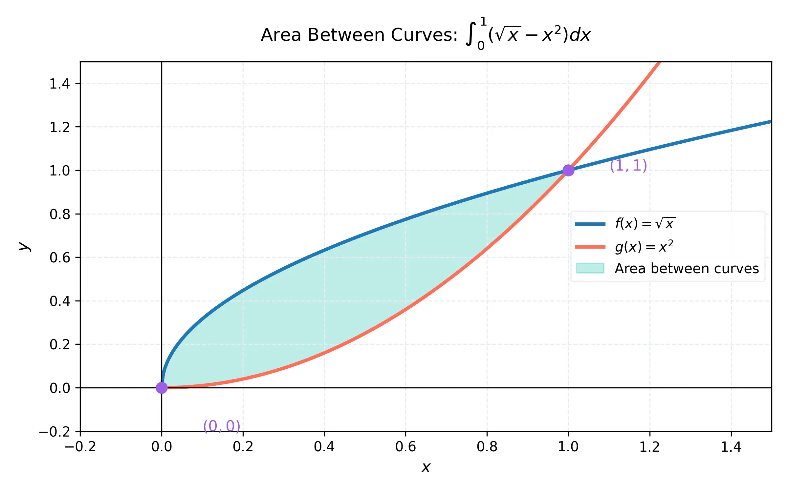
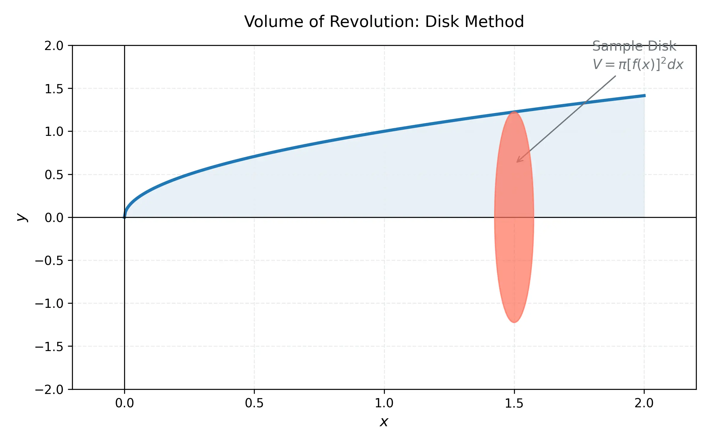

# 課程：微積分上 - 第 17 週 - 積分的應用：面積與體積

本文件包含了第 17 週完整的教學大綱、實作指南以及練習題庫。本週重點在於定積分在幾何上的應用，包括計算兩曲線之間的面積，以及利用切片法、圓盤法與墊圈法計算旋轉體的體積。
本週教學內容對應 **Stewart Calculus (Metric Edition) Chapter 6: Applications of Integration**。

---

## 一、 單元講解 (Lecture) - 總計 100 分鐘

### 1. 兩曲線間面積的計算 (對 x 積分) (20 min) (KP17.1)
*   **概念講解**：
    若函數 $f(x)$ 與 $g(x)$ 在區間 $[a, b]$ 上連續，且 $f(x) \geq g(x)$，則由這兩條曲線以及直線 $x=a, x=b$ 所圍成的區域面積 $A$ 為：
    $$A = \int_a^b [f(x) - g(x)] \, dx$$
    其幾何意義是將區域切割成無數個垂直的矩形，每個矩形的高度為 $f(x) - g(x)$（上函數減下函數），寬度為 $dx$。若兩曲線在區間內相交，則需找出交點並分段積分。

    

*   **練習題與解答**：
    *   **練習題 17.1.1**：求由 $y = x^2 + 1$ 與 $y = x$ 在 $x=0$ 到 $x=1$ 之間圍成的面積。
    *   **解答**：在 $[0, 1]$ 區間內，$x^2+1 > x$。
        $A = \int_0^1 (x^2 + 1 - x) \, dx = [\frac{1}{3}x^3 + x - \frac{1}{2}x^2]_0^1 = (\frac{1}{3} + 1 - \frac{1}{2}) - 0 = \frac{5}{6}$。
    *   **練習題 17.1.2**：求 $y = x^2$ 與 $y = 2x - x^2$ 圍成的區域面積。
    *   **解答**：先找交點：$x^2 = 2x - x^2 \implies 2x^2 - 2x = 0 \implies 2x(x-1) = 0 \implies x=0, 1$。
        在 $[0, 1]$ 區間內，$2x-x^2 \geq x^2$。
        $A = \int_0^1 (2x - x^2 - x^2) \, dx = \int_0^1 (2x - 2x^2) \, dx = [x^2 - \frac{2}{3}x^3]_0^1 = 1 - \frac{2}{3} = \frac{1}{3}$。

---

### 2. 兩曲線間面積的計算 (對 y 積分) (20 min) (KP17.2)
*   **概念講解**：
    有些區域若對 $x$ 積分會非常複雜（需要分多段），此時若將區域視為以 $y$ 為自變數的函數 $x = f(y)$ 與 $x = g(y)$，則面積可表示為：
    $$A = \int_c^d [f(y) - g(y)] \, dy$$
    其中 $f(y)$ 為「右邊」的曲線，$g(y)$ 為「左邊」的曲線（右減左）。

*   **練習題與解答**：
    *   **練習題 17.2.1**：求曲線 $y^2 = 2x + 6$ 與直線 $y = x - 1$ 圍成的面積。
    *   **解答**：改寫為 $x = \frac{1}{2}y^2 - 3$ 與 $x = y + 1$。
        找交點：$\frac{1}{2}y^2 - 3 = y + 1 \implies y^2 - 2y - 8 = 0 \implies (y-4)(y+2) = 0 \implies y=-2, 4$。
        在區間內，右側為直線 $x = y + 1$。
        $A = \int_{-2}^4 [y + 1 - (\frac{1}{2}y^2 - 3)] \, dy = \int_{-2}^4 (-\frac{1}{2}y^2 + y + 4) \, dy = [-\frac{1}{6}y^3 + \frac{1}{2}y^2 + 4y]_{-2}^4 = 18$。
    *   **練習題 17.2.2**：什麼情況下對 $y$ 積分會比對 $x$ 積分更具優勢？
    *   **解答**：當邊界函數更容易表示為 $x = h(y)$，或者區域的「上」或「下」邊界由多條曲線組成而「左」或「右」邊界較為單一時。

---

### 3. 體積：切片法 (Slicing) 基礎 (20 min) (KP17.3)
*   **概念講解**：
    若一個幾何體位於 $x=a$ 與 $x=b$ 之間，且其垂直於 $x$ 軸的橫截面積為 $A(x)$，則該幾何體的體積 $V$ 為：
    $$V = \int_a^b A(x) \, dx$$
    這是求體積最普遍的方法。無論截面是圓形、正方形還是三角形，只要能將截面積表達為 $x$ 的函數即可。

*   **練習題與解答**：
    *   **練習題 17.3.1**：一個幾何體的底圓半徑為 $r$，且每個垂直於直徑的截面都是等腰直角三角形（斜邊在底面上）。求其體積。
    *   **解答**：設底圓方程為 $x^2 + y^2 = r^2$。在位置 $x$，截面斜邊長為 $2\sqrt{r^2 - x^2}$。
        等腰直角三角形斜邊為 $c$，則面積 $A = \frac{1}{4}c^2 = \frac{1}{4}(4(r^2-x^2)) = r^2 - x^2$。
        $V = \int_{-r}^r (r^2 - x^2) \, dx = 2\int_0^r (r^2 - x^2) \, dx = 2[r^2x - \frac{1}{3}x^3]_0^r = \frac{4}{3}r^3$。
    *   **練習題 17.3.2**：若已知一個物體在 $[0, 2]$ 上的截面積為 $A(x) = \pi(4-x^2)$，求體積。
    *   **解答**：$V = \int_0^2 \pi(4-x^2) \, dx = \pi[4x - \frac{1}{3}x^3]_0^2 = \pi(8 - \frac{8}{3}) = \frac{16\pi}{3}$。

---

### 4. 旋轉體體積：圓盤法 (Disk Method) (20 min) (KP17.4)
*   **概念講解**：
    當一個平面區域繞著一條軸旋轉時，會產生旋轉體。若旋轉軸是區域的邊界，則截面為實心圓盤。
    **繞 x 軸旋轉**：$V = \int_a^b \pi [f(x)]^2 \, dx$
    **繞 y 軸旋轉**：$V = \int_c^d \pi [g(y)]^2 \, dy$
    公式中的 $\pi R^2$ 即為截面積 $A(x)$ 或 $A(y)$。

    

*   **練習題與解答**：
    *   **練習題 17.4.1**：將 $y = \sqrt{x}$ 繞 x 軸旋轉，求其在 $x=0$ 到 $x=4$ 之間的體積。
    *   **解答**：$V = \int_0^4 \pi (\sqrt{x})^2 \, dx = \int_0^4 \pi x \, dx = [\frac{\pi}{2}x^2]_0^4 = 8\pi$。
    *   **練習題 17.4.2**：將 $y = x^3$ 與 y 軸圍成的區域（$0 \leq y \leq 8$）繞 y 軸旋轉，求體積。
    *   **解答**：改寫為 $x = y^{1/3}$。
        $V = \int_0^8 \pi (y^{1/3})^2 \, dy = \pi \int_0^8 y^{2/3} \, dy = \pi [\frac{3}{5}y^{5/3}]_0^8 = \pi \cdot \frac{3}{5} \cdot 32 = \frac{96\pi}{5}$。

---

### 5. 旋轉體體積：墊圈法 (Washer Method) (20 min) (KP17.5)
*   **概念講解**：
    當旋轉區域在旋轉軸與邊界之間有空隙時，截面會呈現「墊圈」（中空圓環）形狀。
    **繞 x 軸旋轉**：$V = \int_a^b \pi ([f(x)]^2 - [g(x)]^2) \, dx$
    其中 $f(x)$ 為外半徑（離軸較遠），$g(x)$ 為內半徑（離軸較近）。
    **核心思想**：外圓面積減內圓面積。

*   **練習題與解答**：
    *   **練習題 17.5.1**：求由 $y = x$ 與 $y = x^2$ 圍成的區域繞 x 軸旋轉的體積。
    *   **解答**：交點為 $x=0, 1$。在 $[0, 1]$ 內，$x \geq x^2$，故外半徑 $R = x$，內半徑 $r = x^2$。
        $V = \int_0^1 \pi (x^2 - (x^2)^2) \, dx = \pi \int_0^1 (x^2 - x^4) \, dx = \pi [\frac{1}{3}x^3 - \frac{1}{5}x^5]_0^1 = \pi(\frac{1}{3} - \frac{1}{5}) = \frac{2\pi}{15}$。
    *   **練習題 17.5.2**：若將上述區域繞直線 $y = 2$ 旋轉，外半徑與內半徑為何？
    *   **解答**：外半徑為離軸較遠者 $R = 2 - x^2$，內半徑為離軸較近者 $r = 2 - x$。

---

## 二、 動手實作 (Lab) - 總計 50 分鐘

### 實作：使用 SymPy 計算面積與體積
**任務目標**：利用 Python 處理複雜的交點運算與積分計算，驗證手算結果。
1.  在 Google Colab 中執行以下代碼。
    ```python
    import sympy as sp

    x, y = sp.symbols('x y')

    # --- 實作 1: 兩曲線間面積 ---
    # 函數 f(x) = sin(x), g(x) = cos(x) 在 [0, pi/2]
    # 先求交點
    intersection = sp.solve(sp.sin(x) - sp.cos(x), x)
    print(f"交點: {intersection}")
    # 面積 = |int_0^{pi/4} (cos x - sin x) dx| + |int_{pi/4}^{pi/2} (sin x - cos x) dx|
    area = sp.integrate(sp.cos(x) - sp.sin(x), (x, 0, sp.pi/4)) + \
           sp.integrate(sp.sin(x) - sp.cos(x), (x, sp.pi/4, sp.pi/2))
    print(f"兩曲線間面積: {area.simplify()}")

    # --- 實作 2: 旋轉體體積 (Washer Method) ---
    # 區域: y = x**2, y = x 繞 x 軸旋轉
    R = x      # 外半徑
    r = x**2   # 內半徑
    vol = sp.integrate(sp.pi * (R**2 - r**2), (x, 0, 1))
    print(f"旋轉體體積 (繞 x 軸): {vol}")

    # --- 實作 3: 繞非座標軸旋轉 ---
    # 區域: y = sqrt(x), x 軸, x = 4 繞 y = -1 旋轉
    # 半徑 = f(x) - (-1) = sqrt(x) + 1
    vol_offset = sp.integrate(sp.pi * ((sp.sqrt(x) + 1)**2 - (0 + 1)**2), (x, 0, 4))
    print(f"繞 y = -1 旋轉體積: {vol_offset}")
    ```

---

## 三、 本週知識點回顧 (KP)
- **KP17.1**: 掌握面積積分的基本公式 $\int (上 - 下) dx$ 並學會找交點。
- **KP17.2**: 理解何時使用 $\int (右 - 左) dy$ 積分更簡便。
- **KP17.3**: 建立切片法概念：體積是截面積函數的積分。
- **KP17.4**: 熟練圓盤法公式，區分繞 x 軸與繞 y 軸的差異。
- **KP17.5**: 應用墊圈法處理空心旋轉體，精確識別內外半徑。

---

## 四、 課後測驗題庫 (Quiz) - 30 分鐘

### 1. 單選題 (Single Choice) - 共 10 題
1. **Q1**: 求 $y=x^2$ 與 $y=x^3$ 在 $[0, 1]$ 圍成的面積？
   - (A) 1/12 (B) 1/4 (C) 1/3 (D) 1/2
2. **Q2**: 若區域繞 y 軸旋轉，截面垂直於 y 軸，則應使用？
   - (A) $dx$ 圓盤法 (B) $dy$ 圓盤法 (C) $dx$ 剝殼法 (D) $dy$ 墊圈法
3. **Q3**: 墊圈法公式中，若繞 $x$ 軸旋轉，內半徑 $r$ 是？
   - (A) 離 $x$ 軸較遠的函數 (B) 離 $x$ 軸較近的函數 (C) 恆為常數 (D) 旋轉軸的長度
4. **Q4**: 計算面積時若曲線 $f(x)$ 與 $g(x)$ 相交兩次，形成一個封閉區域，則積分限 $a, b$ 為？
   - (A) 任意給定 (B) 曲線的交點 (C) 必為 0 與 1 (D) $x$ 軸的截點
5. **Q5**: 圓盤法是切片法的特例，其截面形狀為？
   - (A) 正方形 (B) 圓形 (C) 三角形 (D) 梯形
6. **Q6**: $y = \sqrt{r^2 - x^2}$ 繞 $x$ 軸旋轉產生的幾何體是？
   - (A) 圓柱 (B) 圓錐 (C) 球體 (D) 環面
7. **Q7**: 若對 $y$ 積分求面積，被積函數應為？
   - (A) $f(y) - g(y)$ (B) $f(x) - g(x)$ (C) $f(y) + g(y)$ (D) $f'(y)$
8. **Q8**: 繞 $x$ 軸旋轉時，若區域位於 $y=1$ 與 $y=3$ 之間，外半徑為？
   - (A) 1 (B) 2 (C) 3 (D) 4
9. **Q9**: $\int_1^2 \pi (x^2)^2 \, dx$ 代表哪條曲線繞 $x$ 軸旋轉的體積？
   - (A) $y=x$ (B) $y=x^2$ (C) $y=x^4$ (D) $y=\sqrt{x}$
10. **Q10**: 哪種方法最適合求橫截面為等邊三角形的幾何體體積？
    - (A) 圓盤法 (B) 墊圈法 (C) 一般切片法 (D) 剝殼法

### 2. 多選題 (Multiple Choice) - 共 10 題
11. **Q11**: 下列關於面積積分的敘述，正確的有？
    - (A) 面積恆為正值 (B) 必須找出所有交點 (C) 只能對 $x$ 積分 (D) 右減左適用於對 $y$ 積分
12. **Q12**: 墊圈法與圓盤法的共同點包括？
    - (A) 截面都垂直於旋轉軸 (B) 都涉及 $\pi \times (\text{半徑})^2$ (C) 都不需要考慮旋轉軸 (D) 都是切片法的應用
13. **Q13**: 哪些因素會改變旋轉體的體積？
    - (A) 旋轉區域的形狀 (B) 旋轉軸的位置 (C) 旋轉的角度 (D) 積分變數的選擇
14. **Q14**: 若區域由 $y=f(x), y=g(x)$ 圍成，繞 $x$ 軸旋轉，體積公式正確的有？
    - (A) $\int \pi (f^2 - g^2) dx$ (B) $\pi \int (f-g)^2 dx$ (C) $\int \pi f^2 dx - \int \pi g^2 dx$ (D) $\int 2\pi x f dx$
15. **Q15**: 下列哪些函數圍成的面積建議對 $y$ 積分？
    - (A) $x = y^2$ 與 $x = y + 2$ (B) $y = x^2$ 與 $y = x$ (C) $x = e^y$ 與 $x = 1, y = 1$ (D) $y = \ln x$ 與 $x$ 軸
16. **Q16**: 求體積時，若截面平行於旋轉軸，通常不使用？
    - (A) 圓盤法 (B) 墊圈法 (C) 剝殼法 (D) 切片法
17. **Q17**: 關於 $V = \int_a^b A(x) \, dx$，下列何者正確？
    - (A) $A(x)$ 是橫截面積 (B) 截面必須垂直於 $x$ 軸 (C) 此公式僅適用於圓形截面 (D) $A(x)$ 必須是 $x$ 的函數
18. **Q18**: 使用 SymPy 計算時，哪些步驟是必要的？
    - (A) 定義符號變數 (B) 設定積分限 (C) 呼叫 `sp.integrate` (D) 必須畫圖
19. **Q19**: 下列幾何體的體積公式推導涉及積分的有？
    - (A) 球體 (B) 圓錐 (C) 圓柱 (D) 長方體
20. **Q20**: 墊圈法的「空洞」部分體積計算式為？
    - (A) $\int \pi r^2 dx$ (B) $\int \pi R^2 dx$ (C) $\int \pi (R-r)^2 dx$ (D) 總體積減去實心部分

### 3. 填充題 (Fill-in-the-blank) - 共 10 題
21. **Q21**: 兩曲線 $y=x$ 與 $y=x^2$ 的交點坐標為 (0,0) 與 __________。
22. **Q22**: 圓盤法公式中，若繞 $y=k$ 旋轉，半徑應表示為 __________。
23. **Q23**: 墊圈法的截面面積公式為 $A(x) = \pi(R^2 - r^2)$，其中 $r$ 代表 __________。
24. **Q24**: 切片法中，若截面為邊長 $s(x)$ 的正方形，則 $A(x) = $ __________。
25. **Q25**: 繞 $y$ 軸旋轉的圓盤法公式為 $V = \int_c^d$ __________ $dy$。
26. **Q26**: $\int_{-1}^1 (1-x^2) dx = $ __________（此為面積值）。
27. **Q27**: 墊圈法公式 $\int \pi (R^2 - r^2) dx$ 中，$R$ 稱為 __________。
28. **Q28**: 若一個旋轉體是由 $y=x$ 在 $[0, 1]$ 繞 $x$ 軸旋轉而成，其形狀為 __________。
29. **Q29**: 在 Python 中，`sp.solve(f-g, x)` 的作用是 __________。
30. **Q30**: 體積積分的本質是累積無數個微小幾何元件的 __________。
