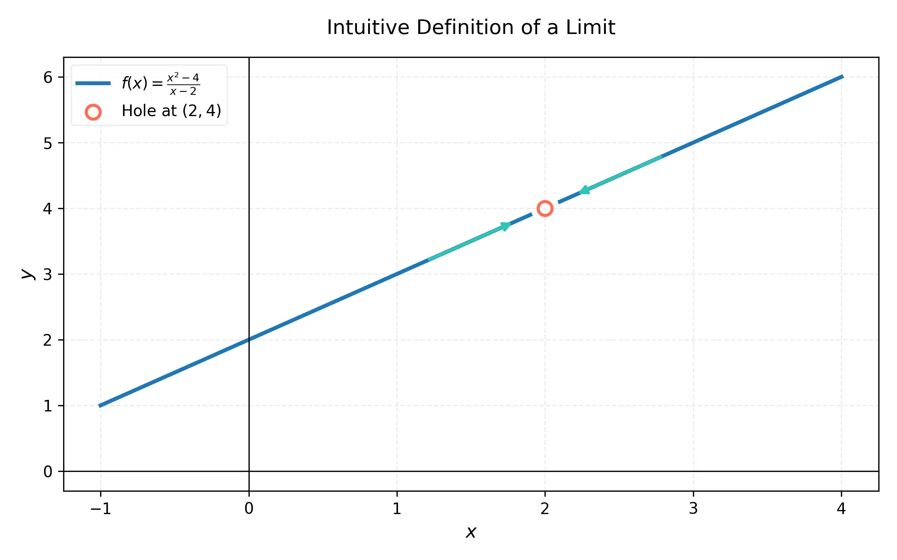
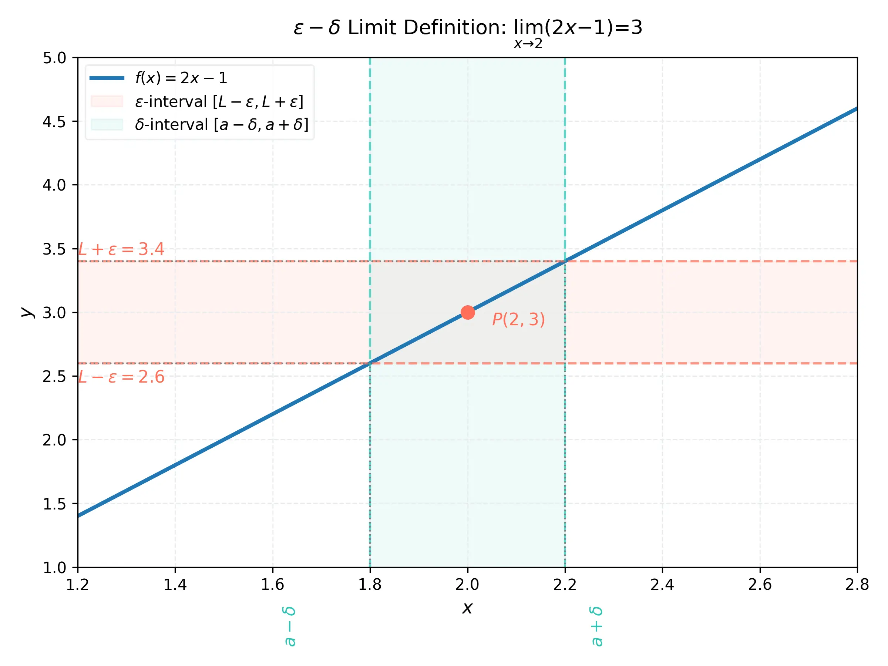

# Week 2: 極限與連續性基礎 (Limits and Continuity Basics)

## 課程簡介
本週進入微積分的核心概念：**極限 (Limits)**。從探討切線問題與瞬時速度問題出發，引導出極限的直觀概念。接著，我們將介紹計算極限的法則，並深入探討極限的嚴格數學定義（$\epsilon-\delta$ 定義），這對建立堅實的微積分基礎至關重要。最後將介紹單側極限的概念。

---

## 知識點 (Key Points)

### KP 2.1: 從割線到切線 (The Tangent and Velocity Problems)

**理論解釋：**
微積分的起源之一是為了解決切線問題。給定一個函數圖形上的點 $P$，我們想找到通過 $P$ 的切線。直觀上，切線是剛好「觸碰」曲線於該點的直線。為了找到切線斜率，我們可以在曲線上取另一點 $Q$，計算連接 $P$ 和 $Q$ 的割線斜率 (Secant slope)：
$m_{PQ} = \frac{f(x) - f(a)}{x - a}$
當 $Q$ 沿著曲線無窮逼近 $P$（即 $x$ 無窮逼近 $a$）時，割線斜率將逐漸逼近切線斜率 (Tangent slope)。同理，在物理學中，平均速度在時間區間縮小至零時，將逼近瞬時速度。

**練習 2.1.1：**
求曲線 $y = x^2$ 在點 $P(1, 1)$ 處的切線斜率估計。
**解答：**
1. 取鄰近點 $Q(x, x^2)$。
2. 割線斜率為 $m_{PQ} = \frac{x^2 - 1}{x - 1} = x + 1$ (當 $x \neq 1$)。
3. 當 $x$ 越來越靠近 1 (例如 $x=1.1, 1.01, 1.001$)：
   - $x = 1.1 \Rightarrow m_{PQ} = 2.1$
   - $x = 1.01 \Rightarrow m_{PQ} = 2.01$
   - $x = 1.001 \Rightarrow m_{PQ} = 2.001$
4. 由此推測，當 $x$ 趨近於 1 時，切線斜率為 2。

### KP 2.2: 極限的概念 (The Limit of a Function)



**理論解釋：**
假設函數 $f(x)$ 在 $x=a$ 的附近有定義（但在 $x=a$ 本身不一定要有定義）。如果當 $x$ 任意靠近 $a$（但不等於 $a$）時，$f(x)$ 的值能任意靠近一個實數 $L$，我們就說「當 $x$ 趨近於 $a$ 時，$f(x)$ 的極限為 $L$」，記為：
$\lim_{x \to a} f(x) = L$

這是一個直觀的定義，強調函數值在某一點附近的行為，而非該點本身的取值。

**練習 2.2.1：**
估計極限 $\lim_{x \to 0} \frac{\sin x}{x}$ 的值（使用計算機或表格法）。
**解答：**
1. 取 $x$ 接近 0 的值，代入 $f(x) = \frac{\sin x}{x}$（$x$ 必須以弧度為單位）：
   - $x = \pm 0.1 \Rightarrow f(x) \approx 0.998334$
   - $x = \pm 0.01 \Rightarrow f(x) \approx 0.999983$
   - $x = \pm 0.001 \Rightarrow f(x) \approx 0.999999$
2. 隨著 $x$ 趨近於 0，$f(x)$ 趨近於 1。
3. 估計極限為 $\lim_{x \to 0} \frac{\sin x}{x} = 1$。

### KP 2.3: 極限定律 (Calculating Limits Using the Limit Laws)

**理論解釋：**
極限定律簡化了極限的計算。若 $\lim_{x \to a} f(x)$ 和 $\lim_{x \to a} g(x)$ 都存在，則有：
1. 加上法則：$\lim_{x \to a} [f(x) + g(x)] = \lim_{x \to a} f(x) + \lim_{x \to a} g(x)$
2. 常數倍法則：$\lim_{x \to a} [c \cdot f(x)] = c \cdot \lim_{x \to a} f(x)$
3. 乘積法則：$\lim_{x \to a} [f(x) \cdot g(x)] = \lim_{x \to a} f(x) \cdot \lim_{x \to a} g(x)$
4. 商法則：$\lim_{x \to a} \frac{f(x)}{g(x)} = \frac{\lim_{x \to a} f(x)}{\lim_{x \to a} g(x)}$ (前提是 $\lim_{x \to a} g(x) \neq 0$)

遇到不定型 (如 $0/0$) 時，通常需要進行代數化簡（如因式分解、有理化）。

**練習 2.3.1：**
計算極限 $\lim_{x \to 2} \frac{x^2 - 4}{x - 2}$。
**解答：**
1. 直接代入 $x=2$ 會得到 $0/0$ 的形式。
2. 對分子進行因式分解：$x^2 - 4 = (x - 2)(x + 2)$。
3. 原式 = $\lim_{x \to 2} \frac{(x - 2)(x + 2)}{x - 2}$。
4. 因為 $x \to 2$ 表示 $x \neq 2$，可以消去 $(x - 2)$。
5. 得到 $\lim_{x \to 2} (x + 2)$。代入 $x=2$，極限值為 $2 + 2 = 4$。

### KP 2.4: 嚴格的極限定義 (The Precise Definition of a Limit)



**理論解釋：**
這是微積分中最核心且最嚴謹的定義，稱為 $\epsilon-\delta$ (epsilon-delta) 定義。
極限 $\lim_{x \to a} f(x) = L$ 的精確意義是：
對於任意給定的正數 $\epsilon > 0$（無論多小），總存在一個對應的正數 $\delta > 0$，使得：
當 $0 < |x - a| < \delta$ 時，必有 $|f(x) - L| < \epsilon$。

這表示，只要我們將 $x$ 限制在 $a$ 的 $\delta$-鄰域內（但不等於 $a$），就能保證函數值 $f(x)$ 落在 $L$ 的 $\epsilon$-鄰域內。

**證明範例 (Exercise 2.4.1)：**
使用 $\epsilon-\delta$ 定義證明 $\lim_{x \to 3} (2x - 1) = 5$。
**解答：**
1. **分析階段 (猜測 $\delta$)：** 給定 $\epsilon > 0$，我們需要找到 $\delta > 0$ 使得當 $0 < |x - 3| < \delta$ 時，$|(2x - 1) - 5| < \epsilon$。
   整理不等式：$|2x - 6| < \epsilon \Rightarrow 2|x - 3| < \epsilon \Rightarrow |x - 3| < \frac{\epsilon}{2}$。
   因此，我們選擇 $\delta = \frac{\epsilon}{2}$。
2. **證明階段：** 給定任意 $\epsilon > 0$，取 $\delta = \frac{\epsilon}{2}$。
   若 $0 < |x - 3| < \delta$，則：
   $|(2x - 1) - 5| = |2x - 6| = 2|x - 3| < 2\delta = 2(\frac{\epsilon}{2}) = \epsilon$。
3. 根據定義，證明完成：$\lim_{x \to 3} (2x - 1) = 5$。

### KP 2.5: 單側極限 (One-Sided Limits)

**理論解釋：**
當 $x$ 只從 $a$ 的左側（$x < a$）逼近時，稱為左極限，記為 $\lim_{x \to a^-} f(x) = L$。
當 $x$ 只從 $a$ 的右側（$x > a$）逼近時，稱為右極限，記為 $\lim_{x \to a^+} f(x) = L$。
**重要定理：** $\lim_{x \to a} f(x) = L$ 若且唯若 $\lim_{x \to a^-} f(x) = L$ 且 $\lim_{x \to a^+} f(x) = L$。如果左極限和右極限不相等，則雙側極限不存在。

**練習 2.5.1：**
考慮絕對值函數的極限 $\lim_{x \to 0} \frac{|x|}{x}$。求其左右極限。
**解答：**
1. 計算右極限 ($x \to 0^+$)：此時 $x > 0$，故 $|x| = x$。
   $\lim_{x \to 0^+} \frac{|x|}{x} = \lim_{x \to 0^+} \frac{x}{x} = \lim_{x \to 0^+} 1 = 1$。
2. 計算左極限 ($x \to 0^-$)：此時 $x < 0$，故 $|x| = -x$。
   $\lim_{x \to 0^-} \frac{|x|}{x} = \lim_{x \to 0^-} \frac{-x}{x} = \lim_{x \to 0^-} -1 = -1$。
3. 結論：因為右極限 $\neq$ 左極限，所以 $\lim_{x \to 0} \frac{|x|}{x}$ 不存在。

---

## Python 實驗室 (Python Lab)

利用 SymPy 計算極限，並用 Matplotlib 畫出函數圖形，觀察單側極限的不同行為。

```python
import sympy as sp
import numpy as np
import matplotlib.pyplot as plt

# SymPy 計算極限
x = sp.Symbol('x')
f = abs(x) / x

limit_right = sp.limit(f, x, 0, dir='+')
limit_left = sp.limit(f, x, 0, dir='-')

print(f"右極限 (x->0+): {limit_right}")
print(f"左極限 (x->0-): {limit_left}")

# Matplotlib 視覺化
x_vals_pos = np.linspace(0.01, 2, 100)
x_vals_neg = np.linspace(-2, -0.01, 100)

y_vals_pos = np.abs(x_vals_pos) / x_vals_pos
y_vals_neg = np.abs(x_vals_neg) / x_vals_neg

plt.figure(figsize=(8, 4))
plt.plot(x_vals_pos, y_vals_pos, 'b-', label='f(x) for x > 0')
plt.plot(x_vals_neg, y_vals_neg, 'r-', label='f(x) for x < 0')
plt.scatter([0, 0], [1, -1], color=['white', 'white'], edgecolor=['blue', 'red'], zorder=5) # 空心圓
plt.axhline(0, color='black', linewidth=0.5)
plt.axvline(0, color='black', linewidth=0.5)
plt.title("Graph of $f(x) = |x| / x$")
plt.legend()
plt.grid(True, linestyle='--', alpha=0.6)
plt.show()
```

---

## 測驗 (Quiz)

**單選題 (10題)**
1. 直觀上，當割線上的兩點無限靠近時，割線的極限位置為：
   A) 漸近線
   B) 切線
   C) 法線
   D) 平行線
2. 若 $\lim_{x \to 1} f(x) = 3$ 且 $\lim_{x \to 1} g(x) = 4$，則 $\lim_{x \to 1} [2f(x) - g(x)] =$ ?
   A) 1
   B) 2
   C) -1
   D) 5
3. 計算 $\lim_{x \to 3} \frac{x^2 - 9}{x - 3}$：
   A) 0
   B) 3
   C) 6
   D) 不存在
4. 根據極限的嚴格定義，要證明 $\lim_{x \to a} f(x) = L$，必須對任意給定的 $\epsilon > 0$，找到對應的：
   A) $\delta > 0$ 使得若 $0 < |x - a| < \delta$，則 $|f(x) - L| < \epsilon$
   B) $\delta > 0$ 使得若 $|f(x) - L| < \epsilon$，則 $0 < |x - a| < \delta$
   C) $M > 0$ 使得 $|f(x)| \le M$
   D) $\delta > 0$ 使得 $|x - a| = \delta$
5. 對於函數 $f(x) = \frac{1}{x-2}$，求 $\lim_{x \to 2^+} f(x)$：
   A) $\infty$
   B) $-\infty$
   C) 0
   D) 不存在（非無窮）
6. 判斷 $\lim_{x \to 0} \sin(\frac{1}{x})$：
   A) 0
   B) 1
   C) $\infty$
   D) 不存在
7. 在使用 $\epsilon-\delta$ 定義證明 $\lim_{x \to 2} (3x - 1) = 5$ 時，若給定 $\epsilon = 0.03$，則可取的最大 $\delta$ 為：
   A) 0.01
   B) 0.03
   C) 0.09
   D) 0.1
8. 若 $\lim_{x \to a} f(x)$ 存在，則：
   A) $\lim_{x \to a^+} f(x) = \lim_{x \to a^-} f(x)$
   B) $f(a)$ 必須有定義
   C) $f(a) = \lim_{x \to a} f(x)$
   D) $f(x)$ 必須是多項式
9. 計算 $\lim_{t \to 0} \frac{\sqrt{t^2 + 9} - 3}{t^2}$：
   A) 0
   B) $1/6$
   C) 3
   D) 不存在
10. 計算 $\lim_{x \to 1} \frac{x^3 - 1}{x - 1}$：
    A) 0
    B) 1
    C) 2
    D) 3

**多選題 (10題)**
11. 關於極限 $\lim_{x \to a} f(x) = L$，下列敘述哪些正確？
    A) $f(a)$ 不一定需要有定義。
    B) 若 $f(a)$ 有定義，$\lim_{x \to a} f(x)$ 不一定等於 $f(a)$。
    C) 只有當左右極限皆存在且相等時，此極限才存在。
    D) 極限一定存在於所有的函數中。
12. 計算極限時，哪些情況可能需要代數操作 (如因式分解、有理化)？
    A) $0/0$
    B) $\infty/\infty$
    C) 常數/0
    D) $\infty - \infty$
13. 若 $\lim_{x \to c} f(x) = L$，且 $L>0$，下列哪些極限必然存在且為正？
    A) $\lim_{x \to c} (f(x))^2$
    B) $\lim_{x \to c} \sqrt{f(x)}$
    C) $\lim_{x \to c} \frac{1}{f(x)}$
    D) $\lim_{x \to c} \ln(f(x))$
14. 在 $\epsilon-\delta$ 證明 $\lim_{x \to 4} (5x) = 20$ 中：
    A) $\delta = \epsilon / 5$ 是正確的選擇。
    B) $\delta = \epsilon / 10$ 也是正確的選擇。
    C) $|x - 4| < \delta$ 是前提條件。
    D) 需要限制 $x \neq 4$。
15. 關於單側極限，下列哪些正確？
    A) 函數的定義域可以限制在 $a$ 的單側來探討單側極限。
    B) 若 $\lim_{x \to a} f(x)$ 存在，則單側極限必存在。
    C) 若單側極限存在，則雙側極限必存在。
    D) 步階函數在斷點處有單側極限。
16. 下列哪些極限為 0？
    A) $\lim_{x \to 0} x \sin(\frac{1}{x})$
    B) $\lim_{x \to 0} \frac{\sin x}{x}$
    C) $\lim_{x \to 0} \frac{1-\cos x}{x}$
    D) $\lim_{x \to 0} x^2$
17. 若函數 $f(x)$ 包含根式如 $\sqrt{x+4}-2$，在 $x \to 0$ 時，常用的處理方法包括：
    A) 直接代入
    B) 羅必達法則 (後續學到)
    C) 分子分母同乘有理化因式 $(\sqrt{x+4}+2)$
    D) 取對數
18. 下列關於切線與割線的敘述，哪些正確？
    A) 割線通過曲線上兩相異點。
    B) 切線是割線當兩點距離趨近於零時的極限狀態。
    C) 所有曲線在任一點都有切線。
    D) 切線斜率代表瞬時變化率。
19. 對於函數 $f(x) = \lfloor x \rfloor$ (高斯符號，不大於 $x$ 的最大整數)，下列哪些正確？
    A) $\lim_{x \to 2^-} f(x) = 1$
    B) $\lim_{x \to 2^+} f(x) = 2$
    C) $\lim_{x \to 2} f(x) = 2$
    D) 在 $x=2.5$ 時，極限存在。
20. 極限定律成立的前提是：
    A) 各別的極限必須存在。
    B) 若求商的極限，分母極限不可為零。
    C) 函數必須是連續的。
    D) 函數必須是多項式。

**填空題 (10題)**
21. $\lim_{x \to 4} \frac{\sqrt{x} - 2}{x - 4} = \underline{\hspace{1cm}}$。
22. 若 $f(x) = x^3 - 2x + 1$，則 $\lim_{x \to 2} f(x) = \underline{\hspace{1cm}}$。
23. 給定 $\lim_{x \to a} f(x) = 5, \lim_{x \to a} g(x) = -2$，則 $\lim_{x \to a} [f(x) \cdot g(x)] = \underline{\hspace{1cm}}$。
24. 在 $\epsilon-\delta$ 定義中，欲證 $\lim_{x \to -1} (4x + 3) = -1$，若 $\epsilon = 0.08$，則對應的最大 $\delta = \underline{\hspace{1cm}}$。
25. 曲線 $y = x^3$ 在 $x=1$ 處的切線斜率為 $\underline{\hspace{1cm}}$。
26. $\lim_{h \to 0} \frac{(2+h)^2 - 4}{h} = \underline{\hspace{1cm}}$。
27. 若函數 $f(x) = \begin{cases} cx+1 & \text{if } x \le 2 \\ 5-x & \text{if } x > 2 \end{cases}$，且 $\lim_{x \to 2} f(x)$ 存在，則 $c = \underline{\hspace{1cm}}$。
28. 單側極限 $\lim_{x \to 3^-} \frac{x-3}{|x-3|} = \underline{\hspace{1cm}}$。
29. $\lim_{x \to 0} \frac{\sin 3x}{x} = \underline{\hspace{1cm}}$。
30. 直觀上，$\lim_{x \to 0} \cos x = \underline{\hspace{1cm}}$。
