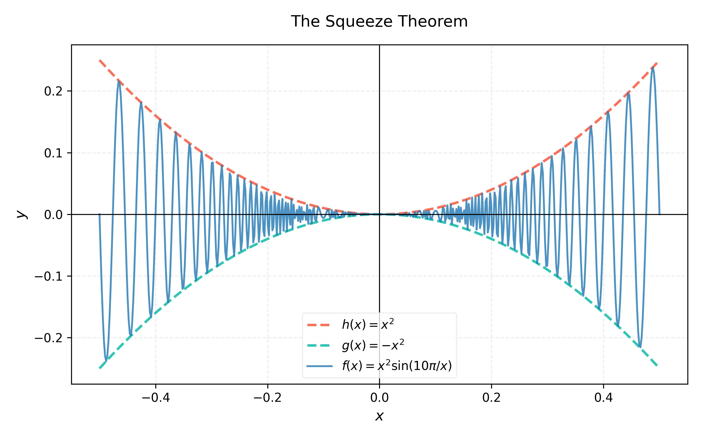

# Week 3: 極限的進階計算 (Advanced Limits and Continuity)

## 課程簡介
本週我們將學習處理更複雜的極限問題，並探討函數的「連續性」。首先介紹強大的夾擠定理 (Squeeze Theorem)，並將其應用於重要的三角函數極限。接著，我們將嚴格定義連續性，並探討其重要推論：中間值定理 (Intermediate Value Theorem, IVT)。

---

## 知識點 (Key Points)

### KP 3.1: 夾擠定理 (The Squeeze Theorem)



**理論解釋：**
夾擠定理提供了一種求極限的巧妙方法，當函數難以直接計算極限，但我們能找到兩個「夾住」它的函數，且這兩個函數在某點有相同的極限時，就能確定原函數的極限。
定理敘述：假設在 $a$ 附近的開區間內（$a$ 點本身除外），恆有 $f(x) \le g(x) \le h(x)$。
如果 $\lim_{x \to a} f(x) = L$ 且 $\lim_{x \to a} h(x) = L$，則：
$\lim_{x \to a} g(x) = L$

**證明概念：**
由 $\epsilon-\delta$ 定義可知，因為 $f(x)$ 和 $h(x)$ 都能被控制在 $L$ 的 $\epsilon$-鄰域內，而 $g(x)$ 被夾在兩者之間，自然也被迫落在同一個 $\epsilon$-鄰域內。

**練習 3.1.1：**
利用夾擠定理計算 $\lim_{x \to 0} x^2 \sin(\frac{1}{x})$。
**解答：**
1. 無論 $x$ 取何值（$x \neq 0$），正弦函數的值域始終在 $[-1, 1]$ 之間，即 $-1 \le \sin(\frac{1}{x}) \le 1$。
2. 將不等式各項同乘 $x^2$（因為 $x^2 \ge 0$，不等號方向不變）：
   $-x^2 \le x^2 \sin(\frac{1}{x}) \le x^2$
3. 分別計算左右兩端函數當 $x \to 0$ 的極限：
   $\lim_{x \to 0} (-x^2) = 0$
   $\lim_{x \to 0} (x^2) = 0$
4. 因為左右極限皆為 0，根據夾擠定理，推得 $\lim_{x \to 0} x^2 \sin(\frac{1}{x}) = 0$。

### KP 3.2: 重要三角函數極限 (Trigonometric Limits)

**理論解釋：**
在微積分中，有一個極其重要的基本極限，常作為後續推導三角函數導數的基礎：
$\lim_{x \to 0} \frac{\sin x}{x} = 1$ （其中 $x$ 單位為弧度）

這個極限也可以利用夾擠定理搭配幾何圖形來證明（夾在 $\cos x$ 與 $1$ 之間）。
另一個重要的推論是：
$\lim_{x \to 0} \frac{1 - \cos x}{x} = 0$

**練習 3.2.1：**
計算極限 $\lim_{x \to 0} \frac{\sin 4x}{\sin 6x}$。
**解答：**
1. 將原式改寫，人為構造出 $\frac{\sin \theta}{\theta}$ 的形式。
2. $\lim_{x \to 0} \frac{\sin 4x}{\sin 6x} = \lim_{x \to 0} \left( \frac{\sin 4x}{4x} \cdot 4x \cdot \frac{6x}{\sin 6x} \cdot \frac{1}{6x} \right)$
3. 重新組合：$\lim_{x \to 0} \left( \frac{\sin 4x}{4x} \cdot \frac{6x}{\sin 6x} \cdot \frac{4x}{6x} \right)$
4. 由於當 $x \to 0$ 時，$4x \to 0$ 且 $6x \to 0$，我們有：
   $\lim_{x \to 0} \frac{\sin 4x}{4x} = 1$ 以及 $\lim_{x \to 0} \frac{6x}{\sin 6x} = 1$
5. 且 $\frac{4x}{6x} = \frac{4}{6} = \frac{2}{3}$。
6. 故極限值為 $1 \cdot 1 \cdot \frac{2}{3} = \frac{2}{3}$。

### KP 3.3: 連續性 (Continuity)

**理論解釋：**
直觀上，若一個函數的圖形可以一筆畫完而不中斷，則該函數是連續的。
數學上的嚴謹定義：函數 $f(x)$ 在 $x = a$ 處連續，必須同時滿足以下三個條件：
1. $f(a)$ 有定義（點存在）。
2. $\lim_{x \to a} f(x)$ 存在（左右極限相等）。
3. $\lim_{x \to a} f(x) = f(a)$（極限值等於函數值）。

如果不滿足上述任一條件，則稱函數在 $x = a$ 處不連續。不連續點可分為：可去不連續點、跳躍不連續點、無窮不連續點。

**練習 3.3.1：**
已知函數 $f(x) = \begin{cases} \frac{x^2 - 1}{x - 1} & \text{if } x \neq 1 \\ c & \text{if } x = 1 \end{cases}$，若 $f(x)$ 在全實數皆連續，求常數 $c$。
**解答：**
1. 函數在 $x \neq 1$ 處皆為有理函數且分母不為零，因此必定連續。重點在檢查 $x=1$。
2. 計算 $x \to 1$ 的極限：
   $\lim_{x \to 1} \frac{x^2 - 1}{x - 1} = \lim_{x \to 1} \frac{(x-1)(x+1)}{x-1} = \lim_{x \to 1} (x+1) = 2$。
3. 為了讓 $f(x)$ 在 $x=1$ 連續，必須滿足 $\lim_{x \to 1} f(x) = f(1)$。
4. 因為 $f(1) = c$，故 $c = 2$。

### KP 3.4: 中間值定理 (Intermediate Value Theorem, IVT)

**理論解釋：**
IVT 敘述：假設 $f$ 是一個在閉區間 $[a, b]$ 上連續的函數，且 $N$ 是介於 $f(a)$ 和 $f(b)$ 之間的任意實數（其中 $f(a) \neq f(b)$）。那麼在開區間 $(a, b)$ 內至少存在一個點 $c$，使得 $f(c) = N$。

IVT 的一個重要應用是「勘根定理」：若 $f(x)$ 在 $[a, b]$ 連續，且 $f(a)$ 與 $f(b)$ 異號（一正一負），則 $f(x)=0$ 在 $(a, b)$ 內至少有一個實根。

**練習 3.4.1：**
證明方程式 $x^3 - x - 1 = 0$ 在區間 $(1, 2)$ 之間至少有一個實根。
**解答：**
1. 令 $f(x) = x^3 - x - 1$。
2. 因為 $f(x)$ 是多項式函數，故在所有實數上（包含區間 $[1, 2]$）皆連續。
3. 計算端點函數值：
   $f(1) = 1^3 - 1 - 1 = -1 < 0$
   $f(2) = 2^3 - 2 - 1 = 5 > 0$
4. 因為 $f(1) < 0 < f(2)$，且 $f(x)$ 連續。
5. 根據中間值定理 (IVT)，必存在 $c \in (1, 2)$，使得 $f(c) = 0$。證明完畢。

### KP 3.5: 綜合極限計算技巧

**理論解釋：**
處理複雜極限時，常需結合多種技巧：
- 直接代入（若連續）。
- 因式分解與約分（處理 $0/0$ 多項式）。
- 有理化（處理帶有根號的 $0/0$）。
- 同除以最高次項（處理 $x \to \infty$）。
- 利用基本三角極限。

**練習 3.5.1：**
計算 $\lim_{x \to 0} \frac{\sqrt{1+x} - 1}{x}$。
**解答：**
1. 代入 $x=0$，得 $0/0$。
2. 分子有理化：同乘 $\frac{\sqrt{1+x} + 1}{\sqrt{1+x} + 1}$。
   原式 $= \lim_{x \to 0} \frac{(\sqrt{1+x} - 1)(\sqrt{1+x} + 1)}{x(\sqrt{1+x} + 1)}$
3. 化簡分子：$1+x - 1 = x$。
   原式 $= \lim_{x \to 0} \frac{x}{x(\sqrt{1+x} + 1)}$
4. 消去 $x$：
   $= \lim_{x \to 0} \frac{1}{\sqrt{1+x} + 1}$
5. 代入 $x=0$，極限值為 $\frac{1}{\sqrt{1} + 1} = \frac{1}{2}$。

---

## Python 實驗室 (Python Lab)

利用 SymPy 驗證勘根定理 (IVT) 並使用 `nsolve` 尋找數值解。

```python
import sympy as sp
import numpy as np
import matplotlib.pyplot as plt

x = sp.Symbol('x')
f_expr = x**3 - x - 1

# 定義區間
a, b = 1, 2

# 計算端點值
f_a = f_expr.subs(x, a)
f_b = f_expr.subs(x, b)
print(f"f({a}) = {f_a}")
print(f"f({b}) = {f_b}")

if f_a * f_b < 0:
    print("根據 IVT，存在根！")
    # 尋找數值根
    root = sp.nsolve(f_expr, x, (a+b)/2)
    print(f"找到的根: c = {root}")

# 繪圖視覺化
x_vals = np.linspace(0, 3, 100)
f_func = sp.lambdify(x, f_expr, 'numpy')
y_vals = f_func(x_vals)

plt.figure(figsize=(6, 4))
plt.plot(x_vals, y_vals, label='$f(x) = x^3 - x - 1$')
plt.axhline(0, color='red', linestyle='--')
plt.axvline(root, color='green', linestyle=':', label=f'Root $\\approx$ {root:.3f}')
plt.plot(root, 0, 'go')
plt.title('Intermediate Value Theorem (IVT)')
plt.legend()
plt.grid()
plt.show()
```

---

## 測驗 (Quiz)

**單選題 (10題)**
1. 下列哪一個定理可以幫助我們計算 $\lim_{x \to 0} x^4 \cos(\frac{2}{x})$？
   A) 中間值定理
   B) 夾擠定理
   C) 極大值定理
   D) 羅爾定理
2. 計算 $\lim_{x \to 0} \frac{\sin 5x}{x}$：
   A) 1
   B) 5
   C) $1/5$
   D) 0
3. 函數在 $x=a$ 連續的嚴格定義包含三個條件，下列何者**不**是其中之一？
   A) $f(a)$ 有定義
   B) $\lim_{x \to a} f(x)$ 存在
   C) $\lim_{x \to a} f(x) = 0$
   D) $\lim_{x \to a} f(x) = f(a)$
4. 中間值定理 (IVT) 的前提條件之一是：
   A) 函數必須可微。
   B) 函數在閉區間必須連續。
   C) 函數必須是遞增的。
   D) 函數圖形必須對稱。
5. 計算 $\lim_{x \to 0} \frac{1 - \cos x}{x}$：
   A) 0
   B) 1
   C) -1
   D) $\infty$
6. 若 $f(x)$ 滿足 $3x \le f(x) \le x^3 + 2$ (當 $0 \le x \le 2$ 時)，則 $\lim_{x \to 1} f(x) = $？
   A) 1
   B) 2
   C) 3
   D) 無法確定
7. 若 $f(x) = \frac{x^2 - 9}{x - 3}$ ($x \neq 3$)，要讓 $f(x)$ 在 $x=3$ 連續，應定義 $f(3) =$？
   A) 0
   B) 3
   C) 6
   D) 9
8. 下列哪一個函數在 $x=0$ 處連續？
   A) $1/x$
   B) $\frac{\sin x}{x}$
   C) $\cos x$
   D) $\ln x$
9. 判斷多項式 $P(x) = x^4 + x - 3$ 在區間 $[1, 2]$ 內是否有根？
   A) 有，因為 $P(1) < 0$ 且 $P(2) > 0$
   B) 沒有，因為它是偶次多項式
   C) 有，因為它在區間內有極大值
   D) 無法判斷
10. 計算 $\lim_{\theta \to 0} \frac{\tan \theta}{\theta}$：
    A) 0
    B) 1
    C) $\pi$
    D) 不存在

**多選題 (10題)**
11. 夾擠定理的應用條件為 $f(x) \le g(x) \le h(x)$。下列哪些函數常被用作 $f(x)$ 或 $h(x)$ 來夾擠含有三角函數的極限？
    A) $|x|$
    B) $-|x|$
    C) $x^2$
    D) $\ln x$
12. 關於 $\lim_{x \to 0} \frac{\sin x}{x} = 1$，下列推論哪些是正確的？
    A) $\lim_{x \to 0} \frac{x}{\sin x} = 1$
    B) $\lim_{x \to 0} \frac{\sin 3x}{3x} = 1$
    C) $\lim_{x \to 0} \frac{\sin ax}{bx} = \frac{a}{b}$
    D) $\lim_{x \to 0} \sin x = 1$
13. 若函數 $f(x)$ 在 $x=c$ 不連續，可能的原因包括：
    A) $\lim_{x \to c} f(x)$ 不存在。
    B) $f(c)$ 沒有定義。
    C) 極限存在且有定義，但兩者不相等。
    D) 函數是多項式。
14. 利用 IVT 可以證明哪些方程式在特定區間有解？
    A) $x^5 - x - 1 = 0$ 在 $(1, 2)$ 內
    B) $\cos x = x$ 在 $(0, \pi/2)$ 內
    C) $e^x = 0$ 在任意區間內
    D) $\ln x = 0$ 在 $(0.5, 1.5)$ 內
15. 對於有理函數 $R(x) = P(x)/Q(x)$ ($P, Q$ 為多項式)，下列敘述哪些正確？
    A) $R(x)$ 在其定義域內連續。
    B) 只要 $Q(a) = 0$，$R(x)$ 在 $x=a$ 必有垂直漸近線。
    C) 若 $P(a) = 0$ 且 $Q(a) = 0$，極限可能存在。
    D) 多項式函數本身處處連續。
16. 下列哪些極限值為 0？
    A) $\lim_{x \to 0} x \cos(\frac{1}{x})$
    B) $\lim_{x \to 0} \frac{1 - \cos x}{x}$
    C) $\lim_{x \to \infty} \frac{\sin x}{x}$
    D) $\lim_{x \to 0} \frac{\sin x}{x}$
17. 若要使用夾擠定理求 $\lim_{x \to 0} x^2 \sin(\frac{1}{x})$，可以選擇的夾擠邊界為：
    A) $-x^2$
    B) $x^2$
    C) $-1$
    D) $1$
18. 下列關於連續性的敘述，哪些是正確的？
    A) 連續函數的和必定是連續函數。
    B) 連續函數的乘積必定是連續函數。
    C) 連續函數的商必定是連續函數 (分母不為零處)。
    D) 絕對值函數 $y=|x|$ 在 $x=0$ 是連續的。
19. 設 $f(x) = \frac{x^2 - x - 2}{x - 2}$ ($x \neq 2$)，若令 $f(x)$ 處處連續，則 $f(2)$ 的值應該是：
    A) 3
    B) 0
    C) $\lim_{x \to 2} f(x)$
    D) 無法讓它連續
20. 中間值定理保證了：
    A) 若 $f$ 在 $[a, b]$ 連續，且 $f(a) < N < f(b)$，則必定存在 $c \in (a, b)$ 使 $f(c) = N$。
    B) 該 $c$ 值是唯一的。
    C) $c$ 點可以精確求出解析解。
    D) 若圖形不中斷地從一點連接到另一點，必穿過兩點間的任何水平線。

**填空題 (10題)**
21. $\lim_{x \to 0} \frac{\sin(7x)}{x} = \underline{\hspace{1cm}}$。
22. 若 $-x^2 \le f(x) \le x^2$，則 $\lim_{x \to 0} f(x) = \underline{\hspace{1cm}}$。
23. 多項式 $f(x) = x^3 - 3x + 1$ 在區間 $[0, 1]$ 端點的乘積 $f(0)f(1) = \underline{\hspace{1cm}}$ (請填數值)，由此可知區間內有根。
24. 為了使函數 $f(x) = \begin{cases} 2x+1 & x \le 1 \\ 3x-c & x > 1 \end{cases}$ 連續，$c$ 必須為 $\underline{\hspace{1cm}}$。
25. $\lim_{x \to 0} \frac{\tan 2x}{x} = \underline{\hspace{1cm}}$。
26. 如果 $\lim_{x \to 3} f(x) = 5$ 且 $f(x)$ 在 $x=3$ 連續，則 $f(3) = \underline{\hspace{1cm}}$。
27. $\lim_{x \to 0} x^4 \sin(\frac{1}{x}) = \underline{\hspace{1cm}}$。
28. 利用極限 $\lim_{x \to 0} \frac{\sin x}{x} = 1$，求 $\lim_{x \to 0} \frac{\sin 4x}{\sin 5x} = \underline{\hspace{1cm}}$。
29. $\lim_{x \to 0} \frac{1-\cos^2 x}{x^2} = \underline{\hspace{1cm}}$。
30. IVT 全名為 Intermediate Value $\underline{\hspace{1cm}}$。
