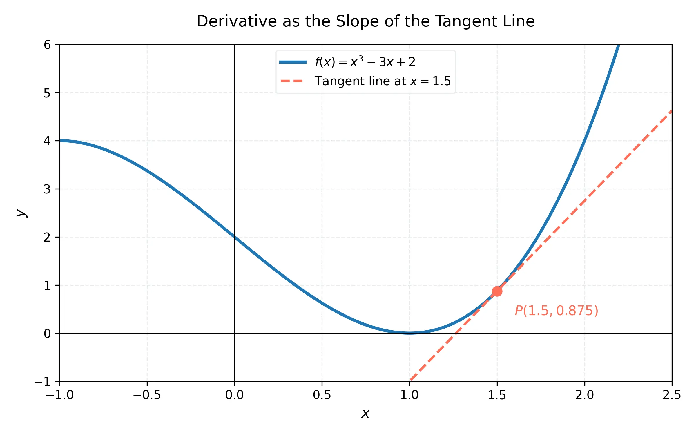

# 微積分 (上) - 第 5 週：基礎微分法則

## 1. 教學目標
- 理解導數的幾何意義與極限定義。
- 掌握常數法則、冪次法則及其證明。
- 熟練運用導數的線性性質（常數倍數、加減法則）。
- 理解自然指數函數 $e^x$ 的導數。
- 掌握高階導數的定義與物理意義。

## 2. 知識點 (KPs) 與理論推導

### KP 5.1: 導數的定義與幾何意義 (Derivative as Tangent)
**理論與推導**：
函數 $f(x)$ 在 $x=a$ 處的導數定義為極限：
$$ f'(a) = \lim_{h \to 0} \frac{f(a+h) - f(a)}{h} $$
或者等價地：
$$ f'(a) = \lim_{x \to a} \frac{f(x) - f(a)}{x-a} $$
幾何上，$f'(a)$ 代表函數 $y=f(x)$ 曲線在點 $(a, f(a))$ 的切線斜率。若極限存在，則稱函數在該點可微 (differentiable)。可微必連續，但連續不一定可微（如 $f(x)=|x|$ 在 $x=0$ 連續但不可微）。



**課堂練習**：
**題目 1**：利用定義求 $f(x) = x^2$ 在 $x=3$ 的導數。
**解答**：
1. 代入定義：$f'(3) = \lim_{h \to 0} \frac{(3+h)^2 - 3^2}{h}$
2. 展開分子：$\lim_{h \to 0} \frac{9 + 6h + h^2 - 9}{h} = \lim_{h \to 0} \frac{6h + h^2}{h}$
3. 約分並取極限：$\lim_{h \to 0} (6 + h) = 6$。

### KP 5.2: 常數函數與冪次法則 (Constant and Power Rules)
**理論與推導**：
1. **常數法則**：若 $f(x) = c$，則 $f'(x) = 0$。
   *證明*：$f'(x) = \lim_{h \to 0} \frac{c - c}{h} = 0$。
2. **冪次法則**：若 $f(x) = x^n$ ($n$ 為實數)，則 $f'(x) = nx^{n-1}$。
   *整數次方證明*：利用二項式展開，
   $(x+h)^n - x^n = [x^n + nx^{n-1}h + \frac{n(n-1)}{2}x^{n-2}h^2 + \dots] - x^n = h[nx^{n-1} + h(\dots)]$。
   除以 $h$ 並令 $h \to 0$，即得 $nx^{n-1}$。

**課堂練習**：
**題目 1**：求 $y = \frac{1}{x^3}$ 的導數。
**解答**：將其寫為 $y = x^{-3}$，根據冪次法則 $y' = -3x^{-4} = -\frac{3}{x^4}$。

**題目 2**：求 $g(x) = \sqrt{x}$ 的導數。
**解答**：將根號寫為指數形式 $g(x) = x^{1/2}$。$g'(x) = \frac{1}{2}x^{-1/2} = \frac{1}{2\sqrt{x}}$。

### KP 5.3: 導數的線性性質 (Linearity: Sum, Difference, Constant Multiple)
**理論與推導**：
- 常數倍數：$\frac{d}{dx}[cf(x)] = c f'(x)$
- 加減法則：$\frac{d}{dx}[f(x) \pm g(x)] = f'(x) \pm g'(x)$
*證明加法法則*：
$\lim_{h \to 0} \frac{[f(x+h)+g(x+h)] - [f(x)+g(x)]}{h} = \lim_{h \to 0} \frac{f(x+h)-f(x)}{h} + \lim_{h \to 0} \frac{g(x+h)-g(x)}{h} = f'(x) + g'(x)$。

**課堂練習**：
**題目 1**：求 $f(x) = 4x^5 - 3x^2 + 7x - 1$ 的導數。
**解答**：
$f'(x) = 4(5x^4) - 3(2x) + 7(1) - 0 = 20x^4 - 6x + 7$。

### KP 5.4: 指數函數的導數 (Derivative of Exponential Functions)
**理論與推導**：
對於 $f(x) = a^x$，其導數為：
$f'(x) = \lim_{h \to 0} \frac{a^{x+h}-a^x}{h} = a^x \lim_{h \to 0} \frac{a^h-1}{h}$。
我們定義尤拉數 $e \approx 2.71828$ 為滿足 $\lim_{h \to 0} \frac{e^h-1}{h} = 1$ 的常數。
因此，自然指數函數的導數為它自己：$\frac{d}{dx}(e^x) = e^x$。

**課堂練習**：
**題目 1**：求 $y = 3e^x + x^e$ 的導數。
**解答**：第一項使用指數函數導數，第二項使用冪次法則（$e$ 為常數）。
$y' = 3e^x + e x^{e-1}$。

### KP 5.5: 高階導數 (Higher-Order Derivatives)
**理論與推導**：
若 $f'(x)$ 可微，其導數稱為第二階導數 $f''(x)$ 或 $\frac{d^2y}{dx^2}$。依此類推可得 $n$ 階導數 $f^{(n)}(x)$。
物理意義：若 $s(t)$ 為位置，則 $v(t) = s'(t)$ 為速度，$a(t) = v'(t) = s''(t)$ 為加速度。

**課堂練習**：
**題目 1**：求 $f(x) = 2x^4 - x^3$ 的第二階及第三階導數。
**解答**：
1. $f'(x) = 8x^3 - 3x^2$
2. $f''(x) = 24x^2 - 6x$
3. $f'''(x) = 48x - 6$

## 3. Python 實驗室 (Python Lab)
使用 SymPy 計算多項式與指數函數的導數。
```python
import sympy as sp

x = sp.Symbol('x')
f = 4*x**5 - 3*x**2 + 7*x - 1

# 一階導數
df = sp.diff(f, x)
print("一階導數:", df)

# 二階導數
d2f = sp.diff(f, x, 2)
print("二階導數:", d2f)

# 指數函數導數
g = 3 * sp.exp(x) + x**sp.E
dg = sp.diff(g, x)
print("指數函數導數:", dg)
```

## 4. 測驗 (Quiz)

### 單選題 (10題)
1. 函數 $f(x) = 5$ 的導數為何？
   (A) $5$  (B) $x$  (C) $0$  (D) $1$
2. $\frac{d}{dx} x^7 =$ ?
   (A) $7x^6$  (B) $x^6$  (C) $\frac{1}{8}x^8$  (D) $7x^7$
3. 若 $f(x) = \frac{1}{x^2}$，則 $f'(x)$ 為何？
   (A) $-\frac{2}{x^3}$  (B) $\frac{2}{x^3}$  (C) $-\frac{1}{x^3}$  (D) $\ln(x)$
4. 函數 $f(x) = e^x$ 的導數為？
   (A) $x e^{x-1}$  (B) $e^x$  (C) $e^{x+1}$  (D) $\ln x$
5. 函數 $f(x) = 3x^2 + 2x$ 的二階導數 $f''(x)$ 為何？
   (A) $6x+2$  (B) $6$  (C) $3$  (D) $0$
6. 在物理中，位置函數的二階導數代表什麼？
   (A) 速度  (B) 距離  (C) 加速度  (D) 時間
7. 若 $f(x) = \sqrt{x}$，則 $f'(4)$ 為何？
   (A) $\frac{1}{2}$  (B) $\frac{1}{4}$  (C) $2$  (D) $4$
8. $y = x^e$，則 $y'$ 為何？
   (A) $e x^{e-1}$  (B) $x^e \ln x$  (C) $e^x$  (D) $e x^e$
9. 已知 $f(x) = |x|$，在 $x=0$ 處，下列何者正確？
   (A) 可微且連續  (B) 連續但不可微  (C) 不連續且不可微  (D) 極限不存在
10. $\frac{d}{dx} (2e^x - 5x)$ 在 $x=0$ 的值為？
   (A) $-3$  (B) $2$  (C) $-5$  (D) $0$

### 多選題 (10題)
11. 關於導數的定義，下列等式何者正確？
    (A) $\lim_{h \to 0} \frac{f(x+h)-f(x)}{h}$
    (B) $\lim_{x \to a} \frac{f(x)-f(a)}{x-a}$
    (C) $\lim_{h \to 0} \frac{f(x)-f(x-h)}{h}$
    (D) $\lim_{h \to 0} \frac{f(x+h)+f(x)}{h}$
12. 若 $f(x)$ 與 $g(x)$ 均可微，下列哪些運算正確？
    (A) $(f+g)' = f' + g'$
    (B) $(cf)' = c f'$
    (C) $(f-g)' = f' - g'$
    (D) $(fg)' = f'g'$
13. 若函數在某點可微，則在該點必定：
    (A) 連續
    (B) 左導數等於右導數
    (C) 二階導數存在
    (D) 函數值不為零
14. 下列哪些函數的導數包含它本身作為因式？
    (A) $e^x$
    (B) $3e^x$
    (C) $x^2$
    (D) $2^x$
15. 關於高階導數，下列哪些正確？
    (A) $n$ 次多項式的第 $n+1$ 階導數恆為零
    (B) $e^x$ 的任意階導數皆為 $e^x$
    (C) 第一階導數的導數即為第二階導數
    (D) 加速度是速度的第一階導數
16. 下列哪些點的導數不存在？
    (A) 尖角處 (Corner)
    (B) 垂直切線處 (Vertical Tangent)
    (C) 不連續點 (Discontinuity)
    (D) 區域極大值處 (Local Max)
17. 若 $f(x) = x^{-1/2}$，則：
    (A) $f'(x) = -\frac{1}{2} x^{-3/2}$
    (B) 這是冪次法則的應用
    (C) 函數在 $x=0$ 處不可微
    (D) $f'(1) = -1/2$
18. 若 $s(t) = t^3 - 3t$，則：
    (A) 速度函數為 $3t^2 - 3$
    (B) 加速度函數為 $6t$
    (C) 在 $t=1$ 時，物體靜止
    (D) 在 $t=0$ 時，加速度為 $0$
19. 計算 $\frac{d}{dx} (\pi^2)$ 的結果為：
    (A) $2\pi$
    (B) $0$
    (C) 因為 $\pi^2$ 是常數
    (D) $\pi$
20. 已知 $f'(a) = 5$，這代表：
    (A) 函數在 $x=a$ 的切線斜率為 $5$
    (B) $x=a$ 處的瞬時變化率為 $5$
    (C) $\lim_{x \to a} \frac{f(x)-f(a)}{x-a} = 5$
    (D) 函數在 $x=a$ 必定連續

### 填充題 (10題)
21. $\frac{d}{dx} (5x^3 - 2x + 1) = \underline{15x^2 - 2}$。
22. 函數 $f(x) = e^x + x^e$ 的導數為 $\underline{e^x + e x^{e-1}}$。
23. 若 $y = x^{100}$，則 $y'(1) = \underline{100}$。
24. $\lim_{h \to 0} \frac{e^h - 1}{h} = \underline{1}$。
25. 已知 $f(x) = x^4$，則 $f'''(x) = \underline{24x}$。
26. 曲線 $y = x^2$ 在 $x=2$ 處的切線斜率為 $\underline{4}$。
27. 若位置 $s(t) = 5t^2 + 2t$，則時間 $t=3$ 時的加速度為 $\underline{10}$。
28. $\frac{d}{dx} (\frac{1}{x^4}) = \underline{-4x^{-5}}$。
29. $\frac{d}{dx} (2\pi^3) = \underline{0}$。
30. 冪次法則中，$\frac{d}{dx} x^n = \underline{nx^{n-1}}$。
