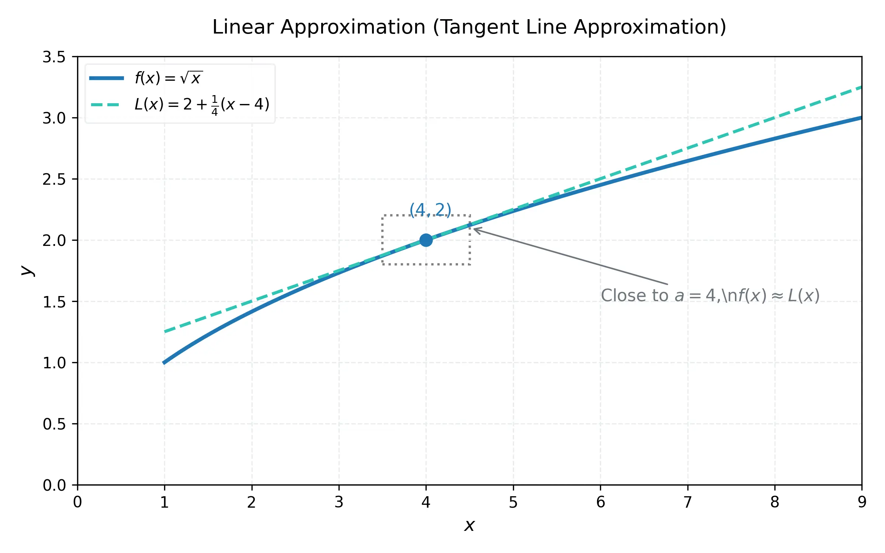

# 微積分 (上) - 第 8 週：相關變率與線性逼近

## 1. 教學目標
- 理解相關變率 (Related Rates) 的概念，並能建立數學模型。
- 掌握解相關變率問題的系統性步驟。
- 學會使用線性逼近 (Linear Approximations) 來估計函數值。
- 了解微分量 (Differentials) 的定義。
- 使用微分量進行誤差估計。

## 2. 知識點 (KPs) 與理論推導

### KP 8.1: 相關變率的概念與建模 (Concept of Related Rates)
**理論與推導**：
在物理或幾何問題中，多個變數可能隨時間 $t$ 變化。這些變數之間通常受到某種幾何或物理定律（如畢氏定理、體積公式）的約束。由於變數是相關的，它們對時間的變化率（導數）也是相關的。這就是「相關變率」。

**課堂練習**：
**題目 1**：一個半徑為 $r$ 的圓，其面積為 $A = \pi r^2$。若半徑隨時間 $t$ 增加，請寫出面積變率 $\frac{dA}{dt}$ 與半徑變率 $\frac{dr}{dt}$ 的關係。
**解答**：
兩邊對時間 $t$ 隱微分：
$\frac{d}{dt}(A) = \frac{d}{dt}(\pi r^2) \implies \frac{dA}{dt} = 2\pi r \frac{dr}{dt}$。

### KP 8.2: 相關變率的解題策略 (Solving Related Rates)
**解題步驟**：
1. **讀題與繪圖**：畫出圖形，標示常數與隨時間變化的變數。
2. **已知與未知**：寫下已知的變率與要求解的變率。
3. **建立方程式**：找出連結這些變數的方程式（如三角函數、相似三角形、體積）。
4. **對 $t$ 微分**：使用連鎖律對時間 $t$ 隱微分。
5. **代入數值**：將特定時刻的數值代入，解出未知的變率。

**課堂練習**：
**題目 1**：一把 5 公尺長的梯子靠在垂直牆上。若梯腳以 1 m/s 的速度滑離牆面，當梯腳距離牆角 3 公尺時，梯頂下滑的速度為何？
**解答**：
1. 設梯腳距牆 $x$，梯頂距地 $y$。$x^2 + y^2 = 5^2$。
2. 已知 $\frac{dx}{dt} = 1$，求 $x=3$ 時的 $\frac{dy}{dt}$。
3. $x=3$ 時，$y = \sqrt{25-9} = 4$。
4. 對 $t$ 微分：$2x \frac{dx}{dt} + 2y \frac{dy}{dt} = 0 \implies x \frac{dx}{dt} + y \frac{dy}{dt} = 0$。
5. 代入數值：$3(1) + 4 \frac{dy}{dt} = 0 \implies \frac{dy}{dt} = -0.75$ m/s。下滑速度為 0.75 m/s。

### KP 8.3: 線性逼近與切線逼近 (Linear Approximations)
**理論與推導**：
在點 $x=a$ 附近，函數曲線可以用其切線來近似。切線方程式為 $y = f(a) + f'(a)(x-a)$。
因此，線性逼近公式為：
$$ L(x) = f(a) + f'(a)(x-a) $$
當 $x$ 非常接近 $a$ 時，$f(x) \approx L(x)$。



**課堂練習**：
**題目 1**：利用線性逼近估計 $\sqrt{4.1}$。
**解答**：
取 $f(x) = \sqrt{x}$，$a = 4$。
$f(a) = 2$。$f'(x) = \frac{1}{2\sqrt{x}} \implies f'(4) = \frac{1}{4} = 0.25$。
線性逼近 $L(x) = 2 + 0.25(x-4)$。
當 $x=4.1$ 時，$L(4.1) = 2 + 0.25(0.1) = 2.025$。

### KP 8.4: 微分量 (Differentials)
**理論與推導**：
設 $y = f(x)$。自變數 $x$ 的變化量記為 $\Delta x$，我們定義微分量 $dx = \Delta x$。
應變數 $y$ 的實際變化量為 $\Delta y = f(x+\Delta x) - f(x)$。
我們定義 $y$ 的微分量 $dy$ 為沿著切線的變化量：
$$ dy = f'(x) dx $$
當 $\Delta x$ 很小時，$\Delta y \approx dy$。

**課堂練習**：
**題目 1**：已知 $y = x^3$，求 $x=2$ 且 $dx=0.1$ 時的 $dy$。
**解答**：
$dy = 3x^2 dx$。
代入得 $dy = 3(2^2)(0.1) = 12(0.1) = 1.2$。

### KP 8.5: 誤差估計 (Error Estimation)
**理論與推導**：
利用微分量可以估計測量誤差。若 $x$ 的測量誤差為 $dx$，則計算結果 $y$ 的傳播誤差為 $dy = f'(x)dx$。
相對誤差為 $\frac{dy}{y}$，百分比誤差為 $\frac{dy}{y} \times 100\%$。

**課堂練習**：
**題目 1**：測量正方體的邊長為 10 cm，最大誤差為 $\pm 0.1$ cm。利用微分量估計體積的最大百分比誤差。
**解答**：
體積 $V = x^3$，則 $dV = 3x^2 dx$。
相對誤差 $\frac{dV}{V} = \frac{3x^2 dx}{x^3} = 3 \frac{dx}{x}$。
代入：$3 (\frac{0.1}{10}) = 3(0.01) = 0.03$。
最大百分比誤差為 $3\%$。

## 3. Python 實驗室 (Python Lab)
使用 Python 繪製函數及其切線逼近。
```python
import numpy as np
import matplotlib.pyplot as plt

def f(x):
    return np.sqrt(x)

def L(x, a):
    # f(a) = sqrt(a), f'(a) = 1/(2*sqrt(a))
    return np.sqrt(a) + (1/(2*np.sqrt(a))) * (x - a)

x_vals = np.linspace(2, 6, 100)
y_vals = f(x_vals)
L_vals = L(x_vals, a=4)

plt.plot(x_vals, y_vals, label='f(x) = sqrt(x)')
plt.plot(x_vals, L_vals, '--', label='Linear Approx L(x) at x=4')
plt.scatter([4], [2], color='red') # 切點
plt.legend()
plt.title('Linear Approximation')
# plt.show() # 此處不執行，供參考
```

## 4. 測驗 (Quiz)

### 單選題 (10題)
1. 在線性逼近 $L(x) = f(a) + f'(a)(x-a)$ 中，$f'(a)$ 代表什麼？
   (A) 函數值  (B) 切線斜率  (C) 截距  (D) 曲率
2. 若 $y = x^2$，則微分量 $dy =$ ?
   (A) $2x$  (B) $2x \Delta x$  (C) $2x dx$  (D) $x^2 dx$
3. 球的體積 $V = \frac{4}{3}\pi r^3$，若 $r$ 隨時間改變，則 $\frac{dV}{dt} =$ ?
   (A) $4\pi r^2$  (B) $4\pi r^2 \frac{dr}{dt}$  (C) $\frac{4}{3}\pi r^2 \frac{dr}{dt}$  (D) $r^3 \frac{dr}{dt}$
4. 利用 $y=x^2$ 於 $x=3$ 的線性逼近來估計 $3.01^2$，結果為？
   (A) $9$  (B) $9.06$  (C) $9.01$  (D) $9.1$
5. 當 $\Delta x$ 極小時，$\Delta y$ 與 $dy$ 的關係是？
   (A) $\Delta y = dy$  (B) $\Delta y \approx dy$  (C) $\Delta y > dy$  (D) 無關
6. 相關變率問題中，必須對哪一個變數隱微分？
   (A) $x$  (B) $y$  (C) 時間 $t$  (D) 常數 $C$
7. 若正方形面積 $A = x^2$，邊長增加率 $\frac{dx}{dt} = 2$，當 $x=5$ 時 $\frac{dA}{dt}$ 為何？
   (A) 10  (B) 20  (C) 25  (D) 50
8. 測量半徑 $r$ 誤差為 $dr$，則圓面積 $A = \pi r^2$ 的相對誤差 $\frac{dA}{A}$ 為何？
   (A) $2dr$  (B) $2 \frac{dr}{r}$  (C) $\pi dr$  (D) $\frac{dr}{r}$
9. 已知微分量 $dy = \cos x \, dx$，則原函數可能為？
   (A) $\cos x$  (B) $-\sin x$  (C) $\sin x$  (D) $\tan x$
10. 對 $y = \sqrt{x}$ 於 $x=1$ 取線性逼近估計 $\sqrt{1.02}$，得值為？
    (A) $1.01$  (B) $1.02$  (C) $1.005$  (D) $1.04$

### 多選題 (10題)
11. 關於線性逼近 $L(x)$，下列哪些正確？
    (A) 其圖形是一條直線
    (B) $L(a) = f(a)$
    (C) 當 $x$ 遠離 $a$ 時，逼近通常不準確
    (D) $L(x)$ 是 $f(x)$ 曲線的切線
12. 關於微分量，下列哪些正確？
    (A) $dx$ 與 $\Delta x$ 相同
    (B) $dy = f'(x)dx$
    (C) $dy$ 代表沿著切線的垂直變化量
    (D) $\Delta y$ 是沿著曲線的實際變化量
13. 解決相關變率問題時，下列哪些步驟是必要的？
    (A) 找出所有變數的關係式
    (B) 先代入特定數值，再對時間 $t$ 微分
    (C) 對時間 $t$ 微分時需要使用連鎖律
    (D) 確認各變數是增加還是減少（正負號）
14. 若梯子沿牆滑下，梯腳以 $\frac{dx}{dt} > 0$ 遠離牆，則梯頂高度 $y$ 會有什麼變化？
    (A) $\frac{dy}{dt} < 0$
    (B) $y$ 逐漸減小
    (C) $x^2 + y^2 = L^2$ (常數)
    (D) $\frac{dy}{dt} = 0$
15. 利用線性逼近來估計時，誤差大小取決於哪些因素？
    (A) $x$ 與展開點 $a$ 的距離
    (B) 函數的二階導數（彎曲程度）
    (C) 函數的值 $f(a)$ 本身
    (D) $f'(a)$ 的正負號
16. 下列哪些公式在計算相對誤差時是正確的？
    (A) 若 $V = x^3$，則 $\frac{dV}{V} = 3 \frac{dx}{x}$
    (B) 若 $A = \pi r^2$，則 $\frac{dA}{A} = 2 \frac{dr}{r}$
    (C) 若 $y = \sqrt{x}$，則 $\frac{dy}{y} = \frac{1}{2} \frac{dx}{x}$
    (D) 相對誤差等同於微分量 $dy$
17. 已知直角三角形兩股 $x, y$ 都在變，斜邊 $z$ 也變。哪些關係成立？
    (A) $x^2 + y^2 = z^2$
    (B) $2x\frac{dx}{dt} + 2y\frac{dy}{dt} = 2z\frac{dz}{dt}$
    (C) $z = x+y$
    (D) 若 $x,y$ 增加，則 $z$ 必增加
18. 對於估計值 $\Delta y \approx dy$，何時估計最好？
    (A) 當 $dx$ 很小
    (B) 當 $dx$ 很大
    (C) 當曲線在此區間接近直線
    (D) 當 $f'(x) = 0$ 且不變時
19. 設 $y = e^x$，在 $x=0$ 處的線性逼近：
    (A) $f(0) = 1$
    (B) $f'(0) = 1$
    (C) $L(x) = 1 + x$
    (D) 估計 $e^{0.1} \approx 1.1$
20. 計算 $\sin(0.05)$ 的線性逼近（以 $a=0$ 為基準），哪些正確？
    (A) $f(0) = 0$
    (B) $f'(0) = 1$
    (C) $L(x) = x$
    (D) $\sin(0.05) \approx 0.05$

### 填充題 (10題)
21. 切線逼近公式 $L(x) = \underline{\hspace{1cm}}$。
22. $y = x^4$，微分量 $dy = \underline{\hspace{1cm}}$。
23. 半徑變率為 $\frac{dr}{dt}$，則圓面積 $A=\pi r^2$ 變率 $\frac{dA}{dt} = \underline{\hspace{1cm}}$。
24. 利用 $L(x) = 1+x$ 估計 $e^{0.02}$，得值為 $\underline{\hspace{1cm}}$。
25. 體積 $V=x^3$，邊長測量誤差為 $1\%$ ($\frac{dx}{x}=0.01$)，則體積最大相對誤差為 $\underline{\hspace{1cm}}$。
26. 梯子問題中，若 $x \frac{dx}{dt} + y \frac{dy}{dt} = 0$，當 $x=y$ 且 $\frac{dx}{dt}=2$ 時，$\frac{dy}{dt} = \underline{\hspace{1cm}}$。
27. 若 $y = \sin x$，$dy = \underline{\hspace{1cm}}$。
28. 當 $x \approx 0$ 時，$\sin x \approx \underline{\hspace{1cm}}$。
29. 微分量中，$\Delta x$ 與 $dx$ 的關係為 $\underline{\hspace{1cm}}$。
30. 直角坐標中，點到原點距離平方 $D^2 = x^2 + y^2$，對時間微分得 $2D\frac{dD}{dt} = \underline{\hspace{1cm}}$。
