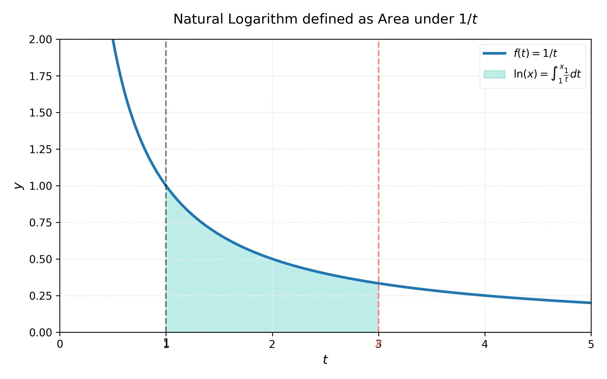

# 課程：微積分中 - 第 1 週 - 積分複習與對數/指數函數

本文件包含了第 1 週「積分複習與對數/指數函數」的完整教學大綱、實作指南以及練習題庫。本週重點在於回顧基本積分概念，並深入探討超越函數（對數與指數函數）的定義、導函數與積分性質。
本週教學內容對應 **Stewart Calculus Chapter 6** 的核心部分。

---

## 一、 單元講解 (Lecture) - 總計 100 分鐘

### 1. 反函數與其導函數 (20 min) (KP1.1)
*   **課本對應**：Stewart Calculus Section 6.1.
*   **概念講解**：
    若 $f$ 是在區間 $I$ 上的單調函數（遞增或遞減），則 $f$ 具備反函數 $f^{-1}$。
    **反函數求導定理**：若 $f$ 是可微函數且 $f'(f^{-1}(a)) \neq 0$，則其反函數在 $a$ 處亦可微，且：
    $$(f^{-1})'(a) = \frac{1}{f'(f^{-1}(a))}$$
    這個公式的幾何意義是：原函數在點 $(x, y)$ 的切線斜率與反函數在點 $(y, x)$ 的切線斜率互為倒數。
*   **練習題與解答**：
    *   **練習題 1.1.1**：已知 $f(x) = x^3 + x + 1$，求 $(f^{-1})'(3)$。
    *   **解答**：
        1. 令 $y = f(x) = 3$，即 $x^3 + x + 1 = 3 \implies x^3 + x - 2 = 0$。
        2. 觀察可知 $x = 1$ 為一解（且因 $f'(x) = 3x^2 + 1 > 0$，函數嚴格遞增，解唯一）。故 $f(1) = 3$，即 $f^{-1}(3) = 1$。
        3. 計算 $f'(x) = 3x^2 + 1$，則 $f'(1) = 3(1)^2 + 1 = 4$。
        4. 根據公式：$(f^{-1})'(3) = \frac{1}{f'(1)} = \frac{1}{4}$。

---

### 2. 自然對數函數 $\ln x$ (20 min) (KP1.2)
*   **課本對應**：Stewart Calculus Section 6.3, 6.4.
*   **概念講解**：
    在微積分中，自然對數定義為積分：
    $$\ln x = \int_1^x \frac{1}{t} dt, \quad x > 0$$
    根據微積分基本定理，$\frac{d}{dx}(\ln x) = \frac{1}{x}$。
    配合連鎖律：$\frac{d}{dx}(\ln |u|) = \frac{1}{u} \frac{du}{dx}$。
    **積分公式**：$\int \frac{1}{x} dx = \ln |x| + C$。
*   **數學證明**：證明對數律 $\ln(xy) = \ln x + \ln y$。
    *   **證明**：
        令 $f(x) = \ln(ax)$，其中 $a$ 為常數。
        則 $f'(x) = \frac{1}{ax} \cdot a = \frac{1}{x}$。
        這表示 $\ln(ax)$ 與 $\ln x$ 具有相同的導函數，因此它們相差一個常數：
        $$\ln(ax) = \ln x + C$$
        代入 $x = 1$，得 $\ln(a) = \ln(1) + C = 0 + C \implies C = \ln a$。
        故 $\ln(ax) = \ln x + \ln a$。令 $a = y$ 即得證。
*   **練習題與解答**：
    *   **練習題 1.2.1**：求 $y = \ln(\sin x)$ 的導函數。
    *   **解答**：
        根據連鎖律：
        $$\frac{dy}{dx} = \frac{1}{\sin x} \cdot \frac{d}{dx}(\sin x) = \frac{\cos x}{\sin x} = \cot x$$

---

### 3. 自然指數函數 $e^x$ (20 min) (KP1.3)
*   **課本對應**：Stewart Calculus Section 6.2.
*   **概念講解**：
    自然指數函數 $f(x) = e^x$ 是 $\ln x$ 的反函數。
    其最重要的性質為：$\frac{d}{dx}(e^x) = e^x$。
    配合連鎖律：$\frac{d}{dx}(e^u) = e^u \frac{du}{dx}$。
    **積分公式**：$\int e^x dx = e^x + C$。

    下列圖形展示了 $y=e^x$ 與 $y=\ln x$ 的對稱關係：
    

*   **練習題與解答**：
    *   **練習題 1.3.1**：計算積分 $\int x e^{x^2} dx$。
    *   **解答**：
        1. 使用代換法，令 $u = x^2$，則 $du = 2x dx \implies x dx = \frac{1}{2} du$。
        2. 原式 $= \int e^u \cdot \frac{1}{2} du = \frac{1}{2} e^u + C$。
        3. 代回 $x$：$\frac{1}{2} e^{x^2} + C$。

---

### 4. 一般指數與對數底數 (20 min) (KP1.4)
*   **課本對應**：Stewart Calculus Section 6.4*.
*   **概念講解**：
    對於任意底數 $a > 0, a \neq 1$：
    1.  **定義**：$a^x = e^{x \ln a}$。
    2.  **導函數**：$\frac{d}{dx}(a^x) = a^x \ln a$。
    3.  **對數**：$\log_a x = \frac{\ln x}{\ln a}$，導函數為 $\frac{d}{dx}(\log_a x) = \frac{1}{x \ln a}$。
*   **練習題與解答**：
    *   **練習題 1.4.1**：求 $y = 10^{x^2}$ 的導函數。
    *   **解答**：
        使用連鎖律與一般指數求導公式：
        $$\frac{dy}{dx} = 10^{x^2} \ln 10 \cdot \frac{d}{dx}(x^2) = 2x \cdot 10^{x^2} \ln 10$$

---

### 5. 指數增長與衰減 (20 min) (KP1.5)
*   **課本對應**：Stewart Calculus Section 6.5.
*   **概念講解**：
    若一個量的變化率與該量本身成正比，即 $\frac{dy}{dt} = ky$，則該量的模型為：
    $$y(t) = y(0)e^{kt}$$
    其中 $k > 0$ 為增長常數，$k < 0$ 為衰減常數。
    常見應用：人口增長、放射性元素半衰期、複利計算。
*   **練習題與解答**：
    *   **練習題 1.5.1**：某放射性物質的半衰期為 100 年。若初始質量為 50 克，求 300 年後剩餘的質量。
    *   **解答**：
        1. 衰減模型 $y(t) = 50 e^{kt}$。
        2. 由半衰期知 $y(100) = 50 e^{100k} = 25 \implies e^{100k} = 1/2 \implies 100k = \ln(1/2) = -\ln 2 \implies k = -\frac{\ln 2}{100}$。
        3. 求 $y(300)$：
           $$y(300) = 50 e^{300 \cdot (-\frac{\ln 2}{100})} = 50 e^{-3\ln 2} = 50 \cdot (e^{\ln 2})^{-3} = 50 \cdot 2^{-3} = 50/8 = 6.25 \text{ 克}$$

---

## 二、 動手實作 (Lab) - 總計 50 分鐘

### 實作一：使用 SymPy 驗證求導與積分 (25 min)
```python
import sympy as sp

x = sp.Symbol('x')
a = sp.Symbol('a', positive=True)

# 1. 驗證自然對數求導
print(f"diff(ln(x)): {sp.diff(sp.log(x), x)}")

# 2. 驗證一般指數求導
print(f"diff(a**x): {sp.diff(a**x, x)}")

# 3. 求解複合積分
f = x * sp.exp(x**2)
integral = sp.integrate(f, x)
print(f"Integral of x*e^(x^2): {integral}")
```

### 實作二：數值模擬指數衰減 (25 min)
```python
import numpy as np
import matplotlib.pyplot as plt

t = np.linspace(0, 500, 100)
y0 = 50
half_life = 100
k = -np.log(2) / half_life
y = y0 * np.exp(k * t)

plt.plot(t, y)
plt.title("Radioactive Decay (Half-life = 100 years)")
plt.xlabel("Time (years)")
plt.ylabel("Mass (g)")
plt.grid(True)
plt.show()
```

---

## 三、 本週知識點回顧 (KP)
- **KP1.1**: 反函數求導公式 $(f^{-1})'(a) = 1/f'(f^{-1}(a))$。
- **KP1.2**: $\ln x$ 的積分定義與 $\frac{d}{dx}(\ln x) = 1/x$。
- **KP1.3**: $e^x$ 的性質與 $\frac{d}{dx}(e^x) = e^x$。
- **KP1.4**: 一般底數 $a^x$ 與 $\log_a x$ 的轉換與求導。
- **KP1.5**: 微分方程 $\frac{dy}{dt} = ky$ 的解與應用。

---

## 四、 課後測驗題庫 (Quiz) - 30 分鐘

### 1. 單選題 (Single Choice) - 共 10 題
1. 若 $f(x) = e^{2x}$，則 $f'(x) = $？ (A) $e^{2x}$ (B) $2e^{2x}$ (C) $\frac{1}{2}e^{2x}$ (D) $e^x$
2. $\int \frac{1}{x+1} dx = $？ (A) $\ln|x+1|+C$ (B) $\frac{1}{(x+1)^2}+C$ (C) $e^{x+1}+C$ (D) $x+C$
3. $\ln(e^3) = $？ (A) 1 (B) $e$ (C) 3 (D) $e^3$
4. 函數 $y = \log_{10} x$ 的導函數為？ (A) $1/x$ (B) $1/(x\ln 10)$ (C) $(\ln 10)/x$ (D) $10^x$
5. 若 $\frac{dy}{dt} = 0.5y$ 且 $y(0)=10$，則 $y(2) = $？ (A) $10e$ (B) $10e^2$ (C) $5e$ (D) $10$
6. $(f^{-1})'(y)$ 的公式與下列何者相關？ (A) $f'(x)$ (B) $1/f'(x)$ (C) $f(x)$ (D) $-f'(x)$
7. $e^{\ln 5} = $？ (A) $e$ (B) $\ln 5$ (C) 5 (D) 1
8. $\frac{d}{dx}(2^x) = $？ (A) $x \cdot 2^{x-1}$ (B) $2^x$ (C) $2^x \ln 2$ (D) $2^x / \ln 2$
9. 哪種函數的變化率與自身成正比？ (A) 多項式 (B) 指數 (C) 對數 (D) 三角
10. $\ln 1 = $？ (A) 0 (B) 1 (C) $e$ (D) 無定義

### 2. 多選題 (Multiple Choice) - 共 10 題
11. 下列哪些關於 $\ln x$ 的敘述正確？ (A) 定義域為 $(0, \infty)$ (B) 是 $e^x$ 的反函數 (C) 導函數為 $1/x$ (D) 圖形通過 $(1, 0)$
12. 關於 $y = e^x$，哪些正確？ (A) 值域為 $(0, \infty)$ (B) $\int e^x dx = e^x + C$ (C) 恆大於 0 (D) 是遞增函數
13. 下列哪些是對數律？ (A) $\ln(ab) = \ln a + \ln b$ (B) $\ln(a/b) = \ln a - \ln b$ (C) $\ln(a^b) = b \ln a$ (D) $\ln(a+b) = \ln a \ln b$
14. 若 $y = a^x$ 且 $a > 1$，則： (A) $y' > 0$ (B) 圖形通過 $(0, 1)$ (C) $\lim_{x \to \infty} y = \infty$ (D) $\lim_{x \to -\infty} y = 0$
15. 指數衰減模型 $y = y_0 e^{kt}$ 中，哪些敘述正確？ (A) $k < 0$ (B) $y$ 隨時間減少 (C) 半衰期與 $y_0$ 無關 (D) $y$ 永遠不會變成 0
16. 反函數存在的前提是函數必須： (A) 連續 (B) 一對一 (C) 單調 (D) 可微
17. 下列哪些導數正確？ (A) $(e^{3x})' = 3e^{3x}$ (B) $(\ln x^2)' = 2/x$ (C) $(3^x)' = 3^x \ln 3$ (D) $(\log_2 x)' = 1/(x\ln 2)$
18. 積分 $\int e^{2x} dx$ 的結果可能包含： (A) $1/2$ (B) $e^{2x}$ (C) $C$ (D) $\ln 2$
19. 關於數 $e$，哪些正確？ (A) 是無理數 (B) 約等於 2.718 (C) $\ln e = 1$ (D) $\lim_{n \to \infty} (1+1/n)^n = e$
20. 哪些是超越函數？ (A) $e^x$ (B) $\ln x$ (C) $x^2$ (D) $\sin x$

### 3. 填充題 (Fill-in-the-blank) - 共 10 題
21. $\frac{d}{dx}(\ln(x^2+1)) = $ __________。
22. 若 $f(x) = x^3$，則 $(f^{-1})'(8) = $ __________。
23. $\int_0^1 e^x dx = $ __________。
24. 若 $\ln x = 2$，則 $x = $ __________。
25. 放射性物質剩餘量 $y = y_0 e^{kt}$，若 $k=-0.1$，其衰減百分率約為每單位時間 __________%。
26. $\log_e x$ 通常記作 __________。
27. $\frac{d}{dx}(x e^x) = $ __________。
28. $\int \frac{1}{2x} dx = $ __________。
29. 若 $y = 5^x$，則 $dy/dx = $ __________。
30. $e^0 = $ __________。

---

## 五、 Q 矩陣 (Q-matrix)
| 題號 | KP1.1 | KP1.2 | KP1.3 | KP1.4 | KP1.5 |
|---|---|---|---|---|---|
| Q1-Q10 | 6 | 2 | 1,3,7 | 4,8,10 | 5,9 |
| Q11-Q20| 16 | 11,13 | 12,19 | 14,17 | 15 | (Q20: 1.2, 1.3)
| Q21-Q30| 22 | 21,26,28 | 23,27,30 | 24,29 | 25 |
