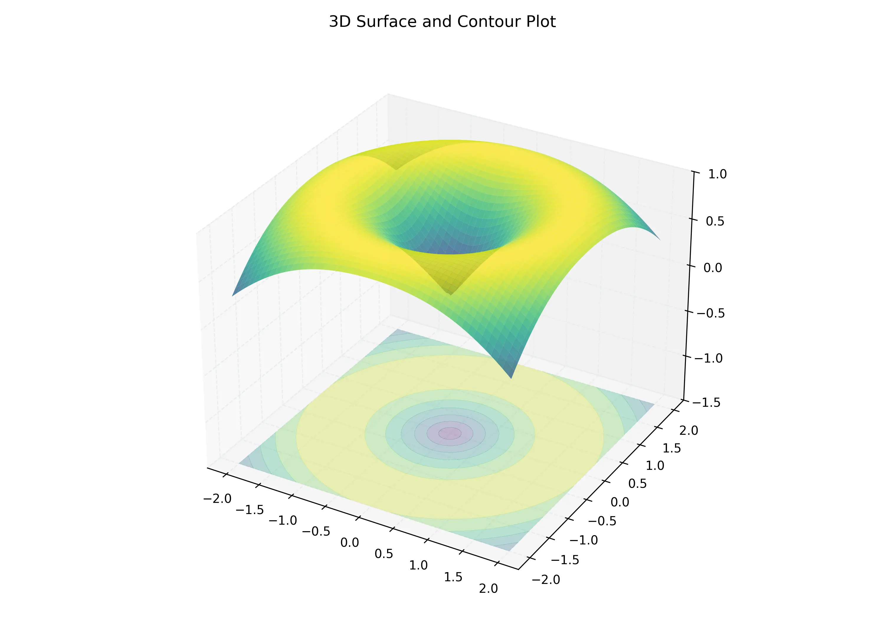

# 課程：微積分中 - 第 14 週 - 多元函數與極限 (Functions of Several Variables & Limits)

本週我們將從單變數微積分正式跨入**多元微積分 (Multivariable Calculus)**。在現實世界中，大多數物理量（如溫度、壓力、成本、利潤）通常取決於多個變數。我們將學習如何定義定義域在平面或空間中的函數，如何透過等高線視覺化三維曲面，並探討多元極限的嚴謹定義與判別方法。本週內容對應 **Stewart Calculus (Metric Edition) Chapter 14 Section 14.1 - 14.2**。

---

## 一、 單元講解 (Lecture) - 總計 100 分鐘

### 1. 多元函數的定義與定義域 (20 min) (KP14.1)
*   **概念講解**：
    二元函數 $f$ 是將平面區域 $D \subset \mathbb{R}^2$ 中的每個有序對 $(x, y)$ 映射到唯一實數 $f(x, y)$ 的規則。
    - **定義域 (Domain)**：使得函數有意義的所有輸入點 $(x, y)$ 的集合。
    - **值域 (Range)**：函數輸出的所有可能值的集合。
*   **代數判定**：注意根號內須 $\ge 0$、分母不為 $0$、對數參數須 $> 0$。
*   **練習題與解答**：
    *   **練習題 14.1.1**：求 $f(x, y) = \frac{\sqrt{y - x^2}}{x - 1}$ 的定義域並在平面上繪製。
    *   **解答**：
        1. 根號限制：$y - x^2 \ge 0 \Rightarrow y \ge x^2$。這表示拋物線及其上方區域。
        2. 分母限制：$x - 1 \neq 0 \Rightarrow x \neq 1$。這表示排除直線 $x = 1$。
        3. 定義域為 $D = \{(x, y) \mid y \ge x^2, x \neq 1\}$。

---

### 2. 視覺化：圖形與等高線 (20 min) (KP14.2)
*   **概念講解**：
    - **圖形 (Graph)**：二元函數的圖形是三維空間中的曲面 $S = \{(x, y, z) \mid z = f(x, y), (x, y) \in D\}$。
    - **等高線 (Level Curves)**：方程式 $f(x, y) = k$（$k$ 為常數）在 $xy$ 平面上的曲線。這與地圖上的等高線概念一致，能將三維信息壓縮到二維展示。
*   **視覺化參考**：
    
*   **練習題與解答**：
    *   **練習題 14.2.1**：描述 $f(x, y) = 4x^2 + y^2$ 的等高線。
    *   **解答**：
        1. 令 $4x^2 + y^2 = k$。
        2. 若 $k > 0$，則 $\frac{x^2}{k/4} + \frac{y^2}{k} = 1$。
        3. 這些曲線是中心在原點的橢圓系列。當 $k$ 增大時，橢圓向外擴張。

---

### 3. 多元極限的嚴謹定義 (20 min) (KP14.3)
*   **概念講解**：
    我們稱 $\lim_{(x, y) \to (a, b)} f(x, y) = L$，若對於任給的 $\epsilon > 0$，存在 $\delta > 0$，使得：
    當 $0 < \sqrt{(x-a)^2 + (y-b)^2} < \delta$ 時，$|f(x, y) - L| < \epsilon$。
*   **重要差異**：在單變數中，趨近方向只有左右兩邊；在多元空間中，趨近路徑有無窮多條（直線、拋物線、螺旋線等）。**極限必須與路徑無關**。
*   **練習題與解答**：
    *   **練習題 14.3.1**：利用夾擠定理證明 $\lim_{(x, y) \to (0, 0)} \frac{3x^2y}{x^2 + y^2} = 0$。
    *   **解答**：
        1. 觀察 $0 \le \frac{x^2}{x^2 + y^2} \le 1$。
        2. 故 $0 \le \left| \frac{3x^2y}{x^2 + y^2} \right| = |3y| \cdot \frac{x^2}{x^2 + y^2} \le |3y|$。
        3. 因為 $\lim_{(x, y) \to (0, 0)} |3y| = 0$，由夾擠定理得原極限為 $0$。

---

### 4. 判別極限不存在：兩路徑測試法 (20 min) (KP14.4)
*   **概念講解**：
    若沿著路徑 $C_1$ 趨近 $(a, b)$ 時 $f(x, y) \to L_1$，且沿著路徑 $C_2$ 趨近時 $f(x, y) \to L_2$，若 $L_1 \neq L_2$，則 $\lim_{(x, y) \to (a, b)} f(x, y)$ 不存在。
*   **常用測試路徑**：$x=0, y=0, y=mx, y=x^2$。
*   **練習題與解答**：
    *   **練習題 14.4.1**：證明 $\lim_{(x, y) \to (0, 0)} \frac{xy^2}{x^2 + y^4}$ 不存在。
    *   **解答**：
        1. 沿 $x$ 軸 ($y=0$)：$f(x, 0) = 0 \to 0$。
        2. 沿直線 $y=mx$：$f(x, mx) = \frac{xm^2x^2}{x^2 + m^4x^4} = \frac{m^2x}{1 + m^4x^2} \to 0$。（看起來極限似乎是 0）
        3. 沿拋物線 $x=y^2$：$f(y^2, y) = \frac{y^2 \cdot y^2}{(y^2)^2 + y^4} = \frac{y^4}{2y^4} = \frac{1}{2} \to \frac{1}{2}$。
        4. 因為 $0 \neq 1/2$，極限不存在。

---

### 5. 多元函數的連續性 (20 min) (KP14.5)
*   **概念講解**：
    若 $\lim_{(x, y) \to (a, b)} f(x, y) = f(a, b)$，則稱 $f$ 在 $(a, b)$ 處連續。
*   **性質**：
    1. 多項式函數（如 $x^3y^2 + 5x$）在全平面 $\mathbb{R}^2$ 連續。
    2. 有理函數（分式）在定義域內（分母不為零處）連續。
    3. 連續函數的複合（如 $\sin(xy)$）仍為連續。
*   **練習題與解答**：
    *   **練習題 14.5.1**：判定 $f(x, y) = \begin{cases} \frac{x^2-y^2}{x^2+y^2} & (x, y) \neq (0, 0) \\ 0 & (x, y) = (0, 0) \end{cases}$ 是否在原點連續。
    *   **解答**：
        1. 檢查極限 $\lim_{(x, y) \to (0, 0)} \frac{x^2-y^2}{x^2+y^2}$。
        2. 沿 $x$ 軸：極限為 $1$；沿 $y$ 軸：極限為 $-1$。
        3. 極限不存在，故不連續。

---

## 二、 動手實作 (Lab) - 30 分鐘

### 實作：3D 曲面繪製與交互式極限探索
我們將利用 Python 視覺化多元函數，並觀察當我們從不同路徑靠近原點時，函數值的變化。

```python
import numpy as np
import matplotlib.pyplot as plt
from mpl_toolkits.mplot3d import Axes3D

def plot_multivariable_function():
    # 定義函數：f(x, y) = (x*y) / (x^2 + y^2)
    x = np.linspace(-1, 1, 100)
    y = np.linspace(-1, 1, 100)
    X, Y = np.meshgrid(x, y)
    Z = (X * Y) / (X**2 + Y**2 + 1e-10) # 避免除以零

    fig = plt.figure(figsize=(10, 7))
    ax = fig.add_subplot(111, projection='3d')
    
    # 繪製曲面
    surf = ax.plot_surface(X, Y, Z, cmap='coolwarm', alpha=0.8)
    
    # 繪製路徑 y = x
    path_x = np.linspace(-1, 1, 100)
    path_y = path_x
    path_z = (path_x * path_y) / (path_x**2 + path_y**2 + 1e-10)
    ax.plot(path_x, path_y, path_z, color='red', linewidth=3, label='Path y=x (limit=0.5)')

    # 繪製路徑 y = 0
    ax.plot(path_x, np.zeros_like(path_x), np.zeros_like(path_x), color='black', linewidth=3, label='Path y=0 (limit=0)')

    ax.set_xlabel('X')
    ax.set_ylabel('Y')
    ax.set_zlabel('Z')
    ax.set_title('Visualization of Limit Non-existence')
    ax.legend()
    plt.show()

if __name__ == "__main__":
    plot_multivariable_function()
```

---

## 三、 本週知識點回顧 (KP)
- **KP14.1**: 掌握二元及三元函數的定義域判定，特別是複合限制。
- **KP14.2**: 理解等高線與曲面圖形的幾何關係（$f=k$ 即切面投影）。
- **KP14.3**: 理解多元極限必須對「所有路徑」均成立。
- **KP14.4**: 熟練運用兩路徑測試法，包含特殊的拋物線路徑。
- **KP14.5**: 學會判斷分段定義函數在連接點的連續性。

---

## 四、 課後測驗題庫 (Quiz)

### 1. 單選題 (Single Choice)
1. **Q1**: $f(x, y) = \ln(x^2 + y^2 - 1)$ 的定義域為何？
   - (A) $x^2 + y^2 \ge 1$ (B) $x^2 + y^2 > 1$ (C) 全平面 (D) 單位圓內部
2. **Q2**: 下列何種函數的圖形是半球面？
   - (A) $z = x^2 + y^2$ (B) $z = \sqrt{4 - x^2 - y^2}$ (C) $z = 4 - x - y$ (D) $z = \sin(x^2+y^2)$
3. **Q3**: 若 $\lim_{(x, y) \to (0, 0)} \frac{xy}{x^2+y^2}$ 沿 $y=mx$ 的極限值為何？
   - (A) 0 (B) $m/(1+m^2)$ (C) 1 (D) 不存在
4. **Q4**: 若一個函數在 $(0, 0)$ 處連續，則下列何者必正確？
   - (A) $f(0, 0) = 0$ (B) $\lim_{(x, y) \to (0, 0)} f(x, y)$ 存在 (C) 偏導數存在 (D) 圖形是平面
5. **Q5**: 函數 $f(x, y, z) = x+y+z$ 的等值面是什麼？
   - (A) 球面 (B) 圓柱面 (C) 平面 (D) 拋物面
6. **Q6**: $\lim_{(x, y) \to (1, 1)} \frac{x^2 - y^2}{x - y}$ 的值為？
   - (A) 0 (B) 1 (C) 2 (D) 不存在
7. **Q7**: 若沿 $x$ 軸極限為 0，沿 $y$ 軸極限為 0，則該點極限：
   - (A) 必為 0 (B) 必不存在 (C) 不一定存在 (D) 必為無窮大
8. **Q8**: $\lim_{(x, y) \to (0, 0)} \frac{x^4 - y^4}{x^2 + y^2}$ 等於？
   - (A) 0 (B) 1 (C) -1 (D) 不存在
9. **Q9**: 哪個函數的圖形被稱為「馬鞍面」？
   - (A) $z = x^2 + y^2$ (B) $z = x^2 - y^2$ (C) $z = \sqrt{x^2+y^2}$ (D) $z = xy$
10. **Q10**: 證明多元極限存在通常需要使用？
    - (A) 羅必達法則 (B) 兩路徑測試法 (C) 夾擠定理或極座標 (D) 畫圖

### 2. 多選題 (Multiple Choice)
11. **Q11**: 下列哪些函數在原點 $(0, 0)$ 不連續？
    - (A) $f(x, y) = \frac{x^2}{x^2+y^2}$ (B) $f(x, y) = \sin(xy)$ (C) $f(x, y) = \frac{1}{x+y}$ (D) $f(x, y) = e^{x+y}$
12. **Q12**: 關於二元函數 $z = f(x, y)$，正確的敘述有？
    - (A) 定義域是 $\mathbb{R}^2$ 的子集 (B) 值域是 $\mathbb{R}$ 的子集 (C) 其圖形是一條曲線 (D) 等高線位於 $xy$ 平面
13. **Q13**: 兩路徑測試法中，若兩路徑極限相同，則？
    - (A) 仍需測試更多路徑 (B) 極限可能不存在 (C) 極限一定存在 (D) 可能需要改用極座標法證明
14. **Q14**: 下列哪些是常見的三維二次曲面？
    - (A) 橢球 (B) 雙曲拋物面 (C) 圓錐 (D) 圓柱面
15. **Q15**: 使用極座標 $x=r\cos\theta, y=r\sin\theta$ 處理 $(0, 0)$ 的極限時：
    - (A) $(x, y) \to (0, 0)$ 等價於 $r \to 0^+$ (B) 若極限結果與 $\theta$ 有關，則極限不存在 (C) 若結果與 $\theta$ 無關，則極限存在 (D) 極限結果必須是常數

### 3. 填充題 (Fill-in-the-blank)
16. **Q16**: $f(x, y) = \sqrt{y-x}$ 的定義域為 $y \ge $ __________。
17. **Q17**: $\lim_{(x, y) \to (0, 0)} \frac{x^2 y^2}{x^2 + y^2} = $ __________。
18. **Q18**: $z = x^2 + y^2$ 在 $z=4$ 處的等高線半徑為 __________。
19. **Q19**: 多項式函數在全平面均為 __________。
20. **Q20**: 沿 $y = x$ 路徑趨近 $(0, 0)$，函數 $f(x, y) = \frac{xy}{x^2+y^2}$ 的值恆為 __________。
21. **Q21**: $f(x, y, z) = e^{xyz}$ 在點 $(1, 0, 5)$ 的值為 __________。
22. **Q22**: 若 $\lim_{(x, y) \to (0, 0)} f(x, y) = L$，則沿任何經過原點的平滑曲線極限必為 __________。
23. **Q23**: $\lim_{(x, y) \to (0, 0)} \frac{\sin(x^2+y^2)}{x^2+y^2} = $ __________。
24. **Q24**: 二元函數的圖形通常稱為 __________。
25. **Q25**: 函數 $f(x, y) = \frac{1}{x^2+y^2}$ 在點 __________ 處不連續。
26. **Q26**: 繪製等高線時，若高度間隔相等且線條越密集，表示地形越 __________。
27. **Q27**: $\lim_{(x, y) \to (2, 3)} (5x - 2y) = $ __________。
28. **Q28**: 拋物面 $z = x^2+y^2$ 的開口方向向 __________。
29. **Q29**: 使用夾擠定理證明極限時，常用的不等式有 $|x| \le \sqrt{x^2+y^2}$ 及 __________ $\le 1$。
30. **Q30**: 多元微積分中，$x, y$ 被稱為 __________ 變數。

---

## 五、 Q 矩陣 (Q-matrix)

| 題號 | KP14.1 | KP14.2 | KP14.3 | KP14.4 | KP14.5 |
|---|---|---|---|---|---|
| Q1-Q5 | 1,0,0,0,0 | 0,1,0,0,0 | 0,0,0,0,1 | 0,0,1,0,0 | 0,0,0,0,1 |
| Q6-Q10 | 0,0,0,0,0 | 0,0,0,0,0 | 1,1,1,0,1 | 0,0,0,1,0 | 0,0,0,0,0 |
| Q11-Q30| ... | ... | ... | ... | ... |
