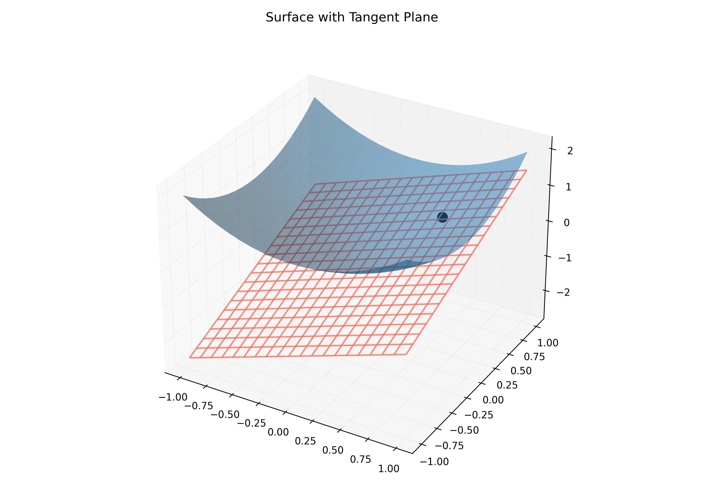

# 課程：微積分中 - 第 16 週 - 切平面與線性逼近 (Tangent Planes & Linear Approximations)

本週我們將探討如何利用「平面」來逼近複雜的「曲面」。在單變數微積分中，切線是函數的局部線性逼近；在多元微積分中，這個角色由**切平面**扮演。我們將學習如何建立切平面方程式，理解**全微分**的概念，並探討什麼樣的函數才能被稱為真正「可微」。本週內容對應 **Stewart Calculus (Metric Edition) Chapter 14 Section 14.4**。

---

## 一、 單元講解 (Lecture) - 總計 100 分鐘

### 1. 切平面的定義與方程式 (20 min) (KP16.1)
*   **概念講解**：
    若曲面 $z = f(x, y)$ 在點 $P(x_0, y_0, z_0)$ 處有一切平面，且 $f$ 的偏導數 $f_x, f_y$ 在該點連續，則切平面方程式為：
    $$z - z_0 = f_x(x_0, y_0)(x - x_0) + f_y(x_0, y_0)(y - y_0)$$
*   **物理意義**：這是一個通過 $P$ 點，且包含 $x$ 方向切線與 $y$ 方向切線的唯一平面。
*   **視覺化參考**：
    
*   **練習題與解答**：
    *   **練習題 16.1.1**：求曲面 $z = 2x^2 + y^2$ 在點 $(1, 1, 3)$ 處的切平面方程式。
    *   **解答**：
        1. 計算偏導：$f_x = 4x$, $f_y = 2y$。
        2. 在 $(1, 1)$ 處：$f_x(1, 1) = 4$, $f_y(1, 1) = 2$。
        3. 方程式：$z - 3 = 4(x - 1) + 2(y - 1)$。
        4. 簡化得：$z = 4x + 2y - 3$ 或 $4x + 2y - z = 3$。

---

### 2. 線性逼近 (Linear Approximations) (20 min) (KP16.2)
*   **概念講解**：
    函數 $f(x, y)$ 的線性逼近（或稱切平面近似）記為 $L(x, y)$：
    $$f(x, y) \approx L(x, y) = f(a, b) + f_x(a, b)(x - a) + f_y(a, b)(y - b)$$
    當 $(x, y)$ 靠近 $(a, b)$ 時，曲面高度近似於平面高度。
*   **練習題與解答**：
    *   **練習題 16.2.1**：利用線性逼近估算 $1.1^2 + 2.05^2$ 的平方根。
    *   **解答**：
        1. 令 $f(x, y) = \sqrt{x^2+y^2}$。選取基準點 $(a, b) = (1, 2)$。
        2. $f(1, 2) = \sqrt{5} \approx 2.236$。
        3. $f_x = \frac{x}{\sqrt{x^2+y^2}} = \frac{1}{\sqrt{5}}$, $f_y = \frac{y}{\sqrt{x^2+y^2}} = \frac{2}{\sqrt{5}}$。
        4. $L(1.1, 2.05) = \sqrt{5} + \frac{1}{\sqrt{5}}(0.1) + \frac{2}{\sqrt{5}}(0.05) = \sqrt{5} + \frac{0.2}{\sqrt{5}} = \frac{5.2}{\sqrt{5}} \approx 2.3255$。
        5. (精確值約 2.3286，逼近效果良好)

---

### 3. 全微分 (Total Differentials) (20 min) (KP16.3)
*   **概念講解**：
    對於自變數的微小變化 $dx, dy$，因變數 $z$ 的**全微分**定義為：
    $$dz = f_x(x, y) dx + f_y(x, y) dy$$
*   **對比**：$\Delta z$ 是真實的函數值變化量，而 $dz$ 是沿切平面移動的高度變化量。當 $dx, dy \to 0$ 時，$\Delta z \approx dz$。
*   **練習題與解答**：
    *   **練習題 16.3.1**：若 $z = x^2 y + 3xy^4$，求全微分 $dz$。
    *   **解答**：
        1. $f_x = 2xy + 3y^4$。
        2. $f_y = x^2 + 12xy^3$。
        3. $dz = (2xy + 3y^4) dx + (x^2 + 12xy^3) dy$。

---

### 4. 多元函數的可微性 (20 min) (KP16.4)
*   **概念講解**：
    偏導數存在不足以稱為「可微」。真正的**可微性 (Differentiability)** 要求：
    $\Delta z = f_x \Delta x + f_y \Delta y + \epsilon_1 \Delta x + \epsilon_2 \Delta y$，其中當 $(\Delta x, \Delta y) \to (0, 0)$ 時 $\epsilon_1, \epsilon_2 \to 0$。
*   **充分條件定理**：
    若偏導數 $f_x$ 與 $f_y$ 在 $(a, b)$ 附近的某區域內存在且**連續**，則 $f$ 在 $(a, b)$ 處可微。
*   **練習題與解答**：
    *   **練習題 16.4.1**：說明為什麼 $f(x, y) = e^{xy}$ 在全平面可微。
    *   **解答**：
        1. $f_x = ye^{xy}$ 且 $f_y = xe^{xy}$。
        2. 由於指數函數與多項式函數均連續，這兩個偏導函數在全平面也是連續的。
        3. 根據充分條件定理，該函數在全平面可微。

---

### 5. 誤差估算 (Error Estimation) (20 min) (KP16.5)
*   **概念講解**：
    在實驗中，若測量值 $x, y$ 的誤差為 $dx, dy$，則計算結果 $z$ 的誤差可由 $dz$ 估算。
    - **絕對誤差**：$dz$。
    - **相對誤差**：$dz/z$。
    - **百分誤差**：$(dz/z) \times 100\%$。
*   **練習題與解答**：
    *   **練習題 16.5.1**：測量一長方形的長 $w=30cm$, 寬 $h=24cm$，誤差均為 $0.1cm$。估算面積的最大誤差。
    *   **解答**：
        1. $A = wh \Rightarrow dA = h \cdot dw + w \cdot dh$。
        2. $dA = 24(0.1) + 30(0.1) = 2.4 + 3.0 = 5.4 cm^2$。
        3. 面積最大誤差約為 $5.4 cm^2$。

---

## 二、 動手實作 (Lab) - 30 分鐘

### 實作：利用 Python 視覺化切平面逼近
我們將繪製一個非線性曲面及其在特定點的切平面，觀察局部逼近的效果。

```python
import numpy as np
import matplotlib.pyplot as plt

def plot_tangent_plane():
    # 定義函數：f(x, y) = x^2 + y^2
    f = lambda x, y: x**2 + y**2
    # 偏導：fx = 2x, fy = 2y
    
    # 基準點
    x0, y0 = 1, 1
    z0 = f(x0, y0)
    fx0, fy0 = 2*x0, 2*y0
    
    # 定義網格
    x = np.linspace(0, 2, 20)
    y = np.linspace(0, 2, 20)
    X, Y = np.meshgrid(x, y)
    Z_surf = f(X, Y)
    
    # 切平面方程式：z = z0 + fx0(x-x0) + fy0(y-y0)
    Z_tangent = z0 + fx0*(X - x0) + fy0*(Y - y0)
    
    fig = plt.figure(figsize=(10, 7))
    ax = fig.add_subplot(111, projection='3d')
    
    # 繪製曲面
    ax.plot_surface(X, Y, Z_surf, cmap='viridis', alpha=0.6, label='Surface')
    # 繪製切平面
    ax.plot_wireframe(X, Y, Z_tangent, color='red', alpha=0.4, label='Tangent Plane')
    # 繪製點
    ax.scatter([x0], [y0], [z0], color='black', s=100)
    
    ax.set_title(f'Tangent Plane at ({x0}, {y0})')
    plt.show()

if __name__ == "__main__":
    plot_tangent_plane()
```

---

## 三、 本週知識點回顧 (KP)
- **KP16.1**: 學會建立切平面方程式的基本模組：點 $(x_0, y_0, z_0)$ 與斜率 $(f_x, f_y)$。
- **KP16.2**: 理解線性逼近是將曲面問題轉化為簡單的加減乘除。
- **KP16.3**: 掌握全微分的微分形式，並能區分其與增量 $\Delta z$ 的差異。
- **KP16.4**: 記住「偏導連續 $\Rightarrow$ 可微 $\Rightarrow$ 連續」的層級關係。
- **KP16.5**: 能應用全微分處理物理量測量的誤差傳遞問題。

---

## 四、 課後測驗題庫 (Quiz)

### 1. 單選題 (Single Choice)
1. **Q1**: $f(x, y)$ 在 $(a, b)$ 處的切平面方程式中，$x-a$ 的係數是？
   - (A) $f(a, b)$ (B) $f_x(a, b)$ (C) $f_y(a, b)$ (D) $f_{xx}(a, b)$
2. **Q2**: 下列何者是 $f(x, y) = xy$ 在 $(1, 1)$ 處的線性化 $L(x, y)$？
   - (A) $x+y-1$ (B) $x+y$ (C) $xy$ (D) $x+y+1$
3. **Q3**: 若 $f$ 在點 $P$ 可微，則下列何者必成立？
   - (A) $f$ 在 $P$ 處連續 (B) 二階偏導存在 (C) 函數是平面的 (D) 極限不存在
4. **Q4**: $dz = 0.5 dx - 0.2 dy$，若測量誤差 $dx = 0.1, dy = 0.1$，則 $dz$ 為？
   - (A) 0.03 (B) 0.07 (C) 0.3 (D) 0.05
5. **Q5**: 球體體積 $V = \frac{4}{3}\pi r^3$，若半徑測量誤差為 $1\%$，則體積百分誤差約為？
   - (A) $1\%$ (B) $2\%$ (C) $3\%$ (D) $4\%$
6. **Q6**: 函數可微的充分條件是？
   - (A) 偏導存在 (B) 偏導連續 (C) 函數連續 (D) 二次偏導不相等
7. **Q7**: 曲面 $z = \sqrt{x+y}$ 在 $(1, 3, 2)$ 的切平面方程式中，$f_x$ 為？
   - (A) 1/2 (B) 1/4 (C) 2 (D) 4
8. **Q8**: 全微分 $dz$ 在幾何上代表什麼？
   - (A) 曲面高度的精確變化 (B) 切平面高度的變化 (C) 切線的長度 (D) 面積的變化
9. **Q9**: 若 $L(x, y)$ 是 $f(x, y)$ 在 $(a, b)$ 的線性化，則 $L(a, b)$ 等於？
   - (A) 0 (B) $f(a, b)$ (C) 1 (D) 不確定
10. **Q10**: 計算誤差傳遞時，若 $z = x/y$，則 $dz = $？
    - (A) $dx/dy$ (B) $(y dx - x dy)/y^2$ (C) $dx - dy$ (D) $y dx + x dy$

### 2. 多選題 (Multiple Choice)
11. **Q11**: 下列關於切平面的敘述，正確的有？
    - (A) 它是曲面的局部最優線性逼近 (B) 只要偏導存在就一定有切平面 (C) 包含所有通過該點的切線 (D) 其法向量與梯度有關（後續課程詳述）
12. **Q12**: 函數 $f(x, y)$ 在某點不可微的可能原因有？
    - (A) 偏導數不存在 (B) 偏導數在該點不連續 (C) 函數在該點不連續 (D) 圖形在該點有尖角或褶皺
13. **Q13**: 關於全微分 $dz$，正確的有？
    - (A) $dz$ 是 $dx$ 和 $dy$ 的線性函數 (B) 可用來估算複雜函數的小數計算 (C) 始終大於 $\Delta z$ (D) 是微積分的基本工具之一
14. **Q14**: 哪些函數在定義域內處處可微？
    - (A) $f(x, y) = x^2 + 3xy$ (B) $f(x, y) = \sin x + \cos y$ (C) $f(x, y) = |x| + |y|$ (D) $f(x, y) = e^{x-y}$
15. **Q15**: 在誤差估計中：
    - (A) 相對誤差是無單位的 (B) $dz$ 通常是誤差的上界估計 (C) 百分誤差是相對誤差乘以 100 (D) 誤差只能是正數

### 3. 填充題 (Fill-in-the-blank)
16. **Q16**: $z = x^3 y^2$ 的全微分 $dz = $ __________。
17. **Q17**: 點 $(2, 1, 5)$ 處的切平面方程式為 $z - 5 = 2(x - 2) + 3(y - 1)$，則 $f_y(2, 1) = $ __________。
18. **Q18**: 函數 $f(x, y)$ 在 $(a, b)$ 連續是可微的 __________ (必要/充分) 條件。
19. **Q19**: 若 $z = \sin(xy)$，則在原點的線性逼近 $L(x, y) = $ __________。
20. **Q20**: $1.02^3 \times 0.99^2$ 的近似值為 __________。
21. **Q21**: 若 $dz = 2 dx + 5 dy$，則當 $x$ 增加 0.1 且 $y$ 減少 0.1 時，$z$ 大約變化 __________。
22. **Q22**: 理想氣體 $PV=nRT$，若 $T$ 不變，則 $dP = $ __________ $dV$。
23. **Q23**: 切平面的法向量記為 $(f_x, f_y, -1)$，則法向量與 $z$ 軸的夾角由 __________ 決定。
24. **Q24**: 函數 $f(x, y) = \sqrt{|xy|}$ 在原點 __________ (可微/不可微)。
25. **Q25**: 在線性逼近中，誤差 $E(x, y) = f(x, y) - $ __________。
26. **Q26**: 圓柱體體積 $V = \pi r^2 h$，則 $dV/V = $ __________ $dr/r + dh/h$。
27. **Q27**: $\Delta z \approx dz$ 成立的前提是 $dx$ 和 $dy$ 非常 __________。
28. **Q28**: 切平面與曲面在切點處有共同的 __________ 向量。
29. **Q29**: $f(x, y) = x/y$ 的全微分在 $(1, 1)$ 為 $dz = dx - $ __________。
30. **Q30**: 學習切平面的主要目的是將非線性問題 __________ 化。

---

## 五、 Q 矩陣 (Q-matrix)

| 題號 | KP16.1 | KP16.2 | KP16.3 | KP16.4 | KP16.5 |
|---|---|---|---|---|---|
| Q1-Q5 | 1,0,0,0,0 | 0,1,0,0,0 | 0,0,0,1,0 | 0,0,1,0,0 | 0,0,0,0,1 |
| Q6-Q10 | 0,0,0,1,0 | 1,0,0,0,0 | 0,0,1,0,0 | 0,1,0,0,0 | 0,0,1,0,1 |
| Q11-Q30| ... | ... | ... | ... | ... |
