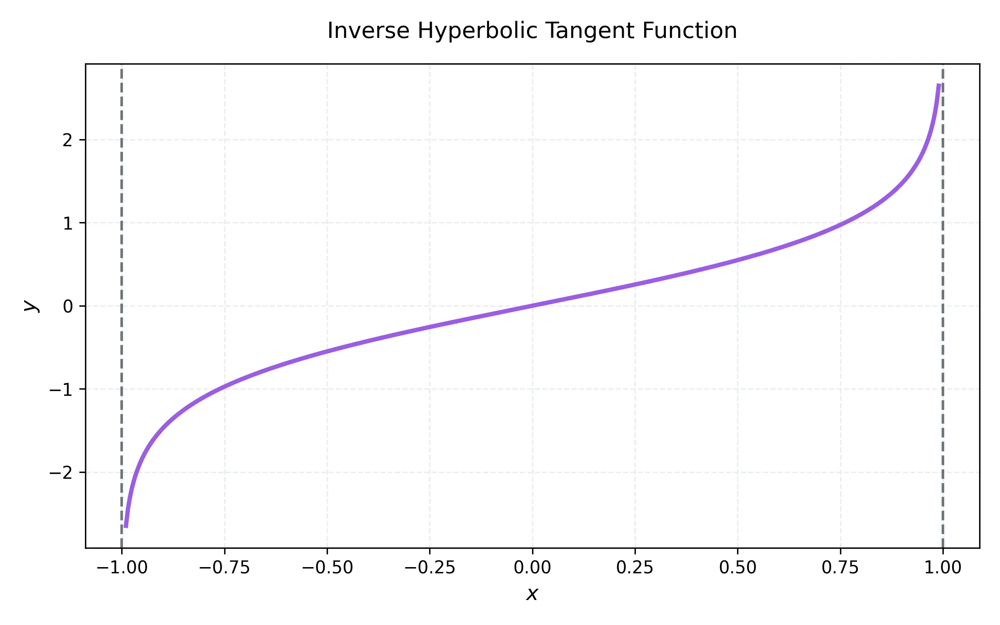

# 課程：微積分中 - 第 2 週 - 超越函數與反函數

本文件包含了第 2 週「超越函數與反函數」的完整教學大綱、實作指南以及練習題庫。本週重點在於掌握反三角函數、雙曲函數的運算、微積分性質，以及解決極限問題的重要工具：羅必達法則。
本週教學內容對應 **Stewart Calculus Chapter 6** 的進階部分。

---

## 一、 單元講解 (Lecture) - 總計 100 分鐘

### 1. 反三角函數 (20 min) (KP2.1)
*   **課本對應**：Stewart Calculus Section 6.6.
*   **概念講解**：
    由於三角函數不是一對一函數，必須限制其定義域才能定義反函數：
    -   **$\arcsin x$ (或 $\sin^{-1} x$)**：定義域 $[-1, 1]$，值域 $[-\pi/2, \pi/2]$。
    -   **$\arccos x$ (或 $\cos^{-1} x$)**：定義域 $[-1, 1]$，值域 $[0, \pi]$。
    -   **$\arctan x$ (或 $\tan^{-1} x$)**：定義域 $(-\infty, \infty)$，值域 $(-\pi/2, \pi/2)$。
*   **練習題與解答**：
    *   **練習題 2.1.1**：計算 $\sin(\arccos(4/5))$。
    *   **解答**：
        1. 令 $\theta = \arccos(4/5)$，則 $\cos \theta = 4/5$ 且 $0 \le \theta \le \pi$。
        2. 由於 $\cos \theta > 0$，$\theta$ 在第一象限。
        3. 利用恆等式 $\sin^2 \theta + \cos^2 \theta = 1$：
           $$\sin \theta = \sqrt{1 - (4/5)^2} = \sqrt{9/25} = 3/5$$
        4. 故 $\sin(\arccos(4/5)) = 3/5$。

---

### 2. 反三角函數的導函數 (20 min) (KP2.2)
*   **課本對應**：Stewart Calculus Section 6.6.
*   **概念講解**：
    利用隱函數微分法可求得反三角函數的導函數：
    -   $\frac{d}{dx}(\sin^{-1} x) = \frac{1}{\sqrt{1-x^2}}$
    -   $\frac{d}{dx}(\cos^{-1} x) = -\frac{1}{\sqrt{1-x^2}}$
    -   $\frac{d}{dx}(\tan^{-1} x) = \frac{1}{1+x^2}$
*   **數學證明**：證明 $\frac{d}{dx}(\sin^{-1} x) = \frac{1}{\sqrt{1-x^2}}$。
    *   **證明**：
        令 $y = \sin^{-1} x$，則 $\sin y = x$。
        對等號兩邊關於 $x$ 微分：
        $$\cos y \frac{dy}{dx} = 1 \implies \frac{dy}{dx} = \frac{1}{\cos y}$$
        因為 $y \in [-\pi/2, \pi/2]$，故 $\cos y \ge 0$。利用 $\cos y = \sqrt{1-\sin^2 y} = \sqrt{1-x^2}$。
        代回得：$\frac{dy}{dx} = \frac{1}{\sqrt{1-x^2}}$。
*   **練習題與解答**：
    *   **練習題 2.2.1**：求 $f(x) = \tan^{-1}(e^x)$ 的導函數。
    *   **解答**：
        根據連鎖律：
        $$f'(x) = \frac{1}{1+(e^x)^2} \cdot \frac{d}{dx}(e^x) = \frac{e^x}{1+e^{2x}}$$

---

### 3. 雙曲函數 (20 min) (KP2.3)
*   **課本對應**：Stewart Calculus Section 6.7.
*   **概念講解**：
    雙曲函數是透過指數函數組合成的類似三角函數的結構：
    -   **雙曲正弦**：$\sinh x = \frac{e^x - e^{-x}}{2}$
    -   **雙曲餘弦**：$\cosh x = \frac{e^x + e^{-x}}{2}$
    -   **雙曲正切**：$\tanh x = \frac{\sinh x}{\cosh x} = \frac{e^x - e^{-x}}{e^x + e^{-x}}$
    **基本恆等式**：$\cosh^2 x - \sinh^2 x = 1$ (對應單位的雙曲線)。
*   **練習題與解答**：
    *   **練習題 2.3.1**：證明 $1 - \tanh^2 x = \text{sech}^2 x$。
    *   **解答**：
        1. 左式 $= 1 - \frac{\sinh^2 x}{\cosh^2 x} = \frac{\cosh^2 x - \sinh^2 x}{\cosh^2 x}$。
        2. 利用 $\cosh^2 x - \sinh^2 x = 1$，得 $\frac{1}{\cosh^2 x} = \text{sech}^2 x$。

---

### 4. 雙曲函數的微積分 (20 min) (KP2.4)
*   **課本對應**：Stewart Calculus Section 6.7.
*   **概念講解**：
    雙曲函數的微分規則與三角函數極為相似但符號略有不同：
    -   $\frac{d}{dx}(\sinh x) = \cosh x$
    -   $\frac{d}{dx}(\cosh x) = \sinh x$ (注意：此處無負號！)
    -   $\frac{d}{dx}(\tanh x) = \text{sech}^2 x$
    **積分公式**：$\int \sinh x dx = \cosh x + C, \quad \int \cosh x dx = \sinh x + C$。
*   **練習題與解答**：
    *   **練習題 2.4.1**：求 $\int \tanh x dx$。
    *   **解答**：
        1. $\int \frac{\sinh x}{\cosh x} dx$。
        2. 令 $u = \cosh x$，則 $du = \sinh x dx$。
        3. 積分變為 $\int \frac{1}{u} du = \ln|u| + C = \ln(\cosh x) + C$ (因 $\cosh x \ge 1$)。

---

### 5. 羅必達法則 (20 min) (KP2.5)
*   **課本對應**：Stewart Calculus Section 6.8.
*   **概念講解**：
    用於處理不定型極限（如 $0/0$ 或 $\infty/\infty$）。
    **法則內容**：若 $\lim_{x \to a} \frac{f(x)}{g(x)}$ 屬於不定型，則：
    $$\lim_{x \to a} \frac{f(x)}{g(x)} = \lim_{x \to a} \frac{f'(x)}{g'(x)}$$
    (前提是右側極限存在或是 $\pm \infty$)。

    下列展示了不同增長速度函數在極限下的競爭關係：
    

*   **練習題與解答**：
    *   **練習題 2.5.1**：求 $\lim_{x \to 0} \frac{e^x - 1 - x}{x^2}$。
    *   **解答**：
        1. 代入 $x=0$ 得 $0/0$，使用羅必達法則。
        2. 原式 $= \lim_{x \to 0} \frac{e^x - 1}{2x}$。
        3. 再次代入仍為 $0/0$，二次使用羅必達法則。
        4. 原式 $= \lim_{x \to 0} \frac{e^x}{2} = 1/2$。

---

## 二、 動手實作 (Lab) - 總計 50 分鐘

### 實作一：SymPy 處理反函數與極限 (25 min)
```python
import sympy as sp

x = sp.Symbol('x')

# 1. 求反三角函數導數
print(f"diff(asin(x)): {sp.diff(sp.asin(x), x)}")

# 2. 驗證雙曲函數恆等式
lhs = sp.cosh(x)**2 - sp.sinh(x)**2
print(f"cosh^2(x) - sinh^2(x) simplifies to: {sp.simplify(lhs)}")

# 3. 羅必達法則極限計算
expr = (sp.exp(x) - 1 - x) / x**2
limit_val = sp.limit(expr, x, 0)
print(f"Limit at 0: {limit_val}")
```

### 實作二：繪製雙曲函數圖形 (25 min)
```python
import numpy as np
import matplotlib.pyplot as plt

x = np.linspace(-3, 3, 400)
y_sinh = np.sinh(x)
y_cosh = np.cosh(x)
y_tanh = np.tanh(x)

plt.plot(x, y_sinh, label='sinh(x)')
plt.plot(x, y_cosh, label='cosh(x)')
plt.plot(x, y_tanh, label='tanh(x)')
plt.axhline(0, color='black', lw=0.5)
plt.axvline(0, color='black', lw=0.5)
plt.legend()
plt.title("Hyperbolic Functions")
plt.grid(True)
plt.show()
```

---

## 三、 本週知識點回顧 (KP)
- **KP2.1**: 反三角函數的定義域與值域限制。
- **KP2.2**: 反三角函數導函數公式（特別是 $\sin^{-1} x$ 與 $\tan^{-1} x$）。
- **KP2.3**: 雙曲函數定義（$e^x$ 組合）與 $\cosh^2 x - \sinh^2 x = 1$。
- **KP2.4**: 雙曲函數的微分（注意 $\cosh x$ 微分為 $\sinh x$）。
- **KP2.5**: 羅必達法則適用條件與不定型分類。

---

## 四、 課後測驗題庫 (Quiz) - 30 分鐘

### 1. 單選題 (Single Choice) - 共 10 題
1. $\arcsin(1) = $？ (A) 0 (B) $\pi/2$ (C) $\pi$ (D) $1$
2. $\frac{d}{dx}(\tan^{-1} x) = $？ (A) $1/\sqrt{1-x^2}$ (B) $1/(1+x^2)$ (C) $\sec^2 x$ (D) $1/(1-x^2)$
3. $\cosh 0 = $？ (A) 0 (B) 1 (C) $e$ (D) $1/2$
4. $\frac{d}{dx}(\cosh x) = $？ (A) $\sinh x$ (B) $-\sinh x$ (C) $\cosh x$ (D) $\text{sech}^2 x$
5. 羅必達法則主要解決哪種問題？ (A) 積分 (B) 極限不定型 (C) 微分方程 (D) 函數定義域
6. $\lim_{x \to 0} \frac{\sin x}{x} = $？ (A) 0 (B) 1 (C) $\infty$ (D) 不存在
7. 下列何者為 $\sinh x$ 的定義？ (A) $\frac{e^x+e^{-x}}{2}$ (B) $\frac{e^x-e^{-x}}{2}$ (C) $e^x - e^{-x}$ (D) $\frac{1}{\sin x}$
8. $\arctan(1) = $？ (A) $\pi/4$ (B) $\pi/2$ (C) 0 (D) $1$
9. $\int \frac{1}{1+x^2} dx = $？ (A) $\ln(1+x^2)+C$ (B) $\tan^{-1} x + C$ (C) $\sin^{-1} x + C$ (D) $x + C$
10. $\cosh^2 x - \sinh^2 x = $？ (A) 0 (B) 1 (C) $\cosh 2x$ (D) $-1$

### 2. 多選題 (Multiple Choice) - 共 10 題
11. 下列哪些是羅必達法則適用的直接不定型？ (A) $0/0$ (B) $\infty/\infty$ (C) $0 \cdot \infty$ (D) $1^\infty$
12. 關於 $\arcsin x$，哪些敘述正確？ (A) 定義域為 $[-1, 1]$ (B) 值域為 $[-\pi/2, \pi/2]$ (C) 是奇函數 (D) 導函數恆正
13. 關於雙曲函數，哪些正確？ (A) $\sinh x$ 是奇函數 (B) $\cosh x$ 是偶函數 (C) $\cosh x \ge 1$ 對於所有實數 $x$ (D) $\tanh x$ 的值域為 $(-1, 1)$
14. 下列導數正確的有？ (A) $(\sin^{-1} x)' = 1/\sqrt{1-x^2}$ (B) $(\cos^{-1} x)' = -1/\sqrt{1-x^2}$ (C) $(\sinh x)' = \cosh x$ (D) $(\tanh x)' = \text{sech}^2 x$
15. 哪些極限可以用羅必達法則處理（可能需先變換）？ (A) $\lim_{x \to 0} x \ln x$ (B) $\lim_{x \to \infty} (1+1/x)^x$ (C) $\lim_{x \to 0} (1/x - 1/\sin x)$ (D) $\lim_{x \to 1} \frac{x-1}{x^2-1}$
16. 下列恆等式正確的有？ (A) $\cosh^2 x - \sinh^2 x = 1$ (B) $1 - \tanh^2 x = \text{sech}^2 x$ (C) $\sinh(x+y) = \sinh x \cosh y + \cosh x \sinh y$ (D) $\cosh x + \sinh x = e^x$
17. 反三角函數的值域限制包括： (A) $\arcsin: [-\pi/2, \pi/2]$ (B) $\arccos: [0, \pi]$ (C) $\arctan: (-\pi/2, \pi/2)$ (D) $\text{arcsec}: [0, \pi]$
18. 積分公式正確的有？ (A) $\int \cosh x dx = \sinh x + C$ (B) $\int \text{sech}^2 x dx = \tanh x + C$ (C) $\int \frac{1}{\sqrt{1-x^2}} dx = \sin^{-1} x + C$ (D) $\int \sinh x dx = -\cosh x + C$
19. 羅必達法則的先決條件包括： (A) 分子分母皆可微 (B) 呈現不定型 (C) 分母導數不為 0 (D) 極限點必須是 0
20. 下列哪些函數在 $x \to \infty$ 時比 $x^n$ 增長得快？ (A) $e^x$ (B) $\ln x$ (C) $2^x$ (D) $\sinh x$

### 3. 填充題 (Fill-in-the-blank) - 共 10 題
21. $\sin^{-1}(1/2) = $ __________ (弧度)。
22. $\frac{d}{dx}(\sin^{-1}(2x)) = $ __________。
23. $\lim_{x \to \infty} \frac{\ln x}{x} = $ __________。
24. $\cosh x$ 的定義式為 __________。
25. $\int \text{sech}^2(3x) dx = $ __________。
26. $\cos(\sin^{-1} x) = $ __________ (以 $x$ 表示)。
27. $\lim_{x \to 0} \frac{e^x - 1}{x} = $ __________。
28. 雙曲正切函數 $\tanh x$ 當 $x \to \infty$ 時趨近於 __________。
29. $\frac{d}{dx}(\sinh(x^2)) = $ __________。
30. 若 $y = \cos^{-1} x$，則 $dy/dx$ 在 $x=0$ 的值為 __________。

---

## 五、 Q 矩陣 (Q-matrix)
| 題號 | KP2.1 | KP2.2 | KP2.3 | KP2.4 | KP2.5 |
|---|---|---|---|---|---|
| Q1-Q10 | 1,8 | 2,9 | 3,7,10 | 4 | 5,6 |
| Q11-Q20| 12,17 | 14,18 | 13,16 | 14,18 | 11,15,19,20 |
| Q21-Q30| 21,26 | 22,30 | 24,28 | 25,29 | 23,27 |
