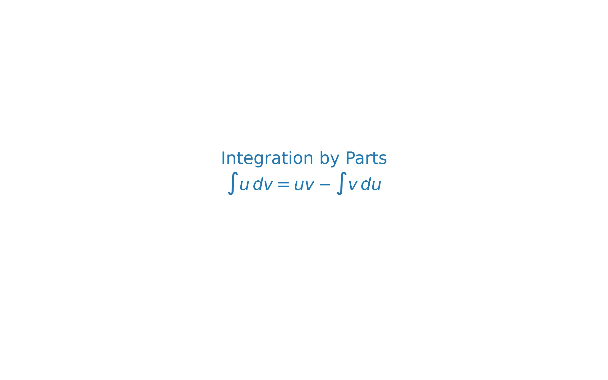

# 課程：微積分中 - 第 3 週 - 積分技巧 I：分部積分與三角積分

本文件包含了第 3 週「積分技巧 I：分部積分與三角積分」的完整教學大綱、實作指南以及練習題庫。本週重點在於掌握處理乘積型函數積分的核心工具：分部積分法，以及系統性地解決各種三角函數組合的積分問題。
本週教學內容對應 **Stewart Calculus Chapter 7** 的開端。

---

## 一、 單元講解 (Lecture) - 總計 100 分鐘

### 1. 分部積分法 (Integration by Parts) (20 min) (KP3.1)
*   **課本對應**：Stewart Calculus Section 7.1.
*   **概念講解**：
    分部積分法源自微分的乘法法則。公式如下：
    $$\int u dv = uv - \int v du$$
    選擇 $u$ 的原則通常遵循 **LIATE** 法則（優先順序：對數 Logarithmic > 反三角 Inverse trig > 代數 Algebraic > 三角 Trigonometric > 指數 Exponential）。

    下圖展示了分部積分法中 $u$ 與 $dv$ 的選取邏輯：
    

*   **練習題與解答**：
    *   **練習題 3.1.1**：計算 $\int x \cos x dx$。
    *   **解答**：
        1. 令 $u = x, dv = \cos x dx$。
        2. 則 $du = dx, v = \sin x$。
        3. 代入公式：$\int x \cos x dx = x \sin x - \int \sin x dx$。
        4. 結果：$x \sin x + \cos x + C$。

---

### 2. 多重分部積分與表格法 (Tabular Method) (20 min) (KP3.2)
*   **課本對應**：Stewart Calculus Section 7.1.
*   **概念講解**：
    當需要進行多次分部積分（特別是 $x^n \cdot e^x$ 或 $x^n \cdot \sin x$ 型）時，表格法極為高效。
    **步驟**：
    1.  建立兩欄：$u$ 欄（連續微分至 0）與 $dv$ 欄（連續積分）。
    2.  交錯標註正負號。
    3.  對角線乘積相加。
*   **練習題與解答**：
    *   **練習題 3.2.1**：使用表格法計算 $\int x^2 e^x dx$。
    *   **解答**：
        - $u$ 欄：$x^2 \to 2x \to 2 \to 0$。
        - $dv$ 欄：$e^x \to e^x \to e^x \to e^x$。
        - 正負號：$(+), (-), (+)$。
        - 結果：$x^2 e^x - 2x e^x + 2e^x + C = (x^2-2x+2)e^x + C$。

---

### 3. 三角積分：$\sin^m x \cos^n x$ 型 (20 min) (KP3.3)
*   **課本對應**：Stewart Calculus Section 7.2.
*   **概念講解**：
    處理規則：
    1.  若 $n$ (cos 次數) 為奇數：保留一個 $\cos x$，將其餘化為 $\sin x$（利用 $\cos^2 x = 1 - \sin^2 x$），令 $u = \sin x$。
    2.  若 $m$ (sin 次數) 為奇數：保留一個 $\sin x$，將其餘化為 $\cos x$，令 $u = \cos x$。
    3.  若均為偶數：使用倍角公式 $\sin^2 x = \frac{1-\cos 2x}{2}, \cos^2 x = \frac{1+\cos 2x}{2}$。
*   **練習題與解答**：
    *   **練習題 3.3.1**：計算 $\int \sin^3 x dx$。
    *   **解答**：
        1. $\int \sin^2 x \sin x dx = \int (1-\cos^2 x) \sin x dx$。
        2. 令 $u = \cos x, du = -\sin x dx$。
        3. 積分變為 $-\int (1-u^2) du = \int (u^2-1) du = \frac{1}{3}u^3 - u + C$。
        4. 結果：$\frac{1}{3}\cos^3 x - \cos x + C$。

---

### 4. 三角積分：$\tan^m x \sec^n x$ 型 (20 min) (KP3.4)
*   **課本對應**：Stewart Calculus Section 7.2.
*   **概念講解**：
    處理規則：
    1.  若 $n$ (sec 次數) 為偶數：保留 $\sec^2 x$，將其餘化為 $\tan x$（利用 $\sec^2 x = 1 + \tan^2 x$），令 $u = \tan x$。
    2.  若 $m$ (tan 次數) 為奇數：保留 $\sec x \tan x$，將其餘化為 $\sec x$，令 $u = \sec x$。
*   **練習題與解答**：
    *   **練習題 3.4.1**：計算 $\int \tan x \sec^2 x dx$。
    *   **解答**：
        1. 方法一：令 $u = \tan x, du = \sec^2 x dx$，則 $\int u du = \frac{1}{2}\tan^2 x + C$。
        2. 方法二：令 $u = \sec x, du = \sec x \tan x dx$，則 $\int u du = \frac{1}{2}\sec^2 x + C'$。
        (兩者僅相差常數，皆正確)。

---

### 5. 循環積分與特殊技巧 (20 min) (KP3.5)
*   **課本對應**：Stewart Calculus Section 7.1, 7.2.
*   **概念講解**：
    有些積分在進行兩次分部積分後會回到原式（如 $e^x \sin x$），此時可建立方程求解。
    此外，積化和差公式對於 $\sin ax \cos bx$ 型積分很有幫助。
*   **練習題與解答**：
    *   **練習題 3.5.1**：計算 $\int e^x \sin x dx$。
    *   **解答**：
        1. 令 $I = \int e^x \sin x dx$。
        2. 分部積分：$u = \sin x, dv = e^x dx \implies I = e^x \sin x - \int e^x \cos x dx$。
        3. 再次分部積分：$u = \cos x, dv = e^x dx \implies \int e^x \cos x dx = e^x \cos x - \int e^x (-\sin x) dx = e^x \cos x + I$。
        4. 代回：$I = e^x \sin x - (e^x \cos x + I) \implies 2I = e^x(\sin x - \cos x)$。
        5. 結果：$I = \frac{1}{2}e^x(\sin x - \cos x) + C$。

---

## 二、 動手實作 (Lab) - 總計 50 分鐘

### 實作一：SymPy 自動化分部積分 (25 min)
```python
import sympy as sp

x = sp.Symbol('x')

# 1. 計算 x*ln(x)
print(f"Integral of x*ln(x): {sp.integrate(x * sp.log(x), x)}")

# 2. 驗證循環積分
expr = sp.exp(x) * sp.cos(x)
print(f"Integral of e^x*cos(x): {sp.integrate(expr, x)}")

# 3. 三角積分
tri_expr = sp.sin(x)**2 * sp.cos(x)**3
print(f"Integral of sin^2*cos^3: {sp.integrate(tri_expr, x)}")
```

### 實作二：數值驗證定積分 (25 min)
```python
import numpy as np
from scipy.integrate import quad

# 定義函數
def f(x):
    return x * np.exp(x)

# 計算從 0 到 1 的積分
res, err = quad(f, 0, 1)
print(f"Numerical integration of x*e^x from 0 to 1: {res}")
print(f"Exact solution (e - 1): {np.exp(1) - 1}")
```

---

## 三、 本週知識點回顧 (KP)
- **KP3.1**: 分部積分公式 $\int u dv = uv - \int v du$。
- **KP3.2**: 表格法簡化多次分部積分。
- **KP3.3**: $\sin^m \cos^n$ 積分中奇偶次數的處理策略。
- **KP3.4**: $\tan^m \sec^n$ 積分中 $\sec^2$ 或 $\sec \tan$ 的提取技巧。
- **KP3.5**: 循環積分的方程解法。

---

## 四、 課後測驗題庫 (Quiz) - 30 分鐘

### 1. 單選題 (Single Choice) - 共 10 題
1. 分部積分法公式為？ (A) $\int f \cdot g = \int f \cdot \int g$ (B) $uv - \int v du$ (C) $uv + \int v du$ (D) $f'g + fg'$
2. 計算 $\int \ln x dx$ 時，$u$ 應選取？ (A) $x$ (B) $dx$ (C) $\ln x$ (D) $1/x$
3. 使用 LIATE 法則，哪類函數在選取 $u$ 時優先度最高？ (A) 代數 (B) 指數 (C) 對數 (D) 三角
4. $\int x e^x dx = $？ (A) $(x-1)e^x+C$ (B) $(x+1)e^x+C$ (C) $x^2e^x/2+C$ (D) $e^x+C$
5. 表格法最適合處理哪種組合？ (A) $\ln x / x$ (B) $x^3 \sin x$ (C) $e^x \cos x$ (D) $\tan^{-1} x$
6. 計算 $\int \sin^2 x \cos^3 x dx$ 時，應令 $u = $？ (A) $\sin x$ (B) $\cos x$ (C) $\tan x$ (D) $\sin^2 x$
7. $\int \sec^2 x dx = $？ (A) $\sec x \tan x$ (B) $\tan x$ (C) $\ln|\sec x|$ (D) $\sec x$
8. 下列哪一個是 $\sin^2 x$ 的倍角公式？ (A) $(1-\cos 2x)/2$ (B) $(1+\cos 2x)/2$ (C) $2\sin x \cos x$ (D) $\cos^2 x - 1$
9. $\int \tan x dx = $？ (A) $\sec^2 x$ (B) $\ln|\sec x|+C$ (C) $\ln|\sin x|+C$ (D) $-\sec^2 x$
10. 循環積分通常發生在什麼組合？ (A) $x \ln x$ (B) $e^x \sin x$ (C) $x^2 e^x$ (D) $\sin^3 x$

### 2. 多選題 (Multiple Choice) - 共 10 題
11. 下列哪些積分通常使用分部積分法？ (A) $\int x \sin x dx$ (B) $\int x \ln x dx$ (C) $\int \tan^{-1} x dx$ (D) $\int e^{x^2} dx$
12. 關於三角積分 $\int \sin^m x \cos^n x dx$，正確敘述包括： (A) $n$ 奇數則提取 $\cos x$ (B) $m$ 奇數則提取 $\sin x$ (C) 皆為偶數則用倍角公式 (D) 任何情況都能用代換 $u = \tan x$ 解決
13. 分部積分中 $v du$ 的部分： (A) 必須比原積分容易處理 (B) 可以是循環形式 (C) 決定了計算能否完成 (D) 必須是多項式
14. 下列積分結果正確的有： (A) $\int x \cos x dx = x\sin x + \cos x + C$ (B) $\int \ln x dx = x\ln x - x + C$ (C) $\int \sin^2 x dx = \frac{x}{2} - \frac{\sin 2x}{4} + C$ (D) $\int \sec x dx = \ln|\sec x + \tan x| + C$
15. 表格法中： (A) $u$ 欄應選微分後能趨向 0 的函數 (B) 符號必須正負交替 (C) 最後一行若不為 0 則需以積分形式結尾 (D) 只適用於多項式乘以指數
16. 下列恆等式在三角積分中常用： (A) $\sin^2 x + \cos^2 x = 1$ (B) $\sec^2 x = 1 + \tan^2 x$ (C) $\sin x \cos x = \frac{1}{2}\sin 2x$ (D) $2\cos^2 x = 1 + \cos 2x$
17. 對於 $\int e^{2x} \cos 3x dx$： (A) 是一個循環積分 (B) 需要兩次分部積分 (C) $u$ 選 $e^{2x}$ 或 $\cos 3x$ 皆可 (D) 可以用表格法直接求出最終解
18. 積分 $\int \tan^3 x \sec x dx$： (A) tan 次數為奇數 (B) 提取 $\sec x \tan x$ (C) 將剩餘 $\tan^2$ 化為 $\sec^2 - 1$ (D) 令 $u = \sec x$
19. 關於 $\int \sec^3 x dx$： (A) 常用分部積分處理 (B) 是一個循環積分 (C) 常用於弧長計算 (D) 結果包含 $\ln|\sec x + \tan x|$
20. 定積分的分部積分公式滿足： (A) $[uv]_a^b - \int_a^b v du$ (B) 必須先求出不定積分再代值 (C) 代換過程可能改變上下限 (D) 幾何意義與區域面積相關

### 3. 填充題 (Fill-in-the-blank) - 共 10 題
21. $\int x \sin x dx = $ __________。
22. 表格法計算 $\int x^2 \sin x dx$，符號序列為 __________。
23. $\int \cos^2 x dx = $ __________ (以 $x$ 與 $\sin 2x$ 表示)。
24. 計算 $\int \sec^4 x dx$ 時，可令 $u = $ __________。
25. LIATE 法則中，'A' 代表 __________ 函數。
26. $\int \ln(2x) dx = $ __________。
27. $\int \sin x \cos x dx = $ __________ (使用 $\sin 2x$ 表示)。
28. $\int \tan^2 x dx = $ __________。
29. 若 $\int u dv = x^2 e^x - \int 2x e^x dx$，則 $u = $ __________。
30. $\int_1^e \ln x dx = $ __________。

---

## 五、 Q 矩陣 (Q-matrix)

| 題號 | KP3.1 | KP3.2 | KP3.3 | KP3.4 | KP3.5 | |
|---|---|---|---|---|---|
| Q1 | 1 | 0 | 0 | 0 | 0 |
| Q2 | 1 | 0 | 0 | 0 | 0 |
| Q3 | 1 | 0 | 0 | 0 | 0 |
| Q4 | 1 | 0 | 0 | 0 | 0 |
| Q5 | 0 | 1 | 0 | 0 | 0 |
| Q6 | 0 | 0 | 1 | 0 | 0 |
| Q7 | 0 | 0 | 0 | 1 | 0 |
| Q8 | 0 | 0 | 1 | 0 | 0 |
| Q9 | 0 | 0 | 0 | 1 | 0 |
| Q10| 0 | 0 | 0 | 0 | 1 |
| Q11| 1 | 0 | 0 | 0 | 0 |
| Q12| 0 | 0 | 1 | 0 | 0 |
| Q13| 1 | 0 | 0 | 0 | 0 |
| Q14| 1 | 0 | 0 | 0 | 0 |
| Q15| 0 | 1 | 0 | 0 | 0 |
| Q16| 0 | 0 | 1 | 0 | 0 |
| Q17| 0 | 0 | 0 | 0 | 1 |
| Q18| 0 | 0 | 0 | 1 | 0 |
| Q19| 0 | 0 | 0 | 0 | 1 |
| Q20| 0 | 0 | 0 | 0 | 1 |
| Q21| 1 | 0 | 0 | 0 | 0 |
| Q22| 0 | 1 | 0 | 0 | 0 |
| Q23| 0 | 0 | 1 | 0 | 0 |
| Q24| 0 | 0 | 0 | 1 | 0 |
| Q25| 1 | 0 | 0 | 0 | 0 |
| Q26| 1 | 0 | 0 | 0 | 0 |
| Q27| 0 | 0 | 1 | 0 | 0 |
| Q28| 0 | 0 | 0 | 1 | 0 |
| Q29| 1 | 0 | 0 | 0 | 0 |
| Q30| 0 | 0 | 0 | 0 | 1 |

