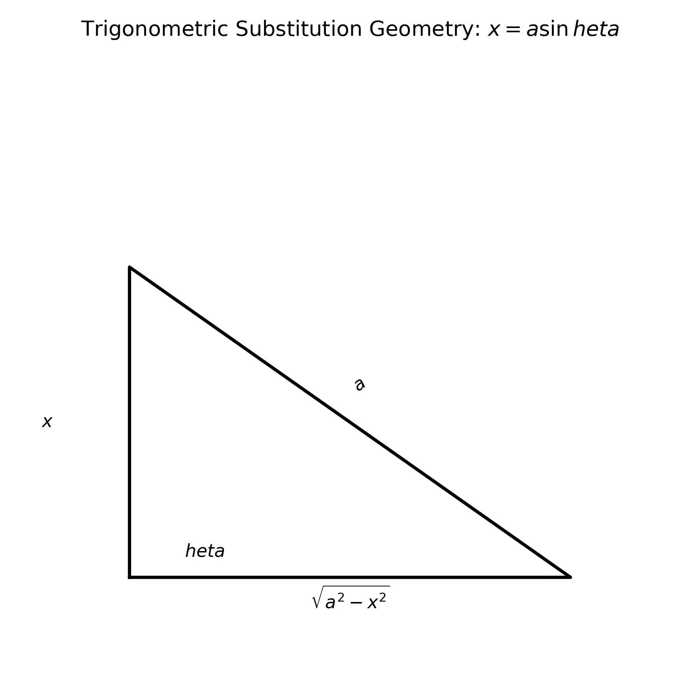

# 課程：微積分中 - 第 4 週 - 積分技巧 II：三角代換與部分分式

本文件包含了第 4 週「積分技巧 II：三角代換與部分分式」的完整教學大綱、實作指南以及練習題庫。本週重點在於學習處理根式與有理函數的進階積分技巧，將複雜的代數式轉換為容易處理的三角函數或簡單分式。
本週教學內容對應 **Stewart Calculus Chapter 7** 的核心技巧。

---

## 一、 單元講解 (Lecture) - 總計 100 分鐘

### 1. 三角代換法：$\sqrt{a^2-x^2}$ 型 (20 min) (KP4.1)
*   **課本對應**：Stewart Calculus Section 7.3.
*   **概念講解**：
    當積分式包含 $\sqrt{a^2-x^2}$ 時，令 $x = a \sin \theta$，其中 $-\pi/2 \le \theta \le \pi/2$。
    此時：$\sqrt{a^2 - x^2} = \sqrt{a^2(1-\sin^2 \theta)} = a \cos \theta$。
    $dx = a \cos \theta d\theta$。

    下列圖形展示了三角代換中直角三角形的對應關係：
    

*   **練習題與解答**：
    *   **練習題 4.1.1**：計算 $\int \sqrt{9-x^2} dx$。
    *   **解答**：
        1. 令 $x = 3 \sin \theta$, $dx = 3 \cos \theta d\theta$。
        2. 原式 $= \int 3 \cos \theta \cdot 3 \cos \theta d\theta = 9 \int \cos^2 \theta d\theta$。
        3. 利用倍角公式：$9 \int \frac{1+\cos 2\theta}{2} d\theta = \frac{9}{2}(\theta + \frac{1}{2}\sin 2\theta) + C$。
        4. 使用 $\sin 2\theta = 2\sin \theta \cos \theta$，且 $\theta = \sin^{-1}(x/3), \cos \theta = \sqrt{1-(x/3)^2} = \frac{\sqrt{9-x^2}}{3}$。
        5. 結果：$\frac{9}{2}\sin^{-1}(x/3) + \frac{x\sqrt{9-x^2}}{2} + C$。

---

### 2. 三角代換法：$\sqrt{a^2+x^2}$ 與 $\sqrt{x^2-a^2}$ 型 (20 min) (KP4.2)
*   **課本對應**：Stewart Calculus Section 7.3.
*   **概念講解**：
    -   **對於 $\sqrt{a^2+x^2}$**：令 $x = a \tan \theta$。則 $\sqrt{a^2+x^2} = a \sec \theta, dx = a \sec^2 \theta d\theta$。
    -   **對於 $\sqrt{x^2-a^2}$**：令 $x = a \sec \theta$。則 $\sqrt{x^2-a^2} = a \tan \theta, dx = a \sec \theta \tan \theta d\theta$。
*   **練習題與解答**：
    *   **練習題 4.2.1**：計算 $\int \frac{1}{\sqrt{x^2+4}} dx$。
    *   **解答**：
        1. 令 $x = 2 \tan \theta$, $dx = 2 \sec^2 \theta d\theta$。
        2. 原式 $= \int \frac{2 \sec^2 \theta}{2 \sec \theta} d\theta = \int \sec \theta d\theta$。
        3. 利用基本公式：$\ln|\sec \theta + \tan \theta| + C$。
        4. 由 $x = 2 \tan \theta \implies \tan \theta = x/2$，建構三角形得 $\sec \theta = \frac{\sqrt{x^2+4}}{2}$。
        5. 結果：$\ln\left|\frac{\sqrt{x^2+4}}{2} + \frac{x}{2}\right| + C = \ln|x + \sqrt{x^2+4}| + C'$。

---

### 3. 部分分式法：線性因子 (20 min) (KP4.3)
*   **課本對應**：Stewart Calculus Section 7.4.
*   **概念講解**：
    將有理函數 $P(x)/Q(x)$ 拆解為簡單分式的和。若 $Q(x)$ 包含不重複的線性因子 $(x-a_1)(x-a_2)\dots$：
    $$\frac{P(x)}{Q(x)} = \frac{A}{x-a_1} + \frac{B}{x-a_2} + \dots$$
    若有重複線性因子 $(x-a)^n$，則需包含從 1 到 $n$ 次的所有分母。
*   **練習題與解答**：
    *   **練習題 4.3.1**：計算 $\int \frac{5x-3}{x^2-2x-3} dx$。
    *   **解答**：
        1. 因式分解分母：$x^2-2x-3 = (x-3)(x+1)$。
        2. 設 $\frac{5x-3}{(x-3)(x+1)} = \frac{A}{x-3} + \frac{B}{x+1}$。
        3. 通分：$5x-3 = A(x+1) + B(x-3)$。
        4. 令 $x=3 \implies 12 = 4A \implies A=3$。
        5. 令 $x=-1 \implies -8 = -4B \implies B=2$。
        6. 積分：$\int (\frac{3}{x-3} + \frac{2}{x+1}) dx = 3\ln|x-3| + 2\ln|x+1| + C$。

---

### 4. 部分分式法：二次因子 (20 min) (KP4.4)
*   **課本對應**：Stewart Calculus Section 7.4.
*   **概念講解**：
    若 $Q(x)$ 包含不可約二次因子 $ax^2+bx+c$，則對應的分子應設為線性式 $Ax+B$：
    $$\frac{P(x)}{(x-k)(ax^2+bx+c)} = \frac{A}{x-k} + \frac{Bx+C}{ax^2+bx+c}$$
*   **練習題與解答**：
    *   **練習題 4.4.1**：計算 $\int \frac{1}{x(x^2+1)} dx$。
    *   **解答**：
        1. 設 $\frac{1}{x(x^2+1)} = \frac{A}{x} + \frac{Bx+C}{x^2+1}$。
        2. $1 = A(x^2+1) + (Bx+C)x$。
        3. 令 $x=0 \implies 1 = A \implies A=1$。
        4. 比較 $x^2$ 項係數：$0 = A + B \implies B = -1$。
        5. 比較 $x$ 項係數：$0 = C \implies C = 0$。
        6. 積分：$\int (\frac{1}{x} - \frac{x}{x^2+1}) dx = \ln|x| - \frac{1}{2}\ln(x^2+1) + C$。

---

### 5. 積分策略總結 (20 min) (KP4.5)
*   **課本對應**：Stewart Calculus Section 7.5.
*   **概念講解**：
    面對複雜積分的檢查清單：
    1.  **簡化**：代數化簡或三角恆等式。
    2.  **直接觀察**：是否為基本公式。
    3.  **代換法**：尋找 $u$ 與 $du$。
    4.  **分類處理**：
        -   三角函數組合 $\to$ 第 3 週技巧。
        -   有理函數 $\to$ 部分分式法。
        -   根式 $\to$ 三角代換或 $u = \sqrt[n]{g(x)}$。
        -   乘積型 $\to$ 分部積分。
*   **練習題與解答**：
    *   **練習題 4.5.1**：試討論 $\int \frac{1}{1+\sqrt{x}} dx$ 的策略。
    *   **解答**：
        1. 此非有理函數，但含有根式。令 $u = \sqrt{x} \implies x = u^2, dx = 2u du$。
        2. 原式 $= \int \frac{2u}{1+u} du$。
        3. 利用長除法或技巧：$\int \frac{2(u+1)-2}{u+1} du = \int (2 - \frac{2}{u+1}) du = 2u - 2\ln|1+u| + C$。
        4. 代回 $x$：$2\sqrt{x} - 2\ln(1+\sqrt{x}) + C$。

---

## 二、 動手實作 (Lab) - 總計 50 分鐘

### 實作一：SymPy 拆解部分分式 (25 min)
```python
import sympy as sp

x = sp.Symbol('x')

# 1. 執行部分分式拆解 (Partial Fraction Decomposition)
f = (5*x - 3) / (x**2 - 2*x - 3)
pfd = sp.apart(f)
print(f"Partial fraction decomposition: {pfd}")

# 2. 驗證積分結果
print(f"Integral: {sp.integrate(f, x)}")

# 3. 處理不可約二次式
g = 1 / (x * (x**2 + 1))
print(f"PFD of 1/(x*(x^2+1)): {sp.apart(g)}")
```

### 實作二：三角代換視覺化 (25 min)
```python
import numpy as np
import matplotlib.pyplot as plt

# 觀察 1/sqrt(4-x^2) 在 [-2, 2] 的行為
x = np.linspace(-1.9, 1.9, 400)
y = 1 / np.sqrt(4 - x**2)

plt.plot(x, y)
plt.fill_between(x, y, alpha=0.3)
plt.title("Function with root term (Trig Sub Area)")
plt.xlabel("x")
plt.ylabel("f(x)")
plt.grid(True)
plt.show()
```

---

## 三、 本週知識點回顧 (KP)
- **KP4.1**: $x = a \sin \theta$ 用於 $\sqrt{a^2-x^2}$。
- **KP4.2**: $x = a \tan \theta$ 與 $x = a \sec \theta$ 的適用時機。
- **KP4.3**: 有理函數拆解中的 A, B 係數求解。
- **KP4.4**: 處理不可約二次分母的 $Ax+B$ 設法。
- **KP4.5**: 綜合各種積分工具的判斷流程。

---

## 四、 課後測驗題庫 (Quiz) - 30 分鐘

### 1. 單選題 (Single Choice) - 共 10 題
1. 遇到 $\sqrt{4-x^2}$，最適當的三角代換是？ (A) $x=2\sin\theta$ (B) $x=2\tan\theta$ (C) $x=4\sin\theta$ (D) $x=2\sec\theta$
2. 若令 $x=a\tan\theta$，則 $\sqrt{a^2+x^2}$ 等於？ (A) $a\sin\theta$ (B) $a\cos\theta$ (C) $a\sec\theta$ (D) $a\tan\theta$
3. 部分分式法中，若分母為 $(x-1)(x-2)$，設法應為？ (A) $\frac{A}{(x-1)(x-2)}$ (B) $\frac{A}{x-1} + \frac{B}{x-2}$ (C) $\frac{Ax+B}{(x-1)(x-2)}$ (D) $\frac{A}{x-1} + \frac{B}{(x-1)^2}$
4. $\int \frac{1}{x^2+a^2} dx = $？ (A) $\frac{1}{a}\tan^{-1}(x/a)+C$ (B) $\tan^{-1}(x/a)+C$ (C) $\ln(x^2+a^2)+C$ (D) $\sin^{-1}(x/a)+C$
5. 計算 $\int \frac{1}{x^2-1} dx$ 最快的方法是？ (A) 分部積分 (B) 部分分式 (C) 三角代換 (D) 直接觀察
6. 三角代換後若得到 $\int \sec \theta d\theta$，結果為？ (A) $\ln|\sec\theta+\tan\theta|$ (B) $\tan\theta$ (C) $\sec\theta\tan\theta$ (D) $\ln|\cos\theta|$
7. $\frac{x+1}{(x^2+1)(x-1)}$ 的部分分式設法應包含： (A) $\frac{A}{x-1}$ (B) $\frac{Bx+C}{x^2+1}$ (C) 以上皆是 (D) 以上皆非
8. 積分 $\int \frac{x^3}{x-1} dx$ 應先進行？ (A) 分部積分 (B) 長除法 (C) 三角代換 (D) 部分分式
9. 在三角代換 $x = a \sec \theta$ 中，$\theta$ 的範圍限制主要為了？ (A) 使函數可積 (B) 保證反函數存在（一對一） (C) 使 $x$ 恆正 (D) 簡化 LaTeX 書寫
10. $\int \frac{1}{\sqrt{x^2-a^2}} dx$ 常見的代換是？ (A) $x=a\sin\theta$ (B) $x=a\sec\theta$ (C) $x=a\tan\theta$ (D) $x=u^2$

### 2. 多選題 (Multiple Choice) - 共 10 題
11. 關於三角代換，下列配對正確的有： (A) $\sqrt{a^2-x^2} \to a\sin\theta$ (B) $\sqrt{a^2+x^2} \to a\tan\theta$ (C) $\sqrt{x^2-a^2} \to a\sec\theta$ (D) $x^2+a^2 \to a\tan\theta$
12. 哪些函數適合使用部分分式法？ (A) $\frac{1}{x^2-5x+6}$ (B) $\frac{x^2}{x^4-1}$ (C) $\frac{e^x}{e^{2x}+1}$ (代換後) (D) $\frac{\ln x}{x}$
13. 對於 $\int \frac{1}{x^2+2x+2} dx$： (A) 應先配方為 $(x+1)^2+1$ (B) 使用三角代換 $x+1 = \tan\theta$ (C) 結果為 $\tan^{-1}(x+1)+C$ (D) 分母是不可約二次式
14. 下列積分結果正確的有： (A) $\int \frac{1}{x-a} dx = \ln|x-a|+C$ (B) $\int \frac{1}{x^2+1} dx = \tan^{-1} x+C$ (C) $\int \frac{1}{\sqrt{1-x^2}} dx = \sin^{-1} x+C$ (D) $\int \frac{x}{x^2+1} dx = \frac{1}{2}\ln(x^2+1)+C$
15. 關於有理函數 $P(x)/Q(x)$： (A) 若 $\deg(P) \ge \deg(Q)$ 稱為假分式 (B) 假分式需先長除法 (C) 部分分式法只適用於真分式 (D) $Q(x)$ 在實數範圍內必可分解為線性或二次因子
16. 下列哪些代換屬於「積分策略」中的常見技巧？ (A) 令根式為 $u$ (B) 利用三角恆等式簡化 (C) 觀察是否為 $f'(x)/f(x)$ 形式 (D) 遇到 $\sin, \cos$ 的有理式使用 Weierstrass 代換 ($t=\tan(x/2)$)
17. 三角代換後，將結果從 $\theta$ 換回 $x$ 的常用方法： (A) 畫出直角三角形 (B) 利用三角恆等式 (C) 查表 (D) 直接把 $\theta$ 換成 $\sin^{-1}(x/a)$
18. 部分分式法中求係數的方法： (A) 代入特殊點 (Heaviside Cover-up) (B) 比較係數法 (C) 數值逼近 (D) 對原式求導
19. 關於 $\int \sqrt{x^2-1} dx$： (A) 可令 $x = \sec\theta$ (B) 代換後變為 $\int \tan^2\theta \sec\theta d\theta$ (C) 可轉化為 $\sec^3\theta$ 型積分 (D) 結果包含雙曲函數形式
20. 下列敘述正確的有： (A) 所有有理函數皆有初等函數積分 (B) 三角代換能處理所有根式積分 (C) 分部積分與部分分式法可以併用 (D) 部分分式拆解的係數是唯一的

### 3. 填充題 (Fill-in-the-blank) - 共 10 題
21. 計算 $\int \frac{1}{x^2-9} dx$ 的部分分式設法為 $\frac{A}{x-3} + $ __________。
22. 若 $x = 2\sin\theta$，則 $\cos\theta = $ __________ (以 $x$ 表示)。
23. $\int \frac{1}{x^2+1} dx = $ __________。
24. $\frac{1}{x(x+1)^2} = \frac{A}{x} + \frac{B}{x+1} + $ __________。
25. 積分 $\int \frac{dx}{x^2+2x+5}$ 配方後的分母為 __________。
26. 三角代換 $x = a \tan \theta$ 中，$dx = $ __________。
27. $\int \frac{x+1}{x} dx = $ __________。
28. $\int \frac{2x}{x^2-1} dx = $ __________。
29. 有理函數拆解後，若分母為 $(x^2+1)$，其分子應設為 __________。
30. $\int \frac{1}{\sqrt{4+x^2}} dx$ 令 $x = 2\tan\theta$ 後變為 $\int$ __________ $d\theta$。

---

## 五、 Q 矩陣 (Q-matrix)
| 題號 | KP4.1 | KP4.2 | KP4.3 | KP4.4 | KP4.5 |
|---|---|---|---|---|---|
| Q1-Q10 | 1,4,9 | 2,6,10 | 3,5 | 7 | 8 |
| Q11-Q20| 11 | 11,13,19 | 12,15,18 | 15,18 | 14,16,17,20 |
| Q21-Q30| 22 | 23,25,26,30 | 21,24 | 29 | 27,28 |
