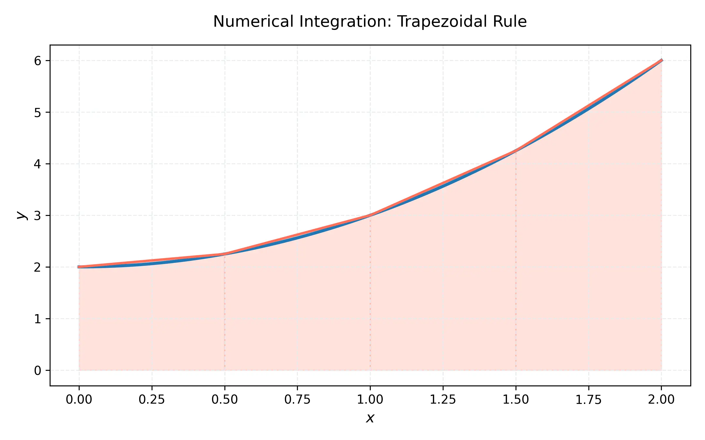

# 課程：微積分中 - 第 5 週 - 數值積分與瑕積分

本文件包含了第 5 週完整的教學內容，重點在於當函數難以求得解析解（反導函數）時，如何透過數值方法估算積分值；以及如何處理積分區間或被積函數趨向無窮大的「瑕積分」情況。

---

## 一、 單元講解 (Lecture)

### 1. 中點法則 (Midpoint Rule) (KP5.1)
*   **課本對應**：Stewart Calculus Section 7.7
*   **概念講解**：
    中點法則是利用每個子區間的中點高度來構造矩形，藉此逼近定積分。設我們將 $[a, b]$ 分成 $n$ 個等分區間，每個區間寬度為 $\Delta x = \frac{b-a}{n}$。
    子區間為 $[x_{i-1}, x_i]$，其中點為 $\bar{x}_i = \frac{x_{i-1} + x_i}{2}$。
    **中點法則公式**：
    $$\int_a^b f(x) dx \approx M_n = \Delta x [f(\bar{x}_1) + f(\bar{x}_2) + \dots + f(\bar{x}_n)]$$
*   **幾何意義與證明簡述**：
    中點法則本質上是用切線逼近。若 $f$ 在中點處的切線被用來構成梯形，其面積恰好等於中點高度乘以寬度的矩形面積。這通常比左端點或右端點法更準確。
    
*   **練習題 5.1.1**：
    利用中點法則估計 $\int_0^1 x^2 dx$，取 $n=2$。
*   **解答**：
    1. $\Delta x = \frac{1-0}{2} = 0.5$。
    2. 子區間為 $[0, 0.5]$ 與 $[0.5, 1]$。
    3. 中點分別為 $\bar{x}_1 = 0.25$ 與 $\bar{x}_2 = 0.75$。
    4. $M_2 = 0.5 \times [f(0.25) + f(0.75)] = 0.5 \times [0.0625 + 0.5625] = 0.5 \times 0.625 = 0.3125$。
    (精確值為 $1/3 \approx 0.3333$)

---

### 2. 梯形法則 (Trapezoidal Rule) (KP5.2)
*   **課本對應**：Stewart Calculus Section 7.7
*   **概念講解**：
    梯形法則是利用子區間兩端點連線構成的梯形來逼近曲線下的面積。
    **梯形法則公式**：
    $$\int_a^b f(x) dx \approx T_n = \frac{\Delta x}{2} [f(x_0) + 2f(x_1) + 2f(x_2) + \dots + 2f(x_{n-1}) + f(x_n)]$$
*   **證明簡述**：
    第 $i$ 個梯形的面積為 $\frac{f(x_{i-1}) + f(x_i)}{2} \Delta x$。將所有 $n$ 個梯形相加，中間的點 $f(x_1)$ 到 $f(x_{n-1})$ 都會被計算兩次，而端點 $f(x_0)$ 與 $f(x_n)$ 僅計算一次。
*   **練習題 5.2.1**：
    利用梯形法則估計 $\int_1^2 \frac{1}{x} dx$，取 $n=5$。
*   **解答**：
    1. $\Delta x = (2-1)/5 = 0.2$。節點為 $1.0, 1.2, 1.4, 1.6, 1.8, 2.0$。
    2. $f(x) = 1/x \implies f(1)=1, f(1.2)=0.8333, f(1.4)=0.7143, f(1.6)=0.625, f(1.8)=0.5556, f(2)=0.5$。
    3. $T_5 = \frac{0.2}{2} [1 + 2(0.8333 + 0.7143 + 0.625 + 0.5556) + 0.5] = 0.1 \times [1 + 2(2.7282) + 0.5] = 0.1 \times 6.9564 = 0.69564$。
    (精確值為 $\ln 2 \approx 0.6931$)

---

### 3. 辛普森法則 (Simpson's Rule) (KP5.3)
*   **課本對應**：Stewart Calculus Section 7.7
*   **概念講解**：
    辛普森法則利用二次函數（拋物線）來逼近函數曲線。這要求 $n$ 必須為**偶數**。
    **辛普森法則公式**：
    $$\int_a^b f(x) dx \approx S_n = \frac{\Delta x}{3} [f(x_0) + 4f(x_1) + 2f(x_2) + 4f(x_3) + \dots + 4f(x_{n-1}) + f(x_n)]$$
    係數模式為 $1, 4, 2, 4, 2, \dots, 4, 1$。
*   **證明簡述**：
    透過積分通過三點 $(x_{i-1}, y_{i-1}), (x_i, y_i), (x_{i+1}, y_{i+1})$ 的拋物線，可求得該兩小區間的面積為 $\frac{\Delta x}{3}(y_{i-1} + 4y_i + y_{i+1})$。
*   **練習題 5.3.1**：
    利用辛普森法則估計 $\int_0^\pi \sin x dx$，取 $n=4$。
*   **解答**：
    1. $\Delta x = \pi/4$。節點為 $0, \pi/4, \pi/2, 3\pi/4, \pi$。
    2. 函數值：$0, \frac{\sqrt{2}}{2}, 1, \frac{\sqrt{2}}{2}, 0$。
    3. $S_4 = \frac{\pi/4}{3} [0 + 4(\frac{\sqrt{2}}{2}) + 2(1) + 4(\frac{\sqrt{2}}{2}) + 0] = \frac{\pi}{12} [2\sqrt{2} + 2 + 2\sqrt{2}] = \frac{\pi}{12} [4\sqrt{2} + 2] \approx 2.0045$。
    (精確值為 2)

---

### 4. 瑕積分第一型：無窮區間 (KP5.4)
*   **課本對應**：Stewart Calculus Section 7.8
*   **概念講解**：
    當積分範圍包含無窮大時，我們定義：
    1. $\int_a^\infty f(x) dx = \lim_{t \to \infty} \int_a^t f(x) dx$
    2. $\int_{-\infty}^b f(x) dx = \lim_{t \to -\infty} \int_t^b f(x) dx$
    若極限存在且有限，稱其**收斂 (Convergent)**；否則**發散 (Divergent)**。
*   **重要性質 ($p$-級數積分)**：
    $\int_1^\infty \frac{1}{x^p} dx$ 在 $p > 1$ 時收斂，在 $p \le 1$ 時發散。
*   **練習題 5.4.1**：
    計算 $\int_1^\infty \frac{1}{x^2} dx$。
*   **解答**：
    $\lim_{t \to \infty} \int_1^t x^{-2} dx = \lim_{t \to \infty} [-x^{-1}]_1^t = \lim_{t \to \infty} (1 - \frac{1}{t}) = 1$。收斂。

---

### 5. 瑕積分第二型：不連續被積函數 (KP5.5)
*   **課本對應**：Stewart Calculus Section 7.8
*   **概念講解**：
    若被積函數在 $[a, b]$ 內某點 $c$ 具有垂直漸近線（不連續）：
    1. 若在 $a$ 點不連續：$\int_a^b f(x) dx = \lim_{t \to a^+} \int_t^b f(x) dx$
    2. 若在 $b$ 點不連續：$\int_a^b f(x) dx = \lim_{t \to b^-} \int_a^t f(x) dx$
*   **練習題 5.5.1**：
    計算 $\int_0^1 \frac{1}{\sqrt{x}} dx$。
*   **解答**：
    在 $x=0$ 處不連續。$\lim_{t \to 0^+} \int_t^1 x^{-1/2} dx = \lim_{t \to 0^+} [2\sqrt{x}]_t^1 = \lim_{t \to 0^+} (2 - 2\sqrt{t}) = 2$。收斂。

---

## 二、 動手實作 (Lab) - Python 數值積分

### 使用 SciPy 進行進階積分
```python
import numpy as np
from scipy.integrate import quad, trapezoid, simpson

# 1. 精確數值積分 (quad) - 使用 Clenshaw-Curtis 節點
res, err = quad(lambda x: np.exp(-x**2), 0, np.inf)
print(f"Gaussian Integral result: {res:.6f}")

# 2. 針對離散數據的梯形與辛普森法
x = np.linspace(0, np.pi, 11)
y = np.sin(x)
t_val = trapezoid(y, x)
s_val = simpson(y, x=x)
print(f"Trapezoidal: {t_val:.6f}, Simpson: {s_val:.6f}")
```

---

## 三、 本週知識點回顧 (KP)
- **KP5.1**: 中點法則利用中點高度。
- **KP5.2**: 梯形法則利用端點平均。
- **KP5.3**: 辛普森法則利用二次逼近（$n$ 必為偶數）。
- **KP5.4**: 第一型瑕積分處理無窮範圍。
- **KP5.5**: 第二型瑕積分處理不連續點。

---

## 四、 課後測驗題庫 (Quiz)

### 1. 單選題 (1-10)
1. 辛普森法則 $S_n$ 的誤差項與 $n$ 的幾次方成反比？ (A) $n$ (B) $n^2$ (C) $n^3$ (D) $n^4$
2. 欲使用辛普森法則，子區間數 $n$ 必須為： (A) 質數 (B) 奇數 (C) 偶數 (D) 3的倍數
3. 下列何者收斂？ (A) $\int_1^\infty \frac{1}{x} dx$ (B) $\int_1^\infty \frac{1}{\sqrt{x}} dx$ (C) $\int_1^\infty \frac{1}{x^2} dx$ (D) $\int_1^\infty \frac{1}{x^{0.9}} dx$
4. 梯形法則估計 $\int_a^b f(x) dx$ 時，若 $f''(x) > 0$，則 $T_n$ 會： (A) 高估 (B) 低估 (C) 等於精確值 (D) 無法判斷
5. 中點法則估計時，若 $f''(x) > 0$，則 $M_n$ 會： (A) 高估 (B) 低估 (C) 等於精確值 (D) 無法判斷
6. 計算 $\int_0^1 \ln x dx$ 屬於： (A) 第一型瑕積分 (B) 第二型瑕積分 (C) 非瑕積分 (D) 定積分
7. $\int_1^\infty e^{-x} dx$ 的值為： (A) 1 (B) $e$ (C) $1/e$ (D) 發散
8. 下列哪種方法的代數精度最高（能精確積分最高次數的多項式）？ (A) 左端點法 (B) 中點法 (C) 梯形法 (D) 辛普森法
9. $\int_0^\infty \frac{1}{1+x^2} dx$ 的值為： (A) $\pi$ (B) $\pi/2$ (C) 1 (D) 發散
10. 若 $\int_a^\infty f(x) dx$ 收斂且 $\int_a^\infty g(x) dx$ 發散，則 $\int_a^\infty (f(x)+g(x)) dx$： (A) 收斂 (B) 發散 (C) 不一定 (D) 趨於零

### 2. 填充題 (11-20)
11. 使用梯形法 $T_4$ 估計 $\int_0^2 x^2 dx$，其值為 \_\_\_\_\_\_。
12. $\int_2^\infty \frac{1}{x(\ln x)^2} dx$ 的值為 \_\_\_\_\_\_。
13. 若 $f(x)$ 為三次多項式，則辛普森法得到的估計值與精確值的關係是 \_\_\_\_\_\_。
14. $\int_0^1 \frac{1}{x-1} dx$ 是 \_\_\_\_\_\_（收斂/發散）。
15. 瑕積分 $\int_0^1 x^p dx$ 在 $p >$ \_\_\_\_\_\_ 時收斂。
16. 辛普森公式中，係數序列的中間項（非首尾）交替出現的數字是 \_\_\_\_\_\_。
17. $\int_{-\infty}^\infty \frac{1}{1+x^2} dx = $ \_\_\_\_\_\_。
18. 在區間 $[0, 10]$ 取 $n=5$，則 $\Delta x = $ \_\_\_\_\_\_。
19. 比較 $\int_1^\infty \frac{1}{x^2+1} dx$ 與 $\int_1^\infty \frac{1}{x^2} dx$，利用比較檢定法可知前者 \_\_\_\_\_\_。
20. 梯形法 $T_n$ 的公式中，$f(x_0)$ 的係數是 \_\_\_\_\_\_。

### 3. 計算與證明題 (21-30)
21. 證明 $\int_1^\infty \frac{1}{x^p} dx$ 在 $p > 1$ 時收斂。
22. 利用辛普森法 $S_4$ 估計 $\int_0^1 e^{x^2} dx$ (列式即可)。
23. 判斷 $\int_0^{\pi/2} \sec x dx$ 的收斂性。
24. 計算 $\int_0^3 \frac{1}{(x-1)^{2/3}} dx$。
25. 使用比較檢定法判斷 $\int_1^\infty \frac{\sin^2 x}{x^2} dx$ 是否收斂。
26. 說明為何辛普森法對三次多項式仍能給出精確解。
27. 求 $\int_e^\infty \frac{1}{x \ln x} dx$。
28. 設 $f(x)$ 為凸函數 ($f'' > 0$)，證明 $M_n \le \int_a^b f(x) dx \le T_n$。
29. 計算 $\int_{-\infty}^0 e^{2x} dx$。
30. 若 $f(x)$ 在 $[0, \infty)$ 上連續且 $\lim_{x \to \infty} f(x) = 1$，證明 $\int_0^\infty f(x) dx$ 發散。
