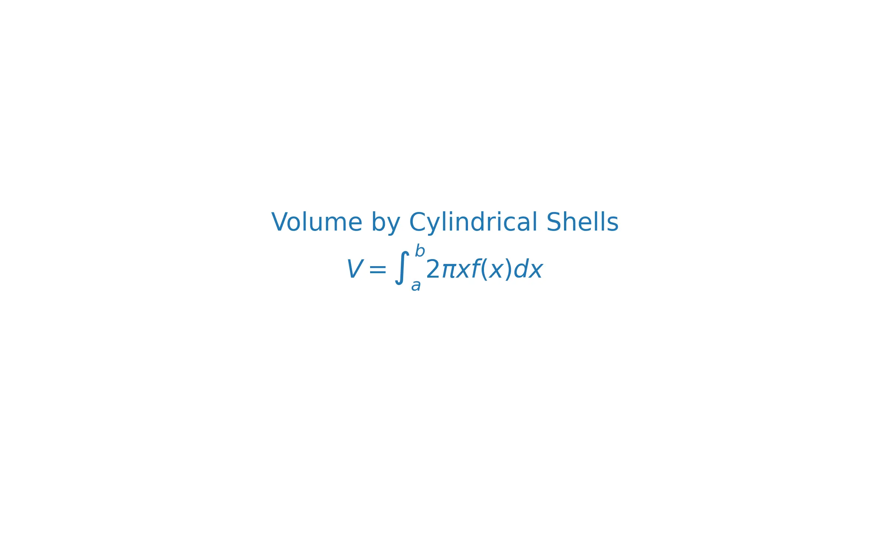

# 課程：微積分中 - 第 6 週 - 積分應用 I：體積與弧長

本週我們進入定積分的幾何應用，學習如何利用積分來計算三維空間中旋轉體的體積，以及二維平面上曲線的長度。這些工具在工程與物理設計中至關重要。

---

## 一、 單元講解 (Lecture)

### 1. 圓盤法 (Disk Method) (KP6.1)
*   **課本對應**：Stewart Calculus Section 6.2
*   **概念講解**：
    若一區域由 $y = f(x)$、 $x$-軸與垂直線 $x=a, x=b$ 圍成，將其繞 $x$-軸旋轉得到的旋轉體，其截面是圓盤。
    **公式**：
    $$V = \int_a^b \pi [f(x)]^2 dx$$
*   **證明簡述**：
    將區間 $[a, b]$ 切分為 $n$ 小段，每小段 $\Delta x$ 旋轉後形成厚度為 $\Delta x$、半徑為 $f(x_i)$ 的薄圓柱，其體積 $\Delta V = \pi R^2 \Delta x$。取極限即得積分式。
    
*   **練習題 6.1.1**：
    將 $y = \sqrt{x}$ 在 $[0, 4]$ 繞 $x$-軸旋轉，求體積。
*   **解答**：
    $V = \int_0^4 \pi (\sqrt{x})^2 dx = \pi \int_0^4 x dx = \pi [\frac{1}{2} x^2]_0^4 = 8\pi$。

---

### 2. 墊圈法 (Washer Method) (KP6.2)
*   **課本對應**：Stewart Calculus Section 6.2
*   **概念講解**：
    若旋轉區域由兩條曲線 $y=f(x)$ 與 $y=g(x)$ 圍成（且 $f(x) \ge g(x)$），旋轉後截面會形成中心有孔的墊圈。
    **公式**：
    $$V = \int_a^b \pi ([f(x)]^2 - [g(x)]^2) dx$$
    其中 $f(x)$ 是外半徑，$g(x)$ 是內半徑。
*   **練習題 6.2.1**：
    區域由 $y=x$ 與 $y=x^2$ 圍成，繞 $x$-軸旋轉，求其體積。
*   **解答**：
    1. 交點：$x = x^2 \implies x=0, 1$。
    2. 在 $[0, 1]$ 區間內，$x \ge x^2$。
    3. $V = \int_0^1 \pi (x^2 - (x^2)^2) dx = \pi \int_0^1 (x^2 - x^4) dx = \pi [\frac{x^3}{3} - \frac{x^5}{5}]_0^1 = \pi(\frac{1}{3} - \frac{1}{5}) = \frac{2\pi}{15}$。

---

### 3. 剝殼法 (Cylindrical Shells) (KP6.3)
*   **課本對應**：Stewart Calculus Section 6.3
*   **概念講解**：
    有時繞 $y$-軸旋轉時，用圓盤法會導致計算複雜（需要反函數）。此時可用「剝殼法」。
    **公式**：
    $$V = \int_a^b 2\pi x f(x) dx$$
*   **證明簡述**：
    想像一個薄圓柱殼，其半徑為 $x$，高度為 $f(x)$，厚度為 $\Delta x$。展開後其體積近似為長方形體：長 ($2\pi x$) $\times$ 高 ($f(x)$) $\times$ 厚 ($\Delta x$)。
*   **練習題 6.3.1**：
    將 $y = 2x^2 - x^3$ 與 $x$-軸圍成的區域（在第一象限）繞 $y$-軸旋轉，求體積。
*   **解答**：
    1. 邊界：$2x^2 - x^3 = 0 \implies x^2(2-x)=0 \implies x=0, 2$。
    2. $V = \int_0^2 2\pi x (2x^2 - x^3) dx = 2\pi \int_0^2 (2x^3 - x^4) dx = 2\pi [\frac{1}{2}x^4 - \frac{1}{5}x^5]_0^2 = 2\pi [8 - \frac{32}{5}] = \frac{16\pi}{5}$。

---

### 4. 弧長 (Arc Length) (KP6.4)
*   **課本對應**：Stewart Calculus Section 8.1
*   **概念講解**：
    求光滑曲線 $y = f(x)$ 在區間 $[a, b]$ 上的長度。
    **公式**：
    $$L = \int_a^b \sqrt{1 + [f'(x)]^2} dx$$
*   **證明簡述**：
    利用畢氏定理。微小弧長 $ds = \sqrt{dx^2 + dy^2} = \sqrt{1 + (dy/dx)^2} dx$。
*   **練習題 6.4.1**：
    求 $y = \frac{2}{3}x^{3/2}$ 在 $0 \le x \le 1$ 的弧長。
*   **解答**：
    1. $f'(x) = x^{1/2}$。
    2. $[f'(x)]^2 = x$。
    3. $L = \int_0^1 \sqrt{1+x} dx = [\frac{2}{3}(1+x)^{3/2}]_0^1 = \frac{2}{3}(2\sqrt{2} - 1)$。

---

### 5. 函數平均值 (Average Value of a Function) (KP6.5)
*   **課本對應**：Stewart Calculus Section 6.5
*   **概念講解**：
    函數 $f(x)$ 在 $[a, b]$ 上的平均值定義為：
    $$f_{avg} = \frac{1}{b-a} \int_a^b f(x) dx$$
*   **均值定理 (MVT for Integrals)**：
    若 $f$ 在 $[a, b]$ 連續，則存在 $c \in [a, b]$ 使得 $f(c) = f_{avg}$。
*   **練習題 6.5.1**：
    求 $f(x) = x^2$ 在 $[0, 3]$ 上的平均值。
*   **解答**：
    $f_{avg} = \frac{1}{3-0} \int_0^3 x^2 dx = \frac{1}{3} [\frac{x^3}{3}]_0^3 = \frac{1}{3} \cdot 9 = 3$。

---

## 二、 動手實作 (Lab) - Python 幾何應用

### 體積與弧長的數值計算
```python
import numpy as np
import sympy as sp

# 1. 符號運算求弧長
x = sp.Symbol('x')
f = (2/3) * x**(3/2)
df = sp.diff(f, x)
arc_length_expr = sp.sqrt(1 + df**2)
length = sp.integrate(arc_length_expr, (x, 0, 1))
print(f"Arc Length (SymPy): {length}")

# 2. 數值積分求體積 (剝殼法)
from scipy.integrate import quad
def shell_integrand(x):
    return 2 * np.pi * x * (2*x**2 - x**3)

vol, err = quad(shell_integrand, 0, 2)
print(f"Volume by Shells: {vol:.6f}")
```

---

## 三、 本週知識點回顧 (KP)
- **KP6.1**: 圓盤法適用於垂直於旋轉軸的實心截面。
- **KP6.2**: 墊圈法處理空心旋轉體。
- **KP6.3**: 剝殼法利用圓柱殼層，通常用於繞 $y$-軸旋轉。
- **KP6.4**: 弧長公式涉及導數的平方與開方。
- **KP6.5**: 函數平均值是積分值除以區間長度。

---

## 四、 課後測驗題庫 (Quiz)

### 1. 單選題 (1-10)
1. 圓盤法的積分核 (Integrand) 中通常包含： (A) $f(x)$ (B) $f(x)^2$ (C) $x f(x)$ (D) $\sqrt{1+f'(x)^2}$
2. 繞 $y$-軸旋轉時，若使用剝殼法，積分變數通常是： (A) $x$ (B) $y$ (C) $z$ (D) $\theta$
3. 弧長公式中的 $\sqrt{1+[f'(x)]^2}$ 必須滿足： (A) $f(x)>0$ (B) $f'(x)$ 連續 (C) $f''(x)>0$ (D) $f(x)$ 為多項式
4. 函數 $f(x)=c$（常數）在 $[a, b]$ 上的平均值為： (A) $c(b-a)$ (B) $c$ (C) $c/2$ (D) 0
5. 墊圈法的外半徑 $R$ 與內半徑 $r$，其體積元為： (A) $\pi(R-r)^2$ (B) $\pi(R^2-r^2)$ (C) $2\pi R r$ (D) $\pi(R^2+r^2)$
6. 若 $f(x) = \sin x$，則在 $[0, \pi]$ 的平均值為： (A) 0 (B) $1/\pi$ (C) $2/\pi$ (D) 1
7. 求 $x = y^2$ 繞 $y$-軸旋轉的體積（$0 \le y \le 1$），最簡便的方法是： (A) 圓盤法 (B) 剝殼法 (C) 弧長法 (D) 均值法
8. 剝殼法公式 $2\pi \int x f(x) dx$ 中，$2\pi x$ 代表： (A) 殼的面積 (B) 殼的圓周長 (C) 殼的厚度 (D) 殼的高度
9. 若積分所得體積為負值，通常是因為： (A) 函數在 $x$-軸下方 (B) 設定了錯誤的上下限或半徑 (C) 旋轉軸在區域左側 (D) 這是正常的
10. $\int_1^3 \sqrt{1+0} dx$ 代表的幾何意義是： (A) 圓面積 (B) 拋物線弧長 (C) 水平線段長度 (D) 單位圓體積

### 2. 填充題 (11-20)
11. $y = x^3$ 在 $[0, 1]$ 繞 $x$-軸旋轉，圓盤法體積式為 \_\_\_\_\_\_。
12. 剝殼法中，繞直線 $x = -1$ 旋轉，半徑應改為 \_\_\_\_\_\_。
13. $y = x^2$ 在 $[0, 2]$ 的平均值為 \_\_\_\_\_\_。
14. $y = \ln(\cos x)$ 在 $[0, \pi/4]$ 的弧長被稱為 \_\_\_\_\_\_（需填入具體數值積分式）。
15. 若 $f(c) = f_{avg}$，則點 $c$ 在均值定理中保證 \_\_\_\_\_\_。
16. 圓盤法中，若繞 $y=2$ 旋轉，區域在 $y=2$ 下方，則半徑為 \_\_\_\_\_\_。
17. 弧長公式 $ds = \sqrt{dx^2 + dy^2}$ 的代數變形為 $ds = \sqrt{1+(dx/dy)^2} dy$。這適用於 \_\_\_\_\_\_。
18. 單位圓 $x^2 + y^2 = 1$ 上半部的弧長精確值為 \_\_\_\_\_\_。
19. $y = e^x$ 繞 $x$-軸旋轉在 $[0, 1]$ 的體積為 \_\_\_\_\_\_。
20. 計算體積時，若截面為正方形且邊長為 $s(x)$，則體積 $V = $ \_\_\_\_\_\_。

### 3. 計算與證明題 (21-30)
21. 證明半徑為 $r$ 的球體體積為 $\frac{4}{3}\pi r^3$（利用圓盤法）。
22. 求 $y = x$ 與 $y = \sqrt{x}$ 圍成區域繞 $y$-軸旋轉之體積（利用剝殼法）。
23. 求 $y = \frac{1}{4}x^2 - \frac{1}{2}\ln x$ 在 $[1, 2]$ 的弧長。
24. 一水槽橫截面由 $y = x^2$ 給出，深 4 公尺。若水槽長 10 公尺，求盛滿水時的總體積。
25. 證明若 $f$ 是偶函數，則其在 $[-a, a]$ 的平均值等於其在 $[0, a]$ 的平均值。
26. 求 $y = \cos x$ 在 $[0, \pi/2]$ 的平均值。
27. 區域 $0 \le x \le \pi, 0 \le y \le \sin x$ 繞 $y$-軸旋轉，求體積。
28. 利用積分求直線 $y = mx + b$ 在 $[x_1, x_2]$ 的弧長，驗證其符合距離公式。
29. 求由 $x=y^2$ 與 $x=1$ 圍成區域繞 $x=1$ 旋轉的體積。
30. 設 $f$ 在 $[a, b]$ 上連續且 $\int_a^b f(x) dx = 0$，證明在 $(a, b)$ 內至少存在一點 $c$ 使得 $f(c)=0$。
