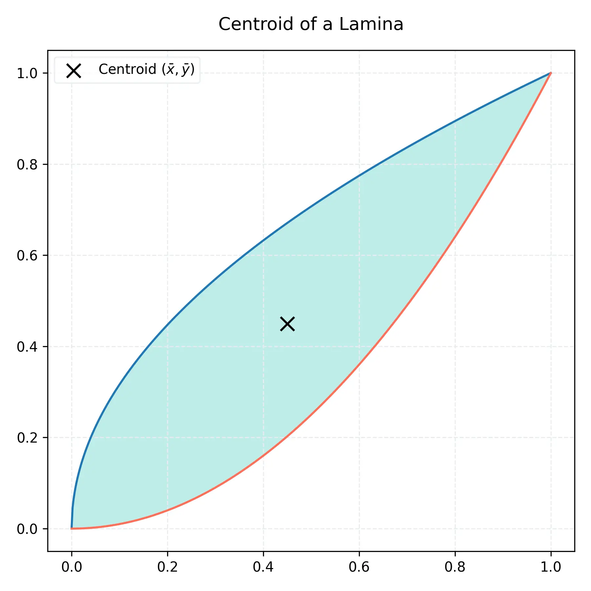

# 課程：微積分中 - 第 7 週 - 積分應用 II：表面積與物理應用

本週我們將進一步探討積分在幾何（旋轉曲面表面積）與物理（功、流體壓力、重心）中的應用。這些工具能讓我們解決現實世界中許多變動力的計算問題。

---

## 一、 單元講解 (Lecture)

### 1. 旋轉曲面表面積 (Area of a Surface of Revolution) (KP7.1)
*   **課本對應**：Stewart Calculus Section 8.2
*   **概念講解**：
    將曲線 $y = f(x)$ 繞 $x$-軸旋轉所形成的曲面表面積 $S$。
    **公式**：
    $$S = \int_a^b 2\pi f(x) \sqrt{1 + [f'(x)]^2} dx$$
*   **證明簡述**：
    想像一個微小的圓環帶，其寬度是微小弧長 $ds = \sqrt{1+(f')^2} dx$，半徑是 $f(x)$。圓環的周長為 $2\pi f(x)$，故微小面積 $dS = 2\pi r ds$。
*   **練習題 7.1.1**：
    將 $y = \sqrt{x}$ 在 $[1, 2]$ 繞 $x$-軸旋轉，求其表面積。
*   **解答**：
    1. $f'(x) = \frac{1}{2\sqrt{x}}$。
    2. $1+(f')^2 = 1 + \frac{1}{4x} = \frac{4x+1}{4x}$。
    3. $S = \int_1^2 2\pi \sqrt{x} \sqrt{\frac{4x+1}{4x}} dx = 2\pi \int_1^2 \sqrt{x} \frac{\sqrt{4x+1}}{2\sqrt{x}} dx = \pi \int_1^2 \sqrt{4x+1} dx$。
    4. 令 $u=4x+1, du=4dx$。 $S = \frac{\pi}{4} [\frac{2}{3}(4x+1)^{3/2}]_1^2 = \frac{\pi}{6} (27 - 5\sqrt{5}) \approx 8.28$。

---

### 2. 功 (Work) (KP7.2)
*   **課本對應**：Stewart Calculus Section 6.4
*   **概念講解**：
    當力 $F(x)$ 隨位置變化時，將物體從 $x=a$ 移動到 $x=b$ 所做的功 $W$。
    **公式**：
    $$W = \int_a^b F(x) dx$$
*   **虎克定律 (Hooke's Law)**：彈簧力 $F(x) = kx$，其中 $k$ 是彈性係數，$x$ 是伸長量。
*   **練習題 7.2.1**：
    將一原長 10 cm 的彈簧拉長到 15 cm 需要 2 J 的功。求將其從 15 cm 拉長到 20 cm 所需的功。
*   **解答**：
    1. $x$ 表示伸長量。15 cm 對應 $x=0.05$ m。
    2. $2 = \int_0^{0.05} kx dx = \frac{1}{2}k(0.0025) \implies k = 1600$ N/m。
    3. $W = \int_{0.05}^{0.1} 1600x dx = [800x^2]_{0.05}^{0.1} = 800(0.01 - 0.0025) = 800(0.0075) = 6$ J。

---

### 3. 流體壓力與壓力 (Hydrostatic Pressure and Force) (KP7.3)
*   **課本對應**：Stewart Calculus Section 8.3
*   **概念講解**：
    在水深 $d$ 處的壓力為 $P = \rho g d$（$\rho$ 為密度，$g$ 為重力加速度）。垂直淹沒在水中的板子所受的總壓力 $F$。
    **公式**：
    $$F = \int_a^b \rho g \cdot (\text{深度}) \cdot (\text{寬度函數}) dy$$
*   **練習題 7.3.1**：
    一個半徑為 1 m 的圓形水壩門，其圓心位於水面下 5 m。求水對此門的總壓力。（設 $\rho g = 9800$ N/m³）
*   **解答**：
    建立座標系，圓心在 $(0,0)$。水面在 $y=5$。深度為 $5-y$。寬度為 $2\sqrt{1-y^2}$。
    $F = \int_{-1}^1 9800(5-y)(2\sqrt{1-y^2}) dy$。
    拆為兩項：$98000 \int_{-1}^1 \sqrt{1-y^2} dy - 19600 \int_{-1}^1 y\sqrt{1-y^2} dy$。
    第一項是半圓面積 $\times 2 = \pi$。第二項是奇函數積分 $=0$。
    $F = 98000\pi$ N。

---

### 4. 矩與重心 (Moments and Centers of Mass) (KP7.4)
*   **課本對應**：Stewart Calculus Section 8.3
*   **概念講解**：
    求平面區域（薄板）的形心 (Centroid) $(\bar{x}, \bar{y})$。
    **公式**：
    $$\bar{x} = \frac{M_y}{A}, \quad \bar{y} = \frac{M_x}{A}$$
    其中 $A$ 為面積，$M_y = \int x f(x) dx$，$M_x = \int \frac{1}{2}[f(x)]^2 dx$。
*   **練習題 7.4.1**：
    求 $y = \cos x$ 在 $[0, \pi/2]$ 與兩軸圍成區域的形心。
*   **解答**：
    1. $A = \int_0^{\pi/2} \cos x dx = 1$。
    2. $M_y = \int_0^{\pi/2} x \cos x dx = [x\sin x + \cos x]_0^{\pi/2} = \pi/2 - 1$。
    3. $M_x = \int_0^{\pi/2} \frac{1}{2}\cos^2 x dx = \frac{1}{4} \int_0^{\pi/2} (1+\cos 2x) dx = \frac{1}{4}[x + \frac{1}{2}\sin 2x]_0^{\pi/2} = \pi/8$。
    形心為 $(\pi/2 - 1, \pi/8)$。

---

### 5. 其他應用：消費者剩餘與機率 (KP7.5)
*   **課本對應**：Stewart Calculus Section 8.4 & 8.5
*   **概念講解**：
    *   **經濟學**：消費者剩餘 (Consumer Surplus) $= \int_0^{Q} [P(q) - P^*] dq$。
    *   **機率**：機率密度函數 (PDF) 滿足 $\int_{-\infty}^\infty f(x) dx = 1$。期望值 $E(X) = \int x f(x) dx$。
    
*   **練習題 7.5.1**：
    已知需求函數 $P(q) = 100 - 0.05q^2$。若市價為 $P^* = 80$，求消費者剩餘。
*   **解答**：
    1. $80 = 100 - 0.05q^2 \implies q^2 = 400 \implies Q = 20$。
    2. $CS = \int_0^{20} (100 - 0.05q^2 - 80) dq = \int_0^{20} (20 - 0.05q^2) dq = [20q - \frac{0.05}{3}q^3]_0^{20} = 400 - \frac{400}{3} = \frac{800}{3} \approx 266.67$。

---

## 二、 動手實作 (Lab) - Python 物理應用

### 重心計算與數值壓力
```python
import sympy as sp

# 1. 符號計算形心
x = sp.Symbol('x')
f = sp.cos(x)
a, b = 0, sp.pi/2

area = sp.integrate(f, (x, a, b))
mx = sp.integrate((f**2)/2, (x, a, b))
my = sp.integrate(x * f, (x, a, b))

x_bar = my / area
y_bar = mx / area
print(f"Centroid: ({x_bar}, {y_bar})")

# 2. 數值積分求功 (假設變力)
from scipy.integrate import quad
def force(x):
    return 100 * np.sin(x) + 50 # 隨位置變化的力

work, _ = quad(force, 0, np.pi)
print(f"Work done: {work:.2f} Joules")
```

---

## 三、 本週知識點回顧 (KP)
- **KP7.1**: 表面積公式包含 $2\pi y$ 與 $ds$。
- **KP7.2**: 功是力對位移的積分。
- **KP7.3**: 流體壓力取決於深度與受力面積。
- **KP7.4**: 重心是區域質量的加權平均位置。
- **KP7.5**: 消費者剩餘反映了市場定價下的消費者獲益。

---

## 四、 課後測驗題庫 (Quiz)

### 1. 單選題 (1-10)
1. 表面積公式 $2\pi \int y ds$ 中，$ds$ 代表： (A) 弧長元素 (B) 體積元素 (C) 密度元素 (D) 功元素
2. 彈簧從平衡位置拉長 $x$ 所受的力為 $kx$，這被稱為： (A) 牛頓定律 (B) 虎克定律 (C) 歐姆定律 (D) 巴斯卡定律
3. 功的國際單位 (SI) 為： (A) 牛頓 (N) (B) 瓦特 (W) (C) 焦耳 (J) (D) 帕斯卡 (Pa)
4. 流體壓力 (Pressure) 的公式 $P = \rho g d$ 中，$d$ 是： (A) 直徑 (B) 密度 (C) 深度 (D) 位移
5. 若一薄板對稱於 $y$-軸，則其形心的 \_\_\_\_\_\_ 座標必為 0。 (A) $x$ (B) $y$ (C) $z$ (D) 原點
6. 計算形心 $(\bar{x}, \bar{y})$ 時，分母通常是區域的： (A) 寬度 (B) 周長 (C) 面積 (D) 二階矩
7. 機率密度函數 $f(x)$ 必須滿足 $f(x) \ge 0$ 且全區域積分為： (A) 0 (B) 1 (C) $\pi$ (D) $\infty$
8. 在經濟學中，需求曲線下、市價線以上的區域面積稱為： (A) 生產者剩餘 (B) 市場平衡 (C) 消費者剩餘 (D) 邊際利潤
9. 繞 $y$-軸旋轉的表面積公式，半徑應改為： (A) $x$ (B) $y$ (C) $f'(x)$ (D) $\sqrt{x}$
10. 一根長度為 $L$ 的均質細棒，其重心位於： (A) $L/4$ (B) $L/2$ (C) $L$ (D) $2L/3$

### 2. 填充題 (11-20)
11. 表面積公式繞 $x$-軸：$S = \int 2\pi y \sqrt{1 + (\_\_\_\_\_\_)^2} dx$。
12. 將 1000 kg 水抽到 10 m 高處做的功約為 \_\_\_\_\_\_ J。（取 $g=9.8$）
13. $y = x^2$ 在 $[0, 1]$ 繞 $y$-軸旋轉的表面積式子（對 $x$ 積分）為 \_\_\_\_\_\_。
14. 浸沒在水中的矩形垂直板，受力與其中心深度 \_\_\_\_\_\_（成正比/反比）。
15. 形心公式中，$M_y$ 代表區域對 \_\_\_\_\_\_ 軸的矩。
16. 若機率分佈為 $f(x) = 0.5e^{-0.5x}$ ($x \ge 0$)，其期望值為 \_\_\_\_\_\_。
17. 帕普斯定理 (Pappus's Theorem) 聯繫了旋轉體體積與區域的 \_\_\_\_\_\_。
18. 單位面積的壓力稱為 \_\_\_\_\_\_。
19. 欲計算一三角形板（底 $b$ 高 $h$）的重心，其 $\bar{y}$ 距離底邊為 \_\_\_\_\_\_。
20. 消費者剩餘 $\int_0^Q [P(q) - P^*] dq$ 中，$P^*$ 代表 \_\_\_\_\_\_。

### 3. 計算與證明題 (21-30)
21. 證明半徑為 $r$ 的球面表面積為 $4\pi r^2$。
22. 一個圓柱形水井深 20 m，半徑 1 m，盛滿水。求將所有水抽乾所需的功。
23. 求 $y = \sqrt{4-x^2}$ 在 $[-1, 1]$ 繞 $x$-軸旋轉的表面積。
24. 一個等腰三角形板，底邊 4 m 在水面，頂點向下深 3 m。求其所受流體壓力。
25. 求 $y = x^2$ 與 $y = \sqrt{x}$ 圍成區域的形心。
26. 證明帕普斯第一定理：旋轉體表面積等於生成曲線長度乘以其形心旋轉路徑長。
27. 已知 PDF $f(x) = C x^2$ 在 $[0, 3]$，求常數 $C$。
28. 求 $y = e^x$ 在 $[0, 1]$ 的形心（列式即可）。
29. 有一變力 $F(x) = 3x^2 + 2x$ (N)，求將物體從 $x=1$ 移動到 $x=3$ 的功。
30. 說明為何形心不一定位於物體內部（舉一例）。
