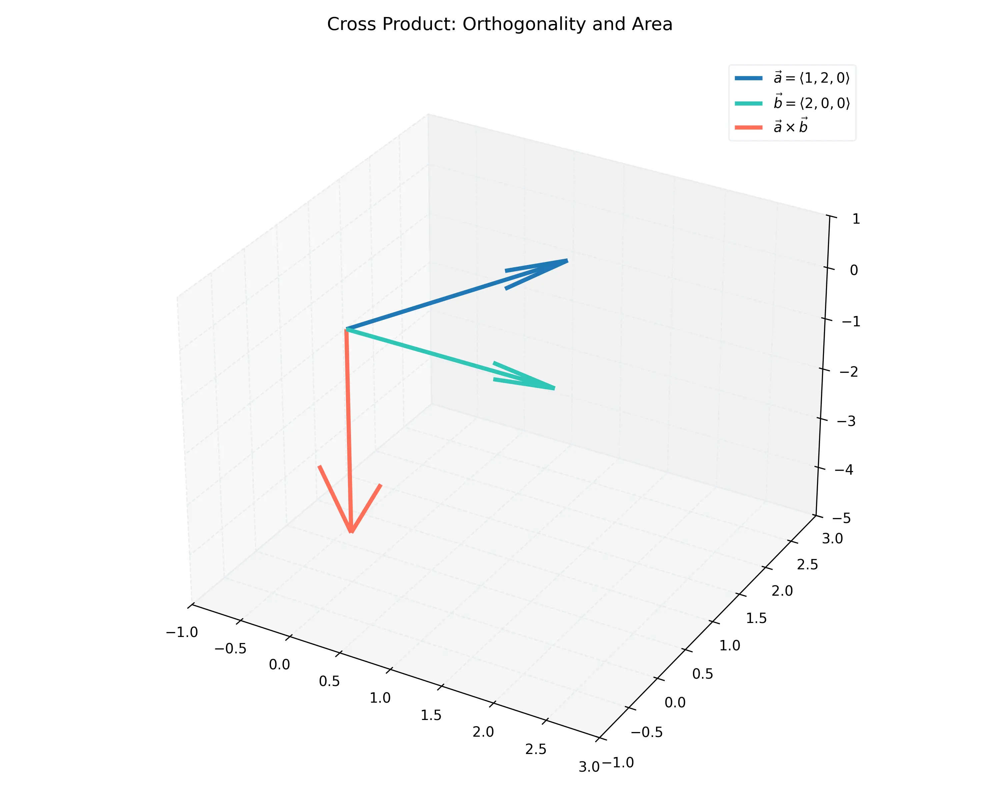

# 課程：微積分下 - 第 1 週 - 空間幾何與向量基礎 (Vectors and the Geometry of Space)

本文件包含了第 1 週完整的教學大綱、實作指南以及擴充版練習題庫。本週重點在於建立三維空間的概念，並掌握向量的代數運算與幾何意義。
本週教學內容對應 **Stewart Calculus Ch 12.1-12.4** 的核心內容。

---

## 一、 單元講解 (Lecture) - 總計 100 分鐘

### 1. 三維坐標系與距離公式 (20 min) (KP1.1)
*   **概念講解**：
    三維坐標系由三條互相垂直的數軸（$x$ 軸、$y$ 軸、$z$ 軸）構成，通常遵循**右手定則**。空間中一點 $P$ 可以用序對 $(x, y, z)$ 表示。
*   **距離公式推導**：
    設 $P_1(x_1, y_1, z_1)$ 與 $P_2(x_2, y_2, z_2)$ 為空間中兩點。根據勾股定理（畢氏定理）兩次應用，其距離為：
    $$|P_1 P_2| = \sqrt{(x_2-x_1)^2 + (y_2-y_1)^2 + (z_2-z_1)^2}$$
*   **球體方程式**：
    以 $(h, k, l)$ 為球心，$r$ 為半徑的球體方程式為：
    $$(x-h)^2 + (y-k)^2 + (z-l)^2 = r^2$$
*   **練習題**：
    *   **練習題 1.1.1**：求點 $A(1, 2, 3)$ 與 $B(4, -2, 3)$ 之間的距離。
    *   **解答**：
        $$|AB| = \sqrt{(4-1)^2 + (-2-2)^2 + (3-3)^2} = \sqrt{3^2 + (-4)^2 + 0^2} = \sqrt{9+16} = 5$$

---

### 2. 向量運算及其幾何意義 (20 min) (KP1.2)
*   **概念講解**：
    向量是同時具有大小（Magnitude）與方向（Direction）的量。
    *   **向量加法**：幾何上遵循平行四邊形法則或三角形法則。
    *   **分量表示**：$\mathbf{v} = \langle v_1, v_2, v_3 \rangle = v_1 \mathbf{i} + v_2 \mathbf{j} + v_3 \mathbf{k}$。
    *   **長度 (Magnitude)**：$|\mathbf{v}| = \sqrt{v_1^2 + v_2^2 + v_3^2}$。
*   **單位向量**：
    若 $\mathbf{v} \neq \mathbf{0}$，則與 $\mathbf{v}$ 同方向的單位向量為 $\mathbf{u} = \frac{\mathbf{v}}{|\mathbf{v}|}$。
*   **練習題**：
    *   **練習題 1.2.1**：若 $\mathbf{a} = \langle 1, 2, -2 \rangle$，求其長度與同方向之單位向量。
    *   **解答**：
        1. 長度 $|\mathbf{a}| = \sqrt{1^2 + 2^2 + (-2)^2} = \sqrt{9} = 3$。
        2. 單位向量 $\mathbf{u} = \frac{1}{3}\langle 1, 2, -2 \rangle = \langle 1/3, 2/3, -2/3 \rangle$。

---

### 3. 內積與投影 (20 min) (KP1.3)
*   **概念講解**：
    設 $\mathbf{a} = \langle a_1, a_2, a_3 \rangle, \mathbf{b} = \langle b_1, b_2, b_3 \rangle$。
    *   **代數定義**：$\mathbf{a} \cdot \mathbf{b} = a_1 b_1 + a_2 b_2 + a_3 b_3$。
    *   **幾何意義**：$\mathbf{a} \cdot \mathbf{b} = |\mathbf{a}| |\mathbf{b}| \cos \theta$，其中 $\theta$ 為兩向量夾角。
*   **數學證明**：證明 $\mathbf{a} \cdot \mathbf{b} = |\mathbf{a}| |\mathbf{b}| \cos \theta$。
    *   **證明**：考慮由 $\mathbf{a}, \mathbf{b}, \mathbf{a-b}$ 組成的三角形。根據餘弦定理：
        $$|\mathbf{a-b}|^2 = |\mathbf{a}|^2 + |\mathbf{b}|^2 - 2|\mathbf{a}||\mathbf{b}|\cos\theta$$
        代入向量分量展開：
        $$\sum (a_i - b_i)^2 = \sum a_i^2 + \sum b_i^2 - 2|\mathbf{a}||\mathbf{b}|\cos\theta$$
        $$\sum (a_i^2 - 2a_i b_i + b_i^2) = \sum a_i^2 + \sum b_i^2 - 2|\mathbf{a}||\mathbf{b}|\cos\theta$$
        $$-2 \sum a_i b_i = -2|\mathbf{a}||\mathbf{b}|\cos\theta \implies \mathbf{a} \cdot \mathbf{b} = |\mathbf{a}||\mathbf{b}|\cos\theta$$
*   **正交射影 (Projection)**：
    $\text{proj}_{\mathbf{a}} \mathbf{b} = \left( \frac{\mathbf{a} \cdot \mathbf{b}}{|\mathbf{a}|^2} \right) \mathbf{a}$。
*   **練習題**：
    *   **練習題 1.3.1**：求向量 $\mathbf{a} = \langle 3, -1, 2 \rangle$ 在 $\mathbf{b} = \langle 1, 2, 2 \rangle$ 方向上的標量投影。
    *   **解答**：
        標量投影 $\text{comp}_{\mathbf{b}} \mathbf{a} = \frac{\mathbf{a} \cdot \mathbf{b}}{|\mathbf{b}|} = \frac{3(1) + (-1)(2) + 2(2)}{\sqrt{1^2+2^2+2^2}} = \frac{3-2+4}{3} = \frac{5}{3}$。

---

### 4. 外積及其幾何應用 (20 min) (KP1.4)
*   **概念講解**：
    外積 $\mathbf{a} \times \mathbf{b}$ 僅定義於三維空間。其結果是一個同時垂直於 $\mathbf{a}$ 與 $\mathbf{b}$ 的向量。
    *   **代數定義**：利用行列式
        $$\mathbf{a} \times \mathbf{b} = \begin{vmatrix} \mathbf{i} & \mathbf{j} & \mathbf{k} \\ a_1 & a_2 & a_3 \\ b_1 & b_2 & b_3 \end{vmatrix}$$
    *   **性質**：$|\mathbf{a} \times \mathbf{b}| = |\mathbf{a}| |\mathbf{b}| \sin \theta$。這代表了以 $\mathbf{a}, \mathbf{b}$ 為鄰邊之平行四邊形的面積。
*   **視覺化參考**：
    下圖展示了外積向量的方向如何遵循右手定則，以及其長度與夾角的關係：
    
*   **練習題**：
    *   **練習題 1.4.1**：若 $\mathbf{a} = \langle 1, 3, 4 \rangle, \mathbf{b} = \langle 2, 7, -5 \rangle$，求 $\mathbf{a} \times \mathbf{b}$。
    *   **解答**：
        $$\mathbf{a} \times \mathbf{b} = \begin{vmatrix} \mathbf{i} & \mathbf{j} & \mathbf{k} \\ 1 & 3 & 4 \\ 2 & 7 & -5 \end{vmatrix} = (3(-5)-4(7))\mathbf{i} - (1(-5)-4(2))\mathbf{j} + (1(7)-3(2))\mathbf{k} = -43\mathbf{i} + 13\mathbf{j} + \mathbf{k} = \langle -43, 13, 1 \rangle$$

---

### 5. 純量三重積與體積 (20 min) (KP1.5)
*   **概念講解**：
    由 $\mathbf{a}, \mathbf{b}, \mathbf{c}$ 組成的純量三重積定義為 $\mathbf{a} \cdot (\mathbf{b} \times \mathbf{c})$。
    *   **幾何意義**：其絕對值等於由這三個向量作為稜邊所構成的**平行六面體 (Parallelepiped)** 的體積 $V$。
    *   **計算公式**：
        $$V = |\det(\mathbf{a}, \mathbf{b}, \mathbf{c})| = \left| \begin{vmatrix} a_1 & a_2 & a_3 \\ b_1 & b_2 & b_3 \\ c_1 & c_2 & c_3 \end{vmatrix} \right|$$
*   **共面判定**：若三重積為 0，則 $\mathbf{a}, \mathbf{b}, \mathbf{c}$ 共面。
*   **練習題**：
    *   **練習題 1.5.1**：判定 $\mathbf{a}=\langle 1, 4, -7 \rangle, \mathbf{b}=\langle 2, -1, 4 \rangle, \mathbf{c}=\langle 0, -9, 18 \rangle$ 是否共面？
    *   **解答**：
        計算行列式：
        $$\begin{vmatrix} 1 & 4 & -7 \\ 2 & -1 & 4 \\ 0 & -9 & 18 \end{vmatrix} = 1(-18+36) - 4(36-0) - 7(-18-0) = 18 - 144 + 126 = 0$$
        因為三重積為 0，故這三個向量共面。

---

## 二、 動手實作 (Lab) - 總計 50 分鐘

### 實作：Matplotlib 3D 向量運算與視覺化
**任務目標**：透過 Python 實作 3D 向量的加法、內積、外積，並繪製 3D 圖形。

```python
import matplotlib.pyplot as plt
import numpy as np

def plot_vectors(vecs, colors):
    fig = plt.figure(figsize=(10, 10))
    ax = fig.add_subplot(111, projection='3d')
    
    # 原點
    origin = [0, 0, 0]
    
    for i in range(len(vecs)):
        ax.quiver(origin[0], origin[1], origin[2], vecs[i][0], vecs[i][1], vecs[i][2], 
                  color=colors[i], arrow_length_ratio=0.1)
    
    ax.set_xlim([-5, 5])
    ax.set_ylim([-5, 5])
    ax.set_zlim([-5, 5])
    ax.set_xlabel('X')
    ax.set_ylabel('Y')
    ax.set_zlabel('Z')
    plt.title("3D Vector Visualization")
    plt.show()

# 定義向量
a = np.array([3, 1, 2])
b = np.array([-1, 2, 3])

# 運算
cross_prod = np.cross(a, b)
dot_prod = np.dot(a, b)

print(f"向量 a: {a}")
print(f"向量 b: {b}")
print(f"內積 a . b: {dot_prod}")
print(f"外積 a x b: {cross_prod}")

# 繪圖 (顯示 a, b 與其外積)
plot_vectors([a, b, cross_prod], ['r', 'b', 'g'])
```

---

## 三、 本週知識點回顧 (KP)
- **KP1.1**: 3D 坐標系、距離公式與球體方程式。
- **KP1.2**: 向量代數運算、長度計算與單位向量。
- **KP1.3**: 內積的代數與幾何定義（夾角計算與正交判定）。
- **KP1.4**: 外積的計算（行列式法）與其幾何意義（面積與垂直性）。
- **KP1.5**: 純量三重積與平行六面體體積。

---

## 四、 課後測驗題庫 (Quiz) - 30 分鐘

### 1. 單選題 (Single Choice) - 共 10 題
1. **Q1**: 點 $(1, -2, 5)$ 到 $xy$ 平面的距離是多少？
   - (A) 1 (B) 2 (C) 5 (D) $\sqrt{30}$
2. **Q2**: 若 $\mathbf{a} \cdot \mathbf{b} = 0$，則兩向量的關係為？
   - (A) 平行 (B) 垂直 (C) 相等 (D) 反向
3. **Q3**: 下列哪項運算的結果是「純量 (Scalar)」？
   - (A) $\mathbf{a} + \mathbf{b}$ (B) $\mathbf{a} \times \mathbf{b}$ (C) $\mathbf{a} \cdot \mathbf{b}$ (D) $k \mathbf{a}$
4. **Q4**: 外積 $\mathbf{i} \times \mathbf{j}$ 等於？
   - (A) $\mathbf{k}$ (B) $-\mathbf{k}$ (C) $0$ (D) $1$
5. **Q5**: 以 $(0, 0, 0)$ 為球心，半徑為 2 的球體方程式？
   - (A) $x+y+z=4$ (B) $x^2+y^2+z^2=2$ (C) $x^2+y^2+z^2=4$ (D) $x^2+y^2+z^2=8$
6. **Q6**: 若 $|\mathbf{a}| = 2, |\mathbf{b}| = 3$，夾角為 $60^\circ$，則 $\mathbf{a} \cdot \mathbf{b} =$？
   - (A) 3 (B) $3\sqrt{3}$ (C) 6 (D) 0
7. **Q7**: 向量 $\mathbf{a} = \langle 1, 2, 2 \rangle$ 的長度為？
   - (A) 3 (B) 5 (C) 9 (D) $\sqrt{5}$
8. **Q8**: 下列何者可以判定三向量 $\mathbf{a, b, c}$ 共面？
   - (A) $\mathbf{a} \cdot \mathbf{b} = 0$ (B) $\mathbf{a} \times \mathbf{b} = \mathbf{c}$ (C) $\mathbf{a} \cdot (\mathbf{b} \times \mathbf{c}) = 0$ (D) $\mathbf{a} + \mathbf{b} = \mathbf{c}$
9. **Q9**: $\mathbf{a} \times \mathbf{a}$ 的結果為？
   - (A) $|\mathbf{a}|^2$ (B) $\mathbf{0}$ (C) $1$ (D) $\mathbf{a}$
10. **Q10**: 向量 $\langle 2, -1, 3 \rangle$ 的反方向向量為？
    - (A) $\langle -2, 1, -3 \rangle$ (B) $\langle 2, 1, 3 \rangle$ (C) $\langle 1/2, -1, 1/3 \rangle$ (D) $\langle 3, -1, 2 \rangle$

### 2. 多選題 (Multiple Choice) - 共 10 題
11. **Q11**: 關於向量運算性質，哪些正確？
    - (A) $\mathbf{a} \cdot \mathbf{b} = \mathbf{b} \cdot \mathbf{a}$ (B) $\mathbf{a} \times \mathbf{b} = \mathbf{b} \times \mathbf{a}$ (C) $\mathbf{a} \times \mathbf{b} = -(\mathbf{b} \times \mathbf{a})$ (D) $\mathbf{a} \cdot (\mathbf{b} + \mathbf{c}) = \mathbf{a} \cdot \mathbf{b} + \mathbf{a} \cdot \mathbf{c}$
12. **Q12**: 下列哪些點位於球體 $x^2 + y^2 + z^2 \le 9$ 內部或表面？
    - (A) $(1, 1, 1)$ (B) $(3, 0, 0)$ (C) $(2, 2, 2)$ (D) $(0, 4, 0)$
13. **Q13**: 關於外積 $\mathbf{c} = \mathbf{a} \times \mathbf{b}$，哪些描述正確？
    - (A) $\mathbf{c} \perp \mathbf{a}$ (B) $\mathbf{c} \perp \mathbf{b}$ (C) $|\mathbf{c}|$ 是面積 (D) $\mathbf{c}$ 是標量
14. **Q14**: 若 $\mathbf{a}$ 為單位向量，則：
    - (A) $|\mathbf{a}| = 1$ (B) $\mathbf{a} \cdot \mathbf{a} = 1$ (C) $\mathbf{a} \times \mathbf{a} = \mathbf{0}$ (D) $\mathbf{a}$ 的方向任意
15. **Q15**: 三維空間中，方程式 $z = 3$ 可能表示：
    - (A) 一個點 (B) 一條直線 (C) 一個平面 (D) 所有 $z$ 坐標為 3 的點的集合
16. **Q16**: 向量 $\mathbf{a} = \langle 2, 4 \rangle$ 與 $\mathbf{b} = \langle -2, 1 \rangle$ 是：
    - (A) 垂直的 (B) 內積為 0 (C) 平行的 (D) 反向的
17. **Q17**: 哪些運算可以用來求兩向量間的夾角？
    - (A) 內積 (B) 外積 (C) 向量加法 (D) 純量倍數
18. **Q18**: 關於右手定則，下列哪些組成的序對滿足右手系？
    - (A) $(\mathbf{i, j, k})$ (B) $(\mathbf{j, k, i})$ (C) $(\mathbf{k, i, j})$ (D) $(\mathbf{j, i, k})$
19. **Q19**: 若 $\mathbf{a} \cdot (\mathbf{b} \times \mathbf{c}) = 12$，則由這三向量構成的平行六面體體積可能為？
    - (A) 12 (B) -12 (C) 24 (D) 以上皆非
20. **Q20**: 空間中兩點 $P(1, 0, 0)$ 與 $Q(0, 1, 0)$，其：
    - (A) 距離為 $\sqrt{2}$ (B) 中點為 $(0.5, 0.5, 0)$ (C) 向量 $\vec{PQ} = \langle -1, 1, 0 \rangle$ (D) 向量 $\vec{QP} = \langle 1, -1, 0 \rangle$

### 3. 填充題 (Fill-in-the-blank) - 共 10 題
21. **Q21**: 點 $(2, 3, 4)$ 到 $z$ 軸的距離為 __________。
22. **Q22**: 向量 $\mathbf{a} = \langle 2, -1, 2 \rangle$ 的單位向量為 __________。
23. **Q23**: 若 $\mathbf{a} = \langle 1, 0, 1 \rangle, \mathbf{b} = \langle 0, 1, 1 \rangle$，則 $\mathbf{a} \cdot \mathbf{b} =$ __________。
24. **Q24**: $|\mathbf{i} - 2\mathbf{j} + 2\mathbf{k}| =$ __________。
25. **Q25**: 若 $\mathbf{a} \times \mathbf{b} = \langle 3, 4, 12 \rangle$，則由 $\mathbf{a, b}$ 構成的平行四邊形面積為 __________。
26. **Q26**: 兩向量 $\mathbf{a} = \langle 1, 1, 0 \rangle$ 與 $\mathbf{b} = \langle 0, 1, 1 \rangle$ 的夾角為 __________ 度。
27. **Q27**: 方程式 $x^2 + y^2 + z^2 - 2x + 4y = 0$ 代表的球心坐標為 __________。
28. **Q28**: 向量 $\langle 1, 2, 3 \rangle$ 與 $\langle 2, 4, 6 \rangle$ 的關係為 __________ (填平行或垂直)。
29. **Q29**: $(\mathbf{i} \times \mathbf{j}) \cdot \mathbf{k} =$ __________。
30. **Q30**: 空間中點 $(x, y, z)$ 到原點的距離公式為 __________。

---

## 五、 Q 矩陣 (Q-matrix)
| 題號 | KP1.1 | KP1.2 | KP1.3 | KP1.4 | KP1.5 |
|---|---|---|---|---|---|
| Q1-Q10 | 1, 5 | 7, 10 | 2, 3, 6 | 4, 9 | 8 |
| Q11-Q20| 12, 15, 20 | 14 | 11, 16, 17 | 13, 18 | 19 |
| Q21-Q30| 21, 27, 30 | 22, 24, 28 | 23, 26 | 25, 29 | |
