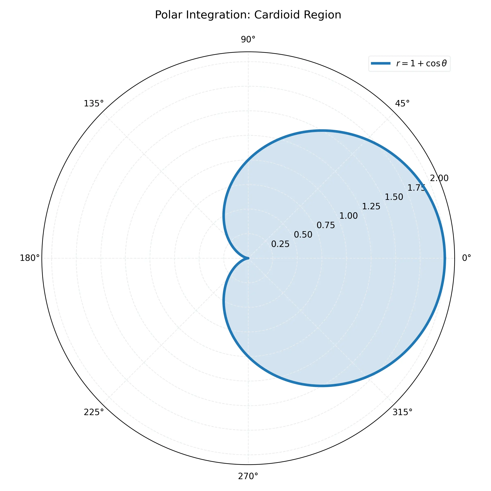

# 課程：微積分下 - 第 10 週 - 極座標與多重積分應用 (Double Integrals in Polar Coordinates & Applications)

本文件包含了第 10 週的完整教學大綱、實作指南以及擴充版練習題庫。本週重點在於掌握二重積分在極座標系統下的轉換與計算，並應用於物理量（如質量、質心、慣性矩）的計算。
本週教學內容對應 **Stewart Calculus Ch 15.3-15.4**。

---

## 一、 單元講解 (Lecture) - 總計 100 分鐘

### 1. 二重積分的極座標轉換 (20 min) (KP10.1)
*   **概念講解**：
    當積分區域 $D$ 具有圓對稱性（如圓、環、扇形）時，使用極座標 $(r, \theta)$ 會比直角座標 $(x, y)$ 簡單得多。
    轉換關係：$x = r \cos \theta, \quad y = r \sin \theta$。
*   **面積元素的推導**：
    在極座標中，一個微小區域（極矩形）的面積 $dA$ 不是 $dr d\theta$。考慮一個半徑由 $r$ 變到 $r+dr$，角度由 $\theta$ 變到 $\theta+d\theta$ 的小塊。其面積約為：
    $$dA = (\text{弧長}) \times (\text{寬度}) = (r d\theta) \times dr = r dr d\theta$$
*   **二重積分公式**：
    $$\iint_D f(x, y) \, dA = \int_{\alpha}^{\beta} \int_{h_1(\theta)}^{h_2(\theta)} f(r\cos\theta, r\sin\theta) \, r \, dr d\theta$$
    **注意：千萬不要忘記被積函數中的 $r$！**
*   **練習題**：
    *   **練習題 10.1.1**：計算 $\iint_D (x^2 + y^2) \, dA$，其中 $D$ 是單位圓 $x^2 + y^2 \le 1$。
    *   **解答**：
        在極座標中，$x^2 + y^2 = r^2$，$D = \{ (r, \theta) \mid 0 \le r \le 1, 0 \le \theta \le 2\pi \}$。
        $$\int_0^{2\pi} \int_0^1 (r^2) \, r \, dr d\theta = \int_0^{2\pi} \left[ \frac{1}{4}r^4 \right]_0^1 d\theta = \int_0^{2\pi} \frac{1}{4} d\theta = \frac{\pi}{2}$$

---

### 2. 極座標積分範例與視覺化 (20 min) (KP10.2)
*   **概念講解**：
    有時我們需要積分非中心對稱的區域，例如 $r = 2\cos\theta$（圓心在 $(1,0)$ 的圓）。
*   **視覺化參考**：
    
*   **練習題**：
    *   **練習題 10.2.1**：計算 $r = \cos(3\theta)$ 其中一個葉瓣的面積。
    *   **解答**：
        一個葉瓣對應 $\cos(3\theta) \ge 0$，例如 $-\pi/6 \le \theta \le \pi/6$。
        $$A = \iint_D 1 \, dA = \int_{-\pi/6}^{\pi/6} \int_0^{\cos(3\theta)} r \, dr d\theta = \int_{-\pi/6}^{\pi/6} \frac{1}{2}\cos^2(3\theta) \, d\theta$$
        利用 $\cos^2 A = \frac{1+\cos 2A}{2}$：
        $$A = \frac{1}{4} \int_{-\pi/6}^{\pi/6} (1 + \cos(6\theta)) \, d\theta = \frac{1}{4} \left[ \theta + \frac{1}{6}\sin(6\theta) \right]_{-\pi/6}^{\pi/6} = \frac{1}{4} (\frac{\pi}{6} + \frac{\pi}{6}) = \frac{\pi}{12}$$

---

### 3. 密度與質量應用 (20 min) (KP10.3)
*   **概念講解**：
    若一薄片（Lina）佔據區域 $D$，其面密度函數為 $\rho(x, y)$。
    *   **總質量 (Mass)**：$m = \iint_D \rho(x, y) \, dA$。
*   **物理意義**：積分是將微小塊的質量 $dm = \rho dA$ 累加。
*   **練習題**：
    *   **練習題 10.3.1**：求半徑為 $a$ 的半圓薄片質量，已知其密度與到原點的距離成正比（$\rho = k\sqrt{x^2+y^2}$）。
    *   **解答**：
        極座標下 $\rho = kr$。半圓區域 $D: 0 \le r \le a, 0 \le \theta \le \pi$。
        $$m = \int_0^{\pi} \int_0^a (kr) \cdot r \, dr d\theta = k \int_0^{\pi} \frac{a^3}{3} d\theta = \frac{k\pi a^3}{3}$$

---

### 4. 質心計算 (20 min) (KP10.4)
*   **概念講解**：
    質心 $(\bar{x}, \bar{y})$ 代表薄片的平衡點。
    *   **對 $y$ 軸的矩 (Moment about y-axis)**：$M_y = \iint_D x \rho(x, y) \, dA$。
    *   **對 $x$ 軸的矩 (Moment about x-axis)**：$M_x = \iint_D y \rho(x, y) \, dA$。
    *   **座標**：$\bar{x} = \frac{M_y}{m}, \quad \bar{y} = \frac{M_x}{m}$。
*   **練習題**：
    *   **練習題 10.4.1**：求密度均勻（$\rho=1$）的半圓區域 $x^2 + y^2 \le a^2, y \ge 0$ 的質心。
    *   **解答**：
        1. 質量 $m = \frac{1}{2}\pi a^2$。
        2. 由對稱性可知 $\bar{x} = 0$。
        3. $M_x = \iint_D y \, dA = \int_0^{\pi} \int_0^a (r\sin\theta) r \, dr d\theta = \int_0^{\pi} \sin\theta d\theta \cdot \int_0^a r^2 dr = [-\cos\theta]_0^{\pi} \cdot \frac{a^3}{3} = 2 \cdot \frac{a^3}{3} = \frac{2a^3}{3}$。
        4. $\bar{y} = \frac{2a^3/3}{\pi a^2/2} = \frac{4a}{3\pi}$。

---

### 5. 慣性矩與高斯積分 (20 min) (KP10.5)
*   **概念講解**：
    *   **慣性矩 (Moment of Inertia)**：衡量轉動慣性的量。
        $I_x = \iint_D y^2 \rho dA, \quad I_y = \iint_D x^2 \rho dA$。
        $I_0 = I_x + I_y = \iint_D (x^2+y^2) \rho dA$ (極慣性矩)。
*   **高斯積分的證明**：
    計算 $I = \int_{-\infty}^{\infty} e^{-x^2} dx$。
    考慮 $I^2 = \left(\int_{-\infty}^{\infty} e^{-x^2} dx\right)\left(\int_{-\infty}^{\infty} e^{-y^2} dy\right) = \int_{-\infty}^{\infty} \int_{-\infty}^{\infty} e^{-(x^2+y^2)} dx dy$。
    轉為極座標：
    $I^2 = \int_0^{2\pi} \int_0^{\infty} e^{-r^2} r \, dr d\theta = 2\pi \cdot \left[ -\frac{1}{2}e^{-r^2} \right]_0^{\infty} = 2\pi \cdot \frac{1}{2} = \pi$。
    故 $\int_{-\infty}^{\infty} e^{-x^2} dx = \sqrt{\pi}$。

---

## 二、 動手實作 (Lab) - 總計 50 分鐘

### 實作：SciPy 多重積分與高斯積分驗證
**任務目標**：利用 Python 計算極座標下的二重積分。

```python
import numpy as np
from scipy.integrate import dblquad

# 任務 1: 計算單位圓面積 (極座標下積分 1*r dr dtheta)
# dblquad(func, theta_low, theta_up, r_low_func, r_up_func)
# 注意 scipy 的 dblquad 參數順序
area, err = dblquad(lambda r, theta: r, 0, 2*np.pi, lambda theta: 0, lambda theta: 1)
print(f"單位圓面積: {area:.6f} (理論值: {np.pi:.6f})")

# 任務 2: 驗證高斯積分
from scipy.integrate import quad
gauss_val, err = quad(lambda x: np.exp(-x**2), -np.inf, np.inf)
print(f"高斯積分結果: {gauss_val:.6f} (理論值: {np.sqrt(np.pi):.6f})")

# 任務 3: 計算心形線 r = 1 + cos(theta) 的質量 (密度 rho = r)
# m = iint r * r dr dtheta
mass, err = dblquad(lambda r, theta: r*r, 0, 2*np.pi, lambda theta: 0, lambda theta: 1 + np.cos(theta))
print(f"心形線質量: {mass:.6f}")
```

---

## 三、 本週知識點回顧 (KP)
- **KP10.1**: 掌握 $dA = r dr d\theta$ 及其背後的幾何意義。
- **KP10.2**: 能夠設定極座標積分的邊界，特別是 $r=f(\theta)$ 的曲線。
- **KP10.3**: 應用二重積分計算平面薄片的質量。
- **KP10.4**: 理解矩的概念並能計算質心。
- **KP10.5**: 理解慣性矩的定義及極座標在解決廣義積分（如高斯積分）中的威力。

---

## 四、 課後測驗題庫 (Quiz) - 30 分鐘

### 1. 單選題 (Single Choice) - 10 題
1. **Q1**: 極座標轉換中，面積元素 $dA$ 等於？
   (A) $dr d\theta$ (B) $r dr d\theta$ (C) $r^2 dr d\theta$ (D) $2\pi r dr$
2. **Q2**: 在極座標下，單位圓 $x^2 + y^2 \le 1$ 的表示範圍為？
   (A) $0 \le r \le 1, 0 \le \theta \le \pi$ (B) $0 \le r \le 1, 0 \le \theta \le 2\pi$ (C) $-1 \le r \le 1, 0 \le \theta \le \pi$ (D) $r=1$
3. **Q3**: 計算 $\iint_D \sqrt{x^2+y^2} dA$，其中 $D$ 是 $r=2$ 內的區域。
   (A) $4\pi/3$ (B) $8\pi/3$ (C) $16\pi/3$ (D) $2\pi$
4. **Q4**: 若薄片密度均勻為 $\rho$，則其質心位置取決於？
   (A) 密度大小 (B) 幾何形狀 (C) 總質量 (D) 以上皆非
5. **Q5**: 極慣性矩 $I_0$ 的公式為？
   (A) $\iint x^2 dA$ (B) $\iint y^2 dA$ (C) $\iint (x^2+y^2)\rho dA$ (D) $\iint \sqrt{x^2+y^2} dA$
6. **Q6**: $\int_{-\infty}^{\infty} e^{-x^2} dx$ 的值為？
   (A) $\pi$ (B) $\sqrt{\pi}$ (C) $1$ (D) $0$
7. **Q7**: 方程式 $r = 2\sin\theta$ 代表一個？
   (A) 心形線 (B) 圓 (C) 玫瑰線 (D) 直線
8. **Q8**: 若區域 $D$ 是由 $y=x$ 與 $y=0$ 且 $x^2+y^2 \le 4$ 圍成，其 $\theta$ 範圍是？
   (A) $0 \le \theta \le \pi/2$ (B) $0 \le \theta \le \pi/4$ (C) $\pi/4 \le \theta \le \pi/2$ (D) $0 \le \theta \le 2\pi$
9. **Q9**: 計算 $\iint_D e^{x^2+y^2} dA$，其中 $D$ 是單位圓。
   (A) $\pi(e-1)$ (B) $2\pi e$ (C) $\pi/2 (e-1)$ (D) $e$
10. **Q10**: 質心 $\bar{y}$ 的計算公式為？
    (A) $M_x/m$ (B) $M_y/m$ (C) $\iint y dA / \text{Area}$ (D) $M_x/M_y$

### 2. 多選題 (Multiple Choice) - 10 題
11. **Q11**: 下列關於極座標積分的敘述，哪些正確？
    (A) 必須將 $x$ 換成 $r\cos\theta$ (B) 必須將 $y$ 換成 $r\sin\theta$ (C) $dA$ 必須補上一個 $r$ (D) 積分限必須是常數
12. **Q12**: 若區域 $D$ 對 $x$ 軸對稱且密度 $\rho$ 亦對 $x$ 軸對稱，則：
    (A) $\bar{x} = 0$ (B) $\bar{y} = 0$ (C) $M_x = 0$ (D) $M_y = 0$
13. **Q13**: 關於心形線 $r = 1+\cos\theta$，哪些正確？
    (A) 它是封閉曲線 (B) 其面積為 $\frac{3\pi}{2}$ (C) $\theta$ 範圍是 $0$ 到 $2\pi$ (D) 它對 $y$ 軸對稱
14. **Q14**: 慣性矩的單位（若長度為 $m$，質量為 $kg$）為？
    (A) $kg \cdot m$ (B) $kg \cdot m^2$ (C) $kg/m^2$ (D) 物理量，取決於 $\rho$ 單位
15. **Q15**: 極座標適合處理哪些區域？
    (A) 矩形 (B) 環形 (C) 圓心在原點的扇形 (D) 任意三角形
16. **Q16**: 關於高斯積分 $\int_{-\infty}^{\infty} e^{-x^2} dx = \sqrt{\pi}$，其推導過程涉及：
    (A) 分部積分 (B) 二重積分 (C) 極座標轉換 (D) 變數變換 $u=r^2$
17. **Q17**: 哪些因素會影響薄片的質心？
    (A) 薄片的外觀邊界 (B) 薄片內部的密度分佈 (C) 重力加速度 $g$ (D) 座標系的平移
18. **Q18**: 若 $\rho(x,y) = x^2+y^2$，則：
    (A) 密度只與距離有關 (B) 它是徑向對稱的 (C) $\iint \rho dA$ 等於極慣性矩 $I_0$ (當 $\rho_{orig}=1$) (D) 質量為 0
19. **Q19**: 在極座標中，圓 $r = 2\cos\theta$：
    (A) 通過原點 (B) 半徑為 1 (C) 圓心在 $(1, 0)$ (D) $\theta$ 完整範圍是 $0$ 到 $\pi$
20. **Q20**: 計算二重積分時，若被積函數包含 $x^2+y^2$，應優先考慮：
    (A) 直角座標 (B) 極座標 (C) 分部積分 (D) 雅可比行列式

### 3. 填充題 (Fill-in-the-blank) - 10 題
21. **Q21**: $\int_0^{\pi/2} \int_0^1 r^3 dr d\theta = \underline{\quad\quad}$。
22. **Q22**: 半徑為 $R$ 的圓面積公式在極座標下積分式為 $\int_0^{2\pi} \int_0^R \underline{\quad\quad} dr d\theta$。
23. **Q23**: 均勻半圓 $x^2+y^2 \le a^2, y \ge 0$ 的質心 $\bar{y} = \underline{\quad\quad}$。
24. **Q24**: 極慣性矩 $I_0$ 與 $I_x, I_y$ 的關係式為 $I_0 = \underline{\quad\quad}$。
25. **Q25**: 若 $\rho = 1$，區域 $D$ 是 $r=1$ 與 $r=2$ 之間的環，則其質量為 $\underline{\quad\quad}$。
26. **Q26**: 極座標下 $x = \underline{\quad\quad}$。
27. **Q27**: $\int_{-\infty}^{\infty} e^{-x^2/2} dx = \underline{\quad\quad}$ (提示：利用高斯積分結果與變數變換)。
28. **Q28**: 玫瑰線 $r = \cos(2\theta)$ 在第一象限（$0 \le \theta \le \pi/4$）的面積積分式為 $\int_0^{\pi/4} \underline{\quad\quad} d\theta$。
29. **Q29**: 若 $M_y = 10, m = 5$，則 $\bar{x} = \underline{\quad\quad}$。
30. **Q30**: 雅可比行列式（Jacobian）在直角轉極座標時的值為 $\underline{\quad\quad}$。

---

## 五、 Q 矩陣 (Q-matrix)
| 題號 | KP10.1 | KP10.2 | KP10.3 | KP10.4 | KP10.5 |
|---|---|---|---|---|---|
| Q1-Q10 | 1, 2, 8 | 3, 7, 9 | 4 | 10 | 5, 6 |
| Q11-Q20| 11, 15, 20| 13, 19 | 18 | 12, 17 | 14, 16 |
| Q21-Q30| 22, 26, 30| 21, 28 | 25 | 23, 29 | 24, 27 |
