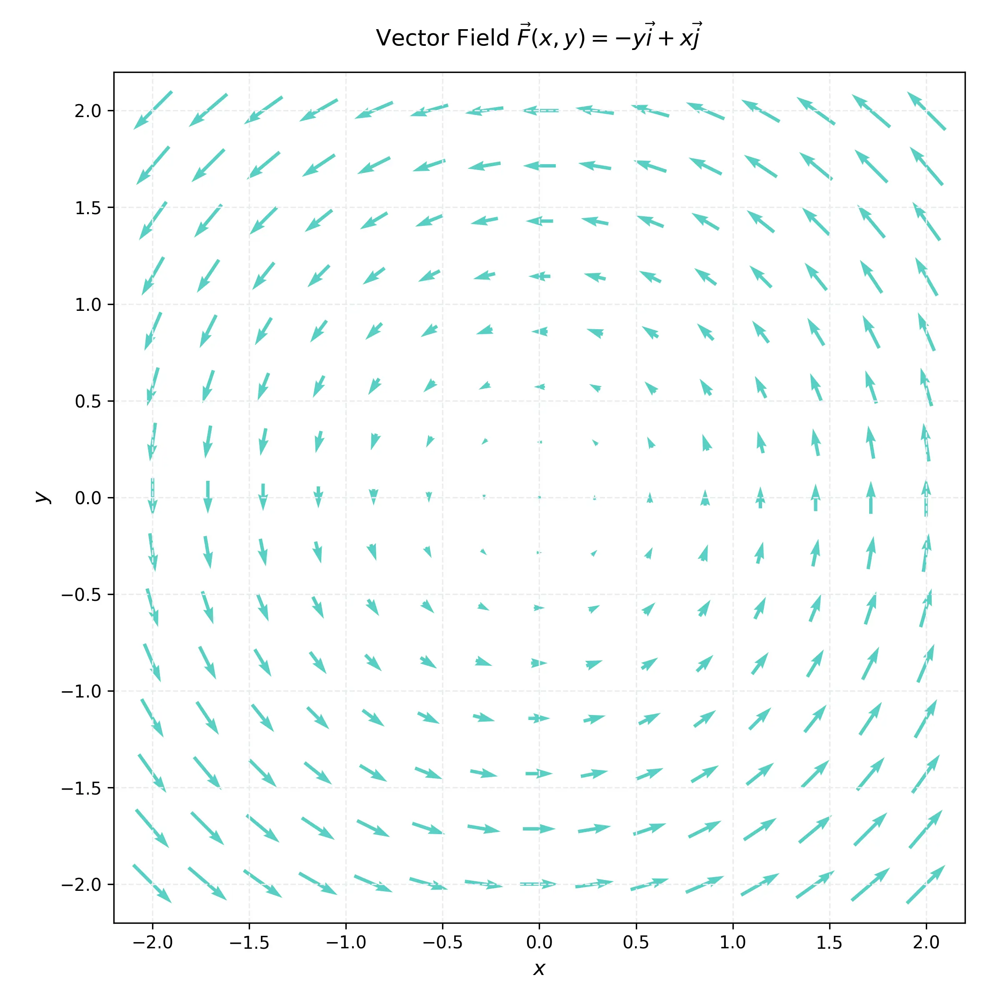

# 課程：微積分下 - 第 13 週 - 向量場與線積分 (Vector Fields & Line Integrals) 🔥 高難度

本文件包含了第 13 週的完整教學大綱、實作指南以及擴充版練習題庫。本週開始進入向量微積分（Vector Calculus）的核心，探討函數在曲線上的積分，以及向量場對物體作功的數學描述。
本週教學內容對應 **Stewart Calculus Ch 16.1-16.3**。

---

## 一、 單元講解 (Lecture) - 總計 100 分鐘

### 1. 向量場定義與繪製 (20 min) (KP13.1)
*   **概念講解**：
    向量場（Vector Field）是在區域中每一點都指定一個向量的函數。
    二維向量場：$\mathbf{F}(x, y) = P(x, y)\mathbf{i} + Q(x, y)\mathbf{j}$。
    三維向量場：$\mathbf{F}(x, y, z) = P\mathbf{i} + Q\mathbf{j} + R\mathbf{k}$。
*   **梯度場 (Gradient Fields)**：
    若 $f$ 是純量函數，則其梯度 $\nabla f = \langle f_x, f_y, f_z \rangle$ 是一個向量場。
*   **視覺化參考**：
    
*   **練習題**：
    *   **練習題 13.1.1**：求 $f(x, y, z) = x^2 y - y z$ 的梯度場。
    *   **解答**：
        $\nabla f = \langle 2xy, x^2 - z, -y \rangle$。

---

### 2. 標量函數的線積分 (20 min) (KP13.2)
*   **概念講解**：
    沿著曲線 $C$ 對純量函數 $f$ 進行積分。若 $C$ 由參數方程 $\mathbf{r}(t), a \le t \le b$ 表示：
    $$\int_C f(x, y, z) \, ds = \int_a^b f(\mathbf{r}(t)) |\mathbf{r}'(t)| \, dt$$
    其中 $ds = |\mathbf{r}'(t)| dt$ 是弧長微元。
*   **應用**：計算曲線形狀細絲的質量（$f$ 為線密度）。
*   **練習題**：
    *   **練習題 13.2.1**：計算 $\int_C y \, ds$，其中 $C$ 是圓 $x^2+y^2=4$ 在第一象限的部分。
    *   **解答**：
        參數化：$x = 2\cos t, y = 2\sin t, 0 \le t \le \pi/2$。
        $\mathbf{r}'(t) = \langle -2\sin t, 2\cos t \rangle$，$|\mathbf{r}'(t)| = \sqrt{4\sin^2 t + 4\cos^2 t} = 2$。
        $$\int_0^{\pi/2} (2\sin t) \cdot 2 \, dt = 4 [-\cos t]_0^{\pi/2} = 4(0 - (-1)) = 4$$

---

### 3. 向量場的線積分與功 (20 min) (KP13.3)
*   **概念講解**：
    向量場 $\mathbf{F}$ 沿曲線 $C$ 的線積分定義為：
    $$\int_C \mathbf{F} \cdot d\mathbf{r} = \int_a^b \mathbf{F}(\mathbf{r}(t)) \cdot \mathbf{r}'(t) \, dt$$
*   **物理意義**：這代表力場 $\mathbf{F}$ 沿路徑 $C$ 對質點所作的**功 (Work)**。
*   **練習題**：
    *   **練習題 13.3.1**：求 $\mathbf{F} = \langle z, x, y \rangle$ 沿螺旋線 $\mathbf{r}(t) = \langle \cos t, \sin t, t \rangle, 0 \le t \le \pi$ 所作的功。
    *   **解答**：
        $\mathbf{r}'(t) = \langle -\sin t, \cos t, 1 \rangle$。
        $\mathbf{F}(\mathbf{r}(t)) = \langle t, \cos t, \sin t \rangle$。
        $$\int_0^{\pi} \langle t, \cos t, \sin t \rangle \cdot \langle -\sin t, \cos t, 1 \rangle \, dt = \int_0^{\pi} (-t\sin t + \cos^2 t + \sin t) \, dt$$
        利用分部積分與三角恆等式計算結果。

---

### 4. 線積分的基本定理 (20 min) (KP13.4)
*   **概念講解**：
    若 $\mathbf{F} = \nabla f$ 是一個**保守場 (Conservative Field)**，則線積分只與端點有關：
    $$\int_C \nabla f \cdot d\mathbf{r} = f(\mathbf{r}(b)) - f(\mathbf{r}(a))$$
*   **路徑無關性**：在保守場中，沿任何封閉路徑的線積分恆為 0。
*   **練習題**：
    *   **練習題 13.4.1**：已知 $\mathbf{F} = \nabla (x^2 y)$，求從 $(0,0)$ 到 $(1,2)$ 的線積分。
    *   **解答**：
        $f(x, y) = x^2 y$。
        積分值 $= f(1, 2) - f(0, 0) = 1^2 \cdot 2 - 0 = 2$。

---

### 5. 保守場判定與位能函數 (20 min) (KP13.5)
*   **概念講解**：
    如何判定 $\mathbf{F} = \langle P, Q \rangle$ 是否為保守場？
    *   必要條件：$\frac{\partial P}{\partial y} = \frac{\partial Q}{\partial x}$（且定義域需單連通）。
*   **求位能函數 $f$**：
    利用積分法從 $\nabla f = \mathbf{F}$ 反推 $f$。
*   **練習題**：
    *   **練習題 13.5.1**：判定 $\mathbf{F} = \langle 3+2xy, x^2-3y^2 \rangle$ 是否為保守場？若是，求其位能函數。
    *   **解答**：
        $P_y = 2x, Q_x = 2x$。相等，故為保守場。
        $f_x = 3+2xy \implies f = 3x + x^2 y + g(y)$。
        $f_y = x^2 + g'(y) = x^2 - 3y^2 \implies g'(y) = -3y^2 \implies g(y) = -y^3 + C$。
        $f(x, y) = 3x + x^2 y - y^3 + C$。

---

## 二、 動手實作 (Lab) - 總計 50 分鐘

### 實作：向量場繪製與數值線積分
**任務目標**：使用 Python 視覺化向量場，並計算數值線積分。

```python
import numpy as np
import matplotlib.pyplot as plt

# 1. 繪製向量場 F = < -y, x > (旋轉場)
x, y = np.meshgrid(np.linspace(-2, 2, 20), np.linspace(-2, 2, 20))
u = -y
v = x

plt.figure(figsize=(7, 7))
plt.quiver(x, y, u, v, color='b')
plt.title("Vector Field $\mathbf{F} = \langle -y, x \rangle$")
plt.xlabel("x")
plt.ylabel("y")
plt.grid()
plt.show()

# 2. 數值線積分: F 沿單位圓 (r = <cos t, sin t>)
t = np.linspace(0, 2*np.pi, 1000)
dt = t[1] - t[0]

# 參數化路徑
rx = np.cos(t)
ry = np.sin(t)
# 速度向量 r'
drx = -np.sin(t)
dry = np.cos(t)

# 向量場在路徑上的值
Fx = -ry
Fy = rx

# 計算 F . dr = (Fx*drx + Fy*dry) * dt
work = np.sum((Fx * drx + Fy * dry) * dt)
print(f"沿單位圓作功: {work:.6f} (理論值: 2*pi = {2*np.pi:.6f})")
```

---

## 三、 本週知識點回顧 (KP)
- **KP13.1**: 辨識向量場，特別是梯度場。
- **KP13.2**: 掌握純量線積分公式 $\int f ds$。
- **KP13.3**: 理解向量線積分與功的關係 $\int \mathbf{F} \cdot d\mathbf{r}$。
- **KP13.4**: 運用線積分基本定理簡化保守場積分。
- **KP13.5**: 學會保守場的判定條件與位能函數的求解。

---

## 四、 課後測驗題庫 (Quiz) - 30 分鐘

### 1. 單選題 (Single Choice) - 10 題
1. **Q1**: 向量場 $\mathbf{F} = \langle y, x \rangle$ 的梯度位能函數可以是？
   (A) $xy$ (B) $x+y$ (C) $x^2+y^2$ (D) $x/y$
2. **Q2**: 計算 $\int_C f ds$ 時，$ds$ 代表？
   (A) 面積微元 (B) 弧長微元 (C) 體積微元 (D) 切向量
3. **Q3**: 若 $\mathbf{F}$ 垂直於曲線 $C$ 的切方向，則 $\int_C \mathbf{F} \cdot d\mathbf{r} =$？
   (A) $1$ (B) $0$ (C) 無窮大 (D) $|\mathbf{F}|$
4. **Q4**: 哪種場沿封閉路徑積分必為 0？
   (A) 旋轉場 (B) 保守場 (C) 常數場 (D) 任何向量場
5. **Q5**: 二維場 $\mathbf{F} = \langle P, Q \rangle$ 為保守場的必要條件是？
   (A) $P_x = Q_y$ (B) $P_y = Q_x$ (C) $P_y = -Q_x$ (D) $P+Q=0$
6. **Q6**: 功的公式為 $\int \mathbf{F} \cdot d\mathbf{r}$，若路徑方向反轉，功的值會？
   (A) 不變 (B) 變號 (C) 變兩倍 (D) 變 0
7. **Q7**: 梯度算子 $\nabla$ 作用於純量函數得到？
   (A) 純量 (B) 向量 (C) 矩陣 (D) 常數
8. **Q8**: 螺旋線 $\mathbf{r}(t) = \langle \cos t, \sin t, t \rangle$ 的速度向量大小 $|\mathbf{r}'(t)|$ 為？
   (A) $1$ (B) $\sqrt{2}$ (C) $t$ (D) $\sqrt{1+t^2}$
9. **Q9**: 線積分的基本定理與微積分基本定理的共同點是？
   (A) 都只看端點值 (B) 都需要求導數 (C) 都只能用於直線 (D) 都需要計算面積
10. **Q10**: 徑向向量場 $\mathbf{F} = \langle x, y, z \rangle$ 是否為保守場？
    (A) 是 (B) 否 (C) 取決於路徑 (D) 無法判定

### 2. 多選題 (Multiple Choice) - 10 題
11. **Q11**: 下列關於線積分 $\int_C \mathbf{F} \cdot d\mathbf{r}$ 的敘述，哪些正確？
    (A) 它等於 $\int_C \mathbf{F} \cdot \mathbf{T} ds$ (B) 它與參數化的選擇無關（只要方向一致） (C) 它可以用來計算流量 (D) 單位是焦耳（若 $\mathbf{F}$ 是力）
12. **Q12**: 哪些場是保守場？
    (A) $\langle 1, 1, 1 \rangle$ (B) $\langle y, x \rangle$ (C) $\langle -y, x \rangle$ (D) 重力場
13. **Q13**: 關於位能函數 $f(x,y)$，哪些正確？
    (A) $\nabla f = \mathbf{F}$ (B) $f$ 加上任何常數仍是位能函數 (C) 它只存在於保守場中 (D) 它是向量函數
14. **Q14**: 曲線 $C$ 的參數化可以是：
    (A) $\mathbf{r}(t)$ (B) $y = g(x)$ (C) $x = h(y)$ (D) 極座標 $r = \theta$
15. **Q15**: 哪些因素會影響線積分 $\int_C f ds$ 的值？
    (A) 函數 $f$ 的數值 (B) 曲線 $C$ 的長度 (C) 路徑的方向 (D) 參數化的速率
16. **Q16**: 關於旋轉場 $\mathbf{F} = \langle -y, x \rangle$：
    (A) 它是保守場 (B) 它的 $P_y = -1, Q_x = 1$ (C) 沿封閉圓路徑積分不為 0 (D) 它有位能函數
17. **Q17**: 線積分可以用於：
    (A) 求曲線質量 (B) 求力所作的功 (C) 求流體環量 (D) 求曲線長度（令 $f=1$）
18. **Q18**: 若 $\int_C \mathbf{F} \cdot d\mathbf{r}$ 與路徑無關，則：
    (A) $\mathbf{F}$ 是梯度場 (B) $\text{curl } \mathbf{F} = \mathbf{0}$ (C) 沿任何圓圈積分為 0 (D) $\mathbf{F}$ 是常數
19. **Q19**: 在三維中，$\mathbf{F} = \langle P, Q, R \rangle$ 為保守場的條件包括：
    (A) $P_y = Q_x$ (B) $P_z = R_x$ (C) $Q_z = R_y$ (D) $P+Q+R=0$
20. **Q20**: 下列哪些函數的梯度場必為保守場？
    (A) $x^2+y^2$ (B) $\sin(xy)$ (C) $\ln(x+y)$ (D) $e^z$

### 3. 填充題 (Fill-in-the-blank) - 10 題
21. **Q21**: 若 $\mathbf{F} = \nabla f$，則 $\int_C \mathbf{F} \cdot d\mathbf{r} = f(\text{終點}) - \underline{\quad\quad}$。
22. **Q22**: 沿著 $x$ 軸從 $0$ 到 $1$ 的線積分 $\int_C \langle P, Q \rangle \cdot d\mathbf{r} = \int_0^1 \underline{\quad\quad} dx$。
23. **Q23**: 純量線積分 $ds = \sqrt{(dx/dt)^2 + (dy/dt)^2} \underline{\quad\quad}$。
24. **Q24**: 常數力 $\mathbf{F} = \langle 2, 3 \rangle$ 沿位移 $\mathbf{d} = \langle 4, 1 \rangle$ 所作的功為 $\underline{\quad\quad}$。
25. **Q25**: 若 $\mathbf{F} = \langle P, Q \rangle$ 滿足 $P_y = Q_x$，且區域無洞，則 $\mathbf{F}$ 稱為 $\underline{\quad\quad}$ 場。
26. **Q26**: 梯度場 $\nabla (x+y+z) = \underline{\quad\quad}$。
27. **Q27**: 單位圓 $C$ 的周長可以用線積分表示為 $\int_C \underline{\quad\quad} ds$。
28. **Q28**: $\int_C \mathbf{F} \cdot d\mathbf{r}$ 中，若 $d\mathbf{r} = \langle dx, dy, dz \rangle$，則積分式展開為 $\int (P dx + Q dy + \underline{\quad\quad})$。
29. **Q29**: 位能函數 $f$ 的等位線（或等位面）與梯度場向量 $\nabla f$ 互相 $\underline{\quad\quad}$。
30. **Q30**: 若 $\mathbf{F} = \langle y, 0 \rangle$，則 $P_y = 1, Q_x = 0$，此場 $\underline{\quad\quad}$ (填是或不是) 保守場。

---

## 五、 Q 矩陣 (Q-matrix)

| 題號 | KP13.1 | KP13.2 | KP13.3 | KP13.4 | KP13.5 | |
|---|---|---|---|---|---|
| Q1 | 0 | 0 | 0 | 0 | 1 |
| Q2 | 0 | 1 | 0 | 0 | 0 |
| Q3 | 0 | 0 | 1 | 0 | 0 |
| Q4 | 0 | 0 | 0 | 0 | 1 |
| Q5 | 0 | 0 | 0 | 0 | 1 |
| Q6 | 0 | 0 | 1 | 0 | 0 |
| Q7 | 1 | 0 | 0 | 0 | 0 |
| Q8 | 0 | 1 | 0 | 0 | 0 |
| Q9 | 0 | 0 | 0 | 1 | 0 |
| Q10| 1 | 0 | 0 | 0 | 0 |
| Q11| 0 | 0 | 1 | 0 | 0 |
| Q12| 0 | 0 | 0 | 0 | 1 |
| Q13| 0 | 0 | 0 | 0 | 1 |
| Q14| 0 | 1 | 0 | 0 | 0 |
| Q15| 0 | 1 | 0 | 0 | 0 |
| Q16| 0 | 0 | 0 | 0 | 1 |
| Q17| 0 | 1 | 0 | 0 | 0 |
| Q18| 0 | 0 | 0 | 1 | 0 |
| Q19| 0 | 0 | 0 | 0 | 1 |
| Q20| 1 | 0 | 0 | 0 | 0 |
| Q21| 0 | 0 | 0 | 1 | 0 |
| Q22| 0 | 0 | 1 | 0 | 0 |
| Q23| 0 | 1 | 0 | 0 | 0 |
| Q24| 0 | 0 | 1 | 0 | 0 |
| Q25| 0 | 0 | 0 | 0 | 1 |
| Q26| 1 | 0 | 0 | 0 | 0 |
| Q27| 0 | 1 | 0 | 0 | 0 |
| Q28| 0 | 0 | 1 | 0 | 0 |
| Q29| 0 | 0 | 0 | 1 | 0 |
| Q30| 0 | 0 | 0 | 0 | 1 |

