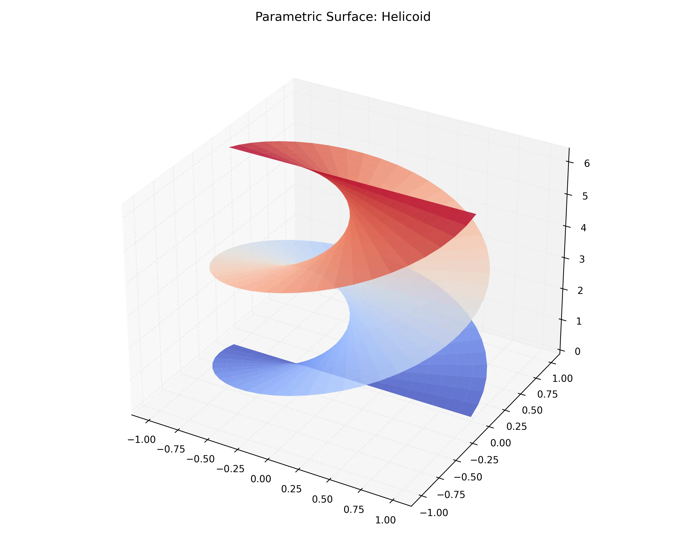

# 課程：微積分下 - 第 16 週 - 參數曲面與面積分 (Parametric Surfaces & Surface Integrals) 🔥 高難度

本週我們將線積分的概念推廣到更高維度：從曲線到曲面。我們將學習如何參數化曲面，計算其面積，並對純量函數與向量場進行面積分（通量）。
本週教學內容對應 **Stewart Calculus Ch 16.6-16.7**。

---

## 一、 單元講解 (Lecture) - 總計 100 分鐘

### 1. 參數曲面 (Parametric Surfaces) 與法向量 (20 min) (KP16.1)
*   **概念講解**：
    曲面 $S$ 可以由兩個參數 $u, v$ 的向量函數表示：
    $$\mathbf{r}(u, v) = x(u, v)\mathbf{i} + y(u, v)\mathbf{j} + z(u, v)\mathbf{k}$$
    常見例子：球、柱、平面、旋轉面。
*   **切向量與法向量**：
    在點 $\mathbf{r}(u, v)$ 處的切向量為 $\mathbf{r}_u = \frac{\partial \mathbf{r}}{\partial u}$ 與 $\mathbf{r}_v = \frac{\partial \mathbf{r}}{\partial v}$。
    曲面的法向量為 $\mathbf{n} = \mathbf{r}_u \times \mathbf{r}_v$。
*   **例題 16.1.1**：
    參數化半徑為 $a$ 的球面。
    *   **解**：
        利用球面座標（固定 $\rho = a$）：
        $x = a\sin\phi\cos\theta, y = a\sin\phi\sin\theta, z = a\cos\phi$。
        其中 $0 \le \phi \le \pi, 0 \le \theta \le 2\pi$。

---

### 2. 曲面積 (Surface Area) (20 min) (KP16.2)
*   **概念講解**：
    參數曲面 $S$ 的面積為：
    $$A(S) = \iint_D |\mathbf{r}_u \times \mathbf{r}_v| \, dA$$
    若曲面是顯函數 $z = g(x, y)$，則 $|\mathbf{r}_x \times \mathbf{r}_y| = \sqrt{1 + (g_x)^2 + (g_y)^2}$。
*   **例題 16.2.1**：
    求圓柱面 $x^2+y^2=a^2$ 被平面 $z=0$ 與 $z=h$ 所截部分的面積。
    *   **解**：
        參數化：$\mathbf{r}(\theta, z) = \langle a\cos\theta, a\sin\theta, z \rangle, 0 \le \theta \le 2\pi, 0 \le z \le h$。
        $\mathbf{r}_\theta = \langle -a\sin\theta, a\cos\theta, 0 \rangle, \mathbf{r}_z = \langle 0, 0, 1 \rangle$。
        $\mathbf{r}_\theta \times \mathbf{r}_z = \langle a\cos\theta, a\sin\theta, 0 \rangle$，大小為 $a$。
        面積 $= \int_0^h \int_0^{2\pi} a \, d\theta dz = 2\pi ah$。

---

### 3. 純量函數的面積分 (20 min) (KP16.3)
*   **概念講解**：
    對純量函數 $f$ 在曲面 $S$ 上的面積分定義為：
    $$\iint_S f(x, y, z) \, dS = \iint_D f(\mathbf{r}(u, v)) |\mathbf{r}_u \times \mathbf{r}_v| \, du dv$$
    物理意義：若 $f$ 為面密度，則積分結果為總質量。
*   **例題 16.3.1**：
    計算 $\iint_S z \, dS$，其中 $S$ 是拋物面 $z = x^2+y^2$ 在 $z=1$ 以下的部分。
    *   **解**：
        $z = x^2+y^2 \implies z_x=2x, z_y=2y$。$dS = \sqrt{1+4x^2+4y^2} dA$。
        利用極座標：$\iint_D (r^2) \sqrt{1+4r^2} r dr d\theta = 2\pi \int_0^1 r^3 \sqrt{1+4r^2} \, dr$。
        使用代換法 $u = 1+4r^2$ 計算最後積分。

---

### 4. 定向曲面與向量場的面積分 (20 min) (KP16.4)
*   **概念講解**：
    若曲面 $S$ 有確定的兩側，則稱為**定向曲面 (Oriented Surface)**。通常取向外為正。
    向量場 $\mathbf{F}$ 穿過曲面 $S$ 的面積分（稱為**通量 Flux**）定義為：
    $$\iint_S \mathbf{F} \cdot d\mathbf{S} = \iint_S \mathbf{F} \cdot \mathbf{n} \, dS = \iint_D \mathbf{F} \cdot (\mathbf{r}_u \times \mathbf{r}_v) \, dA$$
*   **例題 16.4.1**：
    求 $\mathbf{F} = \langle 0, 0, z \rangle$ 穿過單位球面（向外）的通量。
    *   **解**：
        在球面上，$\mathbf{n} = \langle x, y, z \rangle$。
        $\mathbf{F} \cdot \mathbf{n} = z^2$。
        $\iint_S z^2 dS = \int_0^{2\pi} \int_0^\pi (\cos^2\phi) \sin\phi \, d\phi d\theta = 2\pi [ -\frac{1}{3}\cos^3\phi ]_0^\pi = \frac{4\pi}{3}$。

---

### 5. 應用：流體通量與質心 (20 min) (KP16.5)
*   **概念講解**：
    通量 $\iint_S \mathbf{F} \cdot d\mathbf{S}$ 代表單位時間內流體穿過曲面 $S$ 的體積。
    面積分也可用於計算曲面殼層的質心與轉動慣量。
*   **視覺化參考**：
    

---

## 二、 動手實作 (Lab) - 總計 50 分鐘

### 實作：參數曲面繪製與通量計算
**任務目標**：利用 Python 繪製複雜曲面並數值計算其面積與通量。

```python
import numpy as np
import matplotlib.pyplot as plt
from mpl_toolkits.mplot3d import Axes3D

# 1. 繪製莫比烏斯帶 (Moebius Strip) - 非定向曲面示例
u = np.linspace(0, 2 * np.pi, 100)
v = np.linspace(-1, 1, 20)
U, V = np.meshgrid(u, v)

X = (1 + V/2 * np.cos(U/2)) * np.cos(U)
Y = (1 + V/2 * np.cos(U/2)) * np.sin(U)
Z = V/2 * np.sin(U/2)

fig = plt.figure(figsize=(10, 7))
ax = fig.add_subplot(111, projection='3d')
ax.plot_surface(X, Y, Z, cmap='viridis', alpha=0.8)
ax.set_title("Parametric Surface: Mobius Strip")
plt.show()

# 2. 數值計算：通量 F = <0, 0, 1> 穿過 z = 1 - x^2 - y^2 (z >= 0)
r = np.linspace(0, 1, 100)
theta = np.linspace(0, 2*np.pi, 100)
R, THETA = np.meshgrid(r, theta)

# 參數化拋物面
X_p = R * np.cos(THETA)
Y_p = R * np.sin(THETA)
Z_p = 1 - R**2

# 法向量 n = rx * ry (在顯函數 z=g(x,y) 下是 <-gx, -gy, 1>)
# gx = -2x, gy = -2y -> n = <2x, 2y, 1>
# F . n = <0, 0, 1> . <2x, 2y, 1> = 1
# Flux = \iint 1 dA = 圓域面積 = pi
area_element = 1 # 因為 F . n = 1
flux = np.sum(area_element * R * (r[1]-r[0]) * (theta[1]-theta[0]))
print(f"數值通量計算結果: {flux:.6f} (理論值: {np.pi:.6f})")

# 3. 法向量視覺化 (Normal Vector Visualization)
def plot_surface_normal():
    fig = plt.figure(figsize=(8, 8))
    ax = fig.add_subplot(111, projection='3d')
    
    # 繪製拋物面
    r_v = np.linspace(0, 1, 10)
    theta_v = np.linspace(0, 2*np.pi, 20)
    R_v, THETA_v = np.meshgrid(r_v, theta_v)
    X_v = R_v * np.cos(THETA_v)
    Y_v = R_v * np.sin(THETA_v)
    Z_v = 1 - R_v**2
    ax.plot_surface(X_v, Y_v, Z_v, alpha=0.5, cmap='coolwarm')
    
    # 繪製法向量 n = <2x, 2y, 1> (在拋物面上)
    # 取部分點繪製
    X_n = X_v[::3, ::3]
    Y_n = Y_v[::3, ::3]
    Z_n = Z_v[::3, ::3]
    u_n, v_n, w_n = 2*X_n, 2*Y_n, np.ones_like(Z_n)
    ax.quiver(X_n, Y_n, Z_n, u_n, v_n, w_n, length=0.2, color='black', label='Normal Vectors')
    
    ax.set_title("Parametric Surface with Normal Vectors")
    plt.show()

plot_surface_normal()
```

---

## 三、 本週知識點回顧 (KP)
- **KP16.1**: 掌握曲面的參數化方法 $\mathbf{r}(u,v)$。
- **KP16.2**: 學會計算面積微元 $dS = |\mathbf{r}_u \times \mathbf{r}_v| dA$。
- **KP16.3**: 理解純量函數面積分的步驟：參數化 -> 代入 -> 計算二重積分。
- **KP16.4**: 掌握通量積分 $\iint \mathbf{F} \cdot d\mathbf{S}$ 的物理意義與計算。
- **KP16.5**: 辨識定向曲面與非定向曲面（如莫比烏斯帶）。

---

## 四、 課後測驗題庫 (Quiz) - 30 題

### 1. 單選題 (10 題)
1. 參數曲面 $\mathbf{r}(u,v)$ 在某點的法向量由哪個運算得到？ (A) $\mathbf{r}_u \cdot \mathbf{r}_v$ (B) $\mathbf{r}_u \times \mathbf{r}_v$ (C) $\nabla \cdot \mathbf{r}$ (D) $\text{curl } \mathbf{r}$
2. 若曲面方程為 $z = g(x,y)$，則面積微元 $dS$ 為？ (A) $dx dy$ (B) $\sqrt{1+g_x^2+g_y^2} dA$ (C) $\sqrt{g_x^2+g_y^2} dA$ (D) $g(x,y) dA$
3. 通量 $\iint_S \mathbf{F} \cdot d\mathbf{S}$ 的物理單位（若 $\mathbf{F}$ 是速度）為？ (A) 面積 (B) 體積 (C) 體積流率 (D) 質量
4. 球面 $x^2+y^2+z^2 = a^2$ 的面積為？ (A) $\pi a^2$ (B) $2\pi a^2$ (C) $4\pi a^2$ (D) $\frac{4}{3}\pi a^3$
5. 莫比烏斯帶（Mobius Strip）是？ (A) 定向曲面 (B) 非定向曲面 (C) 閉曲面 (D) 平面
6. 在向量面積分中，$d\mathbf{S}$ 等於？ (A) $dS$ (B) $\mathbf{n} dS$ (C) $\mathbf{T} ds$ (D) $dA$
7. 若 $\mathbf{F}$ 與曲面 $S$ 平行，則穿過 $S$ 的通量為？ (A) 最大 (B) 1 (C) 0 (D) 無窮大
8. 計算 $\iint_S dS$ 的結果是？ (A) 體積 (B) 面積 (C) 長度 (D) 0
9. 正向法向量 $\mathbf{n}$ 的長度通常取為？ (A) $0$ (B) $1$ (C) $|\mathbf{r}_u \times \mathbf{r}_v|$ (D) 任意
10. 對於封閉曲面，約定的正方向通常是？ (A) 向上 (B) 向下 (C) 向外 (D) 向內

### 2. 多選題 (10 題)
11. 下列哪些是常見的參數曲面？ (A) 球面 (B) 圓柱面 (C) 錐面 (D) 拋物面
12. 面積分 $\iint_S f dS$ 與參數化的選擇？ (A) 有關 (B) 無關 (C) 只要參數化覆蓋曲面一次 (D) 只與邊界有關
13. 若 $\mathbf{F} = \langle P, Q, R \rangle$ 且 $S$ 是平面 $z=c$，則 $\mathbf{F} \cdot d\mathbf{S}$ 等於？ (A) $P dx dz$ (B) $Q dy dz$ (C) $R dx dy$ (D) $R dA$
14. 關於定向曲面的敘述，哪些正確？ (A) 必須有兩側 (B) 必須是閉合的 (C) 球面是定向的 (D) 法向量場需連續
15. 哪些情況下通量積分為負？ (A) 流向與法向量相反 (B) 場的方向指向曲面內部 (C) 場的強度為負 (D) 曲面面積為負
16. 面積微元 $dS$ 在極座標下可能涉及： (A) $r$ (B) $dr$ (C) $d\theta$ (D) $\sin\phi$
17. 向量面積分可以用於計算： (A) 磁通量 (B) 熱流率 (C) 流體質量流率 (D) 曲面周長
18. 若 $S$ 是圖形 $z=f(x,y)$，則其法向量可取為： (A) $\langle -f_x, -f_y, 1 \rangle$ (B) $\langle f_x, f_y, -1 \rangle$ (C) $\langle 1, 0, f_x \rangle$ (D) $\langle 0, 1, f_y \rangle$
19. 面積分的基本步驟包括： (A) 參數化曲面 (B) 求法向量 (C) 確定積分區域 (D) 代入被積函數
20. 哪些因素會影響 $\iint_S \mathbf{F} \cdot \mathbf{n} dS$ 的值？ (A) 向量場的強度 (B) 曲面的彎曲程度 (C) 法向量的方向 (D) 曲面的大小

### 3. 填充題 (10 題)
21. 顯函數 $z = x+y$ 在 $0 \le x, y \le 1$ 上的面積為 $\underline{\quad\quad}$。
22. 通量積分公式為 $\iint_D \mathbf{F} \cdot (\underline{\quad\quad}) dA$。
23. 半徑為 $R$ 的圓盤面積分 $\iint_S dS = \underline{\quad\quad}$。
24. 若 $\mathbf{F} = \mathbf{n}$，則 $\iint_S \mathbf{F} \cdot \mathbf{n} dS = \underline{\quad\quad}$。
25. 球面座標下，面積微元 $dS = a^2 \sin\phi \underline{\quad\quad}$。
26. 穿過閉曲面的淨通量若為正，說明內部有 $\underline{\quad\quad}$。
27. 非定向曲面最著名的例子是 $\underline{\quad\quad}$。
28. 面積分中，若 $f(x,y,z)=1$，則積分結果即為 $\underline{\quad\quad}$。
29. 法向量 $\mathbf{n}$ 與切向量 $\mathbf{r}_u$ 的點積為 $\underline{\quad\quad}$。
30. 若曲面 $S$ 由 $x=u+v, y=u-v, z=uv$ 給出，則 $\mathbf{r}_u = \underline{\quad\quad}$。

---

## 五、 Q 矩陣 (Q-matrix)

| 題號 | KP16.1 | KP16.2 | KP16.3 | KP16.4 | KP16.5 | |
|---|---|---|---|---|---|
| Q1 | 1 | 0 | 0 | 0 | 0 |
| Q2 | 0 | 1 | 0 | 0 | 0 |
| Q3 | 0 | 0 | 1 | 0 | 0 |
| Q4 | 0 | 1 | 0 | 0 | 0 |
| Q5 | 0 | 0 | 0 | 1 | 0 |
| Q6 | 0 | 0 | 1 | 0 | 0 |
| Q7 | 0 | 0 | 1 | 0 | 0 |
| Q8 | 0 | 1 | 0 | 0 | 0 |
| Q9 | 1 | 0 | 0 | 0 | 0 |
| Q10| 0 | 0 | 1 | 0 | 0 |
| Q11| 1 | 0 | 0 | 0 | 0 |
| Q12| 0 | 0 | 1 | 0 | 0 |
| Q13| 0 | 0 | 0 | 1 | 0 |
| Q14| 1 | 0 | 0 | 0 | 0 |
| Q15| 0 | 0 | 0 | 1 | 0 |
| Q16| 0 | 1 | 0 | 0 | 0 |
| Q17| 0 | 0 | 0 | 0 | 1 |
| Q18| 1 | 0 | 0 | 0 | 0 |
| Q19| 0 | 0 | 1 | 0 | 0 |
| Q20| 0 | 0 | 0 | 1 | 0 |
| Q21| 0 | 1 | 0 | 0 | 0 |
| Q22| 1 | 0 | 0 | 0 | 0 |
| Q23| 0 | 1 | 0 | 0 | 0 |
| Q24| 0 | 0 | 1 | 0 | 0 |
| Q25| 0 | 0 | 1 | 0 | 0 |
| Q26| 0 | 0 | 1 | 0 | 0 |
| Q27| 0 | 0 | 0 | 1 | 0 |
| Q28| 0 | 1 | 0 | 0 | 0 |
| Q29| 1 | 0 | 0 | 0 | 0 |
| Q30| 1 | 0 | 0 | 0 | 0 |

