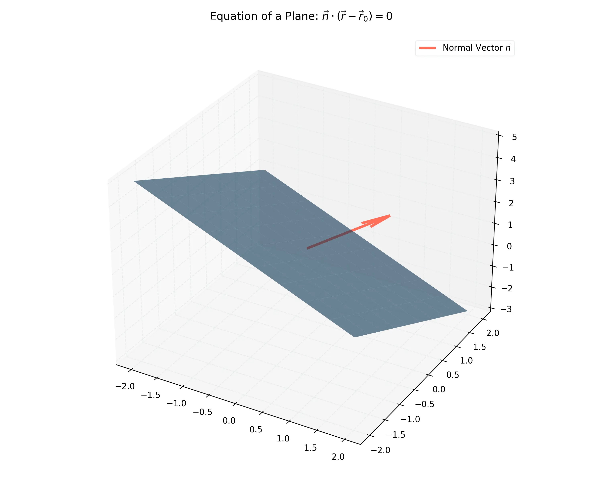

# 課程：微積分下 - 第 2 週 - 空間中的直線與平面 (Lines and Planes in Space)

本文件包含了第 2 週完整的教學大綱、實作指南以及擴充版練習題庫。本週重點在於掌握空間中直線與平面的幾何表示法及其相互關係。
本週教學內容對應 **Stewart Calculus Ch 12.5-12.6** 的核心內容。

---

## 一、 單元講解 (Lecture) - 總計 100 分鐘

### 1. 空間中的直線方程式 (20 min) (KP2.1)
*   **概念講解**：
    空間中的直線由一點 $P_0(x_0, y_0, z_0)$ 與一個方向向量 $\mathbf{v} = \langle a, b, c \rangle$ 確定。
    *   **向量方程式**：$\mathbf{r} = \mathbf{r}_0 + t\mathbf{v}$。
    *   **參數方程式**：
        $$x = x_0 + at, \quad y = y_0 + bt, \quad z = z_0 + ct$$
    *   **對稱方程式**：
        $$\frac{x-x_0}{a} = \frac{y-y_0}{b} = \frac{z-z_0}{c} \quad (\text{若 } a, b, c \neq 0)$$
*   **練習題**：
    *   **練習題 2.1.1**：求通過點 $(1, 2, 3)$ 且平行於向量 $\langle 4, 5, 6 \rangle$ 的直線參數方程式。
    *   **解答**：
        $x = 1 + 4t, \quad y = 2 + 5t, \quad z = 3 + 6t$。

---

### 2. 空間中的平面方程式 (20 min) (KP2.2)
*   **概念講解**：
    平面由一點 $P_0(x_0, y_0, z_0)$ 與一個垂直於平面的**法向量 (Normal Vector)** $\mathbf{n} = \langle a, b, c \rangle$ 確定。
    *   **標量方程式**：$a(x-x_0) + b(y-y_0) + c(z-z_0) = 0$。
    *   **一般式**：$ax + by + cz + d = 0$。
*   **練習題**：
    *   **練習題 2.2.1**：求通過點 $(2, 4, -1)$ 且法向量為 $\mathbf{n} = \langle 2, 3, 4 \rangle$ 的平面方程式。
    *   **解答**：
        $2(x-2) + 3(y-4) + 4(z+1) = 0 \implies 2x - 4 + 3y - 12 + 4z + 4 = 0 \implies 2x + 3y + 4z - 12 = 0$。

---

### 3. 直線與平面的交點與夾角 (20 min) (KP2.3)
*   **概念講解**：
    *   **兩平面夾角**：即其法向量 $\mathbf{n}_1, \mathbf{n}_2$ 的夾角。
    *   **直線與平面交點**：將直線的參數式代入平面方程式求解參數 $t$。
*   **練習題**：
    *   **練習題 2.3.1**：求直線 $x=1+t, y=2t, z=3-t$ 與平面 $x+y+z=5$ 的交點。
    *   **解答**：
        將參數式代入平面：$(1+t) + (2t) + (3-t) = 5 \implies 2t + 4 = 5 \implies 2t = 1 \implies t = 0.5$。
        交點為 $(1.5, 1, 2.5)$。

---

### 4. 點到平面的距離公式 (20 min) (KP2.4)
*   **數學證明**：證明點 $P_1(x_1, y_1, z_1)$ 到平面 $ax + by + cz + d = 0$ 的距離為 $D = \frac{|ax_1 + by_1 + cz_1 + d|}{\sqrt{a^2 + b^2 + c^2}}$。
    *   **證明**：設 $P_0(x_0, y_0, z_0)$ 為平面上任意一點，則向量 $\vec{P_0 P_1} = \langle x_1-x_0, y_1-y_0, z_1-z_0 \rangle$。
        距離 $D$ 即為 $\vec{P_0 P_1}$ 在法向量 $\mathbf{n} = \langle a, b, c \rangle$ 方向上的標量投影絕對值：
        $$D = |\text{comp}_{\mathbf{n}} \vec{P_0 P_1}| = \frac{|\vec{P_0 P_1} \cdot \mathbf{n}|}{|\mathbf{n}|} = \frac{|a(x_1-x_0) + b(y_1-y_0) + c(z_1-z_0)|}{\sqrt{a^2+b^2+c^2}}$$
        由於 $ax_0 + by_0 + cz_0 = -d$，展開分子得：
        $$D = \frac{|ax_1 + by_1 + cz_1 + d|}{\sqrt{a^2+b^2+c^2}} \quad \text{Q.E.D.}$$
*   **練習題**：
    *   **練習題 2.4.1**：求點 $(1, 2, 3)$ 到平面 $3x + 2y + 6z = 5$ 的距離。
    *   **解答**：
        $D = \frac{|3(1) + 2(2) + 6(3) - 5|}{\sqrt{3^2+2^2+6^2}} = \frac{|3+4+18-5|}{\sqrt{9+4+36}} = \frac{20}{7}$。

---

### 5. 二次曲面簡介 (20 min) (KP2.5)
*   **概念講解**：
    二次曲面是變數 $x, y, z$ 的二次方程所定義的圖形。
    *   **柱面 (Cylinders)**：方程式中缺少一個變數，例如 $x^2 + y^2 = 1$ 在 3D 中是圓柱。
    *   **橢球面 (Ellipsoid)**：$\frac{x^2}{a^2} + \frac{y^2}{b^2} + \frac{z^2}{c^2} = 1$。
    *   **拋物面 (Paraboloid)**：$z = \frac{x^2}{a^2} + \frac{y^2}{b^2}$ (橢圓拋物面)。
    *   **雙曲面 (Hyperboloid)**：$\frac{x^2}{a^2} + \frac{y^2}{b^2} - \frac{z^2}{c^2} = 1$ (單葉雙曲面)。
*   **視覺化參考**：
    下圖展示了常見二次曲面的幾何特徵，特別是截面（Traces）如何幫助識別曲面類型：
    

---

## 二、 動手實作 (Lab) - 總計 50 分鐘

### 實作：使用 Matplotlib 繪製 3D 平面與曲面
**任務目標**：繪製平面與簡單的二次曲面（如橢圓拋物面）。

```python
import matplotlib.pyplot as plt
import numpy as np

# 建立數據
x = np.linspace(-5, 5, 100)
y = np.linspace(-5, 5, 100)
X, Y = np.meshgrid(x, y)

# 1. 繪製平面 z = 2x + 3y - 5
Z1 = 2*X + 3*Y - 5

# 2. 繪製橢圓拋物面 z = x^2 + y^2
Z2 = X**2 + Y**2

fig = plt.figure(figsize=(12, 6))

# 平面視圖
ax1 = fig.add_subplot(121, projection='3d')
ax1.plot_surface(X, Y, Z1, alpha=0.8, cmap='viridis')
ax1.set_title('Plane: z = 2x + 3y - 5')

# 拋物面視圖
ax2 = fig.add_subplot(122, projection='3d')
ax2.plot_surface(X, Y, Z2, alpha=0.8, cmap='magma')
ax2.set_title('Paraboloid: z = x^2 + y^2')

plt.show()
```

---

## 三、 本週知識點回顧 (KP)
- **KP2.1**: 直線的向量、參數與對稱方程式。
- **KP2.2**: 平面的法向量概念與標量方程式。
- **KP2.3**: 直線與平面的交點計算方法。
- **KP2.4**: 點到平面的距離公式推導與應用。
- **KP2.5**: 常見二次曲面（柱面、橢球面、拋物面等）的識別。

---

## 四、 課後測驗題庫 (Quiz) - 30 分鐘

### 1. 單選題 (Single Choice) - 共 10 題
1. **Q1**: 空間中通過兩點的直線有幾條？
   - (A) 0 (B) 1 (C) 2 (D) 無限多
2. **Q2**: 平面 $2x - 3y + z = 4$ 的法向量為？
   - (A) $\langle 2, -3, 1 \rangle$ (B) $\langle 2, 3, 1 \rangle$ (C) $\langle -2, 3, 4 \rangle$ (D) $\langle 1, 1, 1 \rangle$
3. **Q3**: 若兩平面的法向量垂直，則這兩個平面？
   - (A) 平行 (B) 重合 (C) 垂直 (D) 夾角為 45 度
4. **Q4**: 方程式 $x^2 + y^2 = 9$ 在三維空間中代表？
   - (A) 圓 (B) 球面 (C) 圓柱面 (D) 拋物面
5. **Q5**: 直線 $\frac{x-1}{2} = \frac{y+2}{3} = z-4$ 的方向向量為？
   - (A) $\langle 1, -2, 4 \rangle$ (B) $\langle 2, 3, 0 \rangle$ (C) $\langle 2, 3, 1 \rangle$ (D) $\langle 1, 1, 1 \rangle$
6. **Q6**: 點 $(0, 0, 0)$ 到平面 $x+y+z=1$ 的距離為？
   - (A) 1 (B) $\sqrt{3}$ (C) $1/\sqrt{3}$ (D) 0
7. **Q7**: 下列哪一個是橢球面的標準方程式？
   - (A) $x^2+y^2-z^2=1$ (B) $x^2/4+y^2/9+z^2/1=1$ (C) $z=x^2+y^2$ (D) $x^2+y^2=z^2$
8. **Q8**: 若直線與平面平行，則直線的方向向量 $\mathbf{v}$ 與平面的法向量 $\mathbf{n}$ 關係為？
   - (A) $\mathbf{v} \cdot \mathbf{n} = 0$ (B) $\mathbf{v} \times \mathbf{n} = \mathbf{0}$ (C) $\mathbf{v} = \mathbf{n}$ (D) 以上皆非
9. **Q9**: 兩平行平面 $x+y+z=1$ 與 $x+y+z=3$ 之間的距離為？
   - (A) 2 (B) $2/\sqrt{3}$ (C) $\sqrt{2}$ (D) 0
10. **Q10**: 通過點 $(1, 0, 0)$ 且平行於 $yz$ 平面的平面方程式為？
    - (A) $y=0$ (B) $z=0$ (C) $x=1$ (D) $x+y+z=1$

### 2. 多選題 (Multiple Choice) - 共 10 題
11. **Q11**: 關於直線方程式，下列哪些正確？
    - (A) 向量式為 $\mathbf{r} = \mathbf{r}_0 + t\mathbf{v}$ (B) 參數式中 $t$ 是實數參數 (C) 對稱式在分母為零時仍可寫出 (D) 直線由一點與方向向量唯一確定
12. **Q12**: 哪些曲面的截面（Trace）包含橢圓？
    - (A) 橢球面 (B) 橢圓拋物面 (C) 單葉雙曲面 (D) 圓柱面
13. **Q13**: 平面 $ax + by + cz + d = 0$ 中，若 $d=0$ 則：
    - (A) 平面通過原點 (B) 平面平行於 $z$ 軸 (C) 法向量為 $\langle a, b, c \rangle$ (D) 平面是垂直的
14. **Q14**: 判定兩直線是否為「歪斜線 (Skew lines)」的條件包括：
    - (A) 不平行 (B) 不相交 (C) 不共面 (D) 垂直
15. **Q15**: 直線 $L_1$ 與 $L_2$ 平行的條件是其方向向量 $\mathbf{v}_1, \mathbf{v}_2$：
    - (A) $\mathbf{v}_1 = k \mathbf{v}_2$ (B) $\mathbf{v}_1 \cdot \mathbf{v}_2 = 0$ (C) $\mathbf{v}_1 \times \mathbf{v}_2 = \mathbf{0}$ (D) 夾角為 0 或 $\pi$
16. **Q16**: 下列哪些是二次曲面？
    - (A) 球面 (B) 雙曲拋物面 (C) 圓錐面 (D) 平面
17. **Q17**: 關於點到平面距離公式 $D$，下列敘述正確的是：
    - (A) 分母是法向量的長度 (B) 分子是點代入平面方程的絕對值 (C) 距離恆不為負 (D) 若點在平面上則 $D=0$
18. **Q18**: 若平面 $\pi$ 通過點 $P, Q, R$，其法向量可以透過哪些運算得到？
    - (A) $\vec{PQ} \times \vec{PR}$ (B) $\vec{QP} \times \vec{QR}$ (C) $\vec{PQ} \cdot \vec{PR}$ (D) $\vec{PQ} + \vec{PR}$
19. **Q19**: 二次曲面 $z = y^2 - x^2$ 的名稱是：
    - (A) 雙曲拋物面 (B) 馬鞍面 (C) 橢圓拋物面 (D) 雙葉雙曲面
20. **Q20**: 直線與平面的關係可能為：
    - (A) 直線在平面上 (B) 直線與平面交於一點 (C) 直線與平面平行 (D) 直線與平面交於兩點但不重合

### 3. 填充題 (Fill-in-the-blank) - 共 10 題
21. **Q21**: 通過 $(0,0,0)$ 且方向向量為 $\langle 1, 1, 1 \rangle$ 的直線參數式為 $x=t, y=t, z=$ __________。
22. **Q22**: 平面 $x - 2y + 2z = 6$ 到原點的距離為 __________。
23. **Q23**: 若兩平面平行，則它們的 __________ 向量必平行。
24. **Q24**: 曲面 $z = x^2 + y^2$ 在 $z=4$ 處的截面是一個半徑為 __________ 的圓。
25. **Q25**: 直線 $x=t, y=t, z=t$ 與平面 $x+y+z=3$ 的交點為 __________。
26. **Q26**: 空間中通過點 $(1, 1, 1)$ 且垂直於 $z$ 軸的平面方程式為 __________。
27. **Q27**: 單葉雙曲面 $\frac{x^2}{a^2} + \frac{y^2}{b^2} - \frac{z^2}{c^2} = 1$ 的對稱中心在 __________。
28. **Q28**: 方程式 $y = x^2$ 在 3D 空間中代表 __________ 面。
29. **Q29**: 兩平面 $x+y=1$ 與 $x+y=2$ 的關係是 __________。
30. **Q30**: 點到平面距離公式中，法向量不需要是單位向量，但分母必須除以其 __________。

---

## 五、 Q 矩陣 (Q-matrix)

| 題號 | KP2.1 | KP2.2 | KP2.3 | KP2.4 | KP2.5 | |
|---|---|---|---|---|---|
| Q1 | 1 | 0 | 0 | 0 | 0 |
| Q2 | 0 | 1 | 0 | 0 | 0 |
| Q3 | 0 | 0 | 1 | 0 | 0 |
| Q4 | 0 | 0 | 0 | 0 | 1 |
| Q5 | 1 | 0 | 0 | 0 | 0 |
| Q6 | 0 | 0 | 0 | 1 | 0 |
| Q7 | 0 | 0 | 0 | 0 | 1 |
| Q8 | 0 | 0 | 1 | 0 | 0 |
| Q9 | 0 | 0 | 0 | 1 | 0 |
| Q10| 0 | 1 | 0 | 0 | 0 |
| Q11| 1 | 0 | 0 | 0 | 0 |
| Q12| 0 | 0 | 0 | 0 | 1 |
| Q13| 0 | 1 | 0 | 0 | 0 |
| Q14| 1 | 0 | 0 | 0 | 0 |
| Q15| 1 | 0 | 0 | 0 | 0 |
| Q16| 0 | 0 | 0 | 0 | 1 |
| Q17| 0 | 0 | 0 | 1 | 0 |
| Q18| 0 | 1 | 0 | 0 | 0 |
| Q19| 0 | 0 | 0 | 0 | 1 |
| Q20| 0 | 0 | 1 | 0 | 0 |
| Q21| 1 | 0 | 0 | 0 | 0 |
| Q22| 0 | 0 | 0 | 1 | 0 |
| Q23| 0 | 0 | 1 | 0 | 0 |
| Q24| 0 | 0 | 0 | 0 | 1 |
| Q25| 0 | 0 | 1 | 0 | 0 |
| Q26| 0 | 1 | 0 | 0 | 0 |
| Q27| 0 | 0 | 0 | 0 | 1 |
| Q28| 0 | 0 | 0 | 0 | 1 |
| Q29| 0 | 0 | 1 | 0 | 0 |
| Q30| 0 | 0 | 0 | 1 | 0 |

