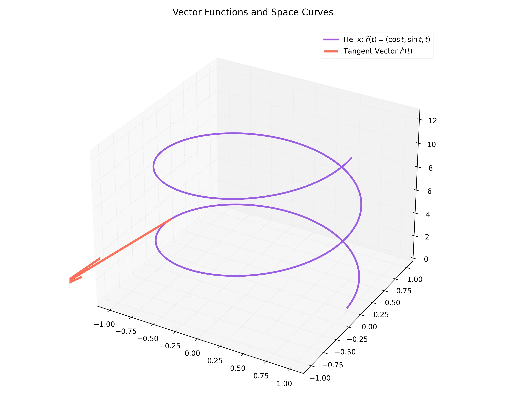

# 課程：微積分下 - 第 3 週 - 向量函數與空間曲線 (Vector Functions and Space Curves)

本文件包含了第 3 週完整的教學大綱、實作指南以及擴充版練習題庫。本週重點在於學習如何用向量函數描述空間曲線，並對其進行微積分分析。
本週教學內容對應 **Stewart Calculus Ch 13.1-13.3** 的核心內容。

---

## 一、 單元講解 (Lecture) - 總計 100 分鐘

### 1. 向量值函數及其圖形 (20 min) (KP3.1)
*   **概念講解**：
    向量值函數 $\mathbf{r}(t) = \langle f(t), g(t), h(t) \rangle$ 將實數 $t$ 映射到空間中的一個位置向量。
    *   **極限與連續**：向量函數的極限是對其各個分量分別取極限。
    *   **空間曲線**：當 $t$ 變化時，向量端點所描繪出的軌跡即為空間曲線。
*   **常見例子**：
    *   **螺旋線 (Helix)**：$\mathbf{r}(t) = \langle \cos t, \sin t, t \rangle$。
*   **練習題**：
    *   **練習題 3.1.1**：求 $\mathbf{r}(t) = \langle \cos t, \sin t, t \rangle$ 在 $t = \pi$ 時的坐標。
    *   **解答**：
        $\mathbf{r}(\pi) = \langle \cos\pi, \sin\pi, \pi \rangle = \langle -1, 0, \pi \rangle$。

---

### 2. 向量函數的微積分 (20 min) (KP3.2)
*   **概念講解**：
    *   **導數**：$\mathbf{r}'(t) = \langle f'(t), g'(t), h'(t) \rangle$。若 $\mathbf{r}'(t) \neq \mathbf{0}$，則 $\mathbf{r}'(t)$ 是曲線在 $t$ 處的**切向量 (Tangent Vector)**。
    *   **單位切向量**：$\mathbf{T}(t) = \frac{\mathbf{r}'(t)}{|\mathbf{r}'(t)|}$。
    *   **積分**：向量函數的定積分是對其各個分量分別進行積分。
*   **練習題**：
    *   **練習題 3.2.1**：求 $\mathbf{r}(t) = \langle t, t^2, t^3 \rangle$ 的導數及在 $t=1$ 處的單位切向量。
    *   **解答**：
        1. $\mathbf{r}'(t) = \langle 1, 2t, 3t^2 \rangle$。
        2. 當 $t=1$ 時，$\mathbf{r}'(1) = \langle 1, 2, 3 \rangle$。
        3. $|\mathbf{r}'(1)| = \sqrt{1^2+2^2+3^2} = \sqrt{14}$。
        4. $\mathbf{T}(1) = \frac{1}{\sqrt{14}} \langle 1, 2, 3 \rangle$。

---

### 3. 弧長公式 (20 min) (KP3.3)
*   **數學證明**：證明曲線 $\mathbf{r}(t)$ 從 $a$ 到 $b$ 的弧長為 $L = \int_a^b |\mathbf{r}'(t)| dt$。
    *   **證明**：將曲線分割成 $n$ 個小段，每小段的長度可以用兩點間距離近似：
        $\Delta s_i \approx |\mathbf{r}(t_i) - \mathbf{r}(t_{i-1})| = \left| \frac{\mathbf{r}(t_i) - \mathbf{r}(t_{i-1})}{\Delta t} \right| \Delta t \approx |\mathbf{r}'(t_i)| \Delta t$
        當 $n \to \infty$ 時，黎曼和趨於積分：
        $L = \lim_{n \to \infty} \sum_{i=1}^n |\mathbf{r}'(t_i)| \Delta t = \int_a^b |\mathbf{r}'(t)| dt \quad \text{Q.E.D.}$
*   **練習題**：
    *   **練習題 3.3.1**：求圓螺旋線 $\mathbf{r}(t) = \langle \cos t, \sin t, t \rangle$ 從 $t=0$ 到 $t=2\pi$ 的長度。
    *   **解答**：
        1. $\mathbf{r}'(t) = \langle -\sin t, \cos t, 1 \rangle$。
        2. $|\mathbf{r}'(t)| = \sqrt{(-\sin t)^2 + \cos^2 t + 1^2} = \sqrt{1+1} = \sqrt{2}$。
        3. $L = \int_0^{2\pi} \sqrt{2} dt = 2\pi\sqrt{2}$。

---

### 4. 單位切向量與法向量 (20 min) (KP3.4)
*   **概念講解**：
    *   **單位切向量 $\mathbf{T}(t)$**：描述曲線前進的方向。
    *   **單位法向量 $\mathbf{N}(t)$**：定義為 $\mathbf{N}(t) = \frac{\mathbf{T}'(t)}{|\mathbf{T}'(t)|}$。它描述了曲線彎曲的方向，始終垂直於 $\mathbf{T}(t)$。
*   **視覺化參考**：
    下圖展示了螺旋線上 $\mathbf{T}, \mathbf{N}, \mathbf{B}$ 向量（Frenet 基底）的動態變化情形：
    
*   **練習題**：
    *   **練習題 3.4.1**：證明對於任何單位切向量 $\mathbf{T}(t)$，其導數 $\mathbf{T}'(t)$ 必垂直於 $\mathbf{T}(t)$。
    *   **解答**：
        因為 $|\mathbf{T}(t)| = 1$，所以 $\mathbf{T}(t) \cdot \mathbf{T}(t) = 1$。
        兩邊對 $t$ 微分：$\mathbf{T}'(t) \cdot \mathbf{T}(t) + \mathbf{T}(t) \cdot \mathbf{T}'(t) = 0$。
        $2(\mathbf{T}'(t) \cdot \mathbf{T}(t)) = 0 \implies \mathbf{T}'(t) \cdot \mathbf{T}(t) = 0$。
        因此 $\mathbf{T}'(t) \perp \mathbf{T}(t)$。

---

### 5. 曲率 (20 min) (KP3.5)
*   **概念講解**：
    曲率 $\kappa$ 衡量曲線彎曲的程度。定義為單位弧長下切向量方向的變化率：
    $\kappa = \left| \frac{d\mathbf{T}}{ds} \right| = \frac{|\mathbf{T}'(t)|}{|\mathbf{r}'(t)|}$
*   **常用公式**：
    $$\kappa(t) = \frac{|\mathbf{r}'(t) \times \mathbf{r}''(t)|}{|\mathbf{r}'(t)|^3}$$
*   **練習題**：
    *   **練習題 3.5.1**：計算半徑為 $R$ 的圓 $x=R\cos t, y=R\sin t$ 的曲率。
    *   **解答**：
        1. $\mathbf{r}(t) = \langle R\cos t, R\sin t, 0 \rangle$。
        2. $\mathbf{r}'(t) = \langle -R\sin t, R\cos t, 0 \rangle, |\mathbf{r}'(t)| = R$。
        3. $\mathbf{r}''(t) = \langle -R\cos t, -R\sin t, 0 \rangle$。
        4. $\mathbf{r}' \times \mathbf{r}'' = \begin{vmatrix} \mathbf{i} & \mathbf{j} & \mathbf{k} \\ -R\sin t & R\cos t & 0 \\ -R\cos t & -R\sin t & 0 \end{vmatrix} = (R^2\sin^2 t + R^2\cos^2 t)\mathbf{k} = R^2 \mathbf{k}$。
        5. $\kappa = \frac{R^2}{R^3} = \frac{1}{R}$。這說明半徑越小的圓，曲率越大。

---

## 二、 動手實作 (Lab) - 總計 50 分鐘

### 實作：繪製 3D 螺旋線及其切向量
**任務目標**：視覺化空間曲線與動態切向量。

```python
import matplotlib.pyplot as plt
import numpy as np

t = np.linspace(0, 4*np.pi, 200)
x = np.cos(t)
y = np.sin(t)
z = t

fig = plt.figure(figsize=(10, 8))
ax = fig.add_subplot(111, projection='3d')

# 繪製曲線
ax.plot(x, y, z, label='Helix: r(t) = <cos t, sin t, t>')

# 繪製特定點的切向量 (例如 t = pi)
t0 = np.pi
p0 = np.array([np.cos(t0), np.sin(t0), t0])
v0 = np.array([-np.sin(t0), np.cos(t0), 1]) # r'(t)

ax.quiver(p0[0], p0[1], p0[2], v0[0], v0[1], v0[2], color='r', length=2, label="Tangent Vector at t=pi")

ax.set_xlabel('X')
ax.set_ylabel('Y')
ax.set_zlabel('Z')
ax.legend()
plt.show()
```

---

## 三、 本週知識點回顧 (KP)
- **KP3.1**: 向量函數的定義、極限與空間曲線的概念。
- **KP3.2**: 向量函數的導數（切向量）與積分。
- **KP3.3**: 空間曲線的弧長積分公式。
- **KP3.4**: 單位切向量 $\mathbf{T}$ 與單位法向量 $\mathbf{N}$ 的定義及其垂直性。
- **KP3.5**: 曲率 $\kappa$ 的幾何意義及其計算公式。

---

## 四、 課後測驗題庫 (Quiz) - 30 分鐘

### 1. 單選題 (Single Choice) - 共 10 題
1. **Q1**: 向量函數 $\mathbf{r}(t) = \langle \cos t, \sin t, t \rangle$ 的圖形名稱是？
   - (A) 圓 (B) 直線 (C) 螺旋線 (D) 拋物線
2. **Q2**: 若 $\mathbf{r}(t) = \langle t, t^2, t^3 \rangle$，則 $\mathbf{r}'(t) =$？
   - (A) $\langle 1, 2t, 3t^2 \rangle$ (B) $\langle 1, 1, 1 \rangle$ (C) $t + t^2 + t^3$ (D) $\sqrt{1+4t^2+9t^4}$
3. **Q3**: 單位切向量 $\mathbf{T}(t)$ 的長度恆為？
   - (A) 0 (B) 1 (C) $t$ (D) 不固定
4. **Q4**: 直線的曲率 $\kappa$ 為？
   - (A) 1 (B) 0 (C) $\infty$ (D) 與斜率有關
5. **Q5**: 弧長參數 $s(t)$ 的微分 $ds/dt$ 等於？
   - (A) $\mathbf{r}'(t)$ (B) $|\mathbf{r}'(t)|$ (C) $\mathbf{r}''(t)$ (D) $\kappa$
6. **Q6**: 若 $\mathbf{r}(t) = \langle 3t, 4t, 0 \rangle$，其弧長積分中的速度 $|\mathbf{r}'(t)|$ 為？
   - (A) 3 (B) 4 (C) 5 (D) 7
7. **Q7**: 單位法向量 $\mathbf{N}(t)$ 的方向與 $\mathbf{T}'(t)$ 的關係是？
   - (A) 相反 (B) 垂直 (C) 相同 (D) 無關
8. **Q8**: 半徑為 5 的圓，其曲率為？
   - (A) 5 (B) 25 (C) 0.2 (D) 0
9. **Q9**: $\int \langle t, 1, 0 \rangle dt$ 的結果包含？
   - (A) $t^2/2$ (B) $t^2$ (C) $\ln t$ (D) $1$
10. **Q10**: 空間曲線 $\mathbf{r}(t)$ 為光滑曲線 (Smooth) 的條件是 $\mathbf{r}'(t)$：
    - (A) 等於 $\mathbf{0}$ (B) 不等於 $\mathbf{0}$ 且連續 (C) 為常數 (D) 不存在

### 2. 多選題 (Multiple Choice) - 共 10 題
11. **Q11**: 關於向量函數導數的性質，哪些正確？
    - (A) $\frac{d}{dt}[\mathbf{u}(t) \cdot \mathbf{v}(t)] = \mathbf{u}' \cdot \mathbf{v} + \mathbf{u} \cdot \mathbf{v}'$
    - (B) $\frac{d}{dt}[\mathbf{u}(t) \times \mathbf{v}(t)] = \mathbf{u}' \times \mathbf{v} + \mathbf{u} \times \mathbf{v}'$
    - (C) $\frac{d}{dt}[f(t)\mathbf{u}(t)] = f'(t)\mathbf{u} + f(t)\mathbf{u}'$
    - (D) $\frac{d}{dt}|\mathbf{u}(t)| = |\mathbf{u}'(t)|$
12. **Q12**: 下列哪些向量在曲線任一點處互相垂直？
    - (A) $\mathbf{T}(t)$ 與 $\mathbf{N}(t)$ (B) $\mathbf{T}(t)$ 與 $\mathbf{r}'(t)$ (C) $\mathbf{N}(t)$ 與 $\mathbf{B}(t)$ (D) $\mathbf{T}(t)$ 與 $\mathbf{B}(t)$
13. **Q13**: 曲率 $\kappa$ 可以表示為：
    - (A) $|d\mathbf{T}/ds|$ (B) $|\mathbf{T}'(t)|/|\mathbf{r}'(t)|$ (C) $|\mathbf{r}' \times \mathbf{r}''|/|\mathbf{r}'|^3$ (D) $1/\rho$ ($\rho$ 為曲率半徑)
14. **Q14**: 若一質點沿曲線運動，其路徑長度與哪些因素有關？
    - (A) 運動的時間區間 (B) 速度的大小 (C) 起點的坐標 (D) 加速度的方向
15. **Q15**: 向量函數 $\mathbf{r}(t) = \langle t, \sin t, 2 \rangle$ 在 $z=2$ 平面上。這意味著：
    - (A) 它是平面曲線 (B) 它的 $z$ 分量導數為 0 (C) 它的法向量 $\mathbf{N}$ 在 $z$ 方向為 0 (D) 曲率恆為 0
16. **Q16**: 螺旋線 $\mathbf{r}(t) = \langle a\cos t, a\sin t, bt \rangle$ 的性質包括：
    - (A) 投影在 $xy$ 平面是圓 (B) 速度大小為常數 (C) 曲率為常數 (D) 它是直線
17. **Q17**: 關於弧長參數 $s$，下列敘述正確的是：
    - (A) $|\frac{d\mathbf{r}}{ds}| = 1$ (B) $s$ 是從某固定點開始計算的長度 (C) $s$ 與 $t$ 無關 (D) 使用 $s$ 參數化時，切向量即為單位切向量
18. **Q18**: 若 $\mathbf{r}'(t) \cdot \mathbf{r}''(t) = 0$，則：
    - (A) 速度大小為常數 (B) 切線加速度為 0 (C) 加速度垂直於速度 (D) 曲率為 0
19. **Q19**: 下列哪些函數代表同一條空間曲線（僅參數化不同）？
    - (A) $\mathbf{r}(t) = \langle t, t^2, t^3 \rangle$
    - (B) $\mathbf{r}(u) = \langle e^u, e^{2u}, e^{3u} \rangle$ (當 $t>0$)
    - (C) $\mathbf{r}(s) = \langle s^2, s^4, s^6 \rangle$
    - (D) $\mathbf{r}(w) = \langle \sin w, \sin^2 w, \sin^3 w \rangle$
20. **Q20**: 求空間曲線交點時，正確的步驟包括：
    - (A) 令兩曲線的 $x, y, z$ 分量分別相等 (B) 使用不同的參數名（如 $t$ 與 $s$） (C) 求解參數方程組 (D) 只需考慮 $x$ 坐標相等

### 3. 填充題 (Fill-in-the-blank) - 共 10 題
21. **Q21**: 若 $\mathbf{r}(t) = \langle 2t, t^2, \ln t \rangle$，則 $\mathbf{r}(1) = \langle 2, 1, $ __________ $\rangle$。
22. **Q23**: 圓 $x^2 + y^2 = 1$ 的曲率 $\kappa = $ __________。
23. **Q23**: 向量函數 $\mathbf{r}(t)$ 的二階導數 $\mathbf{r}''(t)$ 在物理上代表 __________。
24. **Q24**: 計算 $\int_0^1 \langle t, t^2, t^3 \rangle dt = \langle 1/2, 1/3, $ __________ $\rangle$。
25. **Q25**: 單位切向量 $\mathbf{T}(t)$ 的微分 $\mathbf{T}'(t)$ 始終與 $\mathbf{T}(t)$ __________。
26. **Q26**: 弧長 $L = \int_a^b \sqrt{ (x')^2 + (y')^2 + (z')^2 } dt$。其中 $x', y', z'$ 是對 __________ 的導數。
27. **Q27**: 曲率半徑 $\rho$ 與曲率 $\kappa$ 的關係為 $\rho = $ __________。
28. **Q28**: 螺旋線 $\mathbf{r}(t) = \langle \cos t, \sin t, t \rangle$ 的速度大小 $|\mathbf{r}'(t)| = $ __________。
29. **Q29**: 若曲線的曲率恆為 0，則該曲線必為 __________。
30. **Q30**: 單位法向量 $\mathbf{N}$ 的長度為 __________。

---

## 五、 Q 矩陣 (Q-matrix)

| 題號 | KP3.1 | KP3.2 | KP3.3 | KP3.4 | KP3.5 | |
|---|---|---|---|---|---|
| Q1 | 1 | 0 | 0 | 0 | 0 |
| Q2 | 0 | 1 | 0 | 0 | 0 |
| Q3 | 0 | 0 | 0 | 1 | 0 |
| Q4 | 0 | 0 | 0 | 0 | 1 |
| Q5 | 0 | 0 | 1 | 0 | 0 |
| Q6 | 0 | 0 | 1 | 0 | 0 |
| Q7 | 0 | 0 | 0 | 1 | 0 |
| Q8 | 0 | 0 | 0 | 0 | 1 |
| Q9 | 0 | 1 | 0 | 0 | 0 |
| Q10| 1 | 0 | 0 | 0 | 0 |
| Q11| 0 | 1 | 0 | 0 | 0 |
| Q12| 0 | 0 | 0 | 1 | 0 |
| Q13| 0 | 0 | 0 | 0 | 1 |
| Q14| 0 | 0 | 1 | 0 | 0 |
| Q15| 1 | 0 | 0 | 0 | 0 |
| Q16| 0 | 0 | 0 | 0 | 1 |
| Q17| 0 | 0 | 1 | 0 | 0 |
| Q18| 0 | 1 | 0 | 0 | 0 |
| Q19| 1 | 0 | 0 | 0 | 0 |
| Q20| 1 | 0 | 0 | 0 | 0 |
| Q21| 1 | 0 | 0 | 0 | 0 |
| Q22| 0 | 0 | 0 | 0 | 1 |
| Q23| 0 | 1 | 0 | 0 | 0 |
| Q24| 0 | 1 | 0 | 0 | 0 |
| Q25| 0 | 0 | 0 | 1 | 0 |
| Q26| 0 | 0 | 1 | 0 | 0 |
| Q27| 0 | 0 | 0 | 0 | 1 |
| Q28| 0 | 0 | 1 | 0 | 0 |
| Q29| 0 | 0 | 0 | 0 | 1 |
| Q30| 0 | 0 | 0 | 1 | 0 |

