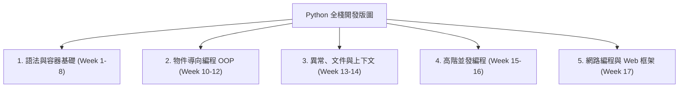
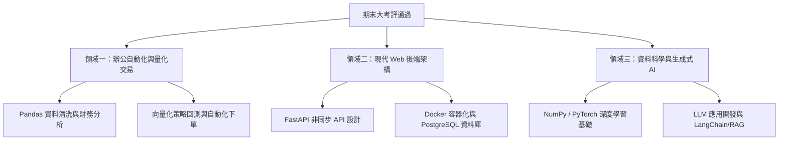

# 第 18 週 - 期末綜合複習與 Python 進階實戰航海圖 (Final Comprehensive Revision & Advanced Roadmap)

本單元為期末大考評綜合複習講義，旨在協助學習者在進行「期末自我診斷大考評」前，系統化回顧全學期的進階技術要點，並指明期末評估後的進階學習發展路徑。

---

## 🏛️ 全學期 Python 技術棧版圖 (Full-Stack Technology Map)



---

## 💡 進階技術要點回顧 (Advanced Concepts Review)

### 一、 物件導向編程精要 (Object-Oriented Programming)
1. **封裝、繼承與多型**：
   * **封裝 (Encapsulation)**：使用單底線 `_` (約定俗成的 protected) 與雙底線 `__` (自動名稱改寫，實現 private) 來保護類別內部狀態。
   * **繼承 (Inheritance)**：支援多重繼承。Python 使用 **C3 線性化算法** 計算 **MRO (Method Resolution Order)** 方法解析順序，可透過 `ClassName.__mro__` 進行查看，以完美解決「鑽石繼承」問題。
   * **多型 (Polymorphism)**：Python 支援「鴨子型別 (Duck Typing)」，只要物件表現出該介面的行為，即可被當作該型別處理。
2. **魔術方法 (Magic Methods)**：
   * `__init__` 用於初始化實例，而 `__new__` 才是真正的實例構造器。
   * `__str__` 回傳適合人類閱讀的字串，`__repr__` 回傳適合開發者偵錯的正式字串（通常滿足 `eval(repr(obj)) == obj`）。
   * `__call__` 使實例物件能夠像函式一樣被直接調用。

```python
# 鑽石繼承與魔術方法範例
class Base:
    def greet(self):
        print("Base")

class A(Base):
    def greet(self):
        print("A")
        super().greet()

class B(Base):
    def greet(self):
        print("B")
        super().greet()

class C(A, B):
    pass

c = C()
c.greet()  # 輸出順序符合 MRO: C -> A -> B -> Base
print(C.__mro__)
```

---

### 二、 異常處理與上下文管理器 (Exceptions & Context Managers)
1. **異常捕捉機制**：採用 `try-except-else-finally` 結構。
   * `else` 區塊在 `try` 區塊無任何異常發生時執行。
   * `finally` 區塊不論是否發生異常，均**必定會執行**，常用於資源釋放。
2. **上下文管理器與 `with` 語句**：
   * `with` 語句用於簡化資源管理（如檔案讀寫、資料庫連線、安全鎖）。
   * 任何實作了 `__enter__`（進入時執行）與 `__exit__`（退出時執行，且能處理異常）魔術方法的類別，均為合法的上下文管理器。

```python
# 自訂上下文管理器範例
class ResourceManager:
    def __enter__(self):
        print("資源已鎖定")
        return self
    def __exit__(self, exc_type, exc_val, exc_tb):
        print("資源已安全釋放")
        return True # 阻止異常向上拋出

with ResourceManager():
    print("正在處理商務邏輯...")
```

---

### 三、 高階並發編程 (Concurrency & Parallelism)
1. **多執行緒 (Threading) 與 GIL**：
   * CPython 包含 **GIL (Global Interpreter Lock，全域直譯器鎖)**，限制同一時刻只有一個執行緒執行 Python 位元組碼。
   * 因此，多執行緒在 **I/O 密集型任務**（如網頁爬蟲、資料庫讀寫）中能有效提升效率，但在 **CPU 密集型任務**（如複雜數學計算）中無法實現真正的多核加速。
2. **多進程 (Multiprocessing)**：
   * 通過建立獨立的 Python 直譯器進程，避開 GIL 限制，能實現真正的多核心並行計算，適合 CPU 密集型任務。
3. **非同步協程 (Asyncio)**：
   * 基於單執行緒的**事件循環 (Event Loop)** 機制，使用 `async def` 定義協程，`await` 掛起 non-blocking I/O 任務，是極高發網路伺服器（如 FastAPI）的核心基石。

```python
# Asyncio 協程非同步範例
import asyncio

async def fetch_data(id):
    print(f"任務 {id} 開始讀取...")
    await asyncio.sleep(1) # 模擬 Non-blocking I/O
    print(f"任務 {id} 讀取完畢")
    return {"data": id}

async def main():
    results = await asyncio.gather(fetch_data(1), fetch_data(2))
    print("所有任務完成:", results)

# 在非同步環境下執行: asyncio.run(main())
```

---

### 四、 網路編程與現代 Web 框架 (Networking & FastAPI)
1. **Socket 套接字**：網路通訊的底層接口。`TCP` 提供連線導向、可靠的資料流傳輸；`UDP` 提供無連線、快速但不可靠的封包傳輸。
2. **FastAPI 與 Requests**：
   * `requests` 用於發送同步 HTTP 請求，簡單直觀。
   * `FastAPI` 是現代化、極致快速的 Web 框架，基於 Python 型別提示 (Type Hints) 和 Pydantic 資料驗證，原生支援非同步 (async/await)，並能自動生成互動式 OpenAPI 文件。

---

## 🧭 Python 進階實戰航海圖 (Next Step Roadmap)

當您順利通過期末評估後，您的 Python 學習旅程將通往更廣闊的專業領域。以下是為您規劃的**黃金學習發展路徑**：



---

## 🎯 啟動期末診斷與大師考評

恭喜您完成了整學期 Python 基礎與進階編程的全部研讀！現在，請切換至上方的 **「⚡ 自我診斷評量」** 分頁。

**10 題自適應期末考評引擎**正等待著您：
1. 系統將隨機抽取本學期最具代表性的進階考點。
2. 透過項目反應理論 (IRT) 與認知診斷模型 (CDM)，我們將為您評估出您的全學期能力值 $\theta$ 與各維度掌握度。
3. 答對題目會被立刻消滅，剩餘的盲點可反覆進行錯題消滅挑戰，直至 100% 解鎖**期末金牌大師榮譽勳章**！

祝您考試順利，展現您卓越的編程實力！
