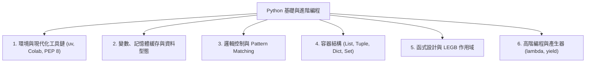

# 第 9 週 - 期中綜合複習與核心知識點精華指南 (Midterm Comprehensive Revision Guide)

本單元為期中綜合知識點梳理，旨在協助學習者在進行「自我診斷評量」前，系統化整理第 1 週至第 8 週的 Python 核心編程底層邏輯與技術框架。

---

## 🏛️ 前 8 週 Python 知識體系全景 (Knowledge Network Overview)



---

## 💡 核心技術要點回顧 (Core Concepts Review)

### 一、 現代化工具鏈與代碼風格 (Modern Tooling & PEP 8)
1. **直譯式與極速管理**：Python 作為動態直譯式語言，其主要版本 (CPython) 由 C 語言編寫。在現代化開發中，我們採用 `uv` 作為極速依賴管理器（常用命令如 `uv add <pkg>`），取代慢速的 legacy 工具，保障虛擬環境的極速建立。
2. **縮排與 PEP 8 規範**：PEP 8 為 Python 的官方代碼風格指南：
   * 建議統一使用 **4 個空格** 縮排，禁止空格與 Tab 混用。
   * 變數與函式名使用小寫底線連接（蛇形命名，如 `user_name`），類別名稱採用首字母大寫（駝峰命名，如 `MyClass`），常數則完全大寫（如 `PI`）。
   * 一行代碼的最大長度建議為 **79 個字元**。

---

### 二、 變數、記憶體緩存與資料型態 (Variables & Data Types)
1. **小整數緩存機制**：Python 對於小整數（**-5 至 256**）會進行預先緩存。
   * 使用 `is` 比較的是物件的**記憶體地址**（即 `id(a) == id(b)`），而 `==` 比較的是**數值是否相等**。
   * `x = 5; y = 5; x is y` 會回傳 `True`；但對於超出緩存範圍的大整數，`is` 可能回傳 `False`。
2. **運算優先級與字串切片**：
   * 指數運算子 `**` 具有**右結合性**。例如 `2**3**2` 相當於 `2**(3**2) = 2**9 = 512`。
   * 切片語法 `s[start:stop:step]` 當 `step` 為負數時，切片方向改為從右向左。如 `s = "Hello", s[4:1:-1]` 會回傳字元反轉結果。
   * 字串的 `.isnumeric()` 可以檢查是否只包含數字（包含全形與羅馬數字）。
3. **布林值真偽判斷**：空容器（`[]`, `()`, `{}`, `set()`）、數值零（`0`, `0.0`）、`None` 在轉換為 `bool` 時均為 `False`，其餘皆為 `True`。

```python
# 記憶體緩存與切片範例
a = 256
b = 256
print(a is b)  # True (小整數緩存)

s = "Python"
print(s[::-1])  # "nohtyP" (完全反轉)
```

---

### 三、 流程控制與衛句實踐 (Logic Control & Guard Clauses)
1. **海象運算子 (Walrus Operator `:=`)**：允許在表達式內部進行變數賦值，極大簡化了 `while` 迴圈與 `if` 條件中的冗餘代碼。
2. **Pattern Matching (`match-case`)**：Python 3.10+ 引入的結構化模式匹配，使用萬用字元 `_` 捕捉剩餘情況，並能使用 `|` 進行模式合併。
3. **衛句架構 (Guard Clauses)**：在函式開頭優先排除無效條件，提前 `return`，以避免深層 `if-else` 嵌套，保持代碼清爽。

```python
# 海象運算子與 match-case 範例
if (n := len("Python")) > 5:
    print(f"字串長度大於 5，長度為 {n}")

def process_status(status_code):
    match status_code:
        case 200 | 201:
            return "Success"
        case 400 | 404:
            return "Client Error"
        case _:
            return "Unknown"
```

---

### 四、 核心容器結構精要 (Advanced Data Structures)
1. **串列 (List) 深度探討**：
   * `.extend()` 方法將另一個容器的所有元素追加至末尾，而 `.append()` 會將容器當作一個整體加入。
   * 切片賦值如 `L[1:1] = [4, 5]` 會在索引 1 處就地插入 `[4, 5]`。
   * 淺拷貝 `old_list.copy()` 或 `old_list[:]` 會建立新串列，但若串列內含巢狀物件，修改第二層仍會互相影響。
2. **元組 (Tuple) 與解構**：元組是不可變 (Immutable) 容器，其雜湊值可用於字典的 Key。解構賦值如 `x, y = y, x` 是就地交換變數的優雅寫法。
3. **字典 (Dict) 與集合 (Set)**：
   * 字典 Key 必須是可雜湊 (Hashable) 的（如字串、數值、元組，而串列和字典則不行）。查找複雜度平均為常數時間 $O(1)$。
   * `collections.Counter` 專用於頻率統計，而 `defaultdict` 能有效避免 `KeyError`。
   * 集合內元素唯一，支援並集 `|`、交集 `&`、差集 `-` 等運算。

```python
# 字典與集合運算範例
A = {1, 2, 3}
B = {3, 4, 5}
print(A & B)  # {3} (交集)
print(A | B)  # {1, 2, 3, 4, 5} (並集)
print(A - B)  # {1, 2} (差集)
```

---

### 五、 函式設計與 LEGB 作用域 (Functions & Scope)
1. **收集參數**：`*args` 用於接收多個位置參數（包裝為元組），`**kwargs` 接收多個關鍵字參數（包裝為字典）。
2. **作用域 LEGB 規則**：
   * **Local**：區域作用域。
   * **Enclosing**：閉包的外層函數作用域（在此處修改變數需宣告 `nonlocal`）。
   * **Global**：全域作用域（修改需宣告 `global`）。
   * **Built-in**：內建作用域（如 `len`, `print`）。

```python
# nonlocal 作用域範例
def outer():
    count = 0
    def inner():
        nonlocal count
        count += 1
        return count
    return inner

counter = outer()
print(counter())  # 1
print(counter())  # 2
```

---

### 六、 高階編程與產生器 (Functional Programming & Generators)
1. **高階函數**：`map()`、`filter()` 和 `reduce()` 均可接收函式作為參數。`map` 與 `filter` 回傳的是惰性計算的疊代器，在需要時才計算。
2. **產生器與延遲計算**：使用 `yield` 的函式即為產生器，能大幅節省記憶體。當疊代器耗盡時，會拋出 `StopIteration` 異常。
3. **裝飾器 (Decorator)**：以 `@decorator` 語法糖無侵入地擴充函式功能（如日誌記錄、權限驗證、快取）。

```python
# 產生器惰性求值範例
def simple_generator():
    yield "第一階段"
    yield "第二階段"

g = simple_generator()
print(next(g))  # "第一階段"
print(next(g))  # "第二階段"
# 再呼叫一次 next(g) 會拋出 StopIteration
```

---

## 🎯 進入自我診斷與錯題消滅挑戰

您已溫習完畢前 8 週的核心知識精華！現在請點擊上方的 **「⚡ 自我診斷評量」** 分頁。

系統將利用 **10 題隨機微診斷抽籤器**，為您進行科學的自適應能力檢測：
1. 做對的題目將會被自動消滅移出題庫，下次不再出現。
2. 答錯的題目會留在池中，您可以一鍵重啟「錯題消滅機制」精準清除弱點。
3. 在評量完成後，系統會為您精準繪製出 IRT 能力 S 曲線與 CDM 知識點掌握度雷達圖，指引您本週的最佳複習方向！
