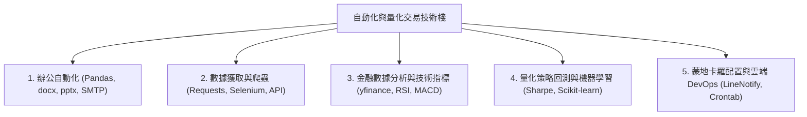

# 第 18 週 - 期末綜合評量複習與自動化/量化實戰全景指南 (Final quantitative evaluation & Automation Roadmap)

本單元為期末大考評綜合知識點梳理，旨在協助學習者在進行「辦公自動化與金融量化應用自我診斷評量」前，系統化總結全學期的實戰技術版圖，並指引期末評估後的專業量化分析師進階發展路徑。

---

## 🏛️ 自動化與量化應用實戰地圖 (Technical Portfolio Map)



---

## 💡 核心技術要點回顧 (Core Practice Review)

### 一、 辦公自動化與批次處理精要 (Office Automation)
1. **Pandas 資料清洗與計算**：
   * 採用 `loc` 進行**標籤索引**，`iloc` 進行**整數位置索引**，布林篩選常用於過濾滿足特定條件的資料列。
   * 處理缺失值時，使用 `.dropna()` 刪除含有空值的行或列，`.fillna()` 對空值進行特定填補。
2. **多文檔批次產生**：
   * 使用 `python-docx` 進行 Word 文檔渲染與段落文字替換。
   * 使用 `python-pptx` 商務幻燈片批次套版與圖表嵌入。
   * 使用 `PyPDF2` 或類似工具進行 PDF 批量合併與加密。
3. **郵件與系統處理**：
   * `smtplib` 用於同步發送電子郵件，`imaplib` 用於讀取收件匣。
   * `os` 與 `shutil` 模組可用於文件批量複製、重命名、及路徑合併。

```python
# Pandas 資料處理範例
import pandas as pd

# 讀取 CSV 並填補缺失值
df = pd.read_csv("financial_data.csv")
df["Close"] = df["Close"].fillna(method="ffill") # 前向填補

# 篩選收盤價大於均線的資料列
bull_market = df.loc[df["Close"] > df["MA_20"]]
```

---

### 二、 數據抓取與 API 對接 (Web Scraping & API Integration)
1. **靜態網頁解析**：使用 `requests` 發送 HTTP 請求，並藉由 `BeautifulSoup` 的 CSS 選擇器或 XPath 精準解析 HTML 節點。
2. **動態網頁交互**：對於經 JavaScript 非同步渲染的網頁，採用 `Selenium` 控網模擬真人點擊、滾動頁面、以及繞過基本反爬防禦。
3. **API 接口讀取**：最穩定高效的資料來源。利用 `requests` 讀取 RESTful API，並使用 `json()` 方法直接將回傳資料包裝為 Python 字典。

```python
# Requests API 讀取範例
import requests

url = "https://api.coingecko.com/api/v3/simple/price?ids=bitcoin&vs_currencies=usd"
response = requests.get(url)
if response.status_code == 200:
    data = response.json()
    btc_price = data["bitcoin"]["usd"]
    print(f"BTC 當前價格: {btc_price} USD")
```

---

### 三、 金融時間序列與指標算法 (Quantitative Financial Metrics)
1. **數據獲取**：採用 `yfinance` 連接全球金融資料庫，獲取歷史 OHLCV 價格。
2. **收益率與移動平均**：
   * 每日收益率計算：`df['Return'] = df['Close'].pct_change()`。
   * 移動平均線 (MA)：`df['MA_20'] = df['Close'].rolling(window=20).mean()`。
3. **技術指標實作**：
   * **RSI (相對強弱指標)**：衡量價格超買或超賣的動量指標。
   * **MACD (指數平滑異同移動平均線)**：快線 (EMA 12) 與慢線 (EMA 26) 的差值，以及訊號線 (EMA 9) 的黃金交叉與死亡交叉。
   * **布林通道 (Bollinger Bands)**：以移動平均線為中心，上下各加減兩個標準差的波動率通道。

---

### 四、 策略回測框架與機器學習應用 (Backtesting & Machine Learning)
1. **雙均線回測框架**：
   * **訊號生成**：當短期均線向上突破長期均線時發送買入訊號（黃金交叉，`Signal = 1`），反之發送賣出或放空訊號（死亡交叉，`Signal = -1`）。
   * **部位管理與最大回撤 (Max Drawdown)**：記錄淨值曲線，計算歷史峰值至谷底的最大跌幅，以評估策略極端風險。
   * **夏普比率 (Sharpe Ratio)**：衡量承受每單位總風險所能獲得的超額回報：$Sharpe = \frac{E(R_p) - R_f}{\sigma_p}$。
2. **機器學習預測**：使用 `scikit-learn` 的線性回歸、隨機森林等演算法進行資產價格預測，並使用特徵重要性 (Feature Importance) 篩選高影響力因子。

```python
# 雙均線回測邏輯範例
import numpy as np

# 生成買賣訊號
df["Signal"] = 0
df["Signal"] = np.where(df["MA_5"] > df["MA_20"], 1, -1)
df["Position"] = df["Signal"].shift(1) # 避開前瞻偏差
df["Strategy_Return"] = df["Position"] * df["Return"]
```

---

### 五、 蒙地卡羅優化與雲端部署 (Portfolio Optimization & DevOps)
1. **蒙地卡羅模擬 (Monte Carlo Simulation)**：通過大量隨機漫步路徑模擬資產未來走勢，或隨機生成投資組合權重以尋找「馬可維茲均值-變異數有效邊界 (Efficient Frontier)」上的最優配置。
2. **量化部署與 DevOps**：
   * 利用 Linux 的 `cron` 定時任務排程，每日自動執行策略。
   * 當發生異常或送出交易訊號時，調用 `LineNotify` API 即時推送警報至手機。

---

## 🎯 啟動期末診斷與大師大考評

恭喜您完成了整學期自動化辦公與量化應用的全部研讀！現在，請切換至上方的 **「⚡ 自我診斷評量」** 分頁。

**自適應期末考評引擎已準備就緒**：
1. 系統將隨機抽取本學期最實用的自動化與量化進階考點。
2. 做對的題目將會被自動移出，您可以透過錯題消滅挑戰，逐步將所有弱點消滅！
3. 評量提交後，系統將精準反饋您的心理計量評量指標與 CDM 各項能力雷達圖，為您解鎖**期末金牌大師榮譽勳章**！

祝您順利通關，成為頂尖的 Python 自動化與量化專家！
